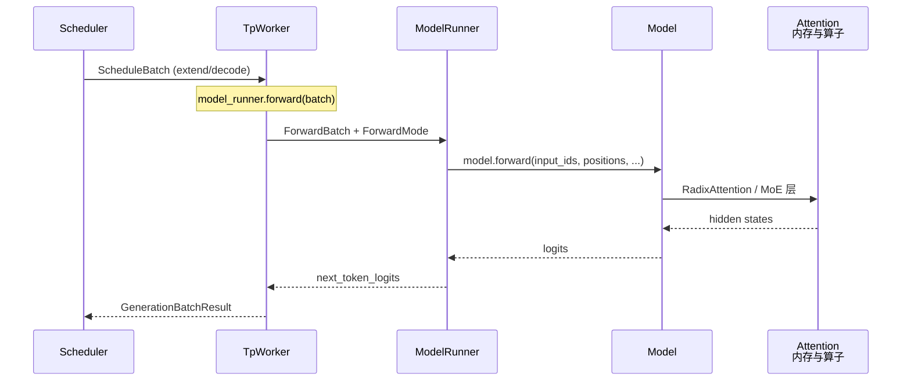

# 模型执行

> **你只需阅读本目录，不必打开 `sglang/` 源码。** 
> 内嵌代码对应 sglang Git commit `70df09b`。

---

## 本目录解决什么问题

请求调度部分讲清了 Scheduler 如何把请求组织成 `ScheduleBatch` 并发起 forward。本目录回答：**GPU 上谁真正跑模型 forward？权重从哪来？Llama / Qwen / DeepSeek 如何注册与加载？**

| 模块 | 模块 | 一句话 |
|------|------|--------|
| [[SGLang-ModelRunner]] | 执行器核心 | ForwardBatch、CUDA Graph、TpWorker 调度 model.forward |
| [[SGLang-ModelLoader]] | 权重加载 | safetensors / HF / 量化权重 iterator → load_weights |
| [[SGLang-通用模型]] | 通用架构 | Registry、Llama/Qwen3 Decoder 层模式 |
| [[SGLang-专用模型]] | 专用架构 | MLA、MoE、DeepSeek、Context Parallel |

---

## 端到端执行链



这张图的读法是：`TpWorker` 持有 `ModelRunner` 实例；Scheduler 子进程通过 ZMQ/共享内存把 batch 交给 worker。`ModelRunner` 负责把 `ScheduleBatch` 转为 `ForwardBatch`、选择 CUDA Graph replay 或 eager forward，并调用 `model.forward`。权重在启动时由 ModelLoader 灌入，模型类由通用/专用模型的 Registry 解析。

**源码锚点：**

```python
## 来源：python/sglang/srt/model_executor/model_runner.py L1188-L1205
                and (moe_intermediate_size // moe_tp_size) % weight_block_size_n != 0
                and not _use_aiter
            ):
                raise ValueError(
                    f"For quantized MoE models, please make sure ({moe_intermediate_size=} / {moe_tp_size=}) % {weight_block_size_n=} == 0 "
                    f"where moe_tp_size is equal to tp_size ({self.tp_size}) divided by ep_size ({self.moe_ep_size}). "
                    f"You can fix this by setting arguments `--tp` and `--ep` correctly."
                )

    def init_torch_distributed(self):
        tic = time.perf_counter()
        logger.info("Init torch distributed begin.")

        try:
            torch.get_device_module(self.device).set_device(self.gpu_id)
        except Exception:
            logger.warning(
                f"Context: {self.device=} {self.gpu_id=} {os.environ.get('CUDA_VISIBLE_DEVICES')=} {self.tp_rank=} {self.tp_size=}"
```

读法：

- `forward_mode` 区分 EXTEND（prefill）、DECODE、IDLE 等；CUDA Graph 路径仅覆盖固定 shape 的 decode/extend。
- Attention backend 初始化在 forward 前完成（Attention 展开）。
- PP（pipeline parallel）时返回 `PPProxyTensors` 而非最终 logits。

---

## 零基础一句话

**像后厨灶台：** ModelLoader 是进货与备料（权重），通用/专用模型是菜谱（模型结构），ModelRunner 是主厨按单炒菜（forward），Scheduler 只负责传菜单不传刀工细节。

---

## 推荐阅读顺序

| 顺序 | 文档 | 必读理由 |
|------|------|----------|
| 1 | [[SGLang-ModelRunner-核心概念]] | ForwardBatch、ForwardMode、Graph 契约 |
| 2 | [[SGLang-ModelRunner-源码走读]] | TpWorker → ModelRunner 主路径 |
| 3 | [[SGLang-ModelLoader-源码走读]] | safetensors 加载与 TP 分片 |
| 4 | [[SGLang-通用模型-核心概念]] | Registry resolve 流程 |
| 5 | [[SGLang-专用模型-排障指南]] | MLA vs MHA、MoE 层判定 |

---

## 上下游衔接

| 方向 | 模块 | 衔接点 |
|------|------|--------|
| ← 请求调度 | Scheduler | `run_batch` → TpWorker |
| → 内存与 Attention | KV Cache 与 RadixAttention | ModelRunner 读写 KV slot；RadixAttention 在 model 层调用 |
| → 高级能力 | Sampling 与投机解码 | logits 进入采样；draft worker 复用 ModelRunner |
| → 运维 | CheckpointEngine | weight sync 热更新 base 权重 |

---

## 验证建议（零基础可试）

1. **启动日志：** 观察 `Load weight end` 与 `Capture cuda graph` 顺序，确认 ModelLoader 完成后再捕获 ModelRunner 的 CUDA Graph。
2. **Registry：** 换 `--model-path` 为 Qwen3，日志应出现 `qwen3` entry class 而非 llama。
3. **Graph：** `--disable-cuda-graph` 对比吞吐；decode 密集场景 graph 通常更优。

---

## 模块导航

| 专题 | 入口 |
|------|------|
| ModelRunner | [[SGLang-ModelRunner]] |
| ModelLoader | [[SGLang-ModelLoader]] |
| 通用模型 | [[SGLang-通用模型]] |
| 专用模型 | [[SGLang-专用模型]] |

← [[SGLang-请求调度]] · → [[SGLang-内存与Attention]]
