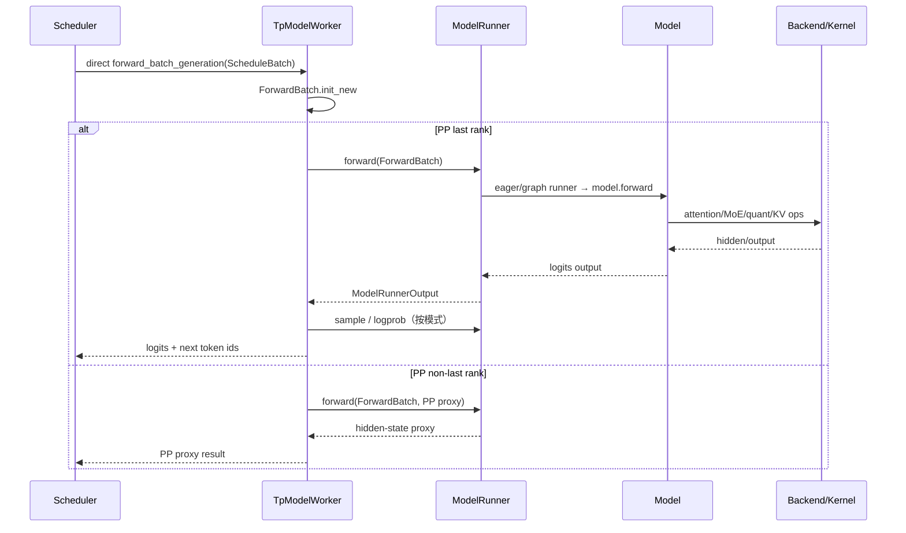

# 模型执行

> 本目录解释调度对象怎样变成 GPU 可执行 tensor，模型与权重怎样实例化，以及 backend、graph、并行和专用架构怎样共同决定一次 forward。

## 你为什么要读

“调用 `model.forward`”只覆盖执行链最中间的一小步。真正的边界包括：

```text
ScheduleBatch
→ ForwardBatch
→ runner / graph / metadata
→ model registry 与模型类
→ attention / MoE / quant method
→ logits 或 PP proxy
→ sampling / logprob
```

如果混淆这些层，就会把 loader 问题归给 kernel、把 Scheduler batch 当成 GPU tensor、把配置 backend 当成实际 kernel，或误以为每个 PP rank 都产生 logits 并采样。

## 四个专题

| 专题 | 所有权 | 核心问题 |
|---|---|---|
| [[SGLang-ModelRunner]] | GPU 执行上下文 | 模型、KV pool、attention backend、CUDA Graph、forward 与 sampling |
| [[SGLang-ModelLoader]] | 权重来源与写入路线 | HF/分片/远端/特殊格式 iterator 怎样写入参数 |
| [[SGLang-通用模型]] | registry 与通用 Transformer 契约 | architecture resolve、PP proxy、attention/MLP/LM head |
| [[SGLang-专用模型]] | 架构特化 | MLA/DSA、MoE、跨模态、CP、专用权重映射与 backend |

量化、Attention、MoE、KV Cache 是横切执行层，分别见 [[SGLang-Quantization]]、[[SGLang-Attention]]、[[SGLang-MoE]]、[[SGLang-KV-Cache]]。

## 一次 generation forward



### 三条关键纠正

1. Scheduler 在自己的进程中直接调用 `TpModelWorker`；不是通过 ZMQ 把 batch 送给同进程 worker。
2. `ForwardBatch.init_new()` 由 `TpModelWorker` 调用，不是 ModelRunner 把 `ScheduleBatch` 转换成 `ForwardBatch`。
3. ModelRunner.forward 返回模型执行输出；正常下一 token sampling 由 last PP rank 的 `TpModelWorker` 再调用 `model_runner.sample()`。

## `TpModelWorker` 是执行门面

```python
# 来源：python/sglang/srt/managers/tp_worker.py L482-L520
    def forward_batch_generation(
        self,
        batch: Optional[ScheduleBatch],
        forward_batch: Optional[ForwardBatch] = None,
        pp_proxy_tensors: Optional[PPProxyTensors] = None,
        is_verify: bool = False,
        skip_attn_backend_init: Optional[bool] = None,  # deprecated
    ) -> GenerationBatchResult:
        # Get forward batch from schedule batch
        if batch is not None:
            # update the consumer index of hicache to the running batch
            self.set_hicache_consumer(batch.hicache_consumer_index)

            forward_batch = ForwardBatch.init_new(batch, self.model_runner)
        else:
            # FIXME(lsyin): unify the interface of forward_batch
            assert forward_batch is not None

        # Deprecated kwarg: pre-planners mark the batch themselves now.
        forward_batch.apply_deprecated_skip_attn_backend_init(skip_attn_backend_init)

        if self.is_dllm():
            return self._forward_batch_generation_dllm(forward_batch)

        if self.pp_group.is_last_rank:
            out = self.model_runner.forward(
                forward_batch,
                pp_proxy_tensors=pp_proxy_tensors,
            )
            logits_output, can_run_cuda_graph = out.logits_output, out.can_run_graph
            batch_result = GenerationBatchResult(
                logits_output=logits_output,
                can_run_cuda_graph=can_run_cuda_graph,
                expert_distribution_metrics=out.expert_distribution_metrics,
                routed_experts_output=out.routed_experts_output,
                indexer_topk_output=out.indexer_topk_output,
            )

            if is_verify:
```

这层还负责 HiCache consumer、DLLM 分支、PP rank 语义、spec verify、sampling 与 prefill-only 结果，因此是 Scheduler 与 ModelRunner 之间的稳定门面，而不是可省略的薄转发。

## ModelRunner 负责什么

ModelRunner 持有并协调：

- `model_config`、device/rank/group 与模型实例；
- weight loader 与 post-load；
- KV/req pool 和 attention backend；
- eager、decode graph、prefill graph 等 runner；
- forward metadata、DP/MLP padding 与特殊 stream/event；
- sampling、logprob、expert/indexer 输出；
- profiler、debugger、memory saver、elastic EP 等横切功能。

```python
# 来源：python/sglang/srt/model_executor/model_runner.py L2954-L3002
    def forward(
        self,
        forward_batch: ForwardBatch,
        skip_attn_backend_init: Optional[bool] = None,  # deprecated
        pp_proxy_tensors: Optional[PPProxyTensors] = None,
        reinit_attn_backend: bool = False,
        split_forward_count: int = 1,
    ) -> ModelRunnerOutput:
        # Deprecated kwarg: pre-planners mark the batch themselves now.
        forward_batch.apply_deprecated_skip_attn_backend_init(skip_attn_backend_init)

        self.forward_pass_id += 1

        # Try msprob debugger
        if self.msprobe_debugger is not None:
            rank_id = (
                self.gpu_id if self.dp_size is not None and self.dp_size > 1 else None
            )
            self.msprobe_debugger.start(model=self.model, rank_id=rank_id)

        # Step span
        step_span_ctx = profile_range(_build_step_span_name(forward_batch))

        canary_ctx = (
            context_tuple(
                c.with_ops_outside_graph(
                    single_forward_indices=[0],
                    maybe_inaccurate_forward_batch=forward_batch,
                ),
                c.with_active_single_forward_manager(0),
            )
            if not self.is_draft_worker and ((c := self.canary_manager) is not None)
            else contextlib.nullcontext()
        )

        with (
            canary_ctx,
            step_span_ctx,
            get_global_expert_distribution_recorder().with_forward_pass(
                self.forward_pass_id,
                forward_batch,
            ) as recorder_outputs,
        ):
            output = self._forward_raw(
                forward_batch,
                pp_proxy_tensors,
                reinit_attn_backend,
                split_forward_count,
            )
```

`_forward_raw` 才继续选择具体 runner/模型路径。调试时先证明进入了哪一层，再下钻；不要从某个 kernel 文件存在反推运行时选择。

## 权重加载不是单一路线

默认 HF/safetensors 只是基线。ModelLoader 还可能处理 sharded state、GGUF、remote、remote instance、layered、量化 packed 权重或模型专用 loader。不同路线的关键差异包括：

- 谁枚举 checkpoint tensor；
- 在 rank 过滤前后占用多少 host memory；
- 参数名如何映射到 fused/sharded 参数；
- quant method 在 load/postprocess 哪一步生效；
- partial update 是否有事务保证；
- 权重版本与 cache flush 如何关联。

所以“日志出现 Load weight end”只证明某加载流程结束，不证明每个参数正确、所有 rank 一致或当前权重版本可追溯。

## 通用模型与专用模型

### 通用模型

重点读 registry resolve、模型类、PP proxy、embedding/LM head、attention communicator 与权重映射。Transformers fallback 和 OOT 注册意味着 architecture 字符串不总是一对一落到内置类。

### 专用模型

MLA/DSA、MoE、跨模态和 hybrid linear attention 会改变 KV layout、forward signature、top-k carrier、collective、position 或专用 kernel。专用 handler 规则通常独立，不能用 DeepSeek 的结论外推所有 MoE，也不能用 Llama 的 MHA layout解释 MLA。

## Graph、backend 与 kernel 的四层证据

```text
用户配置
→ ServerArgs 自动归一化
→ resolved runner/backend/wrapper
→ profiler 中实际 kernel
```

Graph 性能实验还必须证明 capture/replay 命中并与 eager 数值一致。prefill/decode、spec、DP padding、多模态 metadata 或动态 shape 都可能改变可用性；“decode 密集 graph 通常更优”不能替代目标 workload 实测。

## 推荐阅读路径

### 首次理解

[[SGLang-ModelRunner-核心概念]] → [[SGLang-ModelLoader-源码走读]] → [[SGLang-通用模型-核心概念]] → [[SGLang-专用模型-核心概念]]

### backend / graph / shape

[[SGLang-ModelRunner-排障指南]] → [[SGLang-Attention-排障指南]] → [[SGLang-KV-Cache-排障指南]]

### 模型加载或权重不一致

[[SGLang-ModelLoader-排障指南]] → [[SGLang-Quantization-源码走读]] → 模型专用 `load_weights`

## 运行验证

**操作**

1. 保存最终 ServerArgs 与模型/权重版本。
2. 从 architecture 追到实际模型类和 loader。
3. 记录 `ForwardMode`、runner、backend 与 profiler kernel。
4. 比较 eager/graph 或两个 backend：固定请求、sampling、硬件与并行配置，并先做数值一致性。
5. PP 环境分别记录非末 rank proxy 与末 rank logits/sampling。

**预期**：能把“模型、权重、执行 tensor、runner、backend、kernel、sampling”分层证明；性能与正确性结论不越过实际环境。

← [[SGLang-请求调度]] · → [[SGLang-内存与Attention]]
