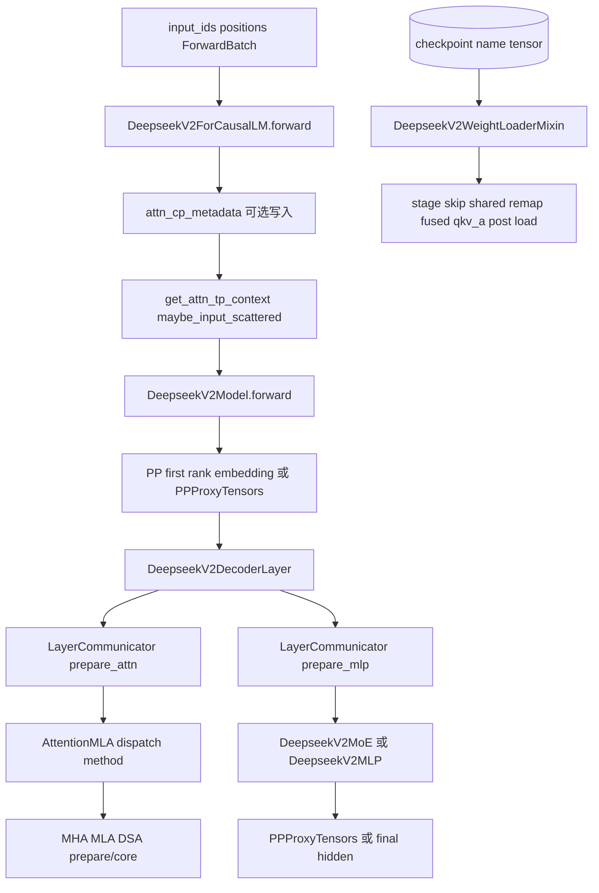

# 专用模型 · 数据流

## 你为什么要读

本页沿 DeepSeek 专用模型的数据流读：外部仍是 `input_ids`、`positions`、`ForwardBatch`，专用逻辑在模型内部补 CP metadata、PP proxy、DSA top-k 和权重名映射。读完后应能判断一个异常发生在 serving 外部契约，还是模型内部特化层。

## 数据流总图



这张图的重点是对象形态。DeepSeek 专用模型不是让 Scheduler 传新对象；Scheduler 仍给 `input_ids`、`positions`、`ForwardBatch`。这个 batch 是借来的可变执行视图：模型入口可能写入 CP metadata，attention TP context 改变本次输入布局，DSA top-k index 可能进入 PP proxy，checkpoint name 则在另一条生命周期中翻译成运行时参数。

## 1. ForCausalLM 边界：补充 CP metadata，不改变外部接口

ForCausalLM 入口根据 DSA/MLA prefill CP 条件写 `forward_batch.attn_cp_metadata`。这一步的输入仍是 token 数、CP rank/size 和 sequence lens：

```python
# 来源：python/sglang/srt/models/deepseek_v2.py L2813-L2832
        if self.dsa_enable_prefill_cp:
            if can_dsa_cp_split(
                len_input_ids, self.cp_size, self.use_dsa, forward_batch
            ):
                forward_batch.attn_cp_metadata = prepare_context_parallel_metadata(
                    len_input_ids,
                    self.cp_rank,
                    self.cp_size,
                    forward_batch.seq_lens_cpu.tolist(),
                    extend_seqs_len=forward_batch.extend_seq_lens_cpu,
                )
        elif self.mla_enable_prefill_cp:
            if can_cp_split(len_input_ids, self.cp_size, forward_batch):
                forward_batch.attn_cp_metadata = prepare_context_parallel_metadata(
                    len_input_ids,
                    self.cp_rank,
                    self.cp_size,
                    forward_batch.seq_lens_cpu.tolist(),
                    extend_seqs_len=forward_batch.extend_seq_lens_cpu,
                )
```

这里的边界很重要：CP metadata 是模型入口写入的 batch 运行态，不是 request 侧字段。当前函数只在 `can_*_split=True` 时赋值，没有对应的 `else: attn_cp_metadata=None`；正常调用方应提供干净的执行视图。若复用对象或 graph buffer，排查时要同时记录进入函数前后的 metadata，不能只看“本轮是否满足 split”。

## 2. PP 数据流：hidden、residual、topk_indices

DeepSeek PP first rank 和通用模型一样从 embedding 开始；中间 rank 从 `PPProxyTensors` 取 hidden/residual。额外的是 DSA 可能要求 `topk_indices`：

```python
# 来源：python/sglang/srt/models/deepseek_v2.py L2477-L2508
    def forward(
        self,
        input_ids: torch.Tensor,
        positions: torch.Tensor,
        forward_batch: ForwardBatch,
        input_embeds: torch.Tensor = None,
        pp_proxy_tensors: Optional[PPProxyTensors] = None,
    ) -> Union[torch.Tensor, PPProxyTensors]:
        total_num_layers = self.end_layer - self.start_layer
        dsa_forward_uses_topk = self._dsa_forward_uses_topk()
        if self.pp_group.is_first_rank:
            if input_embeds is None:
                hidden_states = self.embed_tokens(input_ids)
            else:
                hidden_states = input_embeds
            residual = None
        else:
            assert pp_proxy_tensors is not None
            hidden_states = pp_proxy_tensors["hidden_states"]
            residual = pp_proxy_tensors["residual"]
            topk_indices = pp_proxy_tensors.tensors.get("topk_indices")
            assert not (
                not forward_batch.forward_mode.is_idle()
                and hidden_states.shape[0] != 0
                and self.use_dsa
                and dsa_forward_uses_topk
                and dsa_layer_skips_topk(self.config, self.start_layer)
                and topk_indices is None
            ), (
                f"PP stage starting at layer {self.start_layer} requires DSA "
                "topk_indices from the previous stage."
            )
```

输出边界也类似。非 last rank 返回 proxy；如果下一 stage 需要 skip-topk，就把 `topk_indices` 一起放进去：

```python
# 来源：python/sglang/srt/models/deepseek_v2.py L2600-L2625
        if not self.pp_group.is_last_rank:
            proxy_tensors = {
                "hidden_states": hidden_states,
                "residual": residual,
            }
            if (
                self.use_dsa
                and dsa_forward_uses_topk
                and self.end_layer < self.config.num_hidden_layers
                and dsa_layer_skips_topk(self.config, self.end_layer)
            ):
                if (
                    not forward_batch.forward_mode.is_idle()
                    and hidden_states.shape[0] != 0
                ):
                    assert topk_indices is not None, (
                        f"PP stage ending at layer {self.end_layer} must forward "
                        "DSA topk_indices because the next stage starts on a "
                        "skip-topk layer."
                    )
                if topk_indices is None:
                    topk_indices = hidden_states.new_empty(
                        (0, get_dsa_index_topk(self.config)), dtype=torch.int32
                    )
                proxy_tensors["topk_indices"] = topk_indices
            return PPProxyTensors(proxy_tensors)
```

所以 PP 下的 DeepSeek 对象账是：`hidden_states` 和 `residual` 必有，`topk_indices` 只在 DSA skip-topk 跨 stage 时出现。

## 3. Context Parallel 数据流：split 后算，last rank 前 gather 回来

prefill CP 会在 model forward 内把 hidden states 和 positions 切到 CP 视角：

```python
# 来源：python/sglang/srt/models/deepseek_v2.py L2531-L2536
        if dsa_use_prefill_cp(
            forward_batch, self.dsa_enable_prefill_cp
        ) or mla_use_prefill_cp(forward_batch, self.mla_enable_prefill_cp):
            if self.pp_group.is_first_rank:
                hidden_states = cp_split_and_rebuild_data(forward_batch, hidden_states)
            positions = cp_split_and_rebuild_position(forward_batch, positions)
```

last rank 在 final hidden 输出前把 CP 分片 gather 回完整顺序：

```python
# 来源：python/sglang/srt/models/deepseek_v2.py L2633-L2646
        if self.pp_group.is_last_rank and (
            dsa_use_prefill_cp(forward_batch, self.dsa_enable_prefill_cp)
            or mla_use_prefill_cp(forward_batch, self.mla_enable_prefill_cp)
        ):
            # allgather + rerrange
            hidden_states = cp_all_gather_rerange_output(
                hidden_states,
                self.cp_size,
                forward_batch,
                torch.cuda.current_stream(),
            )
        if len(aux_hidden_states) == 0:
            return hidden_states
        return hidden_states, aux_hidden_states
```

这解释了 CP shape 问题的观察点：进入前 metadata、split 后每个 CP rank 的 token 数、positions 重建结果、gather 后 last rank 的 hidden shape，以及 CP communicator 要求的 `attn_dp_size=attn_tp_size=1`。此外只有 first PP rank 切 embedding hidden，positions 则在每个 stage 重建。

```python
# 来源：python/sglang/srt/layers/communicator_dsa_cp.py L52-L73
def dsa_cp_gather_hidden_states(hidden_states: torch.Tensor):
    attn_dp_size = get_parallel().attn_dp_size
    attn_tp_size = get_parallel().attn_tp_size
    assert attn_dp_size == 1 and attn_tp_size == 1
    hidden_states, local_hidden_states = (
        get_local_dp_buffer(get_attention_cp_group()),
        hidden_states,
    )
    attn_cp_all_gather_into_tensor(hidden_states, local_hidden_states)
    return hidden_states


def dsa_cp_reduce_scatter_hidden_states(hidden_states: torch.Tensor):
    attn_dp_size = get_parallel().attn_dp_size
    attn_tp_size = get_parallel().attn_tp_size
    assert attn_dp_size == 1 and attn_tp_size == 1
    cp_size = get_parallel().attn_cp_size
    cp_rank = get_parallel().attn_cp_rank
    input_hidden_states = hidden_states
    hidden_states = hidden_states.tensor_split(cp_size)[cp_rank]
    attn_cp_reduce_scatter_tensor(hidden_states, input_hidden_states)
    return hidden_states
```

## 4. Attention 数据流：method 决定 prepare/core 的对象形态

AttentionMLA 的 forward 分成 prepare 和 core。prepare 阶段先处理空输入，再选 method，再产出 inner state：

```python
# 来源：python/sglang/srt/models/deepseek_v2.py L1857-L1890
    def forward_prepare(
        self,
        positions: torch.Tensor,
        hidden_states: torch.Tensor,
        forward_batch: ForwardBatch,
        zero_allocator: BumpAllocator,
        layer_scatter_modes: LayerScatterModes = None,
        llama_4_scaling: Optional[torch.Tensor] = None,
        prev_topk_indices: Optional[torch.Tensor] = None,
    ):
        if self.attn_mha.kv_b_proj is None:
            self.attn_mha.kv_b_proj = self.kv_b_proj

        # when hidden_states is a tuple of tensors, the tuple will include quantized weight and scale tensor
        if isinstance(hidden_states, tuple):
            if (
                not get_attn_tp_context().input_scattered
                and hidden_states[0].shape[0] == 0
            ):
                assert (
                    not self.o_proj.reduce_results
                ), "short-circuiting allreduce will lead to hangs"
                return hidden_states[0]
        else:
            if (
                not get_attn_tp_context().input_scattered
                and hidden_states.shape[0] == 0
            ):
                assert (
                    not self.o_proj.reduce_results
                ), "short-circuiting allreduce will lead to hangs"
                return hidden_states, None, forward_batch, None

        attn_forward_method = self.dispatch_attn_forward_method(forward_batch)
```

method 的来源是 backend handler。generic handler 的优先级是：TC piecewise graph 强制 MLA；MLA prefill CP 强制 absorbed MLA；否则纯 extend 在“prefix 达阈值且未禁用 chunked”或“prefix 总长为 0”时进入 MHA one-shot/chunked，其他情况走 MLA subtype：

```python
# 来源：python/sglang/srt/models/deepseek_common/attention_backend_handler.py L93-L108
    if (
        not disable_ragged
        and forward_batch.forward_mode.is_extend_without_speculative()
        and (
            (
                sum_extend_prefix_lens >= attn.chunked_prefix_cache_threshold
                and not attn.disable_chunked_prefix_cache
            )
            or sum_extend_prefix_lens == 0
        )
    ):
        if _support_mha_one_shot(attn, forward_batch, backend_name):
            return AttnForwardMethod.MHA_ONE_SHOT
        return AttnForwardMethod.MHA_CHUNKED_KV
    else:
        return _dispatch_mla_subtype(attn, forward_batch)
```

对象形态的变化在这里发生：MHA 路径展开成 full head K/V，MLA 路径保留 latent cache，DSA 路径还可能返回 top-k index。但这张卡只代表 generic handler；FA4 固定 chunked MHA、Aiter 的 extend/图路径走 MHA、DSA 读取 backend `use_mha`、未知 key 则静默使用 Triton handler。

## 5. MoE 数据流：hidden → gate/topk → expert → combine

MoE 初始化先确定 routed/shared expert 的形态，再构造 gate、experts 和 topk：

```python
# 来源：python/sglang/srt/models/deepseek_v2.py L595-L635
        self.gate = MoEGate(
            config=config,
            quant_config=quant_config,
            prefix=add_prefix("gate", prefix),
            is_nextn=is_nextn,
            is_hash_moe=self.is_hash,
            is_deepseek_v4=is_deepseek_v4,
            dsa_enable_prefill_cp=dsa_enable_prefill_cp,
            mla_enable_prefill_cp=mla_enable_prefill_cp,
        )

        # scaling factor for fused shared experts on AMD-platform.
        # DeepEP doesn't need this: shared expert is only computed on home rank
        # (not all-reduced), so no 1/ep_size correction is needed.
        fused_shared_experts_scaling_factor = None
        if (
            self.moe_ep_size > 1
            and self.num_fused_shared_experts > 0
            and not _is_deepep_fusion
        ):
            # if enable_ep_moe tp_szie == ep_size, every gpu get shared experts gemm output
            # so we scale with 1 / self.moe_ep_size in ep mode which will make it equalation as in tp mode
            # with fused_shared_experts
            fused_shared_experts_scaling_factor = 1.0 / float(self.moe_ep_size)

        self.experts = get_moe_impl_class(quant_config)(
            num_experts=num_experts_for_moe
            + get_global_server_args().ep_num_redundant_experts,
            num_fused_shared_experts=self.num_fused_shared_experts,
            top_k=top_k_for_moe,
            hidden_size=config.hidden_size,
            intermediate_size=config.moe_intermediate_size,
            layer_id=self.layer_id,
            quant_config=quant_config,
            routed_scaling_factor=self.routed_scaling_factor,
            routing_method_type=getattr(
                config, "routing_method_type", RoutingMethodType.DeepSeekV3
            ),
            swiglu_limit=getattr(config, "swiglu_limit", None),
            prefix=add_prefix("experts", prefix),
        )
```

forward 再根据当前后端选择 normal、dual stream、DeepEP 或 MegaMoE。模型层不展开 expert GEMM 细节。

## 6. 权重数据流：name remap 后才有 param write

DeepSeek 权重数据流从 `(name, tensor)` 开始，但真正写参数前会经过多层翻译：

| 步骤 | 对象变化 |
|------|----------|
| PP stage skip | stage 外 `model.layers.<id>` 权重直接跳过 |
| shared expert fusion | `mlp.shared_experts` 改写成 `mlp.experts.<n_routed_experts>` |
| dense stacked mapping | `gate_proj/up_proj` 写进 `gate_up_proj` |
| expert mapping | expert checkpoint name 携带 `expert_id` 和 shard id 写入 FusedMoE 参数 |
| fused qkv_a | `q_a_proj` 与 `kv_a_proj_with_mqa` 两者到齐后才 concat；RunAI streamed tensor 先 clone 以延长存活 |
| fused indexer | `wk`/scale 与 `weights_proj` 分片写入 `wk_weights_proj`；FP8 `wk` 必须 weight+scale 成对 |
| async join | CPU tensor write 可进线程池，但所有 future 在 post-load 前完成并传播异常 |
| post load | 仅对相关 `kv_b_proj` layer 做量化格式处理，再拆出 MLA 使用的 `w_kc` / `w_vc` |

post load 的拆分是 MLA 运行时的重要边界：

```python
# 来源：python/sglang/srt/models/deepseek_common/deepseek_weight_loader.py L628-L651
            w_kc, w_vc = w.unflatten(
                0, (-1, self_attn.qk_nope_head_dim + self_attn.v_head_dim)
            ).split([self_attn.qk_nope_head_dim, self_attn.v_head_dim], dim=1)

            if (
                _use_aiter_gfx95
                and self.quant_config is not None
                and self.quant_config.get_name() == "quark"
                and self.config.architectures
                and self.config.architectures[0]
                == "DeepseekV3ForCausalLM"  # Avoid processing other models like GlmMoeDsaForCausalLM
            ):
                w_kc, self_attn.w_scale_k, w_vc, self_attn.w_scale_v = (
                    quark_post_load_weights(self_attn, w, "mxfp4")
                )

            if not use_deep_gemm_bmm:
                self_attn.w_kc = bind_or_assign(
                    self_attn.w_kc, w_kc.transpose(1, 2).contiguous().transpose(1, 2)
                )
                w_vc = w_vc.contiguous().transpose(1, 2)
                if _is_npu:
                    w_vc = w_vc.contiguous()
                self_attn.w_vc = bind_or_assign(self_attn.w_vc, w_vc)
```

这一步完成后，MLA forward 才能用 `w_kc`、`w_vc` 做 latent-to-output 的转换。注意两个成对缓存都没有循环末尾的完整性断言；运行验证应额外确认 `cached_a_proj` 与 `pending_indexer_wk` 已清空。

## 运行验证

| 数据流 | 观测方式 |
|--------|----------|
| CP metadata | 打印进入/离开 ForCausalLM 时的 metadata，并对照 split 条件与 attention DP/TP/CP size |
| PP proxy | 非 last rank 打印 `PPProxyTensors.tensors.keys()` 是否含 `topk_indices` |
| Attention method | 同时记录 backend key、实际 handler、method；专门测试未知 key 是否落到 Triton |
| MoE shape | 分别记录 routed、fused shared、EP-size shared slot、redundant expert 与最终 local expert 数 |
| 权重 remap | 记录原始/remap name、param 命中、future 完成，以及两个 pending pair 是否清空 |

## 复盘

DeepSeek 的对象变化集中在模型内部：`ForwardBatch` 被补 CP metadata，hidden states 在 CP/attn TP 之间切换，DSA top-k index 可能跨 PP stage 传递，checkpoint name 经过多层 remap 后才写入参数。读懂这些对象形态，比记住每个 mixin 函数名更重要。
