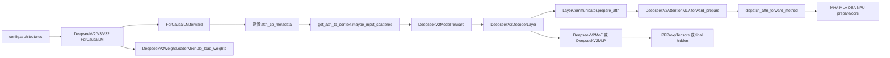

# 专用模型 · 源码走读

## 主线图



这条线要解决的问题是：一个 DeepSeek 请求进入模型层后，到底在哪里从通用模型变成专用模型。答案不是“文件很长”，而是五个接缝：类注册、ForCausalLM 入口、model 层循环、decoder layer、attention/MoE/weight loader 分支。

## 长文读法

这篇按 DeepSeek 专用接缝读：`deepseek_v2.py` 先把 attention method、backend handler、weight loader 接进模型文件，`ForCausalLM.forward` 处理 CP 和 attention TP 上下文，`DeepseekV2Model.forward` 保留 PP 骨架并传递 DSA topk，decoder layer 再把 attention、MoE、allreduce fusion 和权重布局的专用逻辑汇合起来。

| 读者任务 | 先读 | 要抓住的判断 |
|----------|------|--------------|
| 首次建立 DeepSeek 专用主线 | 主线图、第 1 到 2 节 | 专用模型仍挂在 CausalLM 骨架下，差异通过 import、mixin 和 forward 上下文接入 |
| 排查 PP / DSA topk 传递 | 第 2、3 节 | `PPProxyTensors` 不只传 hidden/residual，DSA 场景还可能要跨 stage 传 `topk_indices` |
| 理解 decoder layer 为什么复杂 | 第 4 节 | layer communicator 先处理 attention 输入，再进入 attention，随后才进入 MLP/MoE 和 postprocess |
| 判断 attention 走 MHA、MLA、DSA 还是 NPU | 第 5 节 | 先确认 backend key 命中哪个 handler，再核对图/CP/deterministic/prefix/spec 门禁；未知 key 会落到 Triton |
| 判断 MoE 性能分支 | 第 6 节 | MoE forward 负责在 mega MoE、dual stream、normal、DeepEP 等后端之间选路 |
| 排查 DeepSeek 权重加载 | 第 7 节、运行验证 | loader 把 checkpoint 名称映射到运行时参数，并处理 PP rank、fused shared experts、fused QKV A proj |

读的时候保持两层分离：`DeepseekV2ForCausalLM` 是模型入口和并行上下文边界，attention/MoE/weight loader 才是专用能力真正落地的位置。

## 1. 专用能力通过 import 接进模型文件

`deepseek_v2.py` 的 import 区已经暴露了它的设计：attention method、attention backend handler、weight loader 都被拆到 `deepseek_common`，模型文件负责把它们装进 CausalLM 骨架。

```python
# 来源：python/sglang/srt/models/deepseek_v2.py L150-L162
from sglang.srt.models.deepseek_common.attention_backend_handler import (
    AttentionBackendRegistry,
)
from sglang.srt.models.deepseek_common.attention_forward_methods import (
    AttnForwardMethod,
    DeepseekMHAForwardMixin,
    DeepseekMLACpuForwardMixin,
    DeepseekMLAForwardMixin,
    DeepseekMLARocmForwardMixin,
)
from sglang.srt.models.deepseek_common.deepseek_weight_loader import (
    DeepseekV2WeightLoaderMixin,
)
```

这里先把责任分开：`deepseek_v2.py` 是模型装配台；attention backend handler 是选路器；forward mixin 是不同执行路径；weight loader mixin 是 checkpoint 名字翻译器。

## 2. ForCausalLM 入口先设置 CP 和 attn TP 上下文

DeepSeek 顶层类仍然是普通 `nn.Module`，但它继承了专用 weight loader，并在 init 时注册 fused QKV A proj 的 packed mapping、shared expert fusion、CP 参数和 attention TP context。

```python
# 来源：python/sglang/srt/models/deepseek_v2.py L2649-L2686
class DeepseekV2ForCausalLM(nn.Module, DeepseekV2WeightLoaderMixin):
    # for quark model load
    packed_modules_mapping = {}

    def __init__(
        self,
        config: PretrainedConfig,
        quant_config: Optional[QuantizationConfig] = None,
        prefix: str = "",
    ) -> None:
        super().__init__()

        # for quark model load
        # Fuse q_a_proj and kv_a_proj_with_mqa along output dimension when q_lora_rank is not None
        self.fuse_qkv_a_proj = (
            hasattr(config, "q_lora_rank") and config.q_lora_rank is not None
        )
        if self.fuse_qkv_a_proj:
            self.packed_modules_mapping["fused_qkv_a_proj_with_mqa"] = [
                "q_a_proj",
                "kv_a_proj_with_mqa",
            ]

        # Quant configs like Quark may rely on the model to provide fused-module
        # mappings so exclusion checks can unfuse derived names back to the
        # checkpoint's source layer names.
        if quant_config is not None:
            quant_config.update_packed_modules_mapping(self.packed_modules_mapping)

        self.pp_group = get_pp_group()
        self.config = config
        self.tp_size = get_parallel().tp_size
        self.quant_config = quant_config
        self.determine_num_fused_shared_experts()
        self.use_dsa = is_deepseek_dsa(config)
        self.model = DeepseekV2Model(
            config, quant_config, prefix=add_prefix("model", prefix)
        )
```

forward 入口先根据 DSA/MLA prefill CP 条件写 `forward_batch.attn_cp_metadata`，再用 attention TP context 包住模型 forward：

```python
# 来源：python/sglang/srt/models/deepseek_v2.py L2800-L2847
    @torch.no_grad()
    def forward(
        self,
        input_ids: torch.Tensor,
        positions: torch.Tensor,
        forward_batch: ForwardBatch,
        input_embeds: torch.Tensor = None,
        pp_proxy_tensors: Optional[PPProxyTensors] = None,
    ) -> torch.Tensor:
        # Minor fix for multi-modal model: input_ids is None
        len_input_ids = (
            input_ids.shape[0] if input_ids is not None else input_embeds.shape[0]
        )
        if self.dsa_enable_prefill_cp:
            if can_dsa_cp_split(
                len_input_ids, self.cp_size, self.use_dsa, forward_batch
            ):
                forward_batch.attn_cp_metadata = prepare_context_parallel_metadata(
                    len_input_ids,
                    self.cp_rank,
                    self.cp_size,
                    forward_batch.seq_lens_cpu.tolist(),
                    extend_seqs_len=forward_batch.extend_seq_lens_cpu,
                )
        elif self.mla_enable_prefill_cp:
            if can_cp_split(len_input_ids, self.cp_size, forward_batch):
                forward_batch.attn_cp_metadata = prepare_context_parallel_metadata(
                    len_input_ids,
                    self.cp_rank,
                    self.cp_size,
                    forward_batch.seq_lens_cpu.tolist(),
                    extend_seqs_len=forward_batch.extend_seq_lens_cpu,
                )

        with get_attn_tp_context().maybe_input_scattered(forward_batch):
            hidden_states = self.model(
                input_ids, positions, forward_batch, input_embeds, pp_proxy_tensors
            )
        aux_hidden_states = None
        if self.capture_aux_hidden_states:
            hidden_states, aux_hidden_states = hidden_states

        if self.pp_group.is_last_rank:
            return self.logits_processor(
                input_ids, hidden_states, self.lm_head, forward_batch, aux_hidden_states
            )
        else:
            return hidden_states
```

注意这里没有直接跑 attention，也没有直接跑 MoE。ForCausalLM 入口只设置运行态上下文，并保持 PP last rank 才产出 logits 的通用边界。它只在 split 条件成立时写 metadata，没有显式清空分支；因此正确性依赖本次 `ForwardBatch`/runner view 进入时没有陈旧 CP 状态。

## 3. Model forward 保留 PP 骨架，额外传递 DSA topk

`DeepseekV2Model.forward` 和通用模型一样先处理 PP first/middle rank 的输入来源。差异是：DSA top-k index 可能需要跨 PP stage 传递，否则下一 stage 如果从 skip-topk 层开始就无法复用上一层 index。

```python
# 来源：python/sglang/srt/models/deepseek_v2.py L2477-L2508
    def forward(
        self,
        input_ids: torch.Tensor,
        positions: torch.Tensor,
        forward_batch: ForwardBatch,
        input_embeds: torch.Tensor = None,
        pp_proxy_tensors: Optional[PPProxyTensors] = None,
    ) -> Union[torch.Tensor, PPProxyTensors]:
        total_num_layers = self.end_layer - self.start_layer
        dsa_forward_uses_topk = self._dsa_forward_uses_topk()
        if self.pp_group.is_first_rank:
            if input_embeds is None:
                hidden_states = self.embed_tokens(input_ids)
            else:
                hidden_states = input_embeds
            residual = None
        else:
            assert pp_proxy_tensors is not None
            hidden_states = pp_proxy_tensors["hidden_states"]
            residual = pp_proxy_tensors["residual"]
            topk_indices = pp_proxy_tensors.tensors.get("topk_indices")
            assert not (
                not forward_batch.forward_mode.is_idle()
                and hidden_states.shape[0] != 0
                and self.use_dsa
                and dsa_forward_uses_topk
                and dsa_layer_skips_topk(self.config, self.start_layer)
                and topk_indices is None
            ), (
                f"PP stage starting at layer {self.start_layer} requires DSA "
                "topk_indices from the previous stage."
            )
```

层循环仍然是一层一层调用 decoder layer，只是 `topk_indices` 作为上一层的 DSA 状态被传进去：

```python
# 来源：python/sglang/srt/models/deepseek_v2.py L2560-L2584
        aux_hidden_states = []
        if self.pp_group.is_first_rank:
            topk_indices = None
        for i in range(normal_start_layer, normal_end_layer):
            # NOTE: torch dynamo does not support graph break in context manager
            ctx = (
                nullcontext()
                if check_cuda_graph_backend(Phase.PREFILL, Backend.TC_PIECEWISE)
                else get_global_expert_distribution_recorder().with_current_layer(i)
            )
            with ctx:
                layer = self.layers[i]
                hidden_states, residual, topk_indices = layer(
                    positions,
                    hidden_states,
                    forward_batch,
                    residual,
                    zero_allocator,
                    gemm_output_zero_allocator,
                    llama_4_scaling,
                    prev_topk_indices=topk_indices,
                    captured_last_layer_outputs=(
                        aux_hidden_states if i in self.layers_to_capture else None
                    ),
                )
```

非 last rank 返回 `PPProxyTensors`，并在必要时把 DSA `topk_indices` 一起带走：

```python
# 来源：python/sglang/srt/models/deepseek_v2.py L2600-L2625
        if not self.pp_group.is_last_rank:
            proxy_tensors = {
                "hidden_states": hidden_states,
                "residual": residual,
            }
            if (
                self.use_dsa
                and dsa_forward_uses_topk
                and self.end_layer < self.config.num_hidden_layers
                and dsa_layer_skips_topk(self.config, self.end_layer)
            ):
                if (
                    not forward_batch.forward_mode.is_idle()
                    and hidden_states.shape[0] != 0
                ):
                    assert topk_indices is not None, (
                        f"PP stage ending at layer {self.end_layer} must forward "
                        "DSA topk_indices because the next stage starts on a "
                        "skip-topk layer."
                    )
                if topk_indices is None:
                    topk_indices = hidden_states.new_empty(
                        (0, get_dsa_index_topk(self.config)), dtype=torch.int32
                    )
                proxy_tensors["topk_indices"] = topk_indices
            return PPProxyTensors(proxy_tensors)
```

这段解释了为什么 DeepSeek PP 问题不能只按 Llama 的 hidden states 传递来排查。V3.2 DSA 会多一条 top-k index 状态链；但 `_dsa_forward_uses_topk()` 还读取实际 backend 的 `use_mha`，若 DSA backend 已选 MHA，这条跨层状态链会被关闭。

## 4. Decoder layer 是专用优化的汇合点

Decoder layer init 时先构造 `DeepseekV2AttentionMLA`，再按 `_is_layer_sparse` 选择 MoE 或 dense MLP：

```python
# 来源：python/sglang/srt/models/deepseek_v2.py L2062-L2084
        self.self_attn = DeepseekV2AttentionMLA(
            config=config,
            hidden_size=self.hidden_size,
            num_heads=config.num_attention_heads,
            qk_nope_head_dim=config.qk_nope_head_dim,
            qk_rope_head_dim=config.qk_rope_head_dim,
            v_head_dim=config.v_head_dim,
            q_lora_rank=(
                config.q_lora_rank if hasattr(config, "q_lora_rank") else None
            ),
            kv_lora_rank=config.kv_lora_rank,
            rope_theta=rope_theta,
            rope_scaling=rope_scaling,
            max_position_embeddings=max_position_embeddings,
            quant_config=quant_config,
            layer_id=layer_id,
            reduce_results=False,
            prefix=add_prefix("self_attn", prefix),
            alt_stream=alt_stream,
            is_nextn=is_nextn,
            dsa_enable_prefill_cp=dsa_enable_prefill_cp,
            mla_enable_prefill_cp=mla_enable_prefill_cp,
        )
```

forward 主链是：communicator 准备 attention 输入，attention 返回 hidden/topk，communicator 准备 MLP 输入，MoE/MLP 执行，最后 postprocess：

```python
# 来源：python/sglang/srt/models/deepseek_v2.py L2183-L2223
    def forward(
        self,
        positions: torch.Tensor,
        hidden_states: torch.Tensor,
        forward_batch: ForwardBatch,
        residual: Optional[torch.Tensor],
        zero_allocator: BumpAllocator,
        gemm_output_zero_allocator: BumpAllocator = None,
        llama_4_scaling: Optional[torch.Tensor] = None,
        prev_topk_indices: Optional[torch.Tensor] = None,
        captured_last_layer_outputs: Optional[List[torch.Tensor]] = None,
    ) -> torch.Tensor:
        hidden_states_orig = hidden_states
        hidden_states, residual = (
            self.layer_communicator.prepare_attn_and_capture_last_layer_outputs(
                hidden_states,
                residual,
                forward_batch,
                captured_last_layer_outputs=captured_last_layer_outputs,
                quant_format=getattr(self, "_gfx95_quant_format", ""),
            )
        )

        hidden_states = self.self_attn(
            positions=positions,
            hidden_states=hidden_states,
            forward_batch=forward_batch,
            zero_allocator=zero_allocator,
            llama_4_scaling=llama_4_scaling,
            layer_scatter_modes=self.layer_scatter_modes,
            prev_topk_indices=prev_topk_indices,
        )
        if isinstance(hidden_states, tuple):
            hidden_states, topk_indices = hidden_states
        else:
            topk_indices = None
        get_attn_tp_context().clear_attn_inputs()

        hidden_states, residual = self.layer_communicator.prepare_mlp(
            hidden_states, residual, forward_batch
        )
```

MoE buffer context 和 allreduce fusion 都在 layer 内部处理：

```python
# 来源：python/sglang/srt/models/deepseek_v2.py L2239-L2270
        if (
            isinstance(self.mlp, DeepseekV2MoE)
            and not self.mlp.experts.moe_runner_config.inplace
            and not torch.compiler.is_compiling()
        ):
            from sglang.srt.layers.moe.moe_runner.base import moe_output_buffer_ctx

            _mlp_ctx = moe_output_buffer_ctx(hidden_states_orig)
        else:
            _mlp_ctx = nullcontext()

        with _mlp_ctx:
            hidden_states = self.mlp(
                hidden_states,
                forward_batch,
                should_allreduce_fusion,
                use_reduce_scatter,
                gemm_output_zero_allocator,
            )

        if (
            not (self.dsa_enable_prefill_cp or self.mla_enable_prefill_cp)
            and should_allreduce_fusion
        ):
            hidden_states._sglang_needs_allreduce_fusion = True

        if not should_allreduce_fusion:
            hidden_states, residual = self.layer_communicator.postprocess_layer(
                hidden_states, residual, forward_batch
            )

        return hidden_states, residual, topk_indices
```

这一层是读 DeepSeek 性能问题的主入口：attention 选路、MoE 后端、communicator、allreduce fusion 都在这里相遇。

## 5. Attention 先选 backend，再选 prepare/core

`dispatch_attn_forward_method` 根据当前 `ForwardBatch` 和 backend 字符串选择 attention backend handler：

```python
# 来源：python/sglang/srt/models/deepseek_v2.py L1788-L1816
    def dispatch_attn_forward_method(
        self, forward_batch: ForwardBatch
    ) -> AttnForwardMethod:
        # Determine attention backend name for current forward batch: prefer the
        # name stamped per-runner on the backend object, else resolve from server args.
        backend = get_attn_backend()
        server_args = get_global_server_args()
        default_prefill_str, default_decode_str = server_args.get_attention_backends()
        prefill_backend_str = (
            backend.prefill_attention_backend_str or default_prefill_str
        )
        decode_backend_str = backend.decode_attention_backend_str or default_decode_str
        if forward_batch.forward_mode.is_decode_or_idle():
            attention_backend = decode_backend_str
        elif (
            forward_batch.forward_mode.is_target_verify()
            or forward_batch.forward_mode.is_draft_extend_v2()
        ):
            # Use the specified backend for speculative operations (both verify and draft extend)
            if server_args.speculative_attention_mode == "decode":
                attention_backend = decode_backend_str
            else:  # default to prefill
                attention_backend = prefill_backend_str
        else:
            attention_backend = prefill_backend_str
        self.current_attention_backend = attention_backend

        handler = AttentionBackendRegistry.get_handler(attention_backend)
        return handler(self, forward_batch)
```

handler 层再把 backend 和 batch 形态转成具体 method。Registry 对未知 backend key 会静默返回 Triton handler，而不是报 unsupported；完整证据见 [[SGLang-专用模型-核心概念]]。例如 flashinfer/fa3/flashmla/cutlass_mla 共享 `_handle_attention_backend`：

```python
# 来源：python/sglang/srt/models/deepseek_common/attention_backend_handler.py L78-L108
def _handle_attention_backend(attn, forward_batch, backend_name):
    if is_in_tc_piecewise_cuda_graph():
        return AttnForwardMethod.MLA

    # MLA prefill CP forces absorbed MLA regardless of prefix length: the
    # CP path gathers latent KV via rebuild_cp_kv_cache and feeds the
    # backend's absorbed-MLA kernel.
    if mla_use_prefill_cp(forward_batch):
        return _dispatch_mla_subtype(attn, forward_batch)

    sum_extend_prefix_lens = _get_sum_extend_prefix_lens(forward_batch)
    disable_ragged = (
        backend_name in ["flashinfer", "flashmla"]
    ) and attn.flashinfer_mla_disable_ragged

    if (
        not disable_ragged
        and forward_batch.forward_mode.is_extend_without_speculative()
        and (
            (
                sum_extend_prefix_lens >= attn.chunked_prefix_cache_threshold
                and not attn.disable_chunked_prefix_cache
            )
            or sum_extend_prefix_lens == 0
        )
    ):
        if _support_mha_one_shot(attn, forward_batch, backend_name):
            return AttnForwardMethod.MHA_ONE_SHOT
        return AttnForwardMethod.MHA_CHUNKED_KV
    else:
        return _dispatch_mla_subtype(attn, forward_batch)
```

这张 generic 卡的顺序不能外推所有 backend：TC piecewise graph 与 MLA prefill CP 先强制 MLA；prefix 总长为 0 也进入 MHA 分支；FA3 deterministic、FA4、Aiter、TRT-LLM/tokenspeed、DSA、Triton、Ascend 均有独立规则。

`forward_prepare` 把 method 分派到不同 prepare 函数，`forward_core` 再按同一个 method 调 core：

```python
# 来源：python/sglang/srt/models/deepseek_v2.py L1890-L1950
        attn_forward_method = self.dispatch_attn_forward_method(forward_batch)
        if attn_forward_method == AttnForwardMethod.MHA:
            inner_state = self.forward_normal_prepare(
                positions, hidden_states, forward_batch, zero_allocator
            )
        elif attn_forward_method == AttnForwardMethod.MHA_CHUNKED_KV:
            inner_state = self.forward_normal_chunked_kv_prepare(
                positions, hidden_states, forward_batch, zero_allocator
            )
        elif attn_forward_method == AttnForwardMethod.MHA_ONE_SHOT:
            inner_state = self.forward_normal_one_shot_prepare(
                positions, hidden_states, forward_batch, zero_allocator
            )
        elif attn_forward_method == AttnForwardMethod.MLA:
            inner_state = self.forward_absorb_prepare(
                positions,
                hidden_states,
                forward_batch,
                zero_allocator,
                llama_4_scaling,
                prev_topk_indices,
            )
        elif attn_forward_method == AttnForwardMethod.MLA_FUSED_ROPE_ROCM:
            inner_state = self.forward_absorb_fused_mla_rope_prepare(
                positions, hidden_states, forward_batch, zero_allocator
            )
        elif attn_forward_method == AttnForwardMethod.MLA_FUSED_ROPE_CPU:
            inner_state = self.forward_absorb_fused_mla_rope_cpu_prepare(
                positions, hidden_states, forward_batch, zero_allocator
            )
        elif attn_forward_method == AttnForwardMethod.MHA_NPU:
            inner_state = forward_mha_prepare_npu(
                self,
                positions,
                hidden_states,
                forward_batch,
                zero_allocator,
                layer_scatter_modes,
            )
        elif attn_forward_method == AttnForwardMethod.MLA_NPU:
            inner_state = forward_mla_prepare_npu(
                self,
                positions,
                hidden_states,
                forward_batch,
                zero_allocator,
                layer_scatter_modes,
            )
        elif attn_forward_method == AttnForwardMethod.DSA_NPU:
            inner_state = forward_dsa_prepare_npu(
                self,
                positions,
                hidden_states,
                forward_batch,
                zero_allocator,
                layer_scatter_modes,
                prev_topk_indices,
            )
        else:
            raise NotImplementedError
        return None, attn_forward_method, forward_batch, inner_state
```

排查 attention 时，先记录 `current_attention_backend` 和 `attn_forward_method`，再进入具体 mixin。不要直接从 `forward_mla.py` 或 `forward_mha.py` 的 kernel 细节开始。

## 6. MoE forward 只负责选执行后端

`DeepseekV2MoE.forward` 不把 expert GEMM 手写在模型文件里。它先试 MegaMoE，再根据 A2A/dual stream/normal/DeepEP 分支进入不同实现：

```python
# 来源：python/sglang/srt/models/deepseek_v2.py L853-L916
    def forward(
        self,
        hidden_states: torch.Tensor,
        forward_batch: Optional[ForwardBatch] = None,
        should_allreduce_fusion: bool = False,
        use_reduce_scatter: bool = False,
        gemm_output_zero_allocator: BumpAllocator = None,
        input_ids: Optional[torch.Tensor] = None,
        input_ids_global: Optional[torch.Tensor] = None,
        skip_shared_experts: bool = False,
    ) -> torch.Tensor:
        from sglang.srt.layers.moe.mega_moe import forward_mega_moe, should_use_mega_moe

        if should_use_mega_moe(self, hidden_states):
            return forward_mega_moe(
                self,
                hidden_states,
                forward_batch,
                input_ids_global=input_ids_global,
            )

        if not self._enable_a2a_moe:
            server_args = get_global_server_args()
            if self._can_dual_stream_graph(hidden_states, server_args):
                return dsv2_flashinfer_moe_dual_stream_graph(
                    hidden_states,
                    self.layer_id,
                    should_allreduce_fusion,
                    use_reduce_scatter,
                )
            elif (
                self.alt_stream is not None
                and self.num_fused_shared_experts == 0
                and hidden_states.shape[0] > 0
                and get_is_capture_mode()
                and not (
                    server_args.enable_torch_compile
                    and hidden_states.shape[0]
                    <= server_args.torch_compile_max_bs
                    * (server_args.speculative_num_draft_tokens or 1)
                )
            ):
                return self.forward_normal_dual_stream(
                    hidden_states,
                    should_allreduce_fusion,
                    use_reduce_scatter,
                    gemm_output_zero_allocator,
                    input_ids,
                    input_ids_global=input_ids_global,
                )
            else:
                return self.forward_normal(
                    hidden_states,
                    should_allreduce_fusion,
                    use_reduce_scatter,
                    gemm_output_zero_allocator,
                    input_ids,
                    input_ids_global=input_ids_global,
                    skip_shared_experts=skip_shared_experts,
                )
        else:
            return self.forward_deepep(
                hidden_states, forward_batch, input_ids_global=input_ids_global
            )
```

模型层只负责组织 routing 和后端入口；expert dispatch、combine、EPLB、DeepEP 细节属于 [[SGLang-MoE]]。这里还说明“DeepEP”不是单一分支：shared-expert fusion 默认会被更早的安全门禁关闭，只有强制开启等情况下才把 shared expert 编成 EP-size 个 home slots；`ep_num_redundant_experts` 则是另一条独立扩容。

## 7. 权重加载把 checkpoint 名字翻译成运行时参数

DeepSeek weight loader 先处理 PP stage skip 和 shared expert fusion remap。CPU tensor 的参数写入可提交线程池；源码会在循环后等待全部 future 并传播异常，再进入 post-load：

```python
# 来源：python/sglang/srt/models/deepseek_common/deepseek_weight_loader.py L202-L224
        with concurrent.futures.ThreadPoolExecutor() as executor:
            futures = []
            params_dict = dict(self.named_parameters())
            weight_names = []
            for name, loaded_weight in weights:
                use_async_loading = should_async_load(loaded_weight)
                layer_id = get_layer_id(name)
                if (
                    layer_id is not None
                    and hasattr(self.model, "start_layer")
                    and (
                        layer_id < self.model.start_layer
                        or layer_id >= self.model.end_layer
                    )
                ):
                    continue
                if self.num_fused_shared_experts > 0 and "mlp.shared_experts" in name:
                    name = name.replace(
                        "mlp.shared_experts",
                        f"mlp.experts.{self.config.n_routed_experts}",
                    )

                weight_names.append(name)
```

```python
# 来源：python/sglang/srt/models/deepseek_common/deepseek_weight_loader.py L432-L436
            # Wait for all tasks to complete and raise any exceptions.
            for future in concurrent.futures.as_completed(futures):
                future.result()

        self.post_load_weights(is_nextn=is_nextn, weight_names=weight_names)
```

随后分别处理 dense stacked mapping、expert mapping、PP embedding/norm skip、fused qkv_a：

```python
# 来源：python/sglang/srt/models/deepseek_common/deepseek_weight_loader.py L271-L347
                for param_name, weight_name, shard_id in stacked_params_mapping:
                    # Skip non-stacked layers and experts (experts handled below).
                    if weight_name not in name:
                        continue
                    if _is_npu:
                        name = name.replace("weight_packed", "weight")
                    # We have mlp.experts[0].gate_proj in the checkpoint.
                    # Since we handle the experts below in expert_params_mapping,
                    # we need to skip here BEFORE we update the name, otherwise
                    # name will be updated to mlp.experts[0].gate_up_proj, which
                    # will then be updated below in expert_params_mapping
                    # for mlp.experts[0].gate_gate_up_proj, which breaks load.
                    if ("mlp.experts." in name) and name not in params_dict:
                        continue
                    name = name.replace(weight_name, param_name)
                    # Skip loading extra bias for GPTQ models.
                    if name.endswith(".bias") and name not in params_dict:
                        continue
                    param = params_dict[name]
                    weight_loader = param.weight_loader
                    maybe_executor_submit(
                        executor=executor,
                        futures=futures,
                        use_async=use_async_loading,
                        func=weight_loader,
                        func_args=(param, loaded_weight, shard_id),
                    )
                    break
                else:
                    for mapping in expert_params_mapping:
                        param_name, weight_name, expert_id, shard_id = mapping
                        if weight_name not in name:
                            continue
                        if _is_npu:
                            name = name.replace("weight_packed", "weight")
                        name = name.replace(weight_name, param_name)
                        if name not in params_dict:
                            continue
                        param = params_dict[name]
                        weight_loader = param.weight_loader
                        maybe_executor_submit(
                            executor=executor,
                            futures=futures,
                            use_async=use_async_loading,
                            func=weight_loader,
                            func_args=(
                                param,
                                loaded_weight,
                                name,
                            ),
                            func_kwargs={
                                "shard_id": shard_id,
                                "expert_id": expert_id,
                            },
                        )
                        break
                    else:
                        # Skip loading extra bias for GPTQ models.
                        if name.endswith(".bias") and name not in params_dict:
                            continue
                        # Skip loading embed_tokens if not first rank in pipeline parallelism
                        if ".embed_tokens." in name and not self.pp_group.is_first_rank:
                            continue
                        # Skip loading norm if not last rank in pipeline parallelism
                        if ".norm." in name and not self.pp_group.is_last_rank:
                            continue
                        if fuse_qkv_a_proj and (
                            "q_a_proj" in name or "kv_a_proj_with_mqa" in name
                        ):
                            cached_a_proj[name] = _clone_if_runai_streamed_tensor(
                                loaded_weight
                            )
                            q_a_proj_name = (
                                name
                                if "q_a_proj" in name
                                else name.replace("kv_a_proj_with_mqa", "q_a_proj")
                            )
```

fused A-proj 只有 `q_a_proj` 与 `kv_a_proj_with_mqa` 都到齐才提交写入；FP8 indexer `wk` 同样要 weight 与 scale 成对。两个 pending map 在 iterator 结束时没有非空断言，因此“没有 warning”不等于 pair 完整。RunAI streamed tensor 会先 clone，避免 iterator 复用底层 storage 后缓存失效。

```python
# 来源：python/sglang/srt/models/deepseek_common/deepseek_weight_loader.py L191-L203
        fuse_qkv_a_proj = hasattr(self.config, "q_lora_rank") and (
            self.config.q_lora_rank is not None
        )
        cached_a_proj = {} if fuse_qkv_a_proj else None

        pending_indexer_wk: Dict[str, Dict[str, torch.Tensor]] = {}

        if self.num_fused_shared_experts > 0:
            assert self.num_fused_shared_experts == 1
            log_info_on_rank0(logger, "Shared experts fusion optimization enabled.")

        with concurrent.futures.ThreadPoolExecutor() as executor:
            futures = []
```

这里还有一个强制开关的边界：loader 对 fused shared experts 只接受 1 个；若 `enforce_shared_experts_fusion` 绕过 config 安全门禁并让 `n_shared_experts != 1`，会在加载阶段触发断言，而不是获得一个泛化的多 shared-expert fused 实现。

最后 `post_load_weights` 还会按 AWQ、FP8、INT8 与 DeepGEMM 等条件处理 `kv_b_proj`，再拆成 MLA 需要的 `w_kc` 和 `w_vc`：

```python
# 来源：python/sglang/srt/models/deepseek_common/deepseek_weight_loader.py L472-L483
    def post_load_weights(
        self,
        is_nextn: bool = False,
        weight_names: Optional[Iterable[str]] = None,
    ) -> None:
        """Post-process weights after loading.

        Handles kv_b_proj weight processing including:
        - AWQ dequantization
        - FP8/INT8 requantization and block-wise to tensor-wise conversion
        - Splitting weights into w_kc and w_vc components for MLA
```

所以 DeepSeek 权重问题不能只看 `params_dict` 是否有同名参数。要先经过 stage skip、fused shared expert remap、NextN、成对 qkv_a/indexer fusion、async join 和量化感知 post-load。部分权重更新时，post-load 只处理 `weight_names` 中实际出现 `kv_b_proj` 的 layer。

## 运行验证

| 要验证的事 | 推荐观察点 |
|------------|------------|
| 当前 attention 实际走哪个方法 | 在 `dispatch_attn_forward_method` 后记录 `self.current_attention_backend` 和返回的 `AttnForwardMethod` |
| PP 传递是否带 DSA topk | 非 last rank 的 `PPProxyTensors.tensors` 是否含 `topk_indices` |
| sparse 层分布是否符合预期 | 打印 `_is_layer_sparse(i, False)`，对照 `first_k_dense_replace` 与 `moe_layer_freq` |
| shared expert 是否 fusion | 记录全局 disable/enforce、DeepEP backend、fused/home/redundant slot 的分别来源 |
| 权重名为何缺失 | 记录原始/remap name、stage skip、future 异常，并在 iterator 结束断言两个 pending map 为空 |

## 复盘

这条走读主线可以压成一句话：DeepSeek 专用模型仍沿用通用 CausalLM 外壳，但在 decoder 层内部把 attention、MLP、通信和权重装载都换成可动态分派的系统。读源码时先找选路点，再进入对应后端；先看对象边界，再看 kernel 细节。
