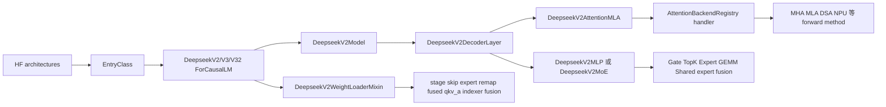

# 专用模型

读完 [[SGLang-通用模型]] 后，再读本专题才有意义。通用模型解决的是“architecture 怎么变成模型类、ForwardBatch 怎么穿过 decoder、checkpoint name 怎么写进参数”。DeepSeek 专用模型没有推翻这三本账，而是在三本账上插入四个高复杂度改造点：MLA attention 选路、MoE 稀疏层、DSA/Context Parallel、专用权重装载。

本专题回答三件事：

1. 为什么 `deepseek_v2.py` 一个文件能承载 DeepSeek V2、V3、V3.2，以及三个空子类究竟没有改变什么。
2. 一条请求进入 DeepSeek 模型后，哪些地方从通用 decoder 变成 MLA/MoE/CP 特化路径。
3. 出现 MLA 回退、expert 数不对、PP/CP 输出异常、权重名找不到时，应先查哪条源码链。

## 阅读路径

| 读者任务 | 先读 | 再读 |
|----------|------|------|
| 建立 DeepSeek 专用模型心智模型 | [[SGLang-专用模型-核心概念]] | [[SGLang-通用模型-核心概念]] |
| 按一次 forward 跟源码 | [[SGLang-专用模型-源码走读]] | [[SGLang-RadixAttention]] |
| 排查 CP、MoE、weight loader 的对象边界 | [[SGLang-专用模型-数据流]] | [[SGLang-MoE]] |
| 遇到线上症状快速定位 | [[SGLang-专用模型-排障指南]] | [[SGLang-分布式]] |
| 验收是否读懂 | [[SGLang-专用模型-学习检查]] | [[SGLang-ModelLoader]] |

## 心理模型



把它读成四本账：

| 账本 | 入口 | 关键判断 | 常见症状 |
|------|------|----------|----------|
| 类账 | `EntryClass`、`DeepseekV2ForCausalLM` | V2/V3/V3.2 共用实现，按类名注册 | architecture 命中但行为不像预期 |
| Attention 账 | `dispatch_attn_forward_method`、handler registry | runner/backend 字符串、forward mode、图模式、CP/DSA 与后端专属策略共同决定 method | 未知 backend 静默落到 Triton、MLA 没走、prefill OOM、NPU 路径不同 |
| Expert 账 | `DeepseekV2MoE`、`_is_layer_sparse` | 哪些层 sparse，shared expert 是独立、普通 fused 还是强制 DeepEP fused，EPLB 冗余 slot 如何叠加 | TP 拓扑不受支持、expert slot 数量不对 |
| 权重账 | `DeepseekV2WeightLoaderMixin` | PP stage skip、shared expert remap、NextN、成对 fusion、异步完成、量化感知 post-load | 参数缺失、shared expert 错槽、DSA indexer 或 fused A-proj 只到半边 |

## 核心源码证据

DeepSeek 专用模型仍由 Registry 的 `EntryClass` 暴露给通用装配线，只是一个文件里暴露三个类名：

```python
# 来源：python/sglang/srt/models/deepseek_v2.py L2937-L2942
class DeepseekV3ForCausalLM(DeepseekV2ForCausalLM):
    pass


class DeepseekV32ForCausalLM(DeepseekV2ForCausalLM):
    pass
```

```python
# 来源：python/sglang/srt/models/deepseek_v2.py L2966-L2966
EntryClass = [DeepseekV2ForCausalLM, DeepseekV3ForCausalLM, DeepseekV32ForCausalLM]
```

Decoder 层不是“全部 MoE”。稀疏层由配置决定，NextN speculative 层强制 sparse：

```python
# 来源：python/sglang/srt/models/deepseek_v2.py L2176-L2181
    def _is_layer_sparse(self, layer_id: int, is_nextn: bool) -> bool:
        return is_nextn or (
            self.config.n_routed_experts is not None
            and layer_id >= self.config.first_k_dense_replace
            and layer_id % self.config.moe_layer_freq == 0
        )
```

MLA/MHA/DSA 不是靠读者猜。Attention 入口先根据当前 batch 的 backend 字符串和 forward mode 找 handler，再返回 `AttnForwardMethod`：

```python
# 来源：python/sglang/srt/models/deepseek_v2.py L1788-L1816
    def dispatch_attn_forward_method(
        self, forward_batch: ForwardBatch
    ) -> AttnForwardMethod:
        # Determine attention backend name for current forward batch: prefer the
        # name stamped per-runner on the backend object, else resolve from server args.
        backend = get_attn_backend()
        server_args = get_global_server_args()
        default_prefill_str, default_decode_str = server_args.get_attention_backends()
        prefill_backend_str = (
            backend.prefill_attention_backend_str or default_prefill_str
        )
        decode_backend_str = backend.decode_attention_backend_str or default_decode_str
        if forward_batch.forward_mode.is_decode_or_idle():
            attention_backend = decode_backend_str
        elif (
            forward_batch.forward_mode.is_target_verify()
            or forward_batch.forward_mode.is_draft_extend_v2()
        ):
            # Use the specified backend for speculative operations (both verify and draft extend)
            if server_args.speculative_attention_mode == "decode":
                attention_backend = decode_backend_str
            else:  # default to prefill
                attention_backend = prefill_backend_str
        else:
            attention_backend = prefill_backend_str
        self.current_attention_backend = attention_backend

        handler = AttentionBackendRegistry.get_handler(attention_backend)
        return handler(self, forward_batch)
```

## 源码范围

| 文件 | 本专题关注点 |
|------|--------------|
| `python/sglang/srt/models/deepseek_v2.py` | DeepSeek V2/V3/V3.2 的模型类、attention、MoE、decoder、CP 入口 |
| `python/sglang/srt/models/deepseek_common/attention_backend_handler.py` | attention backend 到 `AttnForwardMethod` 的分派表 |
| `python/sglang/srt/models/deepseek_common/attention_forward_methods/forward_methods.py` | MHA、MLA、chunked KV、fused RoPE、NPU/DSA 枚举 |
| `python/sglang/srt/models/deepseek_common/deepseek_weight_loader.py` | expert 权重 remap、NextN、fused qkv_a、DSA indexer 权重装载 |
| `python/sglang/srt/layers/communicator_dsa_cp.py` | DSA/MLA prefill CP 的 layer communicator |
| `python/sglang/srt/layers/moe/` | expert dispatch、DeepEP、FusedMoE 后端，详见 [[SGLang-MoE]] |

## 判断标准

- 看到 DeepSeek V3/V3.2 行为差异，先查 config 与 server args；三个注册类本身是空子类，没有各自覆写 forward。
- 看到 prefill 走 MHA 而 decode 走 MLA，先确认 backend key 实际命中哪个 handler，再逐项核对图模式、deterministic、CP、prefix 与 speculative mode。
- 看到 expert 数量多出 slot，先分清普通 fusion、被强制开启的 DeepEP fusion、EPLB redundant experts 和独立 shared expert；DeepEP 默认并不启用 fusion。
- 看到 CP 相关 shape 异常，除 metadata 与 split/gather 外，还要验证 attention DP/TP 是否都为 1；入口本身不会在“不再满足 split”时显式清空旧 metadata。
- 看到权重名缺失，先查 stage skip、shared/NextN remap、成对 fused A-proj/indexer 是否齐全，以及所有 async future 是否已在 post-load 前完成。

## 相邻专题

| 专题 | 关系 |
|------|------|
| [[SGLang-通用模型]] | DeepSeek 仍沿用通用模型装配线和 PP 输出边界 |
| [[SGLang-RadixAttention]] | MLA/MHA 最终仍进入 attention backend 和 KV cache 体系 |
| [[SGLang-MoE]] | 本专题只讲 DeepSeek 模型层如何调用 MoE，专家 GEMM 和 dispatch 细节在 MoE 专题 |
| [[SGLang-Sampling]] | speculative / target verify 影响 attention backend 选择 |
| [[SGLang-ModelLoader]] | ModelLoader 只提供 `(name, tensor)`，DeepSeek 模型类负责专用 remap |
