# 通用模型 · 数据流

## 你为什么要读

本篇回答“对象在边界上长什么样”。通用模型层同时处理三条流：architecture 字符串、运行时 hidden states、checkpoint tensor 名字。把这三条流分开，排查会快很多。

## 数据流总图

```mermaid
flowchart TB
  subgraph ClassFlow[类账]
    A[HF architectures] --> B[get_model_architecture]
    B --> C[ModelRegistry]
    C --> D[model_cls resolved_arch]
  end
  subgraph RunFlow[执行账]
    E[input_ids positions ForwardBatch] --> F[embedding 或 PPProxyTensors]
    F --> G[decoder layers]
    G --> H[RadixAttention]
    H --> I[LogitsProcessor 或 PPProxyTensors]
  end
  subgraph WeightFlow[权重账]
    J[(name tensor)] --> K[load_weights]
    K --> L[stacked name remap]
    L --> M[param.weight_loader]
  end
```



## 1. 类账：输入是字符串，输出是类对象

| 边界 | 输入 | 输出 | 持有者 |
|------|------|------|--------|
| HF config | `architectures: list[str]` | 候选 architecture | `ModelConfig.hf_config` |
| Loader utils | 候选 architecture + `model_impl` | `(model_cls, resolved_arch)` | `get_model_architecture` |
| Registry | architecture 字符串 | `Type[nn.Module]` | `ModelRegistry.models` |
| ModelLoader | `model_cls` | 空模型对象 | `_initialize_model` |

Registry 注册表只保存 architecture 到类的映射：

```python
# 来源：python/sglang/srt/models/registry.py L19-L39
@dataclass
class _ModelRegistry:
    # Keyed by model_arch
    models: Dict[str, Union[Type[nn.Module], str]] = field(default_factory=dict)

    def register(
        self, package_name: str, overwrite: bool = False, strict: bool = False
    ):
        new_models = import_model_classes(package_name, strict=strict)
        if overwrite:
            self.models.update(new_models)
        else:
            for arch, cls in new_models.items():
                if arch in self.models:
                    raise ValueError(
                        f"Model architecture {arch} already registered. Set overwrite=True to replace."
                    )
                self.models[arch] = cls

    def get_supported_archs(self) -> AbstractSet[str]:
        return self.models.keys()
```

因此，类账的核心不变量是：HF architecture 字符串必须能命中 `self.models` 中的 key，或者能被改写到 fallback architecture。

## 2. 执行账：`ForwardBatch` 只随张量下传

模型层不解析 `Req`，也不决定调度策略。Scheduler 和 ModelRunner 已经把请求压成 `input_ids`、`positions` 和 `ForwardBatch`；模型层把它们原样传给 decoder layer 和 attention。

```python
# 来源：python/sglang/srt/models/llama.py L228-L252
    def forward(
        self,
        positions: torch.Tensor,
        hidden_states: torch.Tensor,
        forward_batch: ForwardBatch,
    ) -> torch.Tensor:
        if (
            not _is_npu
            or not hasattr(self.rotary_emb, "get_cos_sin_with_position")
            or forward_batch.forward_mode.is_extend()
        ):
            q, k, v = self.forward_prepare_native(
                positions=positions,
                hidden_states=hidden_states,
            )
        else:
            q, k, v = self.forward_prepare_npu(
                positions=positions,
                hidden_states=hidden_states,
                forward_batch=forward_batch,
            )

        attn_output = self.attn(q, k, v, forward_batch)
        output, _ = self.o_proj(attn_output)
        return output
```

这里的边界很清楚：模型 attention 准备 Q/K/V，`RadixAttention` 消费 `ForwardBatch` 里的 mode、cache 位置和 backend metadata。

## 3. PP 边界：首 rank 消费 token，中间 rank 消费 proxy

PP 下的对象形态会变：

| PP 位置 | 输入对象 | 输出对象 |
|---------|----------|----------|
| first rank | `input_ids` 或 `input_embeds` | hidden states + residual |
| middle rank | `PPProxyTensors` | 新的 `PPProxyTensors` |
| last rank | `PPProxyTensors` 或 first rank hidden | final hidden states，再进入 logits/pooler |

`Qwen2Model.forward` 展示了这个边界：

```python
# 来源：python/sglang/srt/models/qwen2.py L348-L398
    def forward(
        self,
        input_ids: torch.Tensor,
        positions: torch.Tensor,
        forward_batch: ForwardBatch,
        input_embeds: torch.Tensor = None,
        pp_proxy_tensors: Optional[PPProxyTensors] = None,
    ) -> Union[torch.Tensor, PPProxyTensors]:

        if self.pp_group.is_first_rank:
            if input_embeds is None:
                hidden_states = self.embed_tokens(input_ids)
            else:
                hidden_states = input_embeds
            residual = None
        else:
            assert pp_proxy_tensors is not None
            hidden_states = pp_proxy_tensors["hidden_states"]
            residual = pp_proxy_tensors["residual"]

        aux_hidden_states = []
        for i in range(self.start_layer, self.end_layer):
            if i in self.layers_to_capture:
                aux_hidden_states.append(
                    hidden_states + residual if residual is not None else hidden_states
                )
            layer = self.layers[i]
            hidden_states, residual = layer(
                positions,
                hidden_states,
                forward_batch,
                residual,
            )
        if not self.pp_group.is_last_rank:
            return PPProxyTensors(
                {
                    "hidden_states": hidden_states,
                    "residual": residual,
                }
            )
        else:
            if hidden_states.shape[0] != 0:
                if residual is None:
                    hidden_states = self.norm(hidden_states)
                else:
                    hidden_states, _ = self.norm(hidden_states, residual)

        if len(aux_hidden_states) == 0:
            return hidden_states

        return hidden_states, aux_hidden_states
```

`PPProxyTensors` 本身只是一个带 key 的 tensor 容器：

```python
# 来源：python/sglang/srt/model_executor/forward_batch_info.py L1483-L1505
class PPProxyTensors:
    # adapted from https://github.com/vllm-project/vllm/blob/d14e98d924724b284dc5eaf8070d935e214e50c0/vllm/sequence.py#L1103
    tensors: Dict[str, torch.Tensor]

    def __init__(self, tensors):
        # manually define this function, so that
        # Dynamo knows `IntermediateTensors()` comes from this file.
        # Otherwise, dataclass will generate this function by evaluating
        # a string, and we will lose the information about the source file.
        self.tensors = tensors

    def __getitem__(self, key: Union[str, slice]):
        if isinstance(key, str):
            return self.tensors[key]
        elif isinstance(key, slice):
            return self.__class__({k: v[key] for k, v in self.tensors.items()})

    def __setitem__(self, key: str, value: torch.Tensor):
        self.tensors[key] = value

    def __len__(self):
        return len(self.tensors)
```

所以 PP 数据流里，关键不是序列化协议，而是 hidden/residual 两个状态是否在 stage 间保持一致。

## 4. CausalLM 边界：最后一跳才有 logits

`LlamaForCausalLM.forward` 展示了输出分叉。`get_embedding=True` 时走 pooler；普通 generate 在 last rank 走 logits processor；非 last rank 返回 hidden states。

```python
# 来源：python/sglang/srt/models/llama.py L550-L562
        if self.pp_group.is_last_rank:
            if not get_embedding:
                return self.logits_processor(
                    input_ids,
                    hidden_states,
                    self.lm_head,
                    forward_batch,
                    aux_hidden_states,
                )
            else:
                return self.pooler(hidden_states, forward_batch)
        else:
            return hidden_states
```

排查“为什么这里没有 logits”时，先确认当前 rank 是否是 PP last rank，再确认 `get_embedding` 是否为真。

## 5. Qwen3 层内边界：通信由 LayerCommunicator 接管

Qwen3 layer 的对象变化不是简单的 `norm → attention → norm → mlp`。`LayerCommunicator` 会在 attention 和 MLP 前后处理 residual、layout 和必要通信。

```python
# 来源：python/sglang/srt/models/qwen3.py L397-L433
        # Self Attention
        hidden_states, residual = self.layer_communicator.prepare_attn(
            hidden_states,
            residual,
            forward_batch,
            post_residual_addition=post_residual_addition,
        )
        if hidden_states.shape[0] != 0:
            hidden_states = self.self_attn(
                positions=positions,
                hidden_states=hidden_states,
                forward_batch=forward_batch,
            )

        # Fully Connected
        hidden_states, residual = self.layer_communicator.prepare_mlp(
            hidden_states,
            residual,
            forward_batch,
            cache=(
                [self.mlp.gate_up_proj.weight, self.mlp.down_proj.weight]
                if _is_npu
                and check_cuda_graph_backend(Phase.PREFILL, Backend.TC_PIECEWISE)
                and (
                    hasattr(self.mlp.gate_up_proj, "weight")
                    and hasattr(self.mlp.down_proj, "weight")
                )
                else None
            ),
        )
        hidden_states = self.mlp(hidden_states, forward_batch=forward_batch)
        if _is_npu and get_cmo_stream():
            wait_cmo_stream()
        hidden_states, residual = self.layer_communicator.postprocess_layer(
            hidden_states, residual, forward_batch
        )
        return hidden_states, residual
```

这个边界解释了为什么 Qwen3 问题不能只按 Llama 的 Pre-Norm 公式排查。通信和 layout 已经被抽象进 communicator。

## 6. 权重账：ModelLoader 的输出进入 `load_weights`

冷启动或磁盘热更新都会把 `(name, tensor)` 送到模型类的 `load_weights`。模型类在这里做三件事：

| 步骤 | 作用 | 例子 |
|------|------|------|
| name normalization | 补前缀、改旧 scale 名 | `layers.0` → `model.layers.0` |
| stage/filter | 跳过 PP stage 外层和冗余 tensor | `rotary_emb.cos_cached` |
| stacked mapping | 把 HF 分开参数写入 fused 参数 | `q_proj` → `qkv_proj` |

Qwen3 的前缀兼容和 tied embedding 写入发生在权重账入口：

```python
# 来源：python/sglang/srt/models/qwen3.py L607-L624
        params_dict = dict(self.named_parameters())
        for name, loaded_weight in weights:
            if not name.startswith("model.") and (
                name.startswith("layers.")
                or name.startswith("embed_tokens.")
                or name.startswith("norm.")
            ):
                name = add_prefix(name, "model")

            if name == "model.embed_tokens.weight":
                if self.pp_group.is_last_rank and self.config.tie_word_embeddings:
                    if "lm_head.weight" in params_dict:
                        param = params_dict["lm_head.weight"]
                        weight_loader = getattr(
                            param, "weight_loader", default_weight_loader
                        )
                        weight_loader(param, loaded_weight)
```

Llama 的 stacked mapping 则展示了 QKV 和 gate/up 的 fused 写入：

```python
# 来源：python/sglang/srt/models/llama.py L673-L685
            for param_name, weight_name, shard_id in stacked_params_mapping:
                if weight_name not in name:
                    continue
                name = name.replace(weight_name, param_name)
                # Skip loading extra bias for GPTQ models.
                if name.endswith(".bias") and name not in params_dict:
                    continue
                if name not in params_dict:
                    continue
                param = params_dict[name]
                weight_loader = param.weight_loader
                weight_loader(param, loaded_weight, shard_id)
                break
```

这里再次接回 [[SGLang-ModelLoader]]：loader 不理解 q/k/v fused 语义，模型类才理解。

## 运行验证

| 现象 | 观察入口 | 预期 |
|------|----------|------|
| native 没命中 | `model_config._resolved_model_arch` | 值是 native 类名或 `TransformersForCausalLM` |
| PP 中间 rank 无 logits | `pp_group.is_last_rank` | 非 last rank 返回 hidden 或 `PPProxyTensors` |
| Qwen3 layer 输出 shape 异常 | `LayerCommunicator.prepare_attn/prepare_mlp` | attention/MLP 前后的 layout 应匹配当前 parallel 配置 |
| 权重名前缀不匹配 | `Qwen3ForCausalLM.load_weights` | 缺 `model.` 的 `layers/embed_tokens/norm` 会被补前缀 |
| QKV 权重 shape mismatch | `stacked_params_mapping` 和参数 `weight_loader` | `q/k/v` 应写入 `qkv_proj` 的对应 shard |

## 复盘

这篇的关键判断是：通用模型层同时是类解析层、执行骨架层和权重名字翻译层。排障时先判断问题属于哪条流，再进入对应源码。
