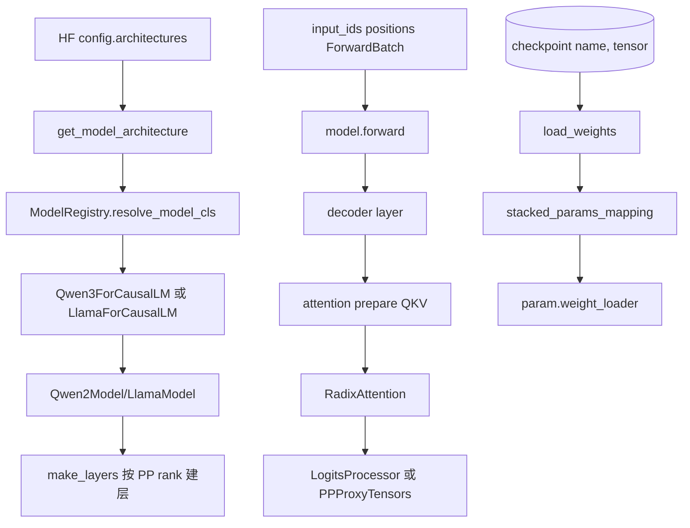

# 通用模型 · 源码走读

本篇沿两条真实主线走：启动时 `architectures` 如何变成模型类；运行时一个 batch 和一组 checkpoint tensor 如何穿过通用模型骨架。

## 主线图



## 读者任务

读完本篇，应能从启动日志、forward 异常或权重加载异常倒推出卡在哪个边界：

- 模型不支持：看 `get_model_architecture` 和 Registry。
- PP stage 行为不对：看 `make_layers`、`start_layer/end_layer`、`PPProxyTensors`。
- Attention 输出异常：看模型层是否正确准备 Q/K/V，再看 `RadixAttention`。
- Qwen3 decode KV cache 异常：先证明 ROCm/Aiter/MRoPE fused 门禁成立，再看 `save_kv_cache`。
- 权重名不匹配：看模型类 `load_weights` 的 remap 与 skip 规则。

## 长文读法

这篇按三本账读：**类账**回答 HF `architectures` 最终命中哪个 SGLang 模型类；**执行账**回答一个 batch 如何穿过 embedding、PP stage、decoder layer、attention 和 logits；**权重账**回答 checkpoint tensor name 如何映射到 fused 参数和当前 PP rank。不要把 Qwen2、Qwen3、Llama 当成三条无关文件线，它们是在同一套模型装配契约上展示不同分叉。

| 读者任务 | 先读 | 要抓住的判断 |
|----------|------|--------------|
| 模型加载时 architecture 不支持 | 1 到 3 | 模型模块先扫描注册；`get_model_architecture` 和 Registry 随后只做路线选择、候选 key 解析与类命中 |
| 判断 Qwen3 为什么复用 Qwen2 骨架 | 4 到 6 | Qwen3 替换 decoder layer，embedding、PP 切层和完整下标空间仍由 Qwen2Model/make_layers 管 |
| 排查 PP stage 输入输出异常 | 5 到 8 | first rank 产 embedding，中间 rank 收 `PPProxyTensors`，last rank 才做 norm/logits/pooler |
| 排查 attention 输出或 KV cache 异常 | 9 到 14 | 模型层准备 Q/K/V、QK-Norm、RoPE 与通信边界；fused mRoPE 仅在严格能力门禁下提前写 cache |
| 排查权重名不匹配或 fused 参数加载 | 15、16 | `q_proj/k_proj/v_proj` 会映射进 `qkv_proj` shard，stage 外 layer 和 tied embedding 有专门跳过/补写规则 |
| 做回归确认 | 运行验证 | 先检索 architecture、EntryClass、make_layers、forward、load_weights 这些契约点是否仍存在 |

读完整篇后，应该能把一个问题先归类到类账、执行账或权重账，再进入对应模型文件；不要一看到 `Qwen3` 或 `Llama` 就直接从文件顶部读起。

## 1. 先把 architecture 变成候选模型类

`get_model_architecture` 读取 HF config 的 `architectures`，处理 Mixtral 量化、MindSpore、Transformers fallback，然后把候选列表交给 Registry。

```python
# 来源：python/sglang/srt/model_loader/utils.py L195-L230
def get_model_architecture(model_config: ModelConfig) -> Tuple[Type[nn.Module], str]:
    from sglang.srt.models.registry import ModelRegistry

    architectures = getattr(model_config.hf_config, "architectures", [])
    # Special handling for quantized Mixtral.
    # FIXME(woosuk): This is a temporary hack.
    mixtral_supported = [
        "fp8",
        "compressed-tensors",
        "gptq_marlin",
        "awq_marlin",
        "quark_int4fp8_moe",
    ]

    if (
        model_config.quantization is not None
        and model_config.quantization not in mixtral_supported
        and "MixtralForCausalLM" in architectures
    ):
        architectures = ["QuantMixtralForCausalLM"]

    supported_archs = ModelRegistry.get_supported_archs()
    is_native_supported = any(arch in supported_archs for arch in architectures)

    if model_config.model_impl == ModelImpl.MINDSPORE:
        architectures = ["MindSporeForCausalLM"]
    elif not is_native_supported or model_config.model_impl == ModelImpl.TRANSFORMERS:
        architectures = resolve_transformers_arch(model_config, architectures)
    model_cls, resolved_arch = ModelRegistry.resolve_model_cls(architectures)
    setattr(model_config, "_resolved_model_arch", resolved_arch)
    setattr(
        model_config,
        "_resolved_model_impl",
        _model_impl_from_architecture(resolved_arch),
    )
    return model_cls, resolved_arch
```

这里的设计压力是兼容性：同一个 HF config 可能走 native、Transformers wrapper 或其他实现。`_resolved_model_arch` 和 `_resolved_model_impl` 被写回 `model_config`，后面排查性能或功能差异时要先看这两个字段。

## 2. Registry 只做候选过滤和按序命中

Registry 的 `resolve_model_cls` 不检查模型结构，也不在此时 import 模块。模型包在 registry 模块初始化时已经扫描注册；这里仅把字符串列表过滤成已注册 key，必要时补一个 CausalLM fallback key，再按顺序从字典取类。

```python
# 来源：python/sglang/srt/models/registry.py L61-L91
    def _normalize_archs(
        self,
        architectures: Union[str, List[str]],
    ) -> List[str]:
        if isinstance(architectures, str):
            architectures = [architectures]
        if not architectures:
            logger.warning("No model architectures are specified")

        # filter out support architectures
        normalized_arch = list(
            filter(lambda model: model in self.models, architectures)
        )

        # make sure Transformers backend is put at the last as a fallback
        if len(normalized_arch) != len(architectures):
            normalized_arch.append("TransformersForCausalLM")
        return normalized_arch

    def resolve_model_cls(
        self,
        architectures: Union[str, List[str]],
    ) -> Tuple[Type[nn.Module], str]:
        architectures = self._normalize_archs(architectures)

        for arch in architectures:
            model_cls = self._try_load_model_cls(arch)
            if model_cls is not None:
                return (model_cls, arch)

        return self._raise_for_unsupported(architectures)
```

所以 native 类的优先级来自候选列表顺序和注册表命中；不是 `ModelRunner` 在后面再选择。

## 3. EntryClass 是模型模块对 Registry 的最小契约

Registry 扫描模块时只认 `EntryClass`。扫描采用容错导入：默认情况下单个模块 import 失败只记 warning，该模块的所有 key 都会缺席。Llama 文件一次暴露多个继承类，它们共享实现，但在 Registry 中是不同 architecture key。

```python
# 来源：python/sglang/srt/models/llama.py L851-L856
EntryClass = [
    LlamaForCausalLM,
    Phi3ForCausalLM,
    InternLM3ForCausalLM,
    IQuestCoderForCausalLM,
]
```

如果 HF `architectures[0]` 写的是 `Phi3ForCausalLM`，Registry 命中的就是这个 key；它继承 `LlamaForCausalLM` 只是代码复用，不是权重自动共享。

## 4. Qwen3 复用 Qwen2Model 骨架，只替换 decoder layer

Qwen3 不是从零实现完整模型骨架。它继承 `Qwen2Model`，并把 `decoder_layer_type` 传成 `Qwen3DecoderLayer`。

```python
# 来源：python/sglang/srt/models/qwen3.py L436-L450
class Qwen3Model(Qwen2Model):
    def __init__(
        self,
        config: Qwen3Config,
        quant_config: Optional[QuantizationConfig] = None,
        prefix: str = "",
    ) -> None:
        alt_stream = torch.cuda.Stream() if _is_cuda else None
        super().__init__(
            config=config,
            quant_config=quant_config,
            prefix=prefix,
            decoder_layer_type=Qwen3DecoderLayer,
            alt_stream=alt_stream,
        )
```

这说明“通用模型”不是单个基类，而是一组可复用装配方式：embedding、PP 切层、层循环、final norm 是骨架；attention 和 layer communicator 是模型差异点。

## 5. Qwen2Model 骨架决定 embedding 与 PP 切层

`Qwen2Model` 根据 PP rank 决定是否创建 embedding，并通过 `make_layers` 只实例化本 rank 负责的层。

```python
# 来源：python/sglang/srt/models/qwen2.py L267-L318
class Qwen2Model(nn.Module):
    def __init__(
        self,
        config: Qwen2Config,
        quant_config: Optional[QuantizationConfig] = None,
        prefix: str = "",
        decoder_layer_type: type[nn.Module] = Qwen2DecoderLayer,
        alt_stream: Optional[torch.cuda.Stream] = None,
    ) -> None:
        super().__init__()
        self.config = config
        self.padding_idx = getattr(config, "pad_token_id", None)
        self.vocab_size = config.vocab_size
        self.pp_group = get_pp_group()

        if self.pp_group.is_first_rank:
            self.embed_tokens = VocabParallelEmbedding(
                config.vocab_size,
                config.hidden_size,
                quant_config=quant_config,
                use_attn_tp_group=is_dp_attention_enabled(),
                prefix=add_prefix("embed_tokens", prefix),
                params_dtype=(
                    torch.float32
                    if get_global_server_args().rl_on_policy_target is not None
                    else None
                ),
            )
        else:
            self.embed_tokens = PPMissingLayer()

        # Use the provided decoder layer type or default to Qwen2DecoderLayer
        decoder_layer_type = decoder_layer_type or Qwen2DecoderLayer
        pp_start_layer, _ = get_pp_indices(
            config.num_hidden_layers,
            self.pp_group.rank_in_group,
            self.pp_group.world_size,
        )
        self.layers, self.start_layer, self.end_layer = make_layers(
            config.num_hidden_layers,
            lambda idx, prefix: decoder_layer_type(
                layer_id=idx,
                start_layer=pp_start_layer,
                config=config,
                quant_config=quant_config,
                prefix=prefix,
                alt_stream=alt_stream,
            ),
            pp_rank=self.pp_group.rank_in_group,
            pp_size=self.pp_group.world_size,
            prefix=add_prefix("layers", prefix),
        )
```

这个片段建立了两个不变量：非 first PP rank 不应该消费原始 `input_ids` 生成 embedding；当前 rank 只执行 `[start_layer, end_layer)`。stage 内模块还会被 offloader 包装，因此“属于当前 stage”与“始终驻留设备”不是同一判断。

## 6. make_layers 保持完整下标空间，但 stage 外是占位层

`make_layers` 先计算当前 PP rank 的 layer 区间，再在区间外填 `PPMissingLayer`。

```python
# 来源：python/sglang/srt/utils/common.py L731-L757
    assert not pp_size or num_hidden_layers >= pp_size
    start_layer, end_layer = (
        get_pp_indices(
            num_hidden_layers,
            pp_rank,
            pp_size,
        )
        if pp_rank is not None and pp_size is not None
        else (0, num_hidden_layers)
    )
    modules = torch.nn.ModuleList(
        [PPMissingLayer(return_tuple=return_tuple) for _ in range(start_layer)]
        + get_offloader().wrap_modules(
            (
                layer_fn(idx=idx, prefix=add_prefix(idx, prefix))
                for idx in range(start_layer, end_layer)
            ),
            **(offloader_kwargs or {}),
        )
        + [
            PPMissingLayer(return_tuple=return_tuple)
            for _ in range(end_layer, num_hidden_layers)
        ]
    )
    if pp_rank is None or pp_size is None:
        return modules
    return modules, start_layer, end_layer
```

这种做法让 `self.layers[i]` 的全局下标仍然稳定，方便权重名里的 layer id、aux hidden capture 和 split prefill 对齐。

## 7. forward 把 input 或 proxy tensor 变成 hidden states

Qwen2/Qwen3 的 model forward 只做三件事：选择输入来源、遍历本 rank 层、在 last rank 做 final norm。

```python
# 来源：python/sglang/srt/models/qwen2.py L348-L398
    def forward(
        self,
        input_ids: torch.Tensor,
        positions: torch.Tensor,
        forward_batch: ForwardBatch,
        input_embeds: torch.Tensor = None,
        pp_proxy_tensors: Optional[PPProxyTensors] = None,
    ) -> Union[torch.Tensor, PPProxyTensors]:

        if self.pp_group.is_first_rank:
            if input_embeds is None:
                hidden_states = self.embed_tokens(input_ids)
            else:
                hidden_states = input_embeds
            residual = None
        else:
            assert pp_proxy_tensors is not None
            hidden_states = pp_proxy_tensors["hidden_states"]
            residual = pp_proxy_tensors["residual"]

        aux_hidden_states = []
        for i in range(self.start_layer, self.end_layer):
            if i in self.layers_to_capture:
                aux_hidden_states.append(
                    hidden_states + residual if residual is not None else hidden_states
                )
            layer = self.layers[i]
            hidden_states, residual = layer(
                positions,
                hidden_states,
                forward_batch,
                residual,
            )
        if not self.pp_group.is_last_rank:
            return PPProxyTensors(
                {
                    "hidden_states": hidden_states,
                    "residual": residual,
                }
            )
        else:
            if hidden_states.shape[0] != 0:
                if residual is None:
                    hidden_states = self.norm(hidden_states)
                else:
                    hidden_states, _ = self.norm(hidden_states, residual)

        if len(aux_hidden_states) == 0:
            return hidden_states

        return hidden_states, aux_hidden_states
```

如果当前 rank 不是最后一个 PP stage，底层 model 输出不是 logits，而是 `PPProxyTensors`。CausalLM wrapper 虽把局部变量命名为 `hidden_states`，实际上只是把这个 proxy 容器继续返回；不要被变量名误导。

## 8. CausalLM wrapper 决定 logits、pooling 或继续传 hidden

Llama 的 wrapper 展示了通用输出分叉：last rank 且不是 embedding 请求时走 `LogitsProcessor`；embedding 请求走 pooler；非 last rank 继续返回 hidden states。

```python
# 来源：python/sglang/srt/models/llama.py L528-L562
    @torch.no_grad()
    def forward(
        self,
        input_ids: torch.Tensor,
        positions: torch.Tensor,
        forward_batch: ForwardBatch,
        input_embeds: torch.Tensor = None,
        get_embedding: bool = False,
        pp_proxy_tensors: Optional[PPProxyTensors] = None,
    ) -> LogitsProcessorOutput:
        hidden_states = self.model(
            input_ids,
            positions,
            forward_batch,
            input_embeds,
            pp_proxy_tensors=pp_proxy_tensors,
        )

        aux_hidden_states = None
        if self.capture_aux_hidden_states:
            hidden_states, aux_hidden_states = hidden_states

        if self.pp_group.is_last_rank:
            if not get_embedding:
                return self.logits_processor(
                    input_ids,
                    hidden_states,
                    self.lm_head,
                    forward_batch,
                    aux_hidden_states,
                )
            else:
                return self.pooler(hidden_states, forward_batch)
        else:
            return hidden_states
```

这个 wrapper 是模型专题和 Sampling 专题的交界：它把 hidden states 变成 logits processor output，后续采样才有输入。

## 9. LlamaAttention 把 hidden states 准备成 Q/K/V

Llama attention 的本地路径是 projection、split、RoPE，然后交给 `RadixAttention`。

```python
# 来源：python/sglang/srt/models/llama.py L207-L252
    def forward_prepare_native(self, positions, hidden_states):
        qkv, _ = self.qkv_proj(hidden_states)
        q, k, v = qkv.split([self.q_size, self.kv_size, self.kv_size], dim=-1)
        q, k = self.rotary_emb(positions, q, k)
        return q, k, v

    def forward_prepare_npu(self, positions, hidden_states, forward_batch):
        qkv, _ = self.qkv_proj(hidden_states)
        if self.attn.layer_id == self.start_layer:
            self.rotary_emb.get_cos_sin_with_position(positions)
        q, k, v = split_qkv_rmsnorm_rope(
            qkv,
            self.rotary_emb.position_sin,
            self.rotary_emb.position_cos,
            self.q_size,
            self.kv_size,
            self.head_dim,
            is_neox_style=self.rotary_emb.is_neox_style,
        )
        return q, k, v

    def forward(
        self,
        positions: torch.Tensor,
        hidden_states: torch.Tensor,
        forward_batch: ForwardBatch,
    ) -> torch.Tensor:
        if (
            not _is_npu
            or not hasattr(self.rotary_emb, "get_cos_sin_with_position")
            or forward_batch.forward_mode.is_extend()
        ):
            q, k, v = self.forward_prepare_native(
                positions=positions,
                hidden_states=hidden_states,
            )
        else:
            q, k, v = self.forward_prepare_npu(
                positions=positions,
                hidden_states=hidden_states,
                forward_batch=forward_batch,
            )

        attn_output = self.attn(q, k, v, forward_batch)
        output, _ = self.o_proj(attn_output)
        return output
```

注意这里没有直接调用 FlashAttention kernel。模型层只产出 Q/K/V，实际 backend 由 `RadixAttention` 根据 `ForwardBatch` 处理。

## 10. Qwen3Attention 使用 attention TP 与 QK-Norm

Qwen3 attention 和 Llama 的第一个差异是并行组：它使用 `attn_tp_rank/attn_tp_size` 构造 QKV 和 output projection，并创建 `q_norm/k_norm`。O projection 显式 `reduce_results=False`，说明 attention 子模块不会在这里独自完成全局布局恢复。

```python
# 来源：python/sglang/srt/models/qwen3.py L85-L141
        self.tp_size = get_parallel().tp_size
        self.total_num_heads = num_heads
        attn_tp_rank = get_parallel().attn_tp_rank
        attn_tp_size = get_parallel().attn_tp_size

        assert self.total_num_heads % attn_tp_size == 0
        self.num_heads = self.total_num_heads // attn_tp_size
        self.total_num_kv_heads = num_kv_heads
        if self.total_num_kv_heads >= attn_tp_size:
            # Number of KV heads is greater than TP size, so we partition
            # the KV heads across multiple tensor parallel GPUs.
            assert self.total_num_kv_heads % attn_tp_size == 0
        else:
            # Number of KV heads is less than TP size, so we replicate
            # the KV heads across multiple tensor parallel GPUs.
            assert attn_tp_size % self.total_num_kv_heads == 0
        self.num_kv_heads = max(1, self.total_num_kv_heads // attn_tp_size)
        self.head_dim = head_dim or hidden_size // self.total_num_heads
        self.q_size = self.num_heads * self.head_dim
        self.kv_size = self.num_kv_heads * self.head_dim
        self.scaling = self.head_dim**-0.5
        self.rope_theta = rope_theta
        self.max_position_embeddings = max_position_embeddings
        self.tp_rank = get_parallel().tp_rank

        norm_kwargs = (
            dict(
                weight_dtype=torch.float32,
                cast_x_before_out_mul=True,
            )
            if get_global_server_args().rl_on_policy_target is not None
            else {}
        )
        self.q_norm = RMSNorm(self.head_dim, eps=rms_norm_eps, **norm_kwargs)
        self.k_norm = RMSNorm(self.head_dim, eps=rms_norm_eps, **norm_kwargs)

        self.qkv_proj = QKVParallelLinear(
            hidden_size,
            self.head_dim,
            self.total_num_heads,
            self.total_num_kv_heads,
            bias=attention_bias,
            quant_config=quant_config,
            tp_rank=attn_tp_rank,
            tp_size=attn_tp_size,
            prefix=add_prefix("qkv_proj", prefix),
        )
        self.o_proj = RowParallelLinear(
            self.total_num_heads * self.head_dim,
            hidden_size,
            bias=attention_bias,
            quant_config=quant_config,
            tp_rank=attn_tp_rank,
            tp_size=attn_tp_size,
            reduce_results=False,
            prefix=add_prefix("o_proj", prefix),
        )
```

如果排查 Qwen3 head shape 或 DP-Attention 相关问题，优先看这里，而不是 Llama 的 `tp_size` 分支；随后还必须追到 `LayerCommunicator`，确认 attention 输出如何接回复用的 Qwen2 MLP。

## 11. Qwen3 的 native prepare 顺序是 split、QK-Norm、RoPE

Qwen3 多了一步 `apply_qk_norm`，而且它发生在 RoPE 前。

```python
# 来源：python/sglang/srt/models/qwen3.py L173-L185
    def forward_prepare_native(self, positions, hidden_states):
        qkv, _ = self.qkv_proj(hidden_states)
        q, k, v = qkv.split([self.q_size, self.kv_size, self.kv_size], dim=-1)
        q, k = apply_qk_norm(
            q=q,
            k=k,
            q_norm=self.q_norm,
            k_norm=self.k_norm,
            head_dim=self.head_dim,
            alt_stream=self.alt_stream,
        )
        q, k = self.rotary_emb(positions, q, k)
        return q, k, v
```

这一步是模型语义，不是性能优化。把 QK-Norm 放错位置会改变数值。

## 12. ROCm/Aiter/MRoPE fused 路径会提前写 KV cache

这条路径的名字容易造成误解：它不是普通 Qwen3 decode 的默认实现。模块级条件要求 HIP、`SGLANG_USE_AITER` 与 kernel 导入成功；实例级条件要求 rotary 是 `MRotaryEmbedding` 且具有 `mrope_section`。条件满足后，decode 才会把 QK-Norm、mRoPE 和 KV cache 写入合在一起。函数返回 `(q, None, None)`，调用方必须让 attention 不再重复写 KV。

```python
# 来源：python/sglang/srt/models/qwen3.py L43-L56
_is_cuda = is_cuda()
_is_hip = is_hip()
_is_npu = is_npu()
_use_aiter = get_bool_env_var("SGLANG_USE_AITER") and _is_hip

_has_fused_qk_norm_mrope = False
if _use_aiter:
    try:
        from aiter import fused_qk_norm_mrope_3d_cache_pts_quant_shuffle

        _has_fused_qk_norm_mrope = True
        logger.info("aiter fused_qk_norm_mrope_3d kernel available")
    except ImportError:
        pass
```

```python
# 定位骨架（非逐行摘录）：来源 python/sglang/srt/models/qwen3.py L160-L171
        self.use_fused_qk_norm_mrope = (
            _has_fused_qk_norm_mrope
            and isinstance(self.rotary_emb, MRotaryEmbedding)
            and getattr(self.rotary_emb, "mrope_section", None) is not None
        )
        if self.use_fused_qk_norm_mrope:
            self._fused_k_scale = torch.tensor(1.0, dtype=torch.float32, device="cpu")
            self._fused_v_scale = torch.tensor(1.0, dtype=torch.float32, device="cpu")
```

```python
# 来源：python/sglang/srt/models/qwen3.py L207-L267
    def forward_prepare_aiter_fused_mrope(
        self, positions, hidden_states, forward_batch
    ):
        """Fused QK-norm + 3D mRoPE + KV cache write for decode (ROCm/aiter).

        The fused HIP kernel replaces split → QK norm → mRoPE → cache write,
        so KV is already in the paged cache when this returns.
        Returns (q, None, None); caller must pass save_kv_cache=False to attn.
        """
        qkv, _ = self.qkv_proj(hidden_states)
        num_tokens = qkv.shape[0]

        qkv_3d = qkv.view(num_tokens, -1, self.head_dim)

        token_to_kv_pool = get_token_to_kv_pool()
        k_cache, v_cache = token_to_kv_pool.get_kv_buffer(self.attn.layer_id)
        slot_mapping = forward_batch.out_cache_loc

        cos_sin = self.rotary_emb.cos_sin_cache
        if cos_sin.dtype != qkv.dtype:
            cos_sin = cos_sin.to(dtype=qkv.dtype)

        q_out = torch.empty(
            num_tokens,
            self.num_heads,
            self.head_dim,
            dtype=qkv.dtype,
            device=qkv.device,
        )

        fused_qk_norm_mrope_3d_cache_pts_quant_shuffle(
            qkv_3d,
            self.q_norm.weight,
            self.k_norm.weight,
            cos_sin,
            positions,
            num_tokens,
            self.num_heads,
            self.num_kv_heads,
            self.num_kv_heads,
            self.head_dim,
            self.rotary_emb.is_neox_style,
            self.rotary_emb.mrope_section,
            self.rotary_emb.mrope_interleaved,
            self.q_norm.variance_epsilon,
            q_out,
            k_cache,
            v_cache,
            slot_mapping,
            self._fused_k_scale,
            self._fused_v_scale,
            None,
            None,
            False,
            False,
            0,
            0,
        )

        q = q_out.reshape(num_tokens, -1)
        return q, None, None
```

这段源码的关键不是 kernel 名字，而是责任边界：KV cache 已经写完，下一步不能再让 `RadixAttention` 写一次。

## 13. Qwen3Attention.forward 用 save_kv_cache 固化边界

Qwen3 只在上述构造期 fused 能力存在、decode 模式、非 RL on-policy 时走 fused 路径。走 fused 后把 `save_kv_cache` 改成 False。

```python
# 来源：python/sglang/srt/models/qwen3.py L269-L308
    def forward(
        self,
        positions: torch.Tensor,
        hidden_states: torch.Tensor,
        forward_batch: ForwardBatch,
    ) -> torch.Tensor:
        if get_global_server_args().rl_on_policy_target is not None:
            hidden_states = hidden_states.bfloat16()

        save_kv_cache = True
        use_aiter_fused = (
            self.use_fused_qk_norm_mrope
            and forward_batch.forward_mode.is_decode()
            and get_global_server_args().rl_on_policy_target is None
        )

        if use_aiter_fused:
            q, k, v = self.forward_prepare_aiter_fused_mrope(
                positions, hidden_states, forward_batch
            )
            save_kv_cache = False
        elif not _is_npu:
            q, k, v = self.forward_prepare_native(
                positions=positions,
                hidden_states=hidden_states,
            )
        else:
            q, k, v = self.forward_prepare_npu(
                positions=positions,
                hidden_states=hidden_states,
                forward_batch=forward_batch,
            )

        if get_global_server_args().rl_on_policy_target is not None:
            q = q.to(torch.bfloat16)
            k = k.to(torch.bfloat16)

        attn_output = self.attn(q, k, v, forward_batch, save_kv_cache=save_kv_cache)
        output, _ = self.o_proj(attn_output)
        return output
```

如果出现 Qwen3 decode cache 异常，先确认实际走的是 fused、native 还是 NPU 路径。

## 14. LayerCommunicator 管理 Qwen3 层内通信边界

Qwen3 layer 不直接手写 attention/MLP 前后的 scatter 和 residual 细节，而是把这些交给 `LayerCommunicator`。

```python
# 来源：python/sglang/srt/models/qwen3.py L376-L433
        self.layer_scatter_modes = LayerScatterModes.init_new(
            layer_id=layer_id,
            num_layers=config.num_hidden_layers,
            is_layer_sparse=False,
            is_previous_layer_sparse=False,
            is_next_layer_sparse=False,
        )
        self.layer_communicator = LayerCommunicator(
            layer_scatter_modes=self.layer_scatter_modes,
            input_layernorm=self.input_layernorm,
            post_attention_layernorm=self.post_attention_layernorm,
        )

    def forward(
        self,
        positions: torch.Tensor,
        hidden_states: torch.Tensor,
        forward_batch: ForwardBatch,
        residual: Optional[torch.Tensor],
        post_residual_addition: Optional[torch.Tensor] = None,
    ) -> Tuple[torch.Tensor, torch.Tensor]:
        # Self Attention
        hidden_states, residual = self.layer_communicator.prepare_attn(
            hidden_states,
            residual,
            forward_batch,
            post_residual_addition=post_residual_addition,
        )
        if hidden_states.shape[0] != 0:
            hidden_states = self.self_attn(
                positions=positions,
                hidden_states=hidden_states,
                forward_batch=forward_batch,
            )

        # Fully Connected
        hidden_states, residual = self.layer_communicator.prepare_mlp(
            hidden_states,
            residual,
            forward_batch,
            cache=(
                [self.mlp.gate_up_proj.weight, self.mlp.down_proj.weight]
                if _is_npu
                and check_cuda_graph_backend(Phase.PREFILL, Backend.TC_PIECEWISE)
                and (
                    hasattr(self.mlp.gate_up_proj, "weight")
                    and hasattr(self.mlp.down_proj, "weight")
                )
                else None
            ),
        )
        hidden_states = self.mlp(hidden_states, forward_batch=forward_batch)
        if _is_npu and get_cmo_stream():
            wait_cmo_stream()
        hidden_states, residual = self.layer_communicator.postprocess_layer(
            hidden_states, residual, forward_batch
        )
        return hidden_states, residual
```

这就是 Qwen3 相比 Llama 更复杂的地方：不是 decoder 顺序变了，而是 attention TP projection、未归约的 O projection、MLP 输入与 residual 之间的通信/layout 被抽象出来。

## 15. Llama load_weights 翻译 HF 名字和 fused 参数

ModelLoader 送进来的只是 `(name, tensor)`。Llama 的 `load_weights` 先定义 q/k/v、gate/up 的合并映射，再处理旧 scale 名字。

```python
# 来源：python/sglang/srt/models/llama.py L629-L645
    def load_weights(self, weights: Iterable[Tuple[str, torch.Tensor]]):
        stacked_params_mapping = [
            # (param_name, shard_name, shard_id)
            (".qkv_proj", ".q_proj", "q"),
            (".qkv_proj", ".k_proj", "k"),
            (".qkv_proj", ".v_proj", "v"),
            (".gate_up_proj", ".gate_proj", 0),
            (".gate_up_proj", ".up_proj", 1),
        ]

        params_dict = dict(self.named_parameters())

        for name, loaded_weight in weights:
            if name.endswith(".activation_scale"):
                name = name.replace(".activation_scale", ".input_scale")
            if name.endswith(".weight_scale_inv"):
                name = name.replace(".weight_scale_inv", ".weight_scale")
```

随后它跳过 stage 外或冗余 tensor，命中 fused mapping 时调用参数自己的 `weight_loader`。

```python
# 来源：python/sglang/srt/models/llama.py L647-L685
            layer_id = get_layer_id(name)
            if (
                layer_id is not None
                and hasattr(self.model, "start_layer")
                and (
                    layer_id < self.model.start_layer
                    or layer_id >= self.model.end_layer
                )
            ):
                continue
            if "rotary_emb.inv_freq" in name or "projector" in name:
                continue
            if "rotary_emb.cos_cached" in name or "rotary_emb.sin_cached" in name:
                # Models trained using ColossalAI may include these tensors in
                # the checkpoint. Skip them.
                continue
            if name.startswith("model.vision_tower") and name not in params_dict:
                continue
            if self.config.tie_word_embeddings and "lm_head.weight" in name:
                continue
            # Handle FP8 kv-scale remapping
            if "scale" in name:
                name = maybe_remap_kv_scale_name(name, params_dict)
                if name is None:
                    continue

            for param_name, weight_name, shard_id in stacked_params_mapping:
                if weight_name not in name:
                    continue
                name = name.replace(weight_name, param_name)
                # Skip loading extra bias for GPTQ models.
                if name.endswith(".bias") and name not in params_dict:
                    continue
                if name not in params_dict:
                    continue
                param = params_dict[name]
                weight_loader = param.weight_loader
                weight_loader(param, loaded_weight, shard_id)
                break
```

如果你看到 `q_proj.weight`，不要在参数表里找同名参数。它通常会被替换成 `qkv_proj` 后再写入其中一个 shard。

## 16. Qwen3 load_weights 还要补 `model.` 前缀和 PP tied embedding

Qwen3 的 `load_weights` 和 Llama 类似，但对缺少 `model.` 前缀的 checkpoint name 做兼容。PP world size 大于 1 时，last rank 会创建独立 `ParallelLMHead`；tied embedding 通过把 `model.embed_tokens.weight` 额外写到 `lm_head.weight` 维持数值语义，而不是共享 Python 参数对象。

```python
# 定位骨架（非逐行摘录）：来源 python/sglang/srt/models/qwen3.py L487-L501
        if self.pp_group.is_last_rank:
            if self.pp_group.world_size == 1 and config.tie_word_embeddings:
                self.lm_head = self.model.embed_tokens
            else:
                self.lm_head = ParallelLMHead(
                    config.vocab_size,
                    config.hidden_size,
                    quant_config=quant_config,
                    use_attn_tp_group=get_global_server_args().enable_dp_lm_head,
                    prefix=add_prefix("lm_head", prefix),
                )
        else:
            self.lm_head = PPMissingLayer()
```

```python
# 来源：python/sglang/srt/models/qwen3.py L597-L624
    def load_weights(self, weights: Iterable[Tuple[str, torch.Tensor]]):
        stacked_params_mapping = [
            # (param_name, shard_name, shard_id)
            ("qkv_proj", "q_proj", "q"),
            ("qkv_proj", "k_proj", "k"),
            ("qkv_proj", "v_proj", "v"),
            ("gate_up_proj", "gate_proj", 0),
            ("gate_up_proj", "up_proj", 1),
        ]

        params_dict = dict(self.named_parameters())
        for name, loaded_weight in weights:
            if not name.startswith("model.") and (
                name.startswith("layers.")
                or name.startswith("embed_tokens.")
                or name.startswith("norm.")
            ):
                name = add_prefix(name, "model")

            if name == "model.embed_tokens.weight":
                if self.pp_group.is_last_rank and self.config.tie_word_embeddings:
                    if "lm_head.weight" in params_dict:
                        param = params_dict["lm_head.weight"]
                        weight_loader = getattr(
                            param, "weight_loader", default_weight_loader
                        )
                        weight_loader(param, loaded_weight)
```

后续仍然是 stage 过滤、skip、scale remap、stacked mapping 和 fallback loader。一个值得保留的源码差异是：Qwen3 的 fused mapping 分支直接索引 `params_dict[name]`，不像 Llama/Qwen2 那样先检查 mapped name 是否存在；因此“映射目标缺失”在 Qwen3 可能直接抛 `KeyError`，而不是落到 warning。

```python
# 来源：python/sglang/srt/models/qwen3.py L625-L671
            layer_id = get_layer_id(name)
            if (
                layer_id is not None
                and hasattr(self.model, "start_layer")
                and (
                    layer_id < self.model.start_layer
                    or layer_id >= self.model.end_layer
                )
            ):
                continue

            if "rotary_emb.inv_freq" in name or "projector" in name:
                continue
            if "rotary_emb.cos_cached" in name or "rotary_emb.sin_cached" in name:
                # Models trained using ColossalAI may include these tensors in
                # the checkpoint. Skip them.
                continue
            if name.startswith("model.vision_tower") and name not in params_dict:
                continue
            if "scale" in name:
                name = maybe_remap_kv_scale_name(name, params_dict)
                if name is None:
                    continue
            for param_name, weight_name, shard_id in stacked_params_mapping:
                if weight_name not in name:
                    continue
                name = name.replace(weight_name, param_name)
                # Skip loading extra bias for GPTQ models.
                if name.endswith(".bias") and name not in params_dict:
                    continue
                param = params_dict[name]
                weight_loader = param.weight_loader
                weight_loader(param, loaded_weight, shard_id)
                break
            else:
                # Skip loading extra bias for GPTQ models.
                if name.endswith(".bias") and name not in params_dict:
                    continue

                if name in params_dict.keys():
                    param = params_dict[name]
                    weight_loader = getattr(
                        param, "weight_loader", default_weight_loader
                    )
                    weight_loader(param, loaded_weight)
                else:
                    logger.warning(f"Parameter {name} not found in params_dict")
```

## 17. 读 helper 时要核对 tuple 契约，不要只信函数名

Llama 在构造函数里保存的 `self.stacked_params_mapping` 是三元组，但 `get_module_name_from_weight_name` 却按四元组解包。当前 `load_weights` 使用自己的局部三元组列表，不受此处影响；然而如果外部路径调用这个 helper，就会在第一次迭代时触发解包错误。阅读源码时应把它记为“当前基线的可疑契约”，而不是替源码脑补一个 `num_shard` 字段。

```python
# 定位骨架（非逐行摘录）：来源 python/sglang/srt/models/llama.py L509-L516
        self.stacked_params_mapping = [
            (".qkv_proj", ".q_proj", "q"),
            (".qkv_proj", ".k_proj", "k"),
            (".qkv_proj", ".v_proj", "v"),
            (".gate_up_proj", ".gate_proj", 0),
            (".gate_up_proj", ".up_proj", 1),
        ]
```

```python
# 来源：python/sglang/srt/models/llama.py L616-L623
    def get_module_name_from_weight_name(self, name):
        for param_name, weight_name, shard_id, num_shard in self.stacked_params_mapping:
            if weight_name in name:
                return (
                    name.replace(weight_name, param_name)[: -len(".weight")],
                    num_shard,
                )
        return name[: -len(".weight")], 1
```

## 运行验证

| 现象 | 观察入口 | 预期 |
|------|----------|------|
| 模型落到 Transformers wrapper | `model_config._resolved_model_arch`、启动日志 fallback warning | `architectures` 未命中 native 或显式指定 Transformers |
| PP 中间 rank 无 logits | `pp_group.is_last_rank`、`PPProxyTensors` | 非 last rank 返回 hidden/proxy，不做 lm_head |
| Qwen3 attention shape 错 | `attn_tp_size`、`num_heads`、`num_kv_heads` | Q head 可整除 attention TP，KV head 可切分或复制 |
| fused mRoPE 后 KV 异常 | HIP/Aiter/MRoPE 构造门禁、`use_aiter_fused`、`save_kv_cache` | 只有门禁成立的 fused decode 已写 cache，后续才应传 `save_kv_cache=False` |
| 权重名找不到 | `load_weights` 中 name remap 与 `params_dict` | 先查前缀、stacked mapping、stage skip，再查参数 loader |
| PP tied embedding 不一致 | 构造期 `lm_head` 与加载期 embedding 补写 | PP>1 时 last rank 是独立输出头，必须确认补写真正发生 |

## 复盘

Models 通用层的读法可以压缩成一句话：Registry 决定“哪个类”，model forward 决定“hidden states 怎么走”，`load_weights` 决定“checkpoint name 怎么写进参数”。
