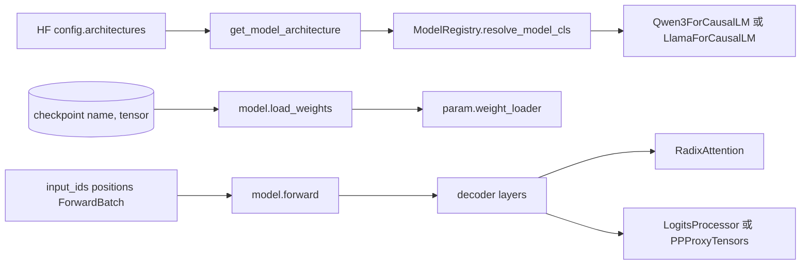

# 通用模型

本专题解决 ModelLoader 之后的下一个问题：HF checkpoint 和 config 只给出 architecture 字符串与 tensor 名字，SGLang 如何把它们变成可执行的 `nn.Module`、可切 PP stage 的 decoder、可对接 RadixAttention 的 forward，以及可接收权重的参数槽。

读完后应能回答：

1. HF `config.architectures` 如何映射到 `Qwen3ForCausalLM` 或 `LlamaForCausalLM`。
2. `EntryClass` 为什么是模型模块暴露给 Registry 的入口，以及“模块导入失败”为什么会表现成 architecture 没注册。
3. 一个 batch 的 `input_ids/positions/ForwardBatch` 如何穿过 embedding、decoder layers、attention、lm_head。
4. 一个 checkpoint 名字如 `q_proj.weight` 如何变成 fused `qkv_proj` 参数写入。
5. Llama 与 Qwen3 的通用骨架相同在哪里，Qwen3 的 attention TP、QK-Norm、LayerCommunicator 又改变了哪里。
6. `tie_word_embeddings`、PP、split-prefill 和 ROCm fused mRoPE 分别有哪些不能省略的适用条件。

## 阅读路径

| 读者任务 | 先读 | 再读 |
|----------|------|------|
| 第一次理解模型类层次 | [[SGLang-通用模型-核心概念]] | [[SGLang-通用模型-源码走读]] |
| 接新 HF architecture | [[SGLang-通用模型-源码走读]] | [[SGLang-通用模型-排障指南]] |
| 排查 `Parameter not found` 或 shape mismatch | [[SGLang-通用模型-数据流]] | [[SGLang-ModelLoader]] |
| 排查 Qwen3 attention/PP 行为 | [[SGLang-通用模型-源码走读]] | [[SGLang-Attention]] |
| 自检是否读懂 | [[SGLang-通用模型-学习检查]] | [[SGLang-专用模型]] |

## 心理模型

把通用模型层看成“模型类装配线”：



这条线里有三本账：

| 账本 | 源码对象 | 负责什么 |
|------|----------|----------|
| 类账 | `get_model_architecture` / `ModelRegistry` / `EntryClass` | 先选择 native、Transformers 或 MindSpore 路线，再把 architecture key 解析成 Python 类 |
| 执行账 | `*Model.forward` / `*DecoderLayer.forward` / `*Attention.forward` | hidden states、residual、PP proxy 与模型特有的 Q/K/V 准备；backend 选择仍在 attention 层 |
| 权重账 | `*ForCausalLM.load_weights` / `stacked_params_mapping` | checkpoint name remap、PP stage skip、tied embedding 补写、QKV/gate-up fused 参数写入 |

## 核心源码证据

模型类解析的入口在 ModelLoader utils 中。它会读取 HF config 的 architecture，处理 Mixtral/MindSpore/Transformers 分支，然后交给 Registry resolve：

```python
# 来源：python/sglang/srt/model_loader/utils.py L195-L230
def get_model_architecture(model_config: ModelConfig) -> Tuple[Type[nn.Module], str]:
    from sglang.srt.models.registry import ModelRegistry

    architectures = getattr(model_config.hf_config, "architectures", [])
    # Special handling for quantized Mixtral.
    # FIXME(woosuk): This is a temporary hack.
    mixtral_supported = [
        "fp8",
        "compressed-tensors",
        "gptq_marlin",
        "awq_marlin",
        "quark_int4fp8_moe",
    ]

    if (
        model_config.quantization is not None
        and model_config.quantization not in mixtral_supported
        and "MixtralForCausalLM" in architectures
    ):
        architectures = ["QuantMixtralForCausalLM"]

    supported_archs = ModelRegistry.get_supported_archs()
    is_native_supported = any(arch in supported_archs for arch in architectures)

    if model_config.model_impl == ModelImpl.MINDSPORE:
        architectures = ["MindSporeForCausalLM"]
    elif not is_native_supported or model_config.model_impl == ModelImpl.TRANSFORMERS:
        architectures = resolve_transformers_arch(model_config, architectures)
    model_cls, resolved_arch = ModelRegistry.resolve_model_cls(architectures)
    setattr(model_config, "_resolved_model_arch", resolved_arch)
    setattr(
        model_config,
        "_resolved_model_impl",
        _model_impl_from_architecture(resolved_arch),
    )
    return model_cls, resolved_arch
```

Registry 本身不理解 Llama 或 Qwen3 的内部结构。当前基线中，模型模块早已在注册阶段被导入；resolve 阶段只是过滤 key，并从字典按顺序取出第一个已注册类：

```python
# 来源：python/sglang/srt/models/registry.py L61-L91
    def _normalize_archs(
        self,
        architectures: Union[str, List[str]],
    ) -> List[str]:
        if isinstance(architectures, str):
            architectures = [architectures]
        if not architectures:
            logger.warning("No model architectures are specified")

        # filter out support architectures
        normalized_arch = list(
            filter(lambda model: model in self.models, architectures)
        )

        # make sure Transformers backend is put at the last as a fallback
        if len(normalized_arch) != len(architectures):
            normalized_arch.append("TransformersForCausalLM")
        return normalized_arch

    def resolve_model_cls(
        self,
        architectures: Union[str, List[str]],
    ) -> Tuple[Type[nn.Module], str]:
        architectures = self._normalize_archs(architectures)

        for arch in architectures:
            model_cls = self._try_load_model_cls(arch)
            if model_cls is not None:
                return (model_cls, arch)

        return self._raise_for_unsupported(architectures)
```

Qwen3 说明通用模型层不是静态类表。它复用 Qwen2 的模型骨架，只把 decoder layer 换成 Qwen3 版本：

```python
# 来源：python/sglang/srt/models/qwen3.py L436-L450
class Qwen3Model(Qwen2Model):
    def __init__(
        self,
        config: Qwen3Config,
        quant_config: Optional[QuantizationConfig] = None,
        prefix: str = "",
    ) -> None:
        alt_stream = torch.cuda.Stream() if _is_cuda else None
        super().__init__(
            config=config,
            quant_config=quant_config,
            prefix=prefix,
            decoder_layer_type=Qwen3DecoderLayer,
            alt_stream=alt_stream,
        )
```

## 源码范围

| 路径 | 读它时关注什么 |
|------|----------------|
| `python/sglang/srt/model_loader/utils.py` | architecture 归一化、Transformers/MindSpore fallback、resolved 字段 |
| `python/sglang/srt/models/registry.py` | 模块扫描与容错导入、`EntryClass.__name__` 注册、外部包覆盖、候选 key resolve |
| `python/sglang/srt/models/llama.py` | 通用 decoder-only 样板、PP stage、QKV/gate-up 权重映射 |
| `python/sglang/srt/models/qwen2.py` | Qwen 系模型共享的 `Qwen2Model` 骨架 |
| `python/sglang/srt/models/qwen3.py` | QK-Norm、attention TP、fused mRoPE、LayerCommunicator、Qwen3 load_weights |
| `python/sglang/srt/utils/common.py` | `make_layers` 如何按 PP rank 生成层和 `PPMissingLayer` |

## 相邻专题

| 相邻专题 | 衔接点 |
|----------|--------|
| [[SGLang-ModelLoader]] | ModelLoader 提供 `(name, tensor)`，模型类负责 `load_weights` |
| [[SGLang-ModelRunner]] | ModelRunner 持有模型对象并调用 forward |
| [[SGLang-Attention]] | 模型 attention 子模块最终委托 `RadixAttention` 和 backend |
| [[SGLang-Quantization]] | 参数创建、`quant_method` 和加载后处理影响模型执行 layout |
| [[SGLang-专用模型]] | 专用模型在通用骨架上扩展 MoE、MLA、多模态、特殊 load_weights |

## 判断标准

- 看到 `Model architectures <archs> are not supported`，知道先查 `architectures` 字符串、模型模块是否成功导入和 `EntryClass.__name__`。
- 看到 native 模型没命中，知道 `SGLANG_DISABLED_MODEL_ARCHS` 按模块 basename 跳过导入，外部包可覆盖同名 key；随后再检查 Transformers 兼容性门禁和实际 resolved backend。
- 看到 PP 中间 rank 没 logits，知道底层 model 返回 `PPProxyTensors`，CausalLM wrapper 只是把这个对象继续向 stage 边界交付。
- 看到 Qwen3 KV cache 被重复写，先确认是否真的满足 ROCm/Aiter/MRoPE fused 条件，再核对 `save_kv_cache=False`；普通 Qwen3 decode 不应默认套用这条路径。
- 看到权重名字不匹配，知道先查模型类 `load_weights`，再查参数 `weight_loader`。
