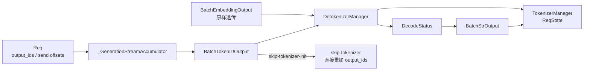
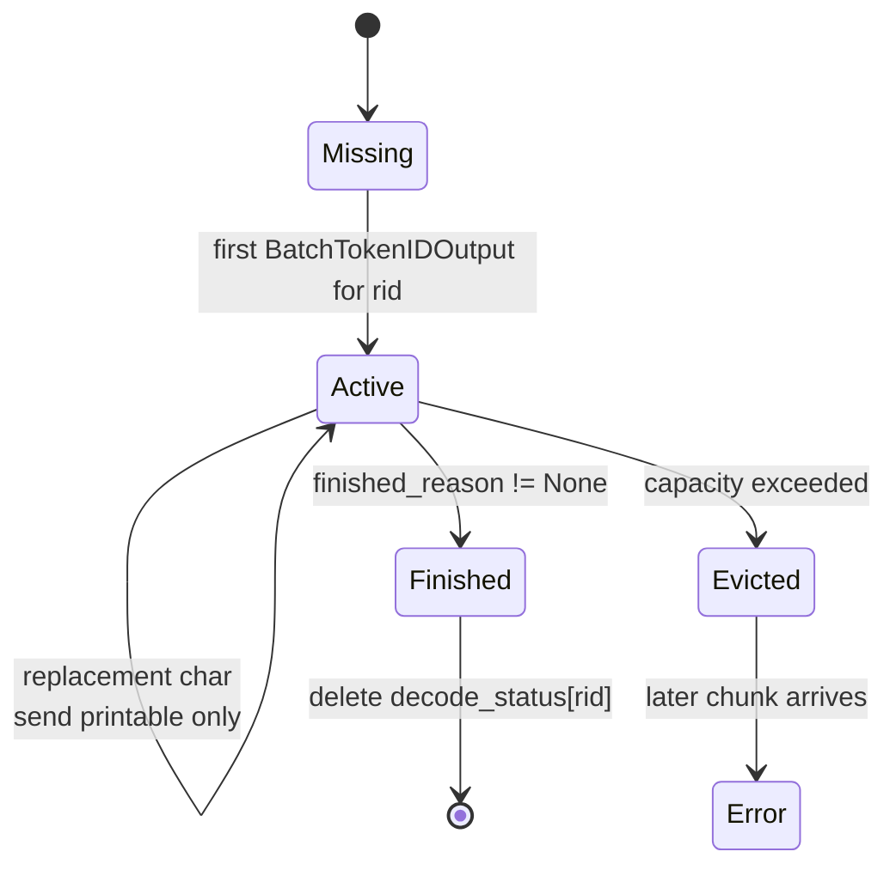

# Detokenizer · 数据流

## 你为什么要读

这篇只看对象和字段如何流动。Detokenizer 的难点不在函数数量，而在 token offset、string offset、IPC 路由和状态生命周期同时变化。

## 数据流总览



## 关键对象表

| 对象 | 所属进程 | 生命周期 | 本专题关注 |
|------|----------|----------|------------|
| `Req` | Scheduler | 请求执行期 | `output_ids`、`send_token_offset`、`send_decode_id_offset` |
| `_GenerationStreamAccumulator` | Scheduler | 一次 stream_output 调用 | 把多个 `Req` 打包成 `BatchTokenIDOutput` |
| `BatchTokenIDOutput` | IPC 消息 | Scheduler 到 Detokenizer 或 skip 下到 TokenizerManager | detokenize 窗口 `decode_ids`、客户端 delta `output_ids`、read offsets、finish reason、元数据 |
| `DecodeStatus` | Detokenizer | 一个 rid 的 streaming 生命周期 | 三类 offset 和已提交文本 |
| `BatchStrOutput` | IPC 消息 | Detokenizer 到 TokenizerManager | `output_strs` 和透传元数据 |
| `ReqState` | TokenizerManager | HTTP 请求生命周期 | 累加文本，唤醒前台协程 |

## IPC 地址

`PortArgs` 定义三条和本专题相关的 IPC 名称：

```python
# 来源：sglang/python/sglang/srt/server_args.py L7602-L7609
@dataclasses.dataclass
class PortArgs:
    # The ipc filename for tokenizer to receive inputs from detokenizer (zmq)
    tokenizer_ipc_name: str
    # The ipc filename for scheduler (rank 0) to receive inputs from tokenizer (zmq)
    scheduler_input_ipc_name: str
    # The ipc filename for detokenizer to receive inputs from scheduler (zmq)
    detokenizer_ipc_name: str
```

普通 generate 回程使用：

| 边 | 消息 | IPC |
|----|------|-----|
| Scheduler 到 Detokenizer | `BatchTokenIDOutput` | `detokenizer_ipc_name` |
| Detokenizer 到 TokenizerManager | `BatchStrOutput` | `tokenizer_ipc_name` |
| Scheduler 到 TokenizerManager | `BatchTokenIDOutput` | 仅 `skip_tokenizer_init=True` 主回路 |

## BatchTokenIDOutput 字段分组

| 字段组 | 字段 | 消费者 |
|--------|------|--------|
| 解码状态 | `decoded_texts`、`decode_ids`、`read_offsets` | Detokenizer；`decode_ids` 首包可含 prompt surrounding context |
| 输出与停止 | `finished_reasons`、`output_ids`、`no_stop_trim` | `output_ids` 作为客户端 token delta 透传；stop 信息供 Detokenizer 收尾 |
| decode 配置 | `skip_special_tokens`、`spaces_between_special_tokens` | Detokenizer |
| 统计与可观测 | token counts、cache details、time stats、DP rank | TokenizerManager |
| 可选大字段 | logprobs、hidden states、routed experts、indexer top-k | TokenizerManager，部分由 Detokenizer base64 编码 |

`BatchStrOutput` 保留大部分字段，只把 token ids 的语义输出变成 `output_strs`：

```python
# 来源：sglang/python/sglang/srt/managers/io_struct.py L1276-L1348
class BatchStrOutput(BaseBatchReq, kw_only=True):
    # The finish reason
    finished_reasons: List[Optional[FinishReasonDict]]
    # The output decoded strings
    output_strs: List[str]
    # The token ids
    output_ids: Optional[List[array]]

    # Token counts
    prompt_tokens: List[int]
    completion_tokens: List[int]
    reasoning_tokens: List[int]
    cached_tokens: List[int]

    # Logprobs
    input_token_logprobs_val: TokenLogprobValues
    input_token_logprobs_idx: TokenLogprobIndices
    output_token_logprobs_val: TokenLogprobValues
    output_token_logprobs_idx: TokenLogprobIndices
    input_top_logprobs_val: TopLogprobValues
    input_top_logprobs_idx: TopLogprobIndices
    output_top_logprobs_val: TopLogprobValues
    output_top_logprobs_idx: TopLogprobIndices
    input_token_ids_logprobs_val: TokenIdsLogprobValues
    input_token_ids_logprobs_idx: TokenIdsLogprobIndices
    output_token_ids_logprobs_val: TokenIdsLogprobValues
    output_token_ids_logprobs_idx: TokenIdsLogprobIndices
    output_token_entropy_val: Optional[List[Optional[float]]]

    # Hidden states
    output_hidden_states: OutputHiddenStates

    # Per-request routed experts, base64-encoded by DetokenizerManager off the
    # tokenizer hot path. Underlying tensor shape is (token, layer, top_k);
    # see BatchTokenIDOutput.routed_experts.
    routed_experts: Optional[List[Optional[str]]]

    indexer_topk: Optional[List[Optional[str]]]

    # The information of placeholder tokens (e.g., image token)
    # idx is the index of the token in the prompt after expansion.
    # val is the length of padded tokens after expansion.
    placeholder_tokens_idx: Optional[List[Optional[List[int]]]]
    placeholder_tokens_val: Optional[List[Optional[List[int]]]]

    # Number of times each request was retracted.
    retraction_counts: Optional[List[int]] = None

    # The trainer step id. Used to know which step's weights are used for sampling.
    token_steps: Optional[List[List[int]]] = None

    # Customized info
    customized_info: Optional[PickleWrapper] = None
    # Detailed breakdown of cached tokens by source (device/host/storage)
    cached_tokens_details: Optional[List[Optional[CachedTokensDetails]]] = None
    # DP rank of the scheduler that processed each request
    dp_ranks: Optional[List[Optional[int]]] = None

    # For observability
    # Pickled Optional[List[SchedulerReqTimeStats]]
    time_stats: Optional[PickleWrapper] = None

    # Multimodal prompt token counts (image/audio/video). None when not applicable.
    image_tokens: Optional[List[int]] = None
    audio_tokens: Optional[List[int]] = None
    video_tokens: Optional[List[int]] = None

    # Verify count: number of verification forward passes
    spec_verify_ct: Optional[List[int]] = None
    # Accepted drafts
    spec_num_correct_drafts: Optional[List[int]] = None
    # Acceptance histogram
    spec_correct_drafts_histogram: Optional[List[List[int]]] = None
```

## 状态生命周期



状态表有容量上限：

```python
# 来源：sglang/python/sglang/srt/managers/detokenizer_manager.py L470-L480
class LimitedCapacityDict(OrderedDict):
    def __init__(self, capacity: int, *args, **kwargs):
        super().__init__(*args, **kwargs)
        self.capacity = capacity

    def __setitem__(self, key, value):
        if len(self) >= self.capacity:
            # Remove the oldest element (first item in the dict)
            self.popitem(last=False)
        # Set the new item
        super().__setitem__(key, value)
```

这不是严格 LRU。它按插入顺序驱逐最旧状态，所以超高并发长 streaming 时，早进入但仍未结束的请求也可能被驱逐。

## 多 tokenizer worker 回传

当 `tokenizer_worker_num > 1`，Detokenizer 不再使用单一 `send_to_tokenizer` socket。它把 batch 输出按 `http_worker_ipcs[i]` 切成 one-item batch，再推回对应 worker。对象类型仍通常是 `BatchStrOutput` / `BatchTokenIDOutput`，只是所有 per-request 字段长度变成 1，不要误以为一定会改造成 `BaseReq`。

```python
# 来源：sglang/python/sglang/srt/managers/multi_tokenizer_mixin.py L351-L376
    def multi_http_worker_event_loop(self: DetokenizerManager):
        """The event loop that handles requests, for multi multi-http-worker mode"""
        self.socket_mapping = SocketMapping()
        while True:
            recv_obj = sock_recv(self.recv_from_scheduler)
            output = self._request_dispatcher(recv_obj)
            if output is None:
                continue

            # Fan out the output back to the originating tokenizer worker(s).
            # In multi-detokenizer mode the upstream MultiDetokenizerRouter may
            # forward either batched or single requests, so handle both shapes.
            if isinstance(recv_obj, BaseBatchReq):
                for i, ipc_name in enumerate(recv_obj.http_worker_ipcs):
                    new_output = _handle_output_by_index(output, i)
                    self.socket_mapping.send_output(
                        ipc_name, new_output, is_tokenizer=True
                    )
            elif isinstance(recv_obj, BaseReq):
                self.socket_mapping.send_output(
                    recv_obj.http_worker_ipc, output, is_tokenizer=True
                )
            else:
                raise ValueError(
                    f"multi_http_worker_event_loop got unexpected req type {type(recv_obj)}"
                )
```

这个切片动作会复制 `BatchStrOutput` 的 per-request 字段，避免某个 HTTP worker 收到与自己无关的 rid。

## 多 detokenizer worker 路由

多 detokenizer worker 前面还有 `MultiDetokenizerRouter`。它从 Scheduler 公共 socket 收 batch，然后按每条请求的 `http_worker_ipc` 拆成 one-item batch 并发给某个 worker。

```python
# 来源：sglang/python/sglang/srt/managers/multi_tokenizer_mixin.py L524-L568
    def event_loop(self):
        while True:
            recv_obj = sock_recv(self.recv_from_scheduler)

            # FreezeGCReq must freeze every detokenizer process.
            if isinstance(recv_obj, FreezeGCReq):
                for ipc in self.ipc_name_list:
                    self._send(ipc, recv_obj)
                continue

            # Single request: route by its own http_worker_ipc.
            if isinstance(recv_obj, BaseReq):
                assert (
                    recv_obj.http_worker_ipc is not None
                ), f"Single req {recv_obj.rid=} missing http_worker_ipc"
                self._send(self._pick(recv_obj.http_worker_ipc), recv_obj)
                continue

            # Batch request.
            if isinstance(recv_obj, BaseBatchReq):
                # Idle/no-op batch (rids=[]): broadcast to all detokenizers
                if not recv_obj.rids:
                    for ipc in self.ipc_name_list:
                        self._send(ipc, recv_obj)
                    continue

                ipcs = recv_obj.http_worker_ipcs
                assert (
                    ipcs is not None
                    and len(ipcs) == len(recv_obj.rids)
                    and all(x is not None for x in ipcs)
                ), f"Batch req {recv_obj.rids=} has invalid http_worker_ipcs"

                # Split per-item and route each by its own ipc.
                for i, ipc_key in enumerate(ipcs):
                    one = _handle_output_by_index(recv_obj, i)
                    if one is recv_obj:
                        raise TypeError(f"Cannot split {type(recv_obj)}")
                    one.http_worker_ipcs = [ipc_key]
                    self._send(self._pick(ipc_key), one)
                continue

            raise ValueError(
                f"MultiDetokenizerRouter got unsupported type {type(recv_obj)}"
            )
```

不变量：有 rid 的 batch 必须携带同长度的 `http_worker_ipcs`，否则 router 无法确定每条输出的归属。亲和键不是 rid：同一 HTTP worker 的所有请求会哈希到同一 Detokenizer。它以更粗粒度换取稳定回传，若 HTTP worker 流量不均，Detokenizer worker 也可能倾斜。

## skip tokenizer 数据流

普通模式：

```text
Scheduler send_to_detokenizer -> detokenizer_ipc_name -> Detokenizer -> tokenizer_ipc_name
```

skip 模式：

```text
Scheduler send_to_detokenizer -> tokenizer_ipc_name -> TokenizerManager
```

这不是 Detokenizer 内部的分支，而是 Scheduler IPC channel 在创建时改变了目标 socket。随后 TokenizerManager 会按 `BatchTokenIDOutput` 分支处理。

```python
# 来源：sglang/python/sglang/srt/managers/tokenizer_manager.py L2022-L2062
            elif isinstance(recv_obj, BatchTokenIDOutput):
                is_stream = getattr(state.obj, "stream", False)
                incremental = (
                    self.server_args.incremental_streaming_output and is_stream
                )
                delta_output_ids = list(recv_obj.output_ids[i])
                output_offset = state.last_output_offset
                state.output_ids.extend(delta_output_ids)

                if is_stream:
                    if incremental:
                        output_token_ids = delta_output_ids
                        _slice_streaming_output_meta_info(
                            meta_info,
                            output_offset,
                            state.customized_info_accumulated.keys(),
                        )
                        state.last_output_offset = len(state.output_ids)
                        out_dict = {
                            "output_ids": output_token_ids,
                            "meta_info": meta_info,
                        }
                    elif state.finished:
                        out_dict = {
                            "output_ids": state.output_ids.copy(),
                            "meta_info": meta_info,
                        }
                    else:
                        out_dict = {
                            "output_ids": state.output_ids,
                            "meta_info": meta_info,
                        }
                elif state.finished:
                    out_dict = {
                        "output_ids": state.output_ids.copy(),
                        "meta_info": meta_info,
                    }
                else:
                    out_dict = None
                if out_dict is not None and state.prompt_token_ids is not None:
                    out_dict["prompt_token_ids"] = state.prompt_token_ids
```

因此 skip 模式下客户端收到的是 token id 语义，不应该期待 `text` 增量。

## 运行验证入口

| 目标 | 观测点 | 预期 |
|------|--------|------|
| 验证普通回程 | `DetokenizerManager.handle_batch_token_id_out` | 每个非空 batch 产生 `BatchStrOutput.output_strs` |
| 验证 TokenizerManager 累加 | `TokenizerManager._handle_batch_output` | `state.append_text(delta_text)` 后前台协程被 event 唤醒 |
| 验证多 worker 回传 | `http_worker_ipcs` 与 `_handle_output_by_index` | 每个 worker 只收到自己的 rid |
| 验证亲和粒度 | `_pick(http_worker_ipc)` | 同一 HTTP worker 的请求落到同一 Detokenizer，而不是按 rid 独立均衡 |
| 验证 skip 模式 | `SchedulerIpcChannels.create` | `send_to_detokenizer_raw` 指向 `tokenizer_ipc_name` |
