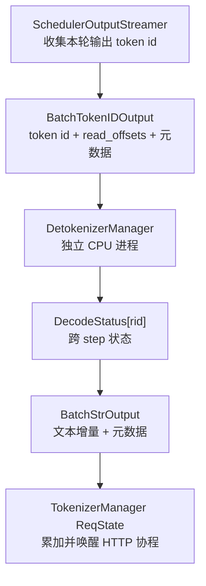

# Detokenizer · 核心概念

这篇先建立模型：Detokenizer 是输出回程上的翻译站，而不是 Scheduler 的一段普通后处理代码。

## 读者任务

读完这篇，你应该能回答：

- token id 到字符串为什么要跨进程。
- `surr_offset`、`read_offset`、`sent_offset` 各自解决什么边界问题。
- `BatchTokenIDOutput` 和 `BatchStrOutput` 的字段为什么大部分是透传。
- 多 worker 模式为什么必须让同一个请求持续回到同一个 Detokenizer worker。

## 心理模型：输出翻译站



这张图里最重要的对象是 `DecodeStatus`。它把一个 streaming 请求拆成三条边界：

| 边界 | 字段 | 解决的问题 |
|------|------|------------|
| token 上下文边界 | `surr_offset`、`read_offset` | tokenizer decode 不能只看最新 token，可能需要前文上下文 |
| 已提交文本边界 | `decoded_text_len` | 哪些字符串已经确认完整，可以累积到全文 |
| 已发送边界 | `sent_offset` | 哪些字符已经发给 TokenizerManager，即使还没提交也不能重复发 |

## 为什么是独立进程

Engine 的源码注释直接给出三段式运行时组件：TokenizerManager 在主进程，Scheduler 和 Detokenizer 是子进程，进程间用 ZMQ IPC。

```python
# 来源：sglang/python/sglang/srt/entrypoints/engine.py L183-L195
class Engine(EngineScoreMixin, EngineBase):
    """
    The entry point to the inference engine.

    - The engine consists of three components:
        1. TokenizerManager: Tokenizes the requests and sends them to the scheduler.
        2. Scheduler (subprocess): Receives requests from the Tokenizer Manager, schedules batches, forwards them, and sends the output tokens to the Detokenizer Manager.
        3. DetokenizerManager (subprocess): Detokenizes the output tokens and sends the result back to the Tokenizer Manager.

    Note:
    1. The HTTP server, Engine, and TokenizerManager all run in the main process.
    2. Inter-process communication is done through IPC (each process uses a different port) via the ZMQ library.
    """
```

这样拆的系统压力很具体：Scheduler 要保持 GPU 调度低延迟，HuggingFace tokenizer 的 decode 工作是 CPU/Python 热路径，放进独立进程后不会直接阻塞 GPU 批次循环和 HTTP 协程。

## DecodeStatus 是流式输出账本

```python
# 来源：sglang/python/sglang/srt/managers/detokenizer_manager.py L63-L88
@dataclasses.dataclass
class DecodeStatus:
    """Store the status of incremental decoding."""

    decoded_text: str
    decode_ids: List[int]
    surr_offset: int
    read_offset: int
    # Offset that's sent to tokenizer for incremental update.
    sent_offset: int = 0
    decoded_text_len: int = dataclasses.field(init=False)
    decoded_text_chunks: List[str] = dataclasses.field(default_factory=list)

    def __post_init__(self):
        self.decoded_text_len = len(self.decoded_text)

    def append_decoded_text(self, text: str):
        if text:
            self.decoded_text_chunks.append(text)
            self.decoded_text_len += len(text)

    def get_decoded_text(self) -> str:
        if self.decoded_text_chunks:
            self.decoded_text += "".join(self.decoded_text_chunks)
            self.decoded_text_chunks.clear()
        return self.decoded_text
```

字段读法：

| 字段 | 含义 | 排障关注点 |
|------|------|------------|
| `decode_ids` | 该 rid 当前累计的 detokenize 窗口；首包可含 prompt surrounding token | 是否按窗口片段连续追加，而不是误当纯生成 token delta |
| `surr_offset` | surrounding 上下文起点 | 如果推进太早，跨 token 字符会丢上下文 |
| `read_offset` | 已经作为 surrounding 基线的上界 | 如果不更新，后续会反复 decode 旧窗口 |
| `sent_offset` | 已经发给 TokenizerManager 的字符串位置 | 如果错误，客户端会重复或漏文本 |
| `decoded_text_chunks` | 已提交但暂不拼接的文本块 | 避免每步字符串拼接变成二次复杂度 |

## 输入输出对象

Detokenizer 的输入是 `BatchTokenIDOutput`。它带的不是“一个完整字符串”，也不只有一种 token 增量：`decode_ids` 服务增量 detokenize，首包可包含 prompt 尾部；`output_ids` 则是 Scheduler 按客户端发送偏移切出的 output-token delta，Detokenizer只负责透传。

```python
# 来源：sglang/python/sglang/srt/managers/io_struct.py L1194-L1206
class BatchTokenIDOutput(BaseBatchReq, kw_only=True):
    # The finish reason
    finished_reasons: List[Optional[FinishReasonDict]]
    # For incremental decoding
    decoded_texts: List[str]
    decode_ids: List[array]  # List[array[int]]
    read_offsets: List[int]
    # Only used when `--skip-tokenizer-init` is on
    output_ids: Optional[List[array]]  # Optional[List[array[int]]]
    # Detokenization configs
    skip_special_tokens: List[bool]
    spaces_between_special_tokens: List[bool]
    no_stop_trim: List[bool]
```

Detokenizer 的输出是 `BatchStrOutput`。真正新生成的是 `output_strs`，其余大量字段是 token 计数、logprob、hidden state、spec decode、cache details、时间统计等元数据的透传或轻量编码。

```python
# 来源：sglang/python/sglang/srt/managers/io_struct.py L1276-L1282
class BatchStrOutput(BaseBatchReq, kw_only=True):
    # The finish reason
    finished_reasons: List[Optional[FinishReasonDict]]
    # The output decoded strings
    output_strs: List[str]
    # The token ids
    output_ids: Optional[List[array]]
```

读者要抓住一个不变量：对 streaming 请求，`output_strs[i]` 是本轮新增文本，不是完整回复。完整回复由 TokenizerManager 的 `ReqState` 继续累加。随后是否把这个 delta 原样交给 HTTP/SSE，取决于 `incremental_streaming_output`：开启时返回 delta，关闭时中间态保存累积状态，前台按累积语义出包。不要把 Detokenizer 契约和最终 API chunk 契约合并成一个层次。

## UTF-8 边界为什么复杂

某些 token 边界不会刚好落在可打印字符边界。当前 step decode 出来的新文本如果以 Unicode replacement char 结尾，Detokenizer 不会提交 token offset；它只发可打印前缀，并通过 `sent_offset` 记住这部分已经发过。下一轮 token 补齐后，再跳过已发送前缀，避免重复发送。

类比成字幕机更准确：字幕机可以先把已经听清的半句话打出去，但只有等音节完整后，才把内部听写指针往前推进。

## 多 worker 的核心约束

多 Detokenizer worker 不是逐包 round-robin。`DecodeStatus` 是每个 worker 本地状态，同一个请求必须持续路由到同一个 worker，否则下一包 token 找不到上一包的 offset 状态。

```python
# 来源：sglang/python/sglang/srt/managers/multi_tokenizer_mixin.py L501-L519
class MultiDetokenizerRouter:
    """Route scheduler outputs to one of N DetokenizerManager workers.

    Each request is pinned to a worker by hashing its ``http_worker_ipc`` with
    ``zlib.crc32`` (deterministic across runs), so all outputs of the same rid
    always land on the same detokenizer and ``decode_status`` stays consistent.
    """

    def __init__(self, ipc_name_list: List[str], port_args: PortArgs):
        self.ipc_name_list = ipc_name_list
        self.num_workers = len(ipc_name_list)
        self.socket_mapping = SocketMapping()
        context = zmq.Context(2)
        self.recv_from_scheduler = get_zmq_socket(
            context, zmq.PULL, port_args.detokenizer_ipc_name, True
        )

    def _pick(self, key: str) -> str:
        return self.ipc_name_list[zlib.crc32(key.encode()) % self.num_workers]
```

这里哈希的是 `http_worker_ipc`，不是 rid。只要一个 rid 的 `http_worker_ipc` 生命周期内不变，它的所有包就会落到同一 Detokenizer；但亲和粒度更粗——同一个 HTTP worker 的所有请求都会被压到同一 Detokenizer worker。这保证状态连续，也意味着负载均衡取决于 HTTP worker 间流量是否均匀，不能把它描述成逐请求均匀散列。

## 两个容易混淆的边界

| 容易混淆 | 正确理解 |
|----------|----------|
| `FanOutCommunicator` 属于 Detokenizer 数据面 | 它是 TokenizerManager 控制面向多个 Scheduler rank fan-out 的原语，不参与 token id 到文本的回程 |
| `skip_tokenizer_init=True` 时 Detokenizer 透传 token id | 主 generate 链路里 Scheduler 的 send-to-detokenizer socket 直接连接 `tokenizer_ipc_name`，TokenizerManager 接收 `BatchTokenIDOutput` |

## 运行验证

Detokenizer 的核心验证是状态账本、输入输出对象、多 worker 路由和 stop 裁剪。下面的检索可以快速确认这些边界仍在。

```powershell
rg -n 'class DetokenizerManager|class DecodeStatus|BatchTokenIDOutput|BatchStrOutput|class MultiDetokenizerRouter|FanOutCommunicator|skip_tokenizer_init|http_worker_ipc|trim_matched_stop|decode_status' sglang/python/sglang/srt/entrypoints/engine.py sglang/python/sglang/srt/managers/detokenizer_manager.py sglang/python/sglang/srt/managers/multi_tokenizer_mixin.py sglang/python/sglang/srt/managers/io_struct.py
```

读输出时先看 `DecodeStatus` 和 `decode_status`，确认流式请求有 per-rid 状态；再看 `BatchTokenIDOutput -> BatchStrOutput`，确认文本回程对象；多 worker 问题看 `MultiDetokenizerRouter` 的 `http_worker_ipc` 哈希；stop 泄漏问题看 `trim_matched_stop`。
