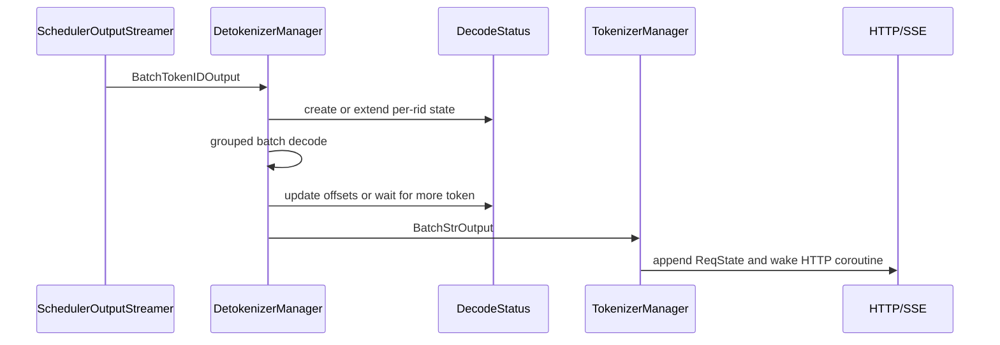

# Detokenizer · 源码走读

这篇沿一条 streaming generate 输出回程走源码：Scheduler 拿到新 token id 后，如何把文本增量送回 HTTP 协程。

## 读者任务

读完这篇，你应该能定位五类问题：

- token id 已生成，但客户端没有收到文本。
- streaming 文本重复、漏字或出现暂时的 replacement char。
- 高并发 streaming 下 Detokenizer 报 decode status 缺失。
- 开了 `skip_tokenizer_init` 后为什么没有 `text` 字段。
- 多 worker 模式下输出为什么必须按 `http_worker_ipc` 回到正确进程。

## 长文读法

这篇按“detokenize 窗口”和“客户端输出”两条线读：Scheduler 把带 surrounding context 的 `decode_ids` 窗口片段、客户端 `output_ids` delta、offset、finish reason、logprob 和 `http_worker_ipc` 打成 `BatchTokenIDOutput`；Detokenizer 只消费前者生成文本 delta，并透传后者；TokenizerManager 再把文本、token 和元信息累加到 `ReqState`，决定 HTTP/SSE 暴露增量还是累积语义。

| 读者任务 | 先读 | 要抓住的判断 |
|----------|------|--------------|
| 第一次建立输出回程 | 主线图、步骤 1 到 4 | Detokenizer 是独立进程，事件循环很薄，复杂度集中在 handler 和 per-rid 状态 |
| 排查 token 已生成但客户端没文本 | 步骤 2、5、7、8 | 先看 Scheduler 是否发出 `BatchTokenIDOutput`，再看 Detokenizer 是否产出 `BatchStrOutput`，最后看 TokenizerManager 是否通知请求状态 |
| 排查 streaming 重复、漏字或 UTF-8 半字符 | 步骤 5 到 6 | `surr_offset`、`read_offset`、`sent_offset` 共同保证未提交文本可重试、已发送文本不重复 |
| 排查 decode status 缺失 | 步骤 3、5 | `decode_status` 是有限容量 per-rid 状态表，缺失通常说明并发状态被淘汰或请求生命周期错位 |
| 理解多 detokenizer worker | 步骤 1、7、8 | router 持有公共 IPC，worker 持有私有 IPC，结果仍要带 `http_worker_ipc` 回到正确 HTTP worker |
| 理解 `skip_tokenizer_init` | 步骤 9 | Scheduler 直接把 `BatchTokenIDOutput` 发给 TokenizerManager，不经过字符串 decode，因此响应侧只累加 token id |
| 排查 logprob / spec / cache 元信息 | 步骤 2、7、8 | 大部分字段只是从 token-id 包轻量搬到字符串包，再由 TokenizerManager 合并到 `meta_info` |

读的时候不要把 Detokenizer 当成 tokenizer 的普通函数调用。它是输出回程里的进程边界，真正要追的是每个请求的 rid、offset 和 IPC 目标是否一路保持一致。

## 主线图



## 步骤 1：Engine 启动 Detokenizer 子进程

Detokenizer 不是库函数调用，而是 Engine 启动时拉起的子进程。单 worker 时直接启动一个 `sglang::detokenizer`；多 detokenizer worker 时还会启动 router。

```python
# 来源：sglang/python/sglang/srt/entrypoints/engine.py L706-L760
    def _launch_detokenizer_subprocesses(
        cls,
        server_args: ServerArgs,
        port_args: PortArgs,
        run_detokenizer_process_func: Callable,
    ) -> Tuple[List[mp.Process], List[str]]:
        """Launch detokenizer worker(s).

        - When ``detokenizer_worker_num == 1``: a single detokenizer process listens on
          ``port_args.detokenizer_ipc_name`` (the original behavior).
        - When ``detokenizer_worker_num > 1``: each detokenizer worker gets its own
          private IPC socket, and a ``MultiDetokenizerRouter`` process owns the
          original ``port_args.detokenizer_ipc_name`` and fans out to them.

        Returns (processes, names) for SubprocessWatchdog.
        """
        processes: List[mp.Process] = []
        names: List[str] = []

        if server_args.detokenizer_worker_num <= 1:
            proc = mp.Process(
                target=run_detokenizer_process_func,
                args=(server_args, port_args),
            )
            proc.start()
            processes.append(proc)
            names.append("detokenizer")
            return processes, names

        router_ipc_name = port_args.detokenizer_ipc_name
        worker_ipc_names: List[str] = []
        try:
            for i in range(server_args.detokenizer_worker_num):
                worker_ipc = f"ipc://{tempfile.NamedTemporaryFile(delete=False).name}"
                port_args.detokenizer_ipc_name = worker_ipc
                proc = mp.Process(
                    target=run_detokenizer_process_func,
                    args=(server_args, port_args),
                )
                proc.start()
                processes.append(proc)
                names.append(f"detokenizer_{i}")
                worker_ipc_names.append(worker_ipc)
        finally:
            port_args.detokenizer_ipc_name = router_ipc_name

        router_proc = mp.Process(
            target=run_multi_detokenizer_router_process,
            args=(worker_ipc_names, server_args, port_args),
        )
        router_proc.start()
        processes.append(router_proc)
        names.append("detokenizer_router")

        return processes, names
```

这段证明了两个边界：Detokenizer 可以水平扩展，但 router 持有公共 `detokenizer_ipc_name`；worker 拿到的是私有 IPC。Router 的 worker 选择键是 `http_worker_ipc`，不是 rid，因此它提供 HTTP-worker 级亲和：状态连续有保证，但单个繁忙 HTTP worker 也会把其全部请求集中到一个 Detokenizer。

## 步骤 2：Scheduler 把输出 token 打包成 BatchTokenIDOutput

Scheduler 不是把字符串发给 Detokenizer，而是通过 `SchedulerOutputStreamer` 同时收集两种 token 载荷：供 Detokenizer 续接上下文的 `decode_ids` 窗口片段，以及供客户端消费的 `output_ids` delta；另带 read offset、finish reason、logprob 和统计字段。

```python
# 来源：sglang/python/sglang/srt/managers/scheduler_components/output_streamer.py L119-L164
    def _stream_output_generation(
        self,
        reqs: List[Req],
        return_logprob: bool,
        skip_req: Optional[Req] = None,
        is_idle_batch: bool = False,
    ):
        return_hidden_states = any(
            req.return_hidden_states for req in reqs if req is not skip_req
        )
        return_routed_experts = any(
            req.return_routed_experts for req in reqs if req is not skip_req
        )
        return_indexer_topk = any(
            req.return_indexer_topk for req in reqs if req is not skip_req
        )

        acc = _GenerationStreamAccumulator(
            return_logprob=return_logprob,
            return_hidden_states=return_hidden_states,
            return_routed_experts=return_routed_experts,
            return_indexer_topk=return_indexer_topk,
            spec_algorithm=self.spec_algorithm,
            disaggregation_mode=self.disaggregation_mode,
            default_stream_interval=self.server_args.stream_interval,
            default_force_stream_interval=DEFAULT_FORCE_STREAM_INTERVAL,
            get_cached_tokens_details=self.get_cached_tokens_details,
        )
        for req in reqs:
            if req is skip_req:
                continue
            if req.finished() and req.finished_output:
                # With the overlap schedule, a request will try to output twice and hit this line twice
                # because of the one additional delayed token. This "continue" prevented the dummy output.
                continue

            acc.accept(req=req)
            self._maybe_log_time_stats(req=req)

        # Send to detokenizer
        payload = acc.to_payload(
            dp_rank=self.ps.dp_rank,
            is_idle_batch=is_idle_batch,
        )
        if payload is not None:
            self.send_to_detokenizer.send_output(payload)
```

`accept` 中的关键字段来自 `Req.init_incremental_detokenize`。Scheduler 侧记录本轮已经送出去的 token offset，避免下一轮重复发送同一段 ids。

```python
# 来源：sglang/python/sglang/srt/managers/scheduler_components/output_streamer.py L354-L377
        send_token_offset = req.send_token_offset
        send_output_token_logprobs_offset = req.send_output_token_logprobs_offset
        self.rids.append(req.rid)
        self.http_worker_ipcs.append(req.http_worker_ipc)
        self.finished_reasons.append(
            req.finished_reason.to_json() if req.finished_reason else None
        )
        self.decoded_texts.append(req.decoded_text)
        decode_ids, read_offset = req.init_incremental_detokenize()

        self.decode_ids_list.append(decode_ids[req.send_decode_id_offset :])

        # Exclude the tokens after stop condition
        output_ids_ = req.output_ids_through_stop

        req.send_decode_id_offset = len(decode_ids)
        self.read_offsets.append(read_offset)
        self.output_ids.append(output_ids_[send_token_offset:])
        req.send_token_offset = len(output_ids_)
        self.skip_special_tokens.append(req.sampling_params.skip_special_tokens)
        self.spaces_between_special_tokens.append(
            req.sampling_params.spaces_between_special_tokens
        )
        self.no_stop_trim.append(req.sampling_params.no_stop_trim)
```

`Req.init_incremental_detokenize` 的做法是保留一段 prompt 尾部 surrounding token，再拼上输出 token。这样 Detokenizer 不是只 decode 最新 token，而是有足够上下文处理 tokenizer 边界。这也解释了为什么首包 `decode_ids` 可能比 `output_ids` 长：前者是窗口协议，后者才是纯输出 token delta。

```python
# 来源：sglang/python/sglang/srt/managers/schedule_batch.py L1233-L1252
    # Based on https://github.com/vllm-project/vllm/blob/7a64d24aad69e4d2548aa0bf528d9fe63428ab01/vllm/transformers_utils/detokenizer.py#L194-L313
    def init_incremental_detokenize(self):
        first_iter = self.surr_offset is None or self.read_offset is None

        output_ids = self.output_ids_through_stop

        if first_iter:
            self.read_offset = len(self.origin_input_ids_unpadded)
            self.surr_offset = max(
                self.read_offset - INIT_INCREMENTAL_DETOKENIZATION_OFFSET, 0
            )
            self.surr_and_decode_ids = (
                self.origin_input_ids_unpadded[self.surr_offset :] + output_ids
            )
            self.cur_decode_ids_len = len(output_ids)
        else:
            self.surr_and_decode_ids.extend(output_ids[self.cur_decode_ids_len :])
            self.cur_decode_ids_len = len(output_ids)

        return self.surr_and_decode_ids, self.read_offset - self.surr_offset
```

这里的心理模型是：Scheduler 负责“准备可解码 token 窗口”，Detokenizer 负责“把窗口差分成可发送文本”。

## 步骤 3：Detokenizer 初始化 IPC、tokenizer、状态表和 dispatcher

DetokenizerManager 构造函数分四层初始化：IPC 通道、tokenizer、运行状态、消息分发器。

```python
# 来源：sglang/python/sglang/srt/managers/detokenizer_manager.py L94-L159
    def __init__(
        self,
        server_args: ServerArgs,
        port_args: PortArgs,
    ):
        # Init inter-process communication
        self.init_ipc_channels(port_args, server_args)

        # Init tokenizer
        self.init_tokenizer(server_args)

        # Init running status
        self.init_running_status(server_args)

        # Init dispatcher
        self.init_request_dispatcher()

    def init_ipc_channels(self, port_args: PortArgs, server_args: ServerArgs):
        context = zmq.Context(2)
        self.recv_from_scheduler = get_zmq_socket(
            context, zmq.PULL, port_args.detokenizer_ipc_name, True
        )
        # In multi-tokenizer mode, results are pushed back to each TokenizerWorker
        # directly via SocketMapping inside multi_http_worker_event_loop, so the
        # single send_to_tokenizer socket is unused.
        if server_args.tokenizer_worker_num == 1:
            self.send_to_tokenizer = get_zmq_socket(
                context, zmq.PUSH, port_args.tokenizer_ipc_name, False
            )

    def init_tokenizer(self, server_args: ServerArgs):
        if server_args.skip_tokenizer_init:
            self.tokenizer = None
        else:
            self.tokenizer = get_tokenizer(
                server_args.tokenizer_path,
                tokenizer_mode=server_args.tokenizer_mode,
                trust_remote_code=server_args.trust_remote_code,
                revision=server_args.revision,
                tokenizer_backend=server_args.tokenizer_backend,
            )

    def init_running_status(self, server_args: ServerArgs):
        self.decode_status = LimitedCapacityDict(capacity=DETOKENIZER_MAX_STATES)
        self.disable_tokenizer_batch_decode = server_args.disable_tokenizer_batch_decode
        self.is_tool_call_parser_gpt_oss = server_args.tool_call_parser == "gpt-oss"

        self.soft_watchdog = Watchdog.create(
            debug_name="DetokenizerManager",
            watchdog_timeout=server_args.soft_watchdog_timeout,
            soft=True,
            test_stuck_time=envs.SGLANG_TEST_STUCK_DETOKENIZER.get(),
        )

        if server_args.enable_metrics:
            start_cpu_monitor_thread("detokenizer")

    def init_request_dispatcher(self):
        self._request_dispatcher = TypeBasedDispatcher(
            [
                (BatchEmbeddingOutput, self.handle_batch_embedding_out),
                (BatchTokenIDOutput, self.handle_batch_token_id_out),
                (FreezeGCReq, self.handle_freeze_gc_req),
                (ConfigureLoggingReq, self.handle_configure_logging_req),
            ]
        )
```

单 tokenizer worker 模式会创建 `send_to_tokenizer`。多 tokenizer worker 模式不创建这个单一 socket，回传由 `multi_http_worker_event_loop` 用 `SocketMapping` 按 worker IPC 分发。

## 步骤 4：事件循环很薄，复杂度在 handler

```python
# 来源：sglang/python/sglang/srt/managers/detokenizer_manager.py L161-L169
    def event_loop(self):
        """The event loop that handles requests"""
        while True:
            with self.soft_watchdog.disable():
                recv_obj = sock_recv(self.recv_from_scheduler)
            output = self._request_dispatcher(recv_obj)
            if output is not None:
                sock_send(self.send_to_tokenizer, output)
            self.soft_watchdog.feed()
```

`sock_recv` 周围禁用 soft watchdog，因为等待上游输出是正常空闲。真正需要被 watchdog 暴露的是 handler 处理阶段，例如 tokenizer decode 卡住。

## 步骤 5：先维护 per-rid DecodeStatus，再做 batch decode

`_decode_batch_token_id_output` 先为每个 rid 创建或更新状态。它构造两组 token 窗口：

- `surr_ids`：从 `surr_offset` 到旧 `read_offset`，作为已经可读的基线。
- `read_ids`：从 `surr_offset` 到当前最新 token，作为本轮可尝试 decode 的窗口。

```python
# 来源：sglang/python/sglang/srt/managers/detokenizer_manager.py L271-L332
    def _decode_batch_token_id_output(self, recv_obj: BatchTokenIDOutput):
        bs = len(recv_obj.rids)

        # Initialize decode status
        read_ids, surr_ids = [], []
        for i in range(bs):
            rid = recv_obj.rids[i]
            if rid not in self.decode_status:
                s = DecodeStatus(
                    decoded_text=recv_obj.decoded_texts[i],
                    decode_ids=list(recv_obj.decode_ids[i]),
                    surr_offset=0,
                    read_offset=recv_obj.read_offsets[i],
                )
                self.decode_status[rid] = s
            else:
                s = self.decode_status[rid]
                s.decode_ids.extend(recv_obj.decode_ids[i])

            read_ids.append(
                self.trim_matched_stop(
                    s.decode_ids[s.surr_offset :],
                    recv_obj.finished_reasons[i],
                    recv_obj.no_stop_trim[i],
                )
            )
            surr_ids.append(s.decode_ids[s.surr_offset : s.read_offset])

        # Decode token ids to strings
        if not self.disable_tokenizer_batch_decode:
            surr_texts = self._grouped_batch_decode(
                surr_ids,
                recv_obj.skip_special_tokens,
                recv_obj.spaces_between_special_tokens,
            )
            read_texts = self._grouped_batch_decode(
                read_ids,
                recv_obj.skip_special_tokens,
                recv_obj.spaces_between_special_tokens,
            )
        else:
            # Do not use batch decode to prevent some detokenization edge cases (e.g., gpt-oss).
            surr_texts = [
                self.tokenizer.decode(
                    surr, skip_special_tokens=skip, spaces_between_special_tokens=space
                )
                for surr, skip, space in zip(
                    surr_ids,
                    recv_obj.skip_special_tokens,
                    recv_obj.spaces_between_special_tokens,
                )
            ]
            read_texts = [
                self.tokenizer.decode(
                    read, skip_special_tokens=skip, spaces_between_special_tokens=space
                )
                for read, skip, space in zip(
                    read_ids,
                    recv_obj.skip_special_tokens,
                    recv_obj.spaces_between_special_tokens,
                )
            ]
```

差分发生在下一步：`new_text = read_texts[i][len(surr_texts[i]):]`。因此 `surr_texts[i]` 必须是 `read_texts[i]` 的前缀，否则增量文本会错。所谓 batch decode 也不是把不同配置混在一次调用里：fast tokenizer 会按 `(skip_special_tokens, spaces_between_special_tokens)` 分组，空窗口先过滤再 scatter；slow tokenizer 则逐行走 `decode_without_hf_kwargs`。

## 步骤 6：streaming 分支处理 UTF-8 与重复发送

```python
# 来源：sglang/python/sglang/srt/managers/detokenizer_manager.py L334-L385
        # Incremental decoding
        output_strs = []
        for i in range(bs):
            rid = recv_obj.rids[i]
            try:
                s = self.decode_status[rid]
            except KeyError:
                raise RuntimeError(
                    f"Decode status not found for request {rid}. "
                    "It may be due to the request being evicted from the decode status due to memory pressure. "
                    "Please increase the maximum number of requests by setting "
                    "the SGLANG_DETOKENIZER_MAX_STATES environment variable to a bigger value than the default value. "
                    f"The current value is {DETOKENIZER_MAX_STATES}. "
                    "For more details, see: https://github.com/sgl-project/sglang/issues/2812"
                )
            new_text = read_texts[i][len(surr_texts[i]) :]
            if recv_obj.finished_reasons[i] is None:
                # Streaming. Invariant: sent_offset >= decoded_text_len. The
                # gap (`pending`) is "printable but uncommitted" text emitted
                # in a prior "�" recovery step; we skip it from this step's
                # emission so we don't double-send.
                pending = s.sent_offset - s.decoded_text_len
                if new_text and not new_text.endswith("�"):
                    # Clean text: commit to decoded_text and advance offsets.
                    s.append_decoded_text(new_text)
                    s.surr_offset = s.read_offset
                    s.read_offset = len(s.decode_ids)
                    s.sent_offset = s.decoded_text_len
                    output_strs.append(new_text[pending:] if pending else new_text)
                else:
                    # Incomplete UTF-8: emit the printable prefix only; do not
                    # commit (token offsets stay so the next iteration retries
                    # with more tokens).
                    printable = find_printable_text(new_text)
                    s.sent_offset = s.decoded_text_len + len(printable)
                    output_strs.append(printable[pending:] if pending else printable)
                continue

            if rid in self.decode_status:
                del self.decode_status[rid]

            # Finished: materialize once, trim the matched stop, emit the tail.
            output_str = self.trim_matched_stop(
                s.get_decoded_text() + new_text,
                recv_obj.finished_reasons[i],
                recv_obj.no_stop_trim[i],
            )
            incremental_output = output_str[s.sent_offset :]
            s.sent_offset = len(output_str)
            output_strs.append(incremental_output)

        return output_strs
```

这里有三个关键判断：

- 未完成请求才走 streaming 分支。
- `new_text` 干净且不以 replacement char 结尾，才提交文本并推进 token offset。
- finished 分支会删除 `decode_status[rid]`，再基于完整文本做 stop 裁剪和最后一次增量输出。

如果客户端看到短暂的字符等待，不一定是 bug；它可能是 Detokenizer 在等下一个 token 补齐 UTF-8 边界。

## 步骤 7：组装 BatchStrOutput，轻量转换少数字段

```python
# 来源：sglang/python/sglang/srt/managers/detokenizer_manager.py L406-L455
    def handle_batch_token_id_out(self, recv_obj: BatchTokenIDOutput):
        # If handling idle batch, set output_strs to [].
        output_strs = (
            self._decode_batch_token_id_output(recv_obj)
            if len(recv_obj.rids) > 0
            else []
        )
        routed_experts = self._b64_encode_per_request(recv_obj.routed_experts)
        indexer_topk = self._b64_encode_per_request(recv_obj.indexer_topk)
        return BatchStrOutput(
            rids=recv_obj.rids,
            http_worker_ipcs=recv_obj.http_worker_ipcs,
            finished_reasons=recv_obj.finished_reasons,
            output_strs=output_strs,
            output_ids=recv_obj.output_ids,
            prompt_tokens=recv_obj.prompt_tokens,
            reasoning_tokens=recv_obj.reasoning_tokens,
            completion_tokens=recv_obj.completion_tokens,
            cached_tokens=recv_obj.cached_tokens,
            cached_tokens_details=recv_obj.cached_tokens_details,
            image_tokens=recv_obj.image_tokens,
            audio_tokens=recv_obj.audio_tokens,
            video_tokens=recv_obj.video_tokens,
            spec_verify_ct=recv_obj.spec_verify_ct,
            spec_num_correct_drafts=recv_obj.spec_num_correct_drafts,
            spec_correct_drafts_histogram=recv_obj.spec_correct_drafts_histogram,
            input_token_logprobs_val=recv_obj.input_token_logprobs_val,
            input_token_logprobs_idx=recv_obj.input_token_logprobs_idx,
            output_token_logprobs_val=recv_obj.output_token_logprobs_val,
            output_token_logprobs_idx=recv_obj.output_token_logprobs_idx,
            input_top_logprobs_val=recv_obj.input_top_logprobs_val,
            input_top_logprobs_idx=recv_obj.input_top_logprobs_idx,
            output_top_logprobs_val=recv_obj.output_top_logprobs_val,
            output_top_logprobs_idx=recv_obj.output_top_logprobs_idx,
            input_token_ids_logprobs_val=recv_obj.input_token_ids_logprobs_val,
            input_token_ids_logprobs_idx=recv_obj.input_token_ids_logprobs_idx,
            output_token_ids_logprobs_val=recv_obj.output_token_ids_logprobs_val,
            output_token_ids_logprobs_idx=recv_obj.output_token_ids_logprobs_idx,
            output_token_entropy_val=recv_obj.output_token_entropy_val,
            output_hidden_states=recv_obj.output_hidden_states,
            routed_experts=routed_experts,
            indexer_topk=indexer_topk,
            customized_info=recv_obj.customized_info,
            placeholder_tokens_idx=None,
            placeholder_tokens_val=None,
            retraction_counts=recv_obj.retraction_counts,
            token_steps=recv_obj.token_steps,
            dp_ranks=recv_obj.dp_ranks,
            time_stats=recv_obj.time_stats,
        )
```

`output_strs` 是本模块的主要产物；`routed_experts` 和 `indexer_topk` 被 base64 编码；其余字段多数从 Scheduler 输出透传给 TokenizerManager。

## 步骤 8：TokenizerManager 收到字符串增量后累加 ReqState

TokenizerManager 的后台 `handle_loop` 接收 Detokenizer 回包，然后 `_handle_batch_output` 按 rid 找到 `ReqState`。

```python
# 来源：sglang/python/sglang/srt/managers/tokenizer_manager.py L1847-L1860
    async def handle_loop(self):
        """The event loop that handles requests"""
        while True:
            with self.soft_watchdog.disable():
                recv_obj = await async_sock_recv(self.recv_from_detokenizer)
            if isinstance(
                recv_obj,
                (BatchStrOutput, BatchEmbeddingOutput, BatchTokenIDOutput),
            ):
                await self._handle_batch_output(recv_obj)
            else:
                self._result_dispatcher(recv_obj)
            self.last_receive_tstamp = real_time()
            self.soft_watchdog.feed()
```

对 `BatchStrOutput`，它总会先把 `delta_text` 追加到 state，再根据 streaming/incremental 配置构造前台对象：incremental 模式直接交出本轮 delta；非 incremental streaming 的中间态把 `text` 设为 `None`，避免每轮物化累积全文，前台等待逻辑再按累积语义读取。Detokenizer 的 delta 契约与客户端 chunk 契约因此是两层状态机。

```python
# 来源：sglang/python/sglang/srt/managers/tokenizer_manager.py L1970-L2021
            state.finished = recv_obj.finished_reasons[i] is not None
            if isinstance(recv_obj, BatchStrOutput):
                # Not all request types have `stream` (e.g., EmbeddingReqInput). Default to non-streaming.
                is_stream = getattr(state.obj, "stream", False)
                incremental = (
                    self.server_args.incremental_streaming_output and is_stream
                )
                delta_text = recv_obj.output_strs[i]
                delta_output_ids = list(recv_obj.output_ids[i])
                output_offset = state.last_output_offset
                state.append_text(delta_text)
                state.output_ids.extend(delta_output_ids)

                if is_stream:
                    if incremental:
                        output_token_ids = delta_output_ids
                        _slice_streaming_output_meta_info(
                            meta_info,
                            output_offset,
                            state.customized_info_accumulated.keys(),
                        )
                        state.last_output_offset = len(state.output_ids)
                        out_dict = {
                            "text": delta_text,
                            "output_ids": output_token_ids,
                            "meta_info": meta_info,
                        }
                    elif state.finished:
                        out_dict = {
                            "text": state.get_text(),
                            "output_ids": state.output_ids.copy(),
                            "meta_info": meta_info,
                        }
                    else:
                        # Non-incremental intermediate: pass reference (no
                        # copy) and defer text to _wait_one_response to avoid
                        # O(n) per-step cost that compounds to O(n^2).
                        out_dict = {
                            "text": None,
                            "output_ids": state.output_ids,
                            "meta_info": meta_info,
                        }
                elif state.finished:
                    out_dict = {
                        "text": state.get_text(),
                        "output_ids": state.output_ids.copy(),
                        "meta_info": meta_info,
                    }
                else:
                    out_dict = None
                if out_dict is not None and state.prompt_token_ids is not None:
                    out_dict["prompt_token_ids"] = state.prompt_token_ids
```

到这里，Detokenizer 的文本增量才进入 HTTP/SSE 输出队列。

## 步骤 9：skip tokenizer 模式走另一条回路

`skip_tokenizer_init=True` 时，Scheduler 的 `send_to_detokenizer` 不是连到 Detokenizer IPC，而是直接连到 `tokenizer_ipc_name`。因此主 generate 回路下 TokenizerManager 会收到 `BatchTokenIDOutput`，并输出 token ids，而不是文本。

```python
# 来源：sglang/python/sglang/srt/managers/scheduler_components/ipc_channels.py L52-L64
            send_to_tokenizer_raw = get_zmq_socket(
                context, zmq.PUSH, port_args.tokenizer_ipc_name, False
            )
            if skip_tokenizer_init:
                # Directly send to the TokenizerManager
                send_to_detokenizer_raw = get_zmq_socket(
                    context, zmq.PUSH, port_args.tokenizer_ipc_name, False
                )
            else:
                # Send to the DetokenizerManager
                send_to_detokenizer_raw = get_zmq_socket(
                    context, zmq.PUSH, port_args.detokenizer_ipc_name, False
                )
```

这也是为什么排查“没有文本输出”时，必须先看是否启用了 `skip_tokenizer_init`。在该模式下没有 HF tokenizer，客户端应按 token ids 自己解码。

## 运行验证

| 验证 | 做法 | 预期 |
|------|------|------|
| 独立进程 | 启动服务后查看进程名 `sglang::detokenizer` | 至少有一个 detokenizer 子进程；多 worker 时还有 `sglang::detokenizer_router` |
| UTF-8 边界 | 流式请求包含中文、emoji、byte-level tokenizer 易拆分字符 | SSE chunk 不应永久输出 replacement char；可打印前缀不应重复 |
| skip 模式 | 启动时开启 `--skip-tokenizer-init` | TokenizerManager 收到 `BatchTokenIDOutput`，输出里主要是 `output_ids` |
| 状态容量 | 压高 streaming 并发并调小 `SGLANG_DETOKENIZER_MAX_STATES` | 可能触发 decode status 缺失错误；调大后缓解 |
| 多 worker 亲和 | 固定多个请求来自同一 `http_worker_ipc`，记录 router `_pick` | 这些请求落到同一 Detokenizer；更换 HTTP worker key 才可能换 worker |
