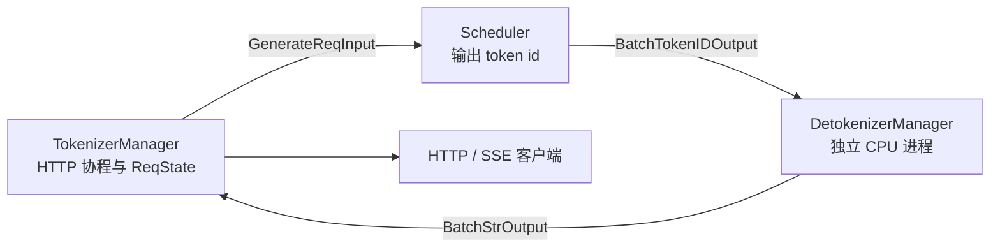

# Detokenizer

## 你为什么要读

这组笔记回答一个问题：Scheduler 已经生成 token id 以后，SGLang 如何把它们变成客户端能消费的文本增量。

读完以后，你应该能解释：

- 为什么 detokenize 被放到独立进程，而不是堵在 Scheduler 或 HTTP 协程里。
- 流式输出里的 `output_strs[i]` 为什么是增量文本，不是全量文本。
- 为什么 `decode_ids` 是带 surrounding context 的解码窗口片段，`output_ids` 才是客户端 token 增量。
- `DecodeStatus` 如何处理 UTF-8 边界、stop 裁剪和最终收尾。
- `skip_tokenizer_init=True` 时为什么主 generate 回路会绕过 Detokenizer。
- 多 tokenizer worker 和多 detokenizer worker 时，结果如何回到正确的 HTTP worker，以及为什么亲和键是比 rid 更粗的 `http_worker_ipc`。

## 模块位置

Detokenizer 是请求回程上的 CPU 翻译站。它不参与 GPU forward，也不调度 batch；它消费 Scheduler 产出的 `BatchTokenIDOutput`，维护 per-rid 增量解码状态，然后返回 `BatchStrOutput` 给 TokenizerManager。

一条请求的正向入口在 [[SGLang-TokenizerManager|TokenizerManager]]，GPU 批次契约在 [[SGLang-ScheduleBatch数据结构|ScheduleBatch-IO]]。本专题只解释从 token id 回到文本的末端链路。

## 阅读顺序

| 顺序 | 文件 | 读者任务 |
|------|------|----------|
| 1 | [[SGLang-Detokenizer-核心概念]] | 建立“输出翻译站”心理模型，理解三个 offset |
| 2 | [[SGLang-Detokenizer-源码走读]] | 沿 `BatchTokenIDOutput → BatchStrOutput → ReqState` 跟一轮输出 |
| 3 | [[SGLang-Detokenizer-数据流]] | 看清跨进程消息、字段透传、状态表和多 worker 路由 |
| 4 | [[SGLang-Detokenizer-排障指南]] | 按乱码、重复输出、状态缺失、skip 模式和 worker 拓扑排障 |
| 5 | [[SGLang-Detokenizer-学习检查]] | 验收自己是否能定位输出回程问题 |

## 源码范围

| 文件 | 在本专题中的角色 |
|------|------------------|
| `sglang/python/sglang/srt/managers/detokenizer_manager.py` | Detokenizer 进程、`DecodeStatus`、增量解码、`BatchStrOutput` |
| `sglang/python/sglang/srt/managers/scheduler_components/output_streamer.py` | Scheduler 侧如何构造 `BatchTokenIDOutput` |
| `sglang/python/sglang/srt/managers/tokenizer_manager.py` | TokenizerManager 如何消费 `BatchStrOutput` 或 skip 模式下的 `BatchTokenIDOutput` |
| `sglang/python/sglang/srt/managers/multi_tokenizer_mixin.py` | 多 HTTP worker 与多 Detokenizer worker 的路由 |
| `sglang/python/sglang/srt/entrypoints/engine.py` | Detokenizer 子进程和 router 的启动 |
| `sglang/python/sglang/srt/managers/scheduler_components/ipc_channels.py` | `skip_tokenizer_init` 下的直连回路 |

## 先抓住一句话

Detokenizer 的核心不是调用一次 `tokenizer.decode`，而是在独立进程里维护一个可恢复的流式解码状态机：解码窗口、已提交字符串、已发送字符串三条边界必须一起对齐。它产出的 `output_strs` 永远是内部文本 delta；客户端最终看到 delta 还是累积全文，还要由 TokenizerManager 的 `incremental_streaming_output` 策略决定。

## 与相邻专题的边界

| 相邻专题 | 边界 |
|----------|------|
| [[SGLang-TokenizerManager]] | HTTP 协程、`ReqState`、SSE 包装；本专题只解释它收到什么 |
| [[SGLang-ScheduleBatch数据结构]] | Scheduler 输出对象结构；本专题解释输出对象如何被解码 |
| [[SGLang-ModelRunner]] | GPU forward 产出 logits/token；本专题不涉及模型执行 |
| [[SGLang-可观测性]] | TTFT/ITL/E2E 指标消费输出时间；本专题只说明 output 回程如何触发这些时间点 |
