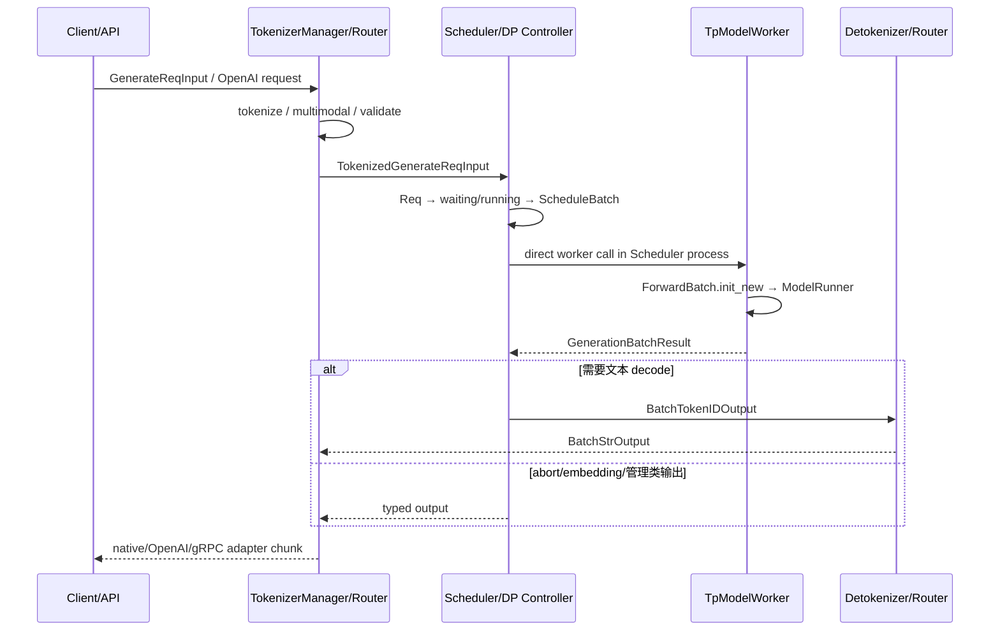

# 请求调度

> 本目录解释一个请求如何从前台输入变成可执行批次，再如何把执行结果变成客户端可消费的增量输出。重点是对象所有权与交接，不是背一张固定进程图。

## 你为什么要读

“连续批处理”常被画成 Tokenizer→Scheduler→GPU→Detokenizer 的单箭头，但真实系统还要处理：多 tokenizer/detokenizer worker、DP controller、TP/PP rank、overlap 的跨迭代结果、PD 独立 loop、embedding/abort 等绕过普通 detokenize 的输出，以及 skip-tokenizer 输入。

读完后你应能回答：

- 请求在每一站是什么对象？
- 谁拥有 waiting/running、KV 准入和 batch 生命周期？
- `ScheduleBatch` 何时被物化为 `ForwardBatch`？
- token id、文本 delta、abort 和管理响应分别走哪条回程？

## 五个专题

| 专题 | 所有权 | 核心问题 |
|---|---|---|
| [[SGLang-TokenizerManager]] | API 前台与 per-request 状态 | tokenization、媒体处理、请求发送、结果唤醒与 API chunk |
| [[SGLang-Scheduler]] | waiting/running、执行批次和资源准入 | loop、continuous batching、overlap、retract、结果提交 |
| [[SGLang-SchedulePolicy]] | 排序与新请求准入 | prefix match、token budget、chunk、priority、delayer |
| [[SGLang-ScheduleBatch数据结构]] | 调度侧可变批次与请求对象 | `Req`、`ScheduleBatch`、输出快照和 `ForwardBatch` 交接 |
| [[SGLang-Detokenizer]] | token→text 的增量 decode 状态 | decode window、UTF-8、stop trim、多 worker 亲和 |

## 普通生成主线



### 两条关键纠正

1. Scheduler 与 `TpModelWorker` 通常在同一 Scheduler 进程内直接调用，不是“Scheduler 通过 ZMQ 把 `ScheduleBatch` 发送给 worker”。
2. 不是所有 Scheduler 输出都先经过 Detokenizer；abort、embedding、管理响应等可以直接发回 TokenizerManager。普通 generation token 才进入 token→text 主线。

## 前台发送边界

TokenizerManager 在 pickle 前包装大 feature，再分派给 Scheduler：

```python
# 来源：python/sglang/srt/managers/tokenizer_manager.py L1331-L1342
    def _send_one_request(
        self,
        tokenized_obj: Union[TokenizedGenerateReqInput, TokenizedEmbeddingReqInput],
    ):
        tokenized_obj.time_stats.set_api_server_dispatch_time()
        tokenized_obj = wrap_shm_features(tokenized_obj)
        time_stats = tokenized_obj.time_stats
        tokenized_obj.wrap_pickle_fields()
        self._dispatch_to_scheduler(tokenized_obj)
        tokenized_obj.time_stats = time_stats
        tokenized_obj.time_stats.set_api_server_dispatch_finish_time()
```

这条边界承载的不只是文本 token，还可能包含多模态共享内存引用、sampling 参数、LoRA 身份、trace 和时间统计。

## Scheduler 的职责闭环

普通 loop 可以压成：

```text
recv requests
→ process input
→ get next batch
→ run batch
→ process result
```

但 normal、overlap、PP、PDMux、PD prefill/decode 是不同 loop 家族。`get_next_batch_to_run()` 也不是简单合并 list：它要处理新请求准入、running decode、chunked prefill、retract、grammar/spec 与资源预算。

## `ScheduleBatch` 与 `ForwardBatch`

| 对象 | 所有者 | 内容 |
|---|---|---|
| `Req` | Scheduler | 请求身份、输入/输出 token、prefix/KV 状态、finish 状态 |
| `ScheduleBatch` | Scheduler | 可变请求集合、调度与资源字段、跨迭代状态 |
| `ForwardBatch` | TpModelWorker/ModelRunner 执行边界 | 本轮 GPU 所需 tensor、position、KV loc、metadata view |
| `GenerationBatchResult` | worker→Scheduler | logits、next token、PP proxy、graph/专家等结果 |

`ForwardBatch.init_new()` 在 `TpModelWorker` 一侧完成；不要把它归给 ModelRunner，也不要把 `ForwardBatch` 当作可长期修改的 running batch。

## Detokenizer 回程

```python
# 来源：python/sglang/srt/managers/detokenizer_manager.py L161-L170
    def event_loop(self):
        """The event loop that handles requests"""
        while True:
            with self.soft_watchdog.disable():
                recv_obj = sock_recv(self.recv_from_scheduler)
            output = self._request_dispatcher(recv_obj)
            if output is not None:
                sock_send(self.send_to_tokenizer, output)
            self.soft_watchdog.feed()
```

Detokenizer 保存增量 decode 状态并回传 `BatchStrOutput`。TokenizerManager/API 层还会再次决定 chunk 粒度、finish reason、usage 与协议格式，因此“Detokenizer 产生一次字符串”不等于“客户端只收到一个 SSE token”。

## 拓扑不是固定三进程

最简 HTTP 配置可以画成前台 + Scheduler + Detokenizer，但以下配置都会改变拓扑：

- `tokenizer_worker_num > 1`：MultiTokenizerRouter + workers；
- `detokenizer_worker_num > 1`：router + 多 detokenizer；
- DP / DP-Attention：controller、多个 Scheduler 或不同通信路径；
- TP/PP：Scheduler/model worker rank 组；
- 多节点非零 rank：不一定启动 tokenizer/detokenizer；
- encoder-only、diffusion、Ray 或 legacy gRPC：进入不同服务形态。

因此进程验证应列 PID、rank 和角色，不用 `ps` 里是否恰好出现三个名字作为正确性门禁。

## 推荐阅读路径

### 首次理解

[[SGLang-TokenizerManager-核心概念]] → [[SGLang-Scheduler-数据流]] → [[SGLang-ScheduleBatch数据结构-核心概念]] → [[SGLang-Detokenizer-数据流]]

### waiting / retract / TTFT

[[SGLang-Scheduler-排障指南]] → [[SGLang-SchedulePolicy-源码走读]] → [[SGLang-KV-Cache-排障指南]]

### token 已有但无文本

[[SGLang-Scheduler-数据流]] → [[SGLang-Detokenizer-排障指南]] → [[SGLang-TokenizerManager-排障指南]]

## 运行验证

**操作**

1. 启动目标配置并保存最终 ServerArgs。
2. 列出实际 PID、rank、router/worker 角色。
3. 发一个流式请求，记录 rid 在 TokenizerManager、Scheduler、Detokenizer 三站的时间。
4. 再发 embedding 或 abort 请求，观察是否绕过普通文本 decode。

**预期**：拓扑与最终配置一致；普通 generation 沿 token→text 回程，特殊输出按 typed channel 返回；不能从单个默认拓扑外推所有模式。

← [[SGLang-启动与入口]] · → [[SGLang-模型执行]]
