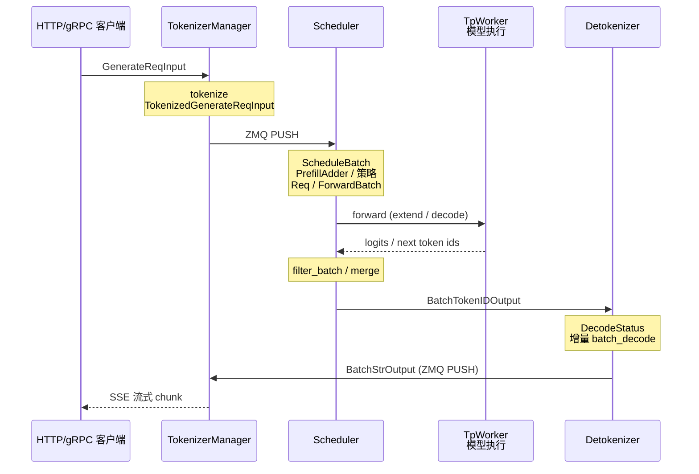

# 请求调度

> **你只需阅读本目录，不必打开 `sglang/` 源码。** 
> 内嵌代码对应 sglang Git commit `70df09b`。

---

## 本目录解决什么问题

启动与入口部分讲清了请求如何从 HTTP/gRPC 进来。本目录回答：**进来之后，SGLang 如何把文本变成 GPU batch、跑 forward、再把 token 变回文本推给客户端？**

五个专题覆盖调度子系统全链路：

| 模块 | 模块 | 一句话 |
|------|------|--------|
| [[SGLang-TokenizerManager]] | 前台进程 | 文本 ↔ token id，ZMQ 与 Scheduler/Detokenizer 通信 |
| [[SGLang-Scheduler]] | GPU 子进程核心 | continuous batching、prefill/decode 调度、OOM retract |
| [[SGLang-SchedulePolicy]] | 调度策略 | FCFS / LPM / 抢占、PrefillAdder 预算、Radix 前缀匹配 |
| [[SGLang-ScheduleBatch数据结构]] | 数据结构 | ScheduleBatch → ForwardBatch、Req、io_struct |
| [[SGLang-Detokenizer]] | 输出进程 | 增量 UTF-8 decode、DecodeStatus |

---

## 端到端时序

这张图用于检查是否能复述 TokenizerManager → Scheduler → TP Worker → Detokenizer 消息流。

这张图的读法是：数据面是 **三进程拓扑**：TokenizerManager（主进程）、Scheduler+TpWorker（GPU 子进程）、Detokenizer（独立 CPU 进程）。Scheduler **不直接**与 Detokenizer 对话：token id 经 Scheduler 发出，Detokenizer 收完后 PUSH 回 TokenizerManager，再由 TM 组装 HTTP 响应。

---

## 零基础一句话

**像餐厅运营：** TokenizerManager 是前台点单员，Scheduler 与 SchedulePolicy 是后厨排班和配菜规则，ScheduleBatch 是订单卡片格式，Detokenizer 是传菜员，把 token id 翻译成客人能看懂的文本。

---

## 推荐阅读顺序

建议按 TokenizerManager → Scheduler → SchedulePolicy → ScheduleBatch → Detokenizer 阅读。若时间紧，最低闭环是 TokenizerManager → Scheduler → Detokenizer；仍建议补读 ScheduleBatch 与 ForwardBatch 的对比。

| 顺序 | 文档 | 必读理由 |
|------|------|----------|
| 1 | [[SGLang-TokenizerManager-核心概念]] | 理解 ReqState、Mixin、generate_request 入口 |
| 2 | [[SGLang-Scheduler-源码走读]] | event loop、overlap、retract 主路径 |
| 3 | [[SGLang-SchedulePolicy-核心概念]] | LPM 与 RadixCache 如何协同 |
| 4 | [[SGLang-ScheduleBatch数据结构-排障指南]] | ScheduleBatch vs ForwardBatch（最高频混淆） |
| 5 | [[SGLang-Detokenizer-源码走读]] | UTF-8 增量 decode 机制 |

---

## 上下游衔接

| 方向 | 模块 | 衔接点 |
|------|------|--------|
| ← 上游入口 | 启动与入口 | HTTP `generate_request` → TokenizerManager |
| → 模型执行 | ModelRunner | Scheduler 调用 TpWorker → ModelRunner |
| → 内存核心 | RadixAttention 与 KV Cache | LPM 依赖 prefix match |
| → 高级能力 | 投机解码与 PD 分离 | overlap 与扩展调度路径 |

---

## 验证建议（零基础可试）

1. **启动服务：** `sglang serve --model-path <small-model>`，另开终端 `curl -N` 流式请求，观察首 token 延迟。
2. **进程拓扑：** `ps aux | grep -E 'Tokenizer|Scheduler|Detokenizer'`（Windows 可用任务管理器）应见三个相关进程。
3. **策略对比：** 同一长 system prompt 两次请求，第二次 `--schedule-policy lpm` 时 TTFT 应低于 `fcfs`（需开启 RadixCache）。

---

## 模块导航

| 专题 | 入口 |
|------|------|
| TokenizerManager | [[SGLang-TokenizerManager]] |
| Scheduler | [[SGLang-Scheduler]] |
| SchedulePolicy | [[SGLang-SchedulePolicy]] |
| ScheduleBatch | [[SGLang-ScheduleBatch数据结构]] |
| Detokenizer | [[SGLang-Detokenizer]] |

← [[SGLang-启动与入口]] · → [[SGLang-模型执行]]
