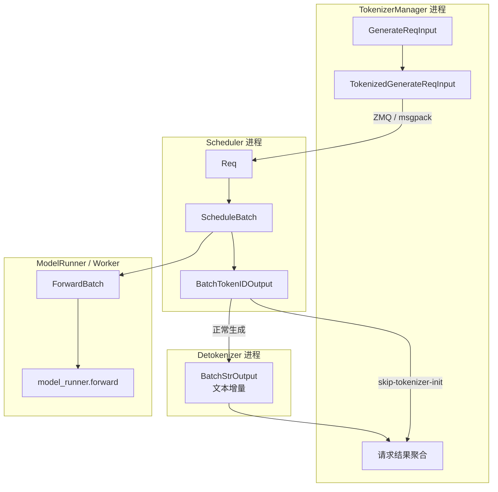
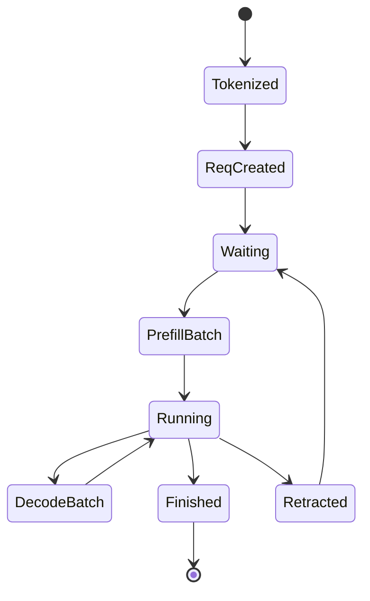

# ScheduleBatch数据结构 · 数据流

## 你为什么要读

本篇只回答边界问题：一条请求在哪些地方跨进程，在哪些地方只是 Scheduler 内部对象变形，在哪些地方变成 GPU forward 输入。

如果 [[SGLang-ScheduleBatch数据结构-源码走读]] 是按时间走，这篇就是按边界走。

---

## 总览：四条边界、三种回程



图中 embedding 输出没有硬塞进 token→string 链：`BatchEmbeddingOutput` 虽会经过 Detokenizer 进程的 dispatcher，但 handler 原样返回，因为 embedding 不需要字符串解码。于是回程实际上有三种：普通生成经 Detokenizer 产出 `BatchStrOutput`；skip-tokenizer 生成直接把 `BatchTokenIDOutput` 发给 TokenizerManager；embedding 以 `BatchEmbeddingOutput` 原样回传。

| 边界 | 输入 | 输出 | 关键问题 |
|------|------|------|----------|
| API 到 IPC | `GenerateReqInput` | `TokenizedGenerateReqInput` | 宽松字段如何被规范化 |
| Scheduler 进程内 | `Req` | `ScheduleBatch` | 单请求生命周期如何组成可变批次 |
| Scheduler 到 ModelRunner | `ScheduleBatch` | `ForwardBatch` | 哪些张量进入 forward |
| Scheduler 到 Detokenizer | `BatchTokenIDOutput` | `BatchStrOutput` | token 级输出何时变成字符串 |

---

## 边界一：TokenizerManager 到 Scheduler

`TokenizedGenerateReqInput` 是已经被分词和参数校验后的 IPC 形态。它继承 `BaseReq`，所以携带 `rid` 与 `http_worker_ipc`，同时保留 Scheduler 需要的采样、stream、LoRA、embedding 覆盖、多模态等字段。

```python
# 来源：python/sglang/srt/managers/io_struct.py L777-L787
class TokenizedGenerateReqInput(BaseReq, kw_only=True):
    input_text: Optional[Union[str, List[Union[str, List[str]]]]]
    # The input token ids
    input_ids: Optional[array]  # Optional[array[int]]
    # The input embeds
    input_embeds: Optional[List[List[float]]]
    # The multimodal inputs
    mm_inputs: Optional[PickleWrapper]  # Pickled Optional[MultimodalProcessorOutput]
    token_type_ids: Optional[List[int]]
    # The sampling parameters
    sampling_params: SamplingParams
```

它的 opaque 字段有显式 wrap/unwrap 时机：

```python
# 来源：python/sglang/srt/managers/io_struct.py L871-L879
    def wrap_pickle_fields(self):
        self.mm_inputs = wrap_as_pickle(self.mm_inputs)
        self.mm_data_mooncake = wrap_as_pickle(self.mm_data_mooncake)
        self.time_stats = wrap_as_pickle(self.time_stats)

    def unwrap_pickle_fields(self):
        self.mm_inputs = unwrap_from_pickle(self.mm_inputs)
        self.mm_data_mooncake = unwrap_from_pickle(self.mm_data_mooncake)
        self.time_stats = unwrap_from_pickle(self.time_stats)
```

ZMQ 发送和接收只关心当前 IPC 后端。默认是 msgpack，显式打开 `SGLANG_USE_PICKLE_IPC` 时才整体走 pickle。

```python
# 来源：python/sglang/srt/managers/io_struct.py L2282-L2295
def sock_send(socket: zmq.Socket, obj: Any, flags: int = 0) -> None:
    if _USE_PICKLE_IPC:
        socket.send_pyobj(obj, flags=flags, protocol=pickle.HIGHEST_PROTOCOL)
        return

    socket.send(msgpack_encode(obj), flags=flags)


def sock_recv(socket: zmq.Socket, flags: int = 0) -> Any:
    if _USE_PICKLE_IPC:
        return socket.recv_pyobj(flags=flags)

    data = socket.recv(flags=flags)
    return msgpack_decode(data)
```

读者抓手：如果 Scheduler 收不到请求，先查 socket 和消息类型；如果序列化失败，先查新增字段是否能被 msgspec 编码，或是否应该进入 `PickleWrapper`。

---

## 边界二：Scheduler 内部对象生命周期

Scheduler 内部有两层对象：

| 对象 | 粒度 | 生命周期 |
|------|------|----------|
| `Req` | 单请求 | 从进入 Scheduler 到完成、abort 或 retract |
| `ScheduleBatch` | 一批请求的可变调度工作台 | 新 prefill 等批次可按轮创建；`running_batch` 可跨多轮 decode 原地过滤、合并、prepare |

`Req` 的状态会随着 decode 轮次变化。`ScheduleBatch` 把多个 `Req` 排成可执行批次，但 running batch 本身也有跨轮身份：一次 decode 完成后，它通常不是被丢弃重建，而是过滤完成请求、合并新 prefill 请求、再为下一轮 prepare。开启 overlap 时，结果处理需要的则是一个受限浅拷贝，避免原 batch 继续 filter/merge 后破坏上一轮结果的请求顺序。



在 prefill 阶段，`ScheduleBatch` 先从 `Req` 列表创建，再通过 `prepare_for_extend` 物化本轮 forward 所需字段。

```python
# 来源：python/sglang/srt/managers/scheduler.py L2933-L2957
        # Create a new batch
        new_batch = ScheduleBatch.init_new(
            can_run_list,
            self.req_to_token_pool,
            self.token_to_kv_pool_allocator,
            self.tree_cache,
            self.model_config,
            self.enable_overlap,
            self.spec_algorithm,
            chunked_req=self.chunked_req,
        )

        new_batch.contains_last_prefill_chunk = (
            self.chunked_req is None or len(can_run_list) != 1
        )

        self.max_prefill_bs = max(self.max_prefill_bs, len(can_run_list))
        if self.enable_hierarchical_cache:
            # todo (zhiqiang): disable cuda graph execution if hicache loading triggered
            new_batch.hicache_consumer_index = (
                self.tree_cache.ready_to_load_host_cache()
            )

        new_batch.prepare_for_extend()
```

在 decode 阶段，running batch 先过滤完成请求，再准备下一轮 decode。

```python
# 来源：python/sglang/srt/managers/scheduler.py L3106-L3114
        if batch.batch_size() < initial_bs:
            batch.batch_is_full = False

        if batch.is_empty():
            return batch

        # Update batch tensors
        batch.prepare_for_decode()
        return batch
```

读者抓手：`ScheduleBatch` 不是“一创建就能 forward”。它必须经过对应 mode 的 prepare 方法，才能拥有本轮 forward 所需的 `input_ids`、`seq_lens`、`out_cache_loc` 等字段。

---

## 边界三：ScheduleBatch 到 ForwardBatch

`ForwardBatch` 是 ModelRunner 的本轮执行视图。`ScheduleBatch` 中许多字段不会进入它，比如 `batch_is_full`、`chunked_req`、prefill stats。进入它的是 forward 必需张量和少量标志；其中部分张量按引用借用，positions 等字段在构造时派生，三项 one-shot override 则被消费并在原 `ScheduleBatch` 上复位。

```python
# 来源：python/sglang/srt/model_executor/forward_batch_info.py L640-L646
        # extend-mode-only fields are None on decode/idle
        if batch.forward_mode.is_decode_or_idle():
            extend_seq_lens = extend_prefix_lens = extend_logprob_start_lens = None
        else:
            extend_seq_lens = batch.extend_lens
            extend_prefix_lens = batch.prefix_lens
            extend_logprob_start_lens = batch.extend_logprob_start_lens
```

extend 模式下，`ForwardBatch` 会把 host list 转成 device tensor，并计算 positions。decode 模式下，positions 来自 `seq_lens`。

```python
# 来源：python/sglang/srt/model_executor/forward_batch_info.py L807-L837
        # Init position information
        if ret.forward_mode.is_decode() or ret.forward_mode.is_target_verify():
            if ret.positions is None:
                ret.positions = clamp_position(batch.seq_lens)
        else:
            if isinstance(extend_seq_lens, list):
                # Main path: H2D from host lists; populate *_cpu mirrors.
                assert isinstance(extend_prefix_lens, list)
                ret.extend_seq_lens = torch.tensor(
                    extend_seq_lens, dtype=torch.int32
                ).to(device, non_blocking=True)
                ret.extend_prefix_lens = torch.tensor(
                    extend_prefix_lens, dtype=torch.int32
                ).to(device, non_blocking=True)
                ret.extend_prefix_lens_cpu = extend_prefix_lens
                ret.extend_seq_lens_cpu = extend_seq_lens
            else:
                # gpu_only: device tensors handed in directly; leave *_cpu unset.
                assert isinstance(extend_seq_lens, torch.Tensor)
                ret.extend_seq_lens = extend_seq_lens
                ret.extend_prefix_lens = extend_prefix_lens
            ret.extend_num_tokens = batch.extend_num_tokens
            positions, ret.extend_start_loc = compute_position(
                model_runner.server_args.attention_backend,
                ret.extend_prefix_lens,
                ret.extend_seq_lens,
                ret.extend_num_tokens,
            )
            if ret.positions is None:
                ret.positions = positions
            ret.extend_logprob_start_lens_cpu = extend_logprob_start_lens
```

读者抓手：如果 attention metadata、position、extend length 异常，不要只查 ModelRunner。先确认 `ScheduleBatch.prepare_for_extend` 或 `prepare_for_decode` 是否已经给出正确 mode 和长度；如果 hidden-state capture 或 CPU seq-lens cache 只在某一轮异常，还要检查 one-shot override 是否在预期的 `init_new` 被消费，调用方是否错误地期待它跨轮保留。

---

## 边界四：Scheduler 到 Detokenizer

输出方向同样分层。`BatchTokenIDOutput` 是 Scheduler 的 token 级输出，但“token 级”不等于里面只有一种 token 增量：`decode_ids` 是 Detokenizer 续接 surrounding/read 上下文的窗口片段，`output_ids` 才是按客户端发送偏移切出的 output-token 增量。

```python
# 来源：python/sglang/srt/managers/io_struct.py L1194-L1203
class BatchTokenIDOutput(BaseBatchReq, kw_only=True):
    # The finish reason
    finished_reasons: List[Optional[FinishReasonDict]]
    # For incremental decoding
    decoded_texts: List[str]
    decode_ids: List[array]  # List[array[int]]
    read_offsets: List[int]
    # Only used when `--skip-tokenizer-init` is on
    output_ids: Optional[List[array]]  # Optional[List[array[int]]]
    # Detokenization configs
```

`BatchStrOutput` 是 Detokenizer 转换后的字符串级输出，保留同样的 `rids` 顺序，并把 `output_ids` 一并透传。`output_strs` 通过每个 rid 的持久 `DecodeStatus`、`surr_offset`、`read_offset` 计算，所以不能用 `decode_ids` 直接逐包 `tokenizer.decode()` 来替代。

```python
# 来源：python/sglang/srt/managers/io_struct.py L1276-L1283
class BatchStrOutput(BaseBatchReq, kw_only=True):
    # The finish reason
    finished_reasons: List[Optional[FinishReasonDict]]
    # The output decoded strings
    output_strs: List[str]
    # The token ids
    output_ids: Optional[List[array]]
```

```python
# 来源：python/sglang/srt/managers/scheduler_components/ipc_channels.py L52-L64
            send_to_tokenizer_raw = get_zmq_socket(
                context, zmq.PUSH, port_args.tokenizer_ipc_name, False
            )
            if skip_tokenizer_init:
                # Directly send to the TokenizerManager
                send_to_detokenizer_raw = get_zmq_socket(
                    context, zmq.PUSH, port_args.tokenizer_ipc_name, False
                )
            else:
                # Send to the DetokenizerManager
                send_to_detokenizer_raw = get_zmq_socket(
                    context, zmq.PUSH, port_args.detokenizer_ipc_name, False
                )
```

读者抓手：排查流式乱码、UTF-8 截断、stop string 裁剪时，入口是 Detokenizer；排查 token 采样、finish reason、logprob 时，入口是 Scheduler 输出聚合；如果启用了 `skip_tokenizer_init`，没有 `BatchStrOutput` 是预期拓扑，不是 Detokenizer 丢包。

---

## filter 与 merge：维护并行数组对齐

动态 batching 的两个基本变形是缩小 batch 和扩大 batch。缩小 batch 时，`filter_batch` 必须同时过滤 `reqs`、多模态输入、request pool index、seq lens、sampling info 等字段。

```python
# 来源：python/sglang/srt/managers/schedule_batch.py L2732-L2741
        self.reqs = [self.reqs[i] for i in keep_indices]
        if self.multimodal_inputs is not None:
            self.multimodal_inputs = [self.multimodal_inputs[i] for i in keep_indices]
        self.req_pool_indices = self.req_pool_indices[keep_indices_device]
        self.req_pool_indices_cpu = self.req_pool_indices_cpu[keep_indices]
        self.seq_lens = self.seq_lens[keep_indices_device]
        self.orig_seq_lens = self.orig_seq_lens[keep_indices_device]
        self.out_cache_loc = None
        # Sum is recomputed lazily by ForwardBatch.init_new.
        self.seq_lens_sum = None
```

扩大 batch 时，`merge_batch` 要拼接相同语义的字段。如果某个输入 tensor 两边不一致，就置为 `None`，让后续 worker 重建。

```python
# 来源：python/sglang/srt/managers/schedule_batch.py L2782-L2805
        self.req_pool_indices = torch.cat(
            [self.req_pool_indices, other.req_pool_indices]
        )
        self.req_pool_indices_cpu = torch.cat(
            [self.req_pool_indices_cpu, other.req_pool_indices_cpu]
        )
        self.seq_lens = torch.cat([self.seq_lens, other.seq_lens])
        self.orig_seq_lens = torch.cat([self.orig_seq_lens, other.orig_seq_lens])
        self.out_cache_loc = None
        # Sum is recomputed lazily by ForwardBatch.init_new.
        self.seq_lens_sum = None
        # Cat only when both sides hold a real token tensor; otherwise drop to
        # None and let resolve_forward_inputs rebuild from the merged
        # req_pool_indices. Mismatch arises e.g. with spec_v1, which keeps its
        # tensor while a relay-staged side is None -- there the worker rebuilds.
        if self.input_ids is not None and other.input_ids is not None:
            self.input_ids = torch.cat([self.input_ids, other.input_ids])
        else:
            self.input_ids = None
        # Optional under no-verify-sync; drop the mirror if either side absent.
        if self.seq_lens_cpu is None or other.seq_lens_cpu is None:
            self.seq_lens_cpu = None
        else:
            self.seq_lens_cpu = torch.cat([self.seq_lens_cpu, other.seq_lens_cpu])
```

这里最容易出现错输出。只要 `reqs` 顺序和 per-request 张量顺序错位，后续采样、输出、KV slot 都可能串请求。

---

## 交互矩阵

| 场景 | 主要对象 | 入口函数 | 预期现象 |
|------|----------|----------|----------|
| 新请求进入 | `TokenizedGenerateReqInput` 到 `Req` | `Scheduler.handle_generate_request` | `Req.output_ids` 为空，`origin_input_ids` 已存在 |
| prefill 组包 | `Req` 到 `ScheduleBatch` | `get_new_batch_prefill` | waiting queue 减少，`prefix_lens` 和 `extend_lens` 生成 |
| decode 推进 | running `ScheduleBatch` | `update_running_batch` | 完成请求被过滤，剩余请求 `seq_lens` 加一 |
| forward 执行 | `ScheduleBatch` 到 `ForwardBatch` | `ForwardBatch.init_new` | `positions`、`seq_lens`、`out_cache_loc` 准备好 |
| token 输出 | `BatchTokenIDOutput` | `SchedulerOutputStreamer.to_payload` | 每个 `rid` 的 detokenize 窗口、output-token 增量和 finish reason 对齐 |
| 字符串输出 | `BatchStrOutput` | `DetokenizerManager.handle_batch_token_id_out` | `output_strs` 与 `rids` 同顺序 |
| skip-tokenizer 回程 | `BatchTokenIDOutput` | `SchedulerIpcChannels.create` | 直接进入 TokenizerManager，不产生 `output_strs` |
| embedding 回程 | `BatchEmbeddingOutput` | `handle_batch_embedding_out` | 不做字符串 detokenize，载荷原样返回 |

---

## 验证方式

调试时可以加六个断点或临时日志：

1. `TokenizerManager._send_one_request`：确认 `TokenizedGenerateReqInput.wrap_pickle_fields()` 已执行。
2. `Scheduler.handle_generate_request`：确认 `Req` 已接住 `rid`、token ids、sampling params、embedding 覆盖。
3. `ScheduleBatch.prepare_for_extend`：确认 `prefix_lens[i] + extend_lens[i] == seq_lens[i]`。
4. `ForwardBatch.init_new`：确认 decode 模式下 `extend_seq_lens` 为空，extend 模式下存在。
5. `ForwardBatch.init_new` 前后：确认 `capture_hidden_mode`、`seq_lens_cpu_cache`、`return_hidden_states_before_norm` 在构造后复位。
6. `SchedulerOutputStreamer.accept`：同时记录 `decode_ids`、`output_ids`、`read_offset`；正常路径再在 Detokenizer 记录 `output_strs`。

如果其中任意一步不成立，先不要看 kernel；问题通常还在数据契约或 batch 对齐层。
