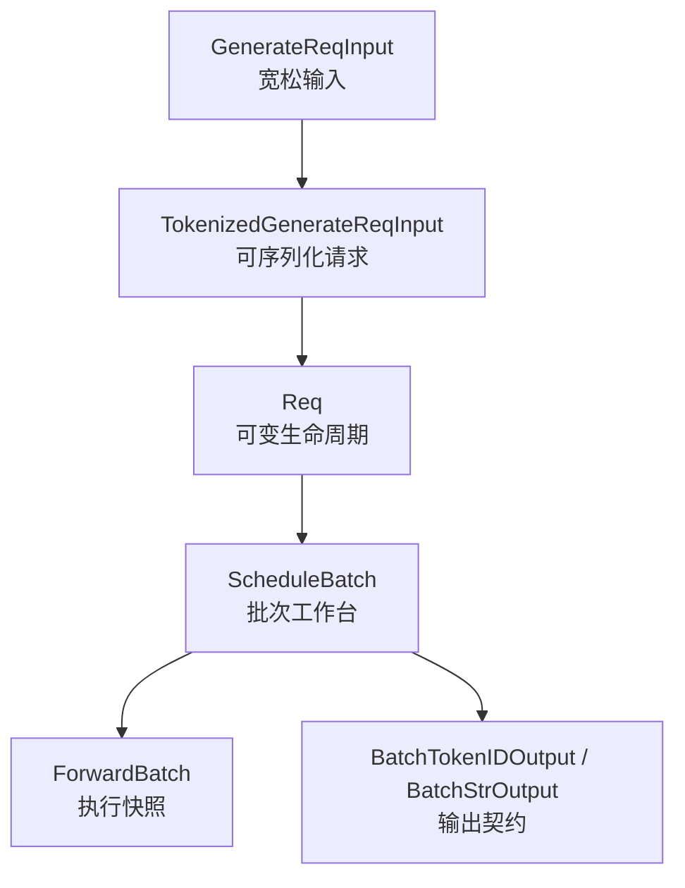

# ScheduleBatch数据结构 · 核心概念

本篇先建立心理模型。你可以把一条请求看成一张卡片，穿过不同岗位时会换成不同格式：前台 API 卡、跨进程运单、后厨单请求状态、批次工作台、GPU 执行单。格式变化的目的，是让每个岗位只承担自己能承担的复杂度。

---

## 读者任务

第一次读本专题时，不要先背字段。先抓住两个问题：

- 哪些对象跨进程传输，哪些对象只在 Scheduler 进程内可变。
- 哪些列表和张量必须按同一请求顺序对齐。

排障时也按这两个问题走。比如“输出串到另一个请求上”，优先怀疑 `filter_batch`、`merge_batch`、输出聚合的 per-request 列表是否错位；“prefix 命中但 prefill 仍很长”，优先看 `prefix_indices` 与 `extend_range` 的关系。

---

## 四层形态

| 层 | 对象 | 读法 |
|----|------|------|
| API 输入层 | `GenerateReqInput` | 外部用户请求，字段宽松，支持 batch、文本、token、多模态 |
| IPC 请求层 | `TokenizedGenerateReqInput` | TokenizerManager 发给 Scheduler 的结构化消息，复杂载荷用 `PickleWrapper` |
| Scheduler 运行层 | `Req`、`ScheduleBatch` | `Req` 管单请求生命周期，`ScheduleBatch` 管一批请求的调度和内存状态 |
| ModelRunner 执行层 | `ForwardBatch` | 从 `ScheduleBatch` 抽取 forward 所需张量，交给模型执行 |
| IPC 输出层 | `BatchTokenIDOutput`、`BatchStrOutput` | Scheduler 发 token 级结果，Detokenizer 转成字符串级结果 |



---

## 不变量一：请求身份和批量字段对齐

跨进程消息的基类已经把单请求和批请求拆开。单请求携带 `rid`，批请求携带 `rids`。这意味着后续所有 per-request 字段都必须与这些 ID 列表同顺序。

```python
# 来源：python/sglang/srt/managers/io_struct.py L74-L93
class BaseReq(msgspec.Struct, tag=True, kw_only=True, array_like=True):
    """Base for single-request IPC payloads."""

    rid: Optional[str] = None
    http_worker_ipc: Optional[str] = None

    @classmethod
    def __get_pydantic_core_schema__(cls, source, handler):
        return msgspec_struct_pydantic_core_schema(cls, handler)


class BaseBatchReq(msgspec.Struct, tag=True, kw_only=True, array_like=True):
    """Base for batched IPC payloads."""

    rids: Optional[List[str]] = None
    http_worker_ipcs: Optional[List[Optional[str]]] = None

    @classmethod
    def __get_pydantic_core_schema__(cls, source, handler):
        return msgspec_struct_pydantic_core_schema(cls, handler)
```

读 `BatchTokenIDOutput`、`BatchStrOutput`、`ScheduleBatch.reqs` 时，都要用同一把尺子：第 `i` 个请求的 rid、输出 token、finish reason、logprob、KV slot、HTTP worker IPC 必须对应同一个请求。

---

## 不变量二：cached prefix 和本次 extend 分开算

`Req` 保存 prefix cache 命中的 KV slot，`ScheduleBatch.prepare_for_extend` 再把“已缓存的前缀”和“本次需要计算的 token”拆成两组长度。

```python
# 来源：python/sglang/srt/managers/schedule_batch.py L848-L863
        # Prefix info
        # The indices to kv cache for the shared prefix.
        self.prefix_indices: torch.Tensor = torch.empty((0,), dtype=torch.int64)
        # TODO(ispobock): rename to last_device_node
        self.last_node: Any = None
        self.last_host_node: Any = None
        self.best_match_node: Any = None
        # Per-component host hit lengths split off from host_hit_length:
        self.host_hit_length = 0
        self.swa_host_hit_length = 0
        self.mamba_host_hit_length = 0
        # Total cached prefix length (on-device prefix_indices + host_hit_length),
        # capped at the max allowed prefix. Set during prefix matching at schedule
        # time and used to estimate uncached tokens / sort by longest prefix for
        # load reporting.
        self.num_matched_prefix_tokens = 0
```

```python
# 来源：python/sglang/srt/managers/schedule_batch.py L2019-L2025
        reqs = self.reqs
        input_ids = [r.get_fill_ids()[len(r.prefix_indices) :] for r in reqs]
        extend_num_tokens = sum(len(ids) for ids in input_ids)
        seq_lens = [r.extend_range.end for r in reqs]
        orig_seq_lens = [max(r.extend_range.end, len(r.origin_input_ids)) for r in reqs]
        prefix_lens = [len(r.prefix_indices) for r in reqs]
        extend_lens = [r.extend_range.length for r in reqs]
```

这里的判断很关键：`prefix_indices` 不是“prompt 长度”，而是已经命中的 KV 索引；`extend_lens` 不是“完整输入长度”，而是本次 forward 真正要计算的长度。

---

## `Req` 是生命周期，不是 IPC 消息

`Req` 接住 tokenized 请求后，会继续承载输出 token、finish 状态、KV 分配、prefix match、retract、session、多模态等运行态。它不是只读消息。

```python
# 来源：python/sglang/srt/managers/schedule_batch.py L713-L730
        # Input and output info
        self.rid = rid
        self.origin_input_ids = origin_input_ids
        self.origin_input_ids_unpadded = (
            origin_input_ids_unpadded
            if origin_input_ids_unpadded
            else self.origin_input_ids
        )  # Before image padding
        # Each decode stage's output ids. Append-only by contract:
        # _refresh_fill_ids infers how many output tokens are already in
        # full_untruncated_fill_ids from lengths alone, so in-place rewrites
        # that preserve length would silently corrupt fill_ids.
        self.output_ids = array("q")
        # Full untruncated sequence: origin + output (+ DLLM mask block).
        # Kept in sync by _refresh_fill_ids; admission only updates
        # extend_range, never mutates this array's length.
        self.full_untruncated_fill_ids = array("q")
        self.extend_range: Optional[Range] = None
```

所以排查请求状态时，应在 Scheduler 内看 `Req`；排查跨进程输入时，才看 `TokenizedGenerateReqInput`。

---

## `ScheduleBatch` 是 Scheduler 的批次工作台

`ScheduleBatch` 的字段分三类：请求列表和共享资源、Scheduler 内部状态、会被 `ForwardBatch` 消费的张量。看字段时先分组，再看字段名。

```python
# 来源：python/sglang/srt/managers/schedule_batch.py L1673-L1698
@dataclasses.dataclass
class ScheduleBatch(ScheduleBatchDisaggregationDecodeMixin):
    """Store all information of a batch on the scheduler."""

    # === Core: request list (ForwardBatch derives lora_ids / rids / grammars / positions from it) ===
    reqs: List[Req]

    # === Global config and shared resources (engine-lifetime; identical across batches) ===
    # Memory pool and cache
    req_to_token_pool: ReqToTokenPool = None
    token_to_kv_pool_allocator: BaseTokenToKVPoolAllocator = None
    tree_cache: BasePrefixCache = None

    # Batch configs
    model_config: ModelConfig = None
    enable_overlap: bool = False

    # Device
    device: str = "cuda"

    # HiSparse (engine-level coordinator ref, same across batches)
    hisparse_coordinator: Optional[HiSparseCoordinator] = None

    # === Batch-variant scheduler state (per-batch; not read by ForwardBatch) ===
    # Tell whether the current running batch is full so that we can skip
    # the check of whether to prefill new requests.
```

把它叫“工作台”比“数据结构”更准确：Scheduler 会在上面组包、过滤、合并、分配 KV slot、准备 prefill/decode，然后才把其中一部分张量交给 ModelRunner。

---

## `ForwardBatch` 是执行快照

`ForwardBatch.init_new` 从 `ScheduleBatch` 抽取 forward 所需字段。它会消费一次性 override、处理 decode/extend 差异、把 host 侧长度转为 device tensor。

```python
# 来源：python/sglang/srt/model_executor/forward_batch_info.py L675-L710
        ret = cls(
            # Required core inputs
            forward_mode=batch.forward_mode,
            batch_size=len(batch.seq_lens),
            input_ids=batch.input_ids,
            req_pool_indices=batch.req_pool_indices,
            seq_lens=batch.seq_lens,
            out_cache_loc=batch.out_cache_loc,
            seq_lens_sum=batch.seq_lens_sum,
            # Inputs aliased by reference from ScheduleBatch
            seq_lens_cpu=seq_lens_cpu,
            orig_seq_lens=batch.orig_seq_lens,
            out_cache_loc_dsv4=batch.out_cache_loc_dsv4,
            mamba_track_indices=batch.mamba_track_indices,
            mamba_track_mask=batch.mamba_track_mask,
            mamba_track_seqlens=batch.mamba_track_seqlens,
            mamba_cow_src_indices=batch.mamba_cow_src_indices,
            mamba_cow_dst_indices=batch.mamba_cow_dst_indices,
            mamba_clear_indices=batch.mamba_clear_indices,
            encoder_lens=batch.encoder_lens,
            encoder_out_cache_loc=batch.encoder_out_cache_loc,
            input_embeds=batch.input_embeds,
            replace_embeds=batch.replace_embeds,
            replace_positions=batch.replace_positions,
            # Scalar config / flags
            return_logprob=batch.return_logprob,
            is_extend_in_batch=batch.is_extend_in_batch,
            all_extend_in_batch=batch.all_extend_in_batch,
            can_run_dp_cuda_graph=batch.can_run_dp_cuda_graph,
            can_run_dp_breakable_cuda_graph=batch.can_run_dp_breakable_cuda_graph,
            global_forward_mode=batch.global_forward_mode,
            is_prefill_only=batch.is_prefill_only,
            spec_algorithm=batch.spec_algorithm,
            capture_hidden_mode=capture_hidden_mode,
            return_hidden_states_before_norm=return_hidden_states_before_norm,
            tbo_split_seq_index=batch.tbo_split_seq_index,
```

因此 ModelRunner 不应该理解 HTTP 请求，也不应该维护 `Req.output_ids`。它消费的是当次 forward 的张量快照。

---

## `PickleWrapper` 是结构化 IPC 的兜底口

默认 IPC 走 msgpack。可结构化字段直接编码，任意 Python 对象先包成 `PickleWrapper`，避免整个协议退回到不透明 pickle。

```python
# 来源：python/sglang/srt/managers/io_struct.py L96-L106
class PickleWrapper(msgspec.Struct, tag=True, array_like=True):
    """Wraps an arbitrary Python object as pickle-serialized bytes for msgpack IPC.

    In msgpack mode, fields that carry opaque or non-msgspec-typed payloads
    (e.g. multimodal inputs, time stats, customized info) are stored as
    PickleWrapper so the outer struct can still be msgpack-encoded.  In pickle
    mode (_USE_PICKLE_IPC=True), wrap_as_pickle / unwrap_from_pickle are no-ops
    and this class is not used on the wire.
    """

    data: bytes
```

判断一个字段需不需要包 pickle，先问它是不是 msgspec 能表达的结构化类型；如果是多模态处理结果、time stats、customized info 这类 opaque 载荷，就应该显式 wrap。

---

## `PositionalEmbeds` 是定点替换，不是整段输入 embedding

`PositionalEmbeds` 只描述“哪些绝对 token 位置要替换成哪些 embedding”。它会把列表归一成一个 `[N, hidden_dim]` tensor，并校验位置数。

```python
# 来源：python/sglang/srt/managers/embed_types.py L27-L58
class PositionalEmbeds(msgspec.Struct, array_like=True):
    """Embeddings to place at specific token positions.

    Accepts either a list of [1, hidden_dim] tensors or a pre-stacked [N, hidden_dim] tensor.
    In both cases, __post_init__ stacks into a single [N, hidden_dim] tensor to reduce
    ZMQ serialization overhead.

    Attributes:
        embeds: Stacked tensor of shape [N, hidden_dim] after __post_init__.
        positions: List of positions where embeddings should be injected.
    """

    embeds: torch.Tensor
    positions: List[int]

    def __post_init__(self):
        # Normalize list of tensors into a single [N, hidden_dim] tensor.
        # Dispatch by element rank to avoid a per-element unsqueeze.
        if isinstance(self.embeds, list):
            if not self.embeds:
                self.embeds = torch.cat(self.embeds, dim=0)  # raises — empty is invalid
            elif self.embeds[0].dim() == 1:
                # [hidden_dim] elements → stack adds the leading dim.
                self.embeds = torch.stack(self.embeds, dim=0)
            else:
                # [1, hidden_dim] (already has the leading dim) → plain concat.
                self.embeds = torch.cat(self.embeds, dim=0)
        if self.embeds.shape[0] != len(self.positions):
            raise ValueError(
                f"embeds length ({self.embeds.shape[0]}) != "
                f"positions length ({len(self.positions)})"
            )
```

这个类型要和 `ScheduleBatch.prepare_for_extend` 连起来看：绝对位置会被转换成当前 extend tensor 的相对位置，落到 `replace_embeds` 和 `replace_positions`。

---

## 小结

这个专题的核心模型是：

- `TokenizedGenerateReqInput` 是跨进程输入契约。
- `Req` 是 Scheduler 内部单请求生命周期。
- `ScheduleBatch` 是一批 `Req` 的调度工作台。
- `ForwardBatch` 是 ModelRunner 执行快照。
- 所有 per-request 列表、张量、输出字段必须按同一请求顺序对齐。

## 运行验证

维护这篇时，先用源码检索确认对象边界没有漂移：跨进程输入在 `io_struct.py`，调度态在 `schedule_batch.py`，执行快照在 `forward_batch_info.py`，定点 embedding 替换在 `embed_types.py`。

```powershell
rg -n 'class TokenizedGenerateReqInput|class Req|class ScheduleBatch|def prepare_for_extend|def prepare_for_decode|class ForwardBatch|class PickleWrapper|class PositionalEmbeds|out_cache_loc|extend_seq_lens' sglang/python/sglang/srt/managers/io_struct.py sglang/python/sglang/srt/managers/schedule_batch.py sglang/python/sglang/srt/model_executor/forward_batch_info.py sglang/python/sglang/srt/managers/embed_types.py
```

读输出时重点看 `Req -> ScheduleBatch -> ForwardBatch` 的字段是否仍然按请求顺序传递，尤其是 `out_cache_loc`、`extend_seq_lens` 和 positional embeds。只要这些边界改了，本篇关于 IO 对齐的解释就要同步重读。

下一篇 [[SGLang-ScheduleBatch数据结构-源码走读]] 会沿真实调用链把这些对象串起来。
