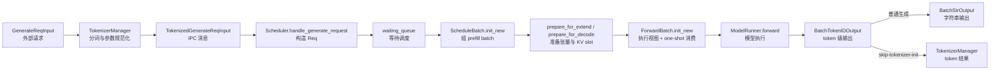

# ScheduleBatch数据结构 · 源码走读

这一篇只沿一条 generate 请求走：用户传入 prompt，TokenizerManager 分词并发给 Scheduler；Scheduler 构造 `Req`，组 `ScheduleBatch`，准备 prefill 或 decode；TpWorker 把它变成 `ForwardBatch`；最后 Scheduler 输出 token 级结果，Detokenizer 转成字符串。

读这篇的目标不是记住每个字段，而是能判断：请求在哪个边界被转换，哪些状态只属于 Scheduler，哪些张量才会进入 ModelRunner。

## 长文读法

这篇按“对象逐层收窄”读：`GenerateReqInput` 是 API 入口对象，`TokenizedGenerateReqInput` 是 TokenizerManager 发给 Scheduler 的 IPC 消息，`Req` 是 Scheduler 的请求状态，`ScheduleBatch` 是可跨 decode 轮次演化的批次工作台，`ForwardBatch` 才是本轮进入 ModelRunner 的执行视图。不要把这些对象当成同一个结构的不同名字。

| 读者任务 | 先读 | 要抓住的判断 |
|----------|------|--------------|
| 第一次建立 generate 数据流 | 主线图、1 到 4 | 请求先在 TokenizerManager 归一化，再由 Scheduler 变成 `Req` 并进入等待队列 |
| 排查 IPC 序列化或 opaque 字段 | 1 到 3 | 结构化字段走 msgspec；优先字段级 wrapper，少数请求类型才允许顶层整体回退 |
| 排查 prefix cache 命中异常 | 4 到 7 | prefix matching 写回 `Req`，`prepare_for_extend` 再把 cached prefix 和本轮 extend token 切开 |
| 排查 embedding / 多模态覆盖 | 1、7、8 | token id 仍是主轴，embedding 覆盖只落到本轮 extend 张量的对应位置 |
| 区分 prefill 与 decode | 6 到 10 | prefill 可能处理多 token 和 prefix；decode 每轮只推进一个位置，最后统一转成 `ForwardBatch` |
| 判断哪些字段会进模型 | 10 | `ForwardBatch.init_new` 消费 `ScheduleBatch` 当前快照，清理一次性 override，并只携带执行所需张量和元信息 |
| 排查输出回程 | 11 | 普通生成经 Detokenizer 产出文本；skip-tokenizer 直接回 token；embedding 无需字符串解码 |

读的时候沿对象边界做断点：API 归一化问题看 TokenizerManager，调度排队和 prefix 问题看 `Req` / `ScheduleBatch`，模型输入问题看 `ForwardBatch`，客户端文本问题看输出回程。

---

## 主线图



---

## 1. TokenizerManager：把宽松输入收窄成 IPC 请求

系统压力：API 层允许 `text`、`input_ids`、`input_embeds`、多模态、LoRA、session、PD 参数混在一起；Scheduler 不应该每轮调度都理解这些前台输入。TokenizerManager 先把 sampling 参数规范化，把 token ids 放进 `array("q")`，再构造 tokenized IPC 消息。

```python
# 来源：python/sglang/srt/managers/tokenizer_manager.py L1120-L1137
    ) -> Union[TokenizedGenerateReqInput, TokenizedEmbeddingReqInput]:
        """Create a tokenized request object from common parameters."""
        input_ids_arr: Optional[array[int]] = (
            array("q", input_ids) if input_ids is not None else None
        )
        # Parse sampling parameters
        # Note: if there are preferred sampling params, we use them if they are not
        # explicitly passed in sampling_params
        if self.preferred_sampling_params:
            sampling_kwargs = {**self.preferred_sampling_params, **obj.sampling_params}
        else:
            sampling_kwargs = obj.sampling_params
        sampling_params = self.sampling_params_class(**sampling_kwargs)
        sampling_params.normalize(self.tokenizer)
        sampling_params.verify(self.model_config.vocab_size)

        # Build return object
        if isinstance(obj, GenerateReqInput):
```

随后真正的 `TokenizedGenerateReqInput` 只保留 Scheduler 需要的字段：token ids、sampling、stream、rid、LoRA、embedding 覆盖、session、PD bootstrap 等。

```python
# 来源：python/sglang/srt/managers/tokenizer_manager.py L1150-L1168
            tokenized_obj = TokenizedGenerateReqInput(
                input_text=input_text,
                input_ids=input_ids_arr,
                mm_inputs=mm_inputs,
                sampling_params=sampling_params,
                return_logprob=obj.return_logprob,
                logprob_start_len=obj.logprob_start_len,
                top_logprobs_num=obj.top_logprobs_num,
                token_ids_logprob=obj.token_ids_logprob,
                stream=obj.stream,
                rid=obj.rid,
                http_worker_ipc=obj.http_worker_ipc,
                bootstrap_host=obj.bootstrap_host,
                bootstrap_port=obj.bootstrap_port,
                bootstrap_room=bootstrap_room,
                lora_id=obj.lora_id,
                input_embeds=input_embeds,
                positional_embed_overrides=obj.positional_embed_overrides,
                session_id=obj.session_id,
```

这里的读法是：`GenerateReqInput` 是前台“允许多种写法”的对象；`TokenizedGenerateReqInput` 是“已经进入内部协议”的对象。后者不应该再承担 API 归一化职责。

---

## 2. 发送前：opaque 字段显式包 pickle

默认 IPC 走 msgpack。TokenizerManager 在发送前调用 `wrap_pickle_fields()`，把多模态、Mooncake 多模态数据、time stats 等明确列出的 opaque 字段包成 `PickleWrapper`。这是字段级路径；编码 hook 还保留第二层兜底：列入 `_REQ_TYPES_WITH_OPAQUE_FIELDS` 的少数 request struct 可被整体包成顶层 `PickleWrapper`。

```python
# 来源：python/sglang/srt/managers/tokenizer_manager.py L1331-L1340
    def _send_one_request(
        self,
        tokenized_obj: Union[TokenizedGenerateReqInput, TokenizedEmbeddingReqInput],
    ):
        tokenized_obj.time_stats.set_api_server_dispatch_time()
        tokenized_obj = wrap_shm_features(tokenized_obj)
        time_stats = tokenized_obj.time_stats
        tokenized_obj.wrap_pickle_fields()
        self._dispatch_to_scheduler(tokenized_obj)
        tokenized_obj.time_stats = time_stats
```

这一步证明一个设计选择：SGLang 的主路径仍让结构化字段走 msgspec，不透明载荷才走 pickle。排查新字段时，决策顺序应是“精确 msgspec 类型 → 字段级 wrapper → 有审计理由的整个 struct 回退”，不能因为存在 `_REQ_TYPES_WITH_OPAQUE_FIELDS` 就把任意新请求整体塞进 pickle。

---

## 3. Scheduler：按消息类型进入 handler

Scheduler 收到的是一批 IPC 消息，不是 HTTP 请求。dispatcher 按类型把 `TokenizedGenerateReqInput`、embedding、batch、控制面请求分到不同 handler。

```python
# 来源：python/sglang/srt/managers/scheduler.py L1352-L1359
    def init_request_dispatcher(self):
        self._request_dispatcher = TypeBasedDispatcher(
            [
                (TokenizedGenerateReqInput, self.handle_generate_request),
                (TokenizedEmbeddingReqInput, self.handle_embedding_request),
                (BatchTokenizedGenerateReqInput, self.handle_batch_generate_request),
                (BatchTokenizedEmbeddingReqInput, self.handle_batch_embedding_request),
                (FlushCacheReqInput, self.flush_wrapper.handle),
```

读到这里，要把“请求协议”与“调度策略”分开。消息类型决定进入哪个 handler；是否能入 batch、是否命中 prefix、是否需要 retract，是后面的 Scheduler 逻辑。

---

## 4. TokenizedGenerateReqInput 变成 Req

`handle_generate_request` 的关键动作是构造 `Req`。这一刻开始，请求从跨进程消息变成 Scheduler 内部可变状态。

```python
# 来源：python/sglang/srt/managers/scheduler.py L2047-L2087
            req = Req(
                recv_req.rid,
                recv_req.input_text,
                recv_req.input_ids,
                recv_req.sampling_params,
                return_logprob=recv_req.return_logprob,
                top_logprobs_num=recv_req.top_logprobs_num,
                token_ids_logprob=recv_req.token_ids_logprob,
                stream=recv_req.stream,
                lora_id=recv_req.lora_id,
                session_id=recv_req.session_id,
                input_embeds=recv_req.input_embeds,
                positional_embed_overrides=recv_req.positional_embed_overrides,
                token_type_ids=recv_req.token_type_ids,
                custom_logit_processor=recv_req.custom_logit_processor,
                require_reasoning=recv_req.require_reasoning,
                return_hidden_states=recv_req.return_hidden_states,
                return_routed_experts=recv_req.return_routed_experts,
                routed_experts_start_len=recv_req.routed_experts_start_len,
                return_indexer_topk=recv_req.return_indexer_topk,
                eos_token_ids=self.model_config.hf_eos_token_id,
                bootstrap_host=recv_req.bootstrap_host,
                bootstrap_port=recv_req.bootstrap_port,
                bootstrap_room=recv_req.bootstrap_room,
                disagg_mode=self.disaggregation_mode,
                routed_dp_rank=recv_req.routed_dp_rank,
                disagg_prefill_dp_rank=recv_req.disagg_prefill_dp_rank,
                vocab_size=self.model_config.vocab_size,
                priority=recv_req.priority,
                metrics_collector=(
                    self.metrics_collector
                    if self.metrics_reporter.enable_metrics
                    else None
                ),
                routing_key=recv_req.routing_key,
                extra_key=recv_req.extra_key,
                http_worker_ipc=recv_req.http_worker_ipc,
                dllm_config=self.dllm_config,
                time_stats=recv_req.time_stats,
                multi_item_delimiter_indices=recv_req.multi_item_delimiter_indices,
            )
```

源码证据显示：`Req` 接收的是已经 tokenized 的字段，但立刻加入运行态语义，比如 tokenizer、metrics collector、disaggregation mode、eos ids。后续 decode 输出、finish 状态、KV 长度、prefix 命中都写在 `Req` 上。

---

## 5. Prefix matching 写入 Req，再决定本轮 extend 范围

`Req.init_next_round_input` 会刷新 `full_untruncated_fill_ids`，然后用当前完整序列和 `extra_key` 去 prefix cache 匹配。一个容易漏掉的分支是：如果有 positional embedding 覆盖，同一 token id 序列不再代表同一 KV，prefix caching 会被禁用。

```python
# 来源：python/sglang/srt/managers/schedule_batch.py L1157-L1167
        # Pass the full array with a raw-token cap (limit) instead of slicing,
        # avoiding an O(context) copy per prefill-batch build.
        token_ids_to_match = self.full_untruncated_fill_ids
        key_limit: Optional[int] = self._compute_max_prefix_len(input_len)

        # Disable prefix caching when embed overrides are present: same token IDs
        # with different override vectors must not share cached KV values.
        if self.positional_embed_overrides is not None:
            token_ids_to_match = array("q")
            key_limit = None
```

匹配结果写回 `Req.prefix_indices` 和 host/cache 相关字段。后面 `prepare_for_extend` 会用这些字段跳过已缓存前缀。

```python
# 来源：python/sglang/srt/managers/schedule_batch.py L1184-L1206
            (
                self.prefix_indices,
                self.last_node,
                self.last_host_node,
                self.best_match_node,
                self.host_hit_length,
                self.swa_host_hit_length,
                self.mamba_host_hit_length,
                self.mamba_branching_seqlen,
            ) = (
                match_result.device_indices,
                match_result.last_device_node,
                match_result.last_host_node,
                match_result.best_match_node,
                match_result.host_hit_length,
                match_result.swa_host_hit_length,
                match_result.mamba_host_hit_length,
                match_result.mamba_branching_seqlen,
            )
            if match_result.cache_protected_len is not None:
                self.cache_protected_len = match_result.cache_protected_len
            else:
                self.cache_protected_len = len(self.prefix_indices)
```

这里能解释一个常见现象：prefix hit 是否生效，不只看 prompt 字符串，还要看 `extra_key`、LoRA、embedding 覆盖、多模态 pad value 等是否让 cache key 发生变化。

---

## 6. Scheduler 组 prefill batch

Scheduler 用 `PrefillAdder` 决定哪些 waiting 请求能跑。能跑的请求从 waiting queue 移除，再进入 `ScheduleBatch.init_new`。

```python
# 来源：python/sglang/srt/managers/scheduler.py L2912-L2934
        # Update waiting queue
        can_run_list: List[Req] = adder.can_run_list
        if len(can_run_list) == 0:
            return None

        can_run_set = set(can_run_list)
        self.waiting_queue = [x for x in self.waiting_queue if x not in can_run_set]
        if adder.preempt_list:
            for req in adder.preempt_list:
                self._add_request_to_queue(req)

        if adder.new_chunked_req is not None:
            # Update chunked prefill
            assert self.chunked_req is None
            self.chunked_req = adder.new_chunked_req

        if self.chunked_req is not None:
            self.chunked_req.inflight_middle_chunks += 1

        set_time_batch(can_run_list, "set_forward_entry_time")

        # Create a new batch
        new_batch = ScheduleBatch.init_new(
```

`ScheduleBatch.init_new` 本身不做重型张量准备，它先建立批次对象和共享资源引用。

```python
# 来源：python/sglang/srt/managers/schedule_batch.py L1845-L1880
    @classmethod
    def init_new(
        cls,
        reqs: List[Req],
        req_to_token_pool: ReqToTokenPool,
        token_to_kv_pool_allocator: BaseTokenToKVPoolAllocator,
        tree_cache: BasePrefixCache,
        model_config: ModelConfig,
        enable_overlap: bool,
        spec_algorithm: SpeculativeAlgorithm,
        chunked_req: Optional[Req] = None,
        dllm_config: Optional[DllmConfig] = None,
    ):
        return_logprob = any(req.return_logprob for req in reqs)

        batch = cls(
            reqs=reqs,
            req_to_token_pool=req_to_token_pool,
            token_to_kv_pool_allocator=token_to_kv_pool_allocator,
            tree_cache=tree_cache,
            model_config=model_config,
            enable_overlap=enable_overlap,
            return_logprob=return_logprob,
            has_grammar=any(req.grammar for req in reqs),
            device=req_to_token_pool.device,
            spec_algorithm=spec_algorithm,
            return_hidden_states=any(req.return_hidden_states for req in reqs),
            is_prefill_only=all(req.is_prefill_only for req in reqs),
            chunked_req=chunked_req,
            chunked_req_next_prompt_token=_compute_chunked_req_next_prompt_token(
                chunked_req,
                model_config.vocab_size,
            ),
            dllm_config=dllm_config,
        )
        return batch
```

所以要区分两个时刻：`init_new` 说明“这一批是谁”；`prepare_for_extend` 才说明“这一批本轮要算哪些 token、写到哪些 KV slot”。

---

## 7. prepare_for_extend：把 prefix 命中和本次计算切开

prefill 的准备阶段会设置 `ForwardMode.EXTEND`，根据 `prefix_indices` 截出本次需要计算的 input ids，计算 `prefix_lens`、`extend_lens`、`seq_lens`。

```python
# 来源：python/sglang/srt/managers/schedule_batch.py L2011-L2025
    def prepare_for_extend(self):
        self.forward_mode = ForwardMode.EXTEND

        if self.is_dllm():
            # For DLLM, we use a separate forward mode
            self.forward_mode = ForwardMode.DLLM_EXTEND

        # Init tensors
        reqs = self.reqs
        input_ids = [r.get_fill_ids()[len(r.prefix_indices) :] for r in reqs]
        extend_num_tokens = sum(len(ids) for ids in input_ids)
        seq_lens = [r.extend_range.end for r in reqs]
        orig_seq_lens = [max(r.extend_range.end, len(r.origin_input_ids)) for r in reqs]
        prefix_lens = [len(r.prefix_indices) for r in reqs]
        extend_lens = [r.extend_range.length for r in reqs]
```

紧接着它把长度写回 batch，并调用 `alloc_for_extend` 分配输出 KV 位置与 request pool index。

```python
# 来源：python/sglang/srt/managers/schedule_batch.py L2048-L2058
        # Set batch fields needed by alloc_for_extend
        self.prefix_lens = prefix_lens
        self.extend_lens = extend_lens
        self.seq_lens = seq_lens_tensor
        self.seq_lens_cpu = seq_lens_cpu
        self.extend_num_tokens = extend_num_tokens

        # Allocate memory
        out_cache_loc, req_pool_indices_tensor, req_pool_indices_cpu = alloc_for_extend(
            self
        )
```

这个阶段的关键不变量是：`reqs[i]`、`prefix_lens[i]`、`extend_lens[i]`、`seq_lens[i]`、`req_pool_indices[i]` 必须描述同一个请求。

---

## 8. embedding 覆盖只落到本轮 extend 的位置

如果请求有 `positional_embed_overrides`，`prepare_for_extend` 会把绝对位置减去 prefix 长度，转成当前 flattened extend tensor 的位置。落在已缓存 prefix 或本轮 chunk 外的覆盖会跳过。

```python
# 来源：python/sglang/srt/managers/schedule_batch.py L2090-L2109
            if req.positional_embed_overrides is not None:
                # Override positions are absolute in the full sequence.
                # Convert to extend-tensor coordinates by subtracting pre_len,
                # then skip any that fall within the cached prefix.
                embeds_to_add = []
                for embed_idx, pos in enumerate(
                    req.positional_embed_overrides.positions
                ):
                    extend_pos = pos - pre_len
                    if extend_pos < 0 or extend_pos >= req.extend_range.length:
                        continue  # Outside current extend chunk, skip
                    embeds_to_add.append((embed_idx, input_id_pointer + extend_pos))
                if embeds_to_add:
                    has_replace_embeds = True
                    indices, positions = zip(*embeds_to_add)
                    all_replace_embeds.append(
                        req.positional_embed_overrides.embeds[list(indices)]
                    )
                    all_replace_positions.extend(positions)
            input_id_pointer += input_id_lens[i]
```

这解释了为什么 embedding 覆盖不能简单理解成 `input_embeds`。`input_embeds` 是整段输入 embedding；`replace_embeds` 是在本轮 extend 的 flattened token 位置做定点替换。

---

## 9. decode：每轮只推进一个位置

prefill 之后，请求进入 running batch。每轮 decode 前，Scheduler 先过滤已完成请求，然后调用 `prepare_for_decode`。decode 会分配每个请求一个新的 KV slot，并把序列长度加一。

```python
# 来源：python/sglang/srt/managers/scheduler.py L3026-L3033
    def update_running_batch(self, batch: ScheduleBatch) -> Optional[ScheduleBatch]:
        """Update the current running decoding batch."""
        initial_bs = batch.batch_size()

        batch.filter_batch()
        if batch.is_empty():
            batch.batch_is_full = False
            return batch
```

```python
# 来源：python/sglang/srt/managers/schedule_batch.py L2618-L2665
    def prepare_for_decode(self):
        self.forward_mode = ForwardMode.DECODE
        # Decode embeds the last output token via embed_tokens; clear the stale
        # prefill-time tensor so it doesn't leak into ForwardBatch.
        self.input_embeds = None

        # Clear context parallel metadata - CP is only for prefill, not decode
        if hasattr(self, "attn_cp_metadata") and self.attn_cp_metadata is not None:
            self.attn_cp_metadata = None

        if not self.spec_algorithm.is_none():
            # Spec decoding owns decode preparation (allocation, seq-lens bookkeeping).
            from sglang.srt.speculative.spec_utils import spec_prepare_for_decode

            spec_prepare_for_decode(self)
            return

        if self.sampling_info.penalizer_orchestrator.is_required:
            self.cumulate_penalty_output_tokens()

        # input_ids is set at end of previous run_batch (placeholder for
        # overlap; next_token_ids cast for non-overlap).

        if self.model_config.is_encoder_decoder:
            self.prepare_encoder_info_decode()

        # Allocate memory (DSV4-NPU c{4,128}_state alloc lens are computed inside
        # the allocator, triggered from mem_cache/common.py.)
        self.out_cache_loc = alloc_for_decode(self, token_per_req=1)

        # Update req-level memory management fields
        for req in self.reqs:
            req.decode_batch_idx += 1
            req.kv_committed_len += 1
            req.kv_allocated_len += 1

        if self.enable_overlap:
            # New-tensor avoids racing model_worker_batch refs queued for
            # overlap forward.
            self.seq_lens = self.seq_lens + 1
            self.seq_lens_cpu = self.seq_lens_cpu + 1
            self.orig_seq_lens = self.orig_seq_lens + 1
        else:
            self.seq_lens.add_(1)
            self.seq_lens_cpu.add_(1)
            self.orig_seq_lens.add_(1)
        # Sum is recomputed lazily by ForwardBatch.init_new.
        self.seq_lens_sum = None
```

prefill 的核心是“未缓存 prompt 的批量计算”；decode 的核心是“每条请求每轮推进一个 token 位置”。两者共享 `ScheduleBatch`，但 `forward_mode`、`input_ids`、`out_cache_loc`、`seq_lens` 的语义不同。

---

## 10. ForwardBatch：进入 ModelRunner 前的执行视图

Scheduler 的 `run_batch` 把 `ScheduleBatch` 交给 worker，worker 在 forward 前构造 `ForwardBatch`。

```python
# 来源：python/sglang/srt/managers/tp_worker.py L490-L510
        # Get forward batch from schedule batch
        if batch is not None:
            # update the consumer index of hicache to the running batch
            self.set_hicache_consumer(batch.hicache_consumer_index)

            forward_batch = ForwardBatch.init_new(batch, self.model_runner)
        else:
            # FIXME(lsyin): unify the interface of forward_batch
            assert forward_batch is not None

        # Deprecated kwarg: pre-planners mark the batch themselves now.
        forward_batch.apply_deprecated_skip_attn_backend_init(skip_attn_backend_init)

        if self.is_dllm():
            return self._forward_batch_generation_dllm(forward_batch)

        if self.pp_group.is_last_rank:
            out = self.model_runner.forward(
                forward_batch,
                pp_proxy_tensors=pp_proxy_tensors,
            )
```

`ForwardBatch.init_new` 会根据 `forward_mode` 判断 extend-only 字段是否存在。decode 或 idle 时，extend 长度相关字段置空；extend 时从 `ScheduleBatch` 读取。

```python
# 来源：python/sglang/srt/model_executor/forward_batch_info.py L613-L646
    def init_new(
        cls,
        batch: ScheduleBatch,
        model_runner: ModelRunner,
    ):
        # Consume one-shot per-forward overrides from SB; reset to defaults so
        # the next forward on the same SB starts clean. See SB field comment
        # for the contract.
        capture_hidden_mode = batch.capture_hidden_mode
        batch.capture_hidden_mode = None
        seq_lens_cpu_cache = batch.seq_lens_cpu_cache
        batch.seq_lens_cpu_cache = None
        return_hidden_states_before_norm = batch.return_hidden_states_before_norm
        batch.return_hidden_states_before_norm = False

        # capture_hidden_mode default: derive from SB.return_hidden_states /
        # spec_info.capture_hidden_mode when caller did not override.
        if capture_hidden_mode is None:
            if batch.return_hidden_states:
                capture_hidden_mode = CaptureHiddenMode.FULL
            elif batch.spec_info is not None:
                capture_hidden_mode = getattr(
                    batch.spec_info, "capture_hidden_mode", CaptureHiddenMode.NULL
                )
            else:
                capture_hidden_mode = CaptureHiddenMode.NULL

        # extend-mode-only fields are None on decode/idle
        if batch.forward_mode.is_decode_or_idle():
            extend_seq_lens = extend_prefix_lens = extend_logprob_start_lens = None
        else:
            extend_seq_lens = batch.extend_lens
            extend_prefix_lens = batch.prefix_lens
            extend_logprob_start_lens = batch.extend_logprob_start_lens
```

这就是 Scheduler 与 ModelRunner 的分界：`ForwardBatch` 不是把 `Req` 原样搬过去，而是从 `ScheduleBatch` 里抽出执行所需的张量和标志。这里也不是纯函数式复制：`capture_hidden_mode`、`seq_lens_cpu_cache`、`return_hidden_states_before_norm` 被读出后会在原 batch 上复位；部分 GPU 张量则仍按引用借用。更准确的心智模型是“本轮执行视图 + one-shot 消费点”。

开启 overlap 后还多一层容易混淆的快照：Scheduler 把 `batch.copy()` 与异步结果一起放进 `result_queue`。这个 copy 只保留 `process_batch_result` 需要的字段，并浅拷贝 `reqs` 列表，目的在于防止原 batch 为下一轮执行 filter/merge 后打乱上一轮结果的索引；它不是另一个可继续调度的完整 batch，更不是 `ForwardBatch`。

---

## 11. 输出回程：先 token，再字符串

Scheduler 侧输出聚合器把每条请求的 token 级结果打包成 `BatchTokenIDOutput`。先看聚合动作本身，才能避免把两个 token 字段混成一个：

```python
# 来源：python/sglang/srt/managers/scheduler_components/output_streamer.py L354-L372
        send_token_offset = req.send_token_offset
        send_output_token_logprobs_offset = req.send_output_token_logprobs_offset
        self.rids.append(req.rid)
        self.http_worker_ipcs.append(req.http_worker_ipc)
        self.finished_reasons.append(
            req.finished_reason.to_json() if req.finished_reason else None
        )
        self.decoded_texts.append(req.decoded_text)
        decode_ids, read_offset = req.init_incremental_detokenize()

        self.decode_ids_list.append(decode_ids[req.send_decode_id_offset :])

        # Exclude the tokens after stop condition
        output_ids_ = req.output_ids_through_stop

        req.send_decode_id_offset = len(decode_ids)
        self.read_offsets.append(read_offset)
        self.output_ids.append(output_ids_[send_token_offset:])
        req.send_token_offset = len(output_ids_)
```

`decode_ids` 按 `send_decode_id_offset` 切的是 Detokenizer 窗口传输增量；首次窗口可能从 prompt 尾部开始，为 tokenizer 合并和不完整 UTF-8 提供 surrounding context。`output_ids` 则按 `send_token_offset` 从 `output_ids_through_stop` 切片，是客户端可见的 output-token 增量。

```python
# 来源：python/sglang/srt/managers/scheduler_components/output_streamer.py L508-L525
    def to_payload(
        self, *, dp_rank: int, is_idle_batch: bool
    ) -> Optional[BatchTokenIDOutput]:
        if not (self.rids or is_idle_batch):
            return None
        dp_ranks = [dp_rank] * len(self.rids) if self.rids else None
        return BatchTokenIDOutput(
            rids=self.rids,
            http_worker_ipcs=self.http_worker_ipcs,
            spec_verify_ct=self.spec_verify_ct,
            spec_num_correct_drafts=self.spec_num_correct_drafts,
            spec_correct_drafts_histogram=self.spec_correct_drafts_histogram,
            time_stats=wrap_as_pickle(self.time_stats),
            finished_reasons=self.finished_reasons,
            decoded_texts=self.decoded_texts,
            decode_ids=self.decode_ids_list,
            read_offsets=self.read_offsets,
            output_ids=self.output_ids,
```

Detokenizer 收到 token 级输出后，才生成 `output_strs`，并返回 `BatchStrOutput` 给 TokenizerManager。

```python
# 来源：python/sglang/srt/managers/detokenizer_manager.py L406-L420
    def handle_batch_token_id_out(self, recv_obj: BatchTokenIDOutput):
        # If handling idle batch, set output_strs to [].
        output_strs = (
            self._decode_batch_token_id_output(recv_obj)
            if len(recv_obj.rids) > 0
            else []
        )
        routed_experts = self._b64_encode_per_request(recv_obj.routed_experts)
        indexer_topk = self._b64_encode_per_request(recv_obj.indexer_topk)
        return BatchStrOutput(
            rids=recv_obj.rids,
            http_worker_ipcs=recv_obj.http_worker_ipcs,
            finished_reasons=recv_obj.finished_reasons,
            output_strs=output_strs,
            output_ids=recv_obj.output_ids,
```

因此必须把三者逐项命名：`decode_ids` 是 Detokenizer 窗口片段，可能含 prompt surrounding context；`output_ids` 是客户端 output-token 增量；`output_strs` 是 Detokenizer 维护 per-rid 状态后生成的文本增量。普通生成走 `BatchTokenIDOutput → Detokenizer → BatchStrOutput`；`--skip-tokenizer-init` 会让 `BatchTokenIDOutput` 直接到 TokenizerManager；embedding 输出也不做字符串 detokenize。

---

## 运行验证

用小模型启动服务后，选一个普通 generate 请求做最小验证：

1. 在 `TokenizerManager._send_one_request` 后打印 `type(tokenized_obj)`、`len(tokenized_obj.input_ids)`，预期是 `TokenizedGenerateReqInput` 且 `input_ids` 已经是 `array("q")`。
2. 在 `Scheduler.handle_generate_request` 构造 `Req` 后打印 `req.rid`、`len(req.origin_input_ids)`、`req.output_ids`，预期 `output_ids` 为空。
3. 在 `ScheduleBatch.prepare_for_extend` 后打印 `batch.prefix_lens`、`batch.extend_lens`、`batch.extend_num_tokens`。验证第二次相同长 prompt 前，先确保第一请求已完成或前缀已插入 cache、cache 未禁用或驱逐，且 `extra_key`、LoRA、embedding override、多模态 pad hash 等匹配条件一致。命中后预期 `prefix_lens` 增大、`extend_num_tokens` 下降；为保留下一 token 的计算边界，通常不应期待完整 prompt 每个 token 都命中。
4. 在 `TpModelWorker.forward_batch_generation` 中打印 `type(forward_batch)`，预期是 `ForwardBatch`，不是 `ScheduleBatch`；同时观察三项 one-shot override 在 `init_new` 后复位。
5. 在 `SchedulerOutputStreamer.accept` 和 Detokenizer `handle_batch_token_id_out` 中同时比较 `decode_ids`、`output_ids`、`output_strs`。预期 `decode_ids` 可能含 surrounding context，`output_ids` 只含新客户端 token，`output_strs` 是可打印文本增量。
6. 分别以普通模式、`--skip-tokenizer-init`、embedding 模式检查回程对象类型，预期依次为 `BatchStrOutput`、`BatchTokenIDOutput`、`BatchEmbeddingOutput`。

---

## 复盘迁移

这条主线可以迁移到其他专题：

- 读 [[SGLang-Scheduler]] 时，关注 `Req` 如何进入 waiting/running 队列。
- 读 [[SGLang-ModelRunner]] 时，从 `ForwardBatch` 开始，不要回头找 HTTP 字段。
- 读 [[SGLang-RadixAttention]] 时，把 `prefix_indices` 当作 Scheduler 与 prefix cache 的交接物。
- 读 [[SGLang-Detokenizer]] 时，把 `BatchTokenIDOutput` 当输入，把 `BatchStrOutput` 当输出。
