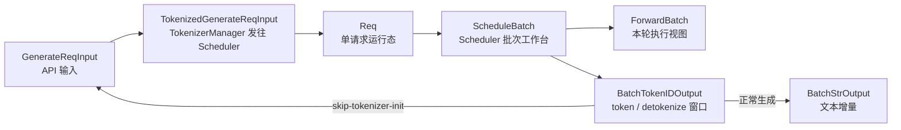

# ScheduleBatch数据结构

## 你为什么要读

这一组文档回答一个具体问题：**同一条生成请求，从 HTTP 进入、跨 ZMQ、进入 Scheduler、变成 GPU forward 输入、再回到字符串输出时，每一层对象到底长什么样。**

读完以后，你应该能做三件事：排查 Scheduler 收到的请求是否完整；解释 `Req`、`ScheduleBatch`、`ForwardBatch` 的分工；在 filter、merge、prefix cache、decode 推进时判断哪条对齐关系不能被破坏。

---

## 一句话模型

`ScheduleBatch-IO` 不是字段手册，而是 SGLang 请求批次的边界契约：



这条链的核心不是“字段很多”，而是“同一个请求在每个边界被收窄”：API 层允许文本、token、多模态、batch；IPC 层要求 msgspec 可编码；Scheduler 层变成可变生命周期对象；ModelRunner 层只保留 forward 所需张量。注意两处容易被一句话抹平的事实：`running_batch` 可以跨多个 decode iteration 原地演化；`ForwardBatch.init_new` 会消费一次性 override，因此它是执行视图的构造边界，不是完全无副作用的只读复制。

---

## 为什么先读它

如果只读 Scheduler，很容易知道“什么时候组 batch”，但不知道 batch 里并行数组如何保持对齐。如果只读 ModelRunner，又会把 `ForwardBatch` 当成完整请求状态，结果找不到 `origin_input_ids`、`finished_reason`、prefix cache 命中记录。

本专题夹在 [[SGLang-Scheduler]] 与 [[SGLang-ModelRunner]] 中间，专门解释这个交接面。

---

## 源码范围

| 文件 | 在本文中的角色 |
|------|----------------|
| `python/sglang/srt/managers/io_struct.py` | HTTP/Tokenizer/Scheduler/Detokenizer 之间的 IPC 消息 |
| `python/sglang/srt/managers/schedule_batch.py` | `Req` 与 `ScheduleBatch` 的生命周期和 batch 变形 |
| `python/sglang/srt/model_executor/forward_batch_info.py` | `ScheduleBatch` 到 `ForwardBatch` 的执行视图与 one-shot 消费 |
| `python/sglang/srt/managers/scheduler.py` | `Req` 入队、prefill 组包、decode 更新的调用点 |
| `python/sglang/srt/managers/scheduler_components/output_streamer.py` | 区分 detokenize 窗口、客户端 token 增量和其他输出元信息 |
| `python/sglang/srt/managers/scheduler_components/ipc_channels.py` | 正常、skip-tokenizer 两种回程拓扑 |
| `python/sglang/srt/managers/tokenizer_manager.py` | `GenerateReqInput` 到 `TokenizedGenerateReqInput` 的入口 |
| `python/sglang/srt/managers/detokenizer_manager.py` | token 级输出到字符串输出的回程 |
| `python/sglang/srt/managers/embed_types.py` | `PositionalEmbeds` 的跨模块嵌入覆盖结构 |

---

## 先看源码自己的边界声明

`schedule_batch.py` 的模块注释已经给出本专题最重要的边界：Scheduler 管 `ScheduleBatch`，ModelRunner 管 `ForwardBatch`，后者从前者构造。

```python
# 来源：python/sglang/srt/managers/schedule_batch.py L25-L37
"""
Store information about requests and batches.

The following is the flow of data structures for a batch:

ScheduleBatch -> ForwardBatch

- ScheduleBatch is managed by `scheduler.py::Scheduler`.
  It contains high-level scheduling data. Most of the data is on the CPU.
- ForwardBatch is managed by `model_runner.py::ModelRunner`.
  It contains low-level tensor data. Most of the data consists of GPU tensors.
  It is constructed directly from a ScheduleBatch by `ForwardBatch.init_new`.
"""
```

中文解释：`ScheduleBatch` 是调度侧的可变工作台，保留请求列表、prefix 命中、KV pool、采样状态、batch 是否满等决策信息。新 prefill batch 常按轮创建，而 `running_batch` 会跨 decode 轮次持续过滤、合并和重新 prepare；overlap 调度还会为延迟结果处理建立受限浅拷贝。`ForwardBatch` 则是本轮 forward 的执行视图，抽取或派生 `input_ids`、`seq_lens`、`out_cache_loc`、`positions` 等张量。

---

## 阅读顺序

| 顺序 | 文档 | 读者任务 |
|------|------|----------|
| 1 | [[SGLang-ScheduleBatch数据结构-核心概念]] | 建立“五层对象 + 两条对齐不变量 + 两种回程”的心理模型 |
| 2 | [[SGLang-ScheduleBatch数据结构-源码走读]] | 沿一条 generate 请求读真实调用链 |
| 3 | [[SGLang-ScheduleBatch数据结构-数据流]] | 看跨进程、进程内、GPU 边界如何分工 |
| 4 | [[SGLang-ScheduleBatch数据结构-排障指南]] | 排查常见混淆与失败模式 |
| 5 | [[SGLang-ScheduleBatch数据结构-学习检查]] | 自测是否能画图、定位源码入口、设计验证实验 |

---

## 运行抓手

最小验证路径不需要改 kernel：

1. 在 `TokenizerManager._send_one_request` 附近观察 `TokenizedGenerateReqInput` 是否已经 `wrap_pickle_fields()`。
2. 在 `Scheduler.handle_generate_request` 后观察 `Req.rid`、`origin_input_ids`、`positional_embed_overrides`。
3. 在 `ScheduleBatch.prepare_for_extend` 后观察 `prefix_lens`、`extend_lens`、`seq_lens`、`out_cache_loc`。
4. 在 `TpModelWorker.forward_batch_generation` 中确认进入 ModelRunner 的对象已经是 `ForwardBatch`。
5. 同时比较 `BatchTokenIDOutput.decode_ids`、`output_ids` 与 `BatchStrOutput.output_strs`：三者分别是 detokenize 窗口片段、客户端 output-token 增量、文本增量。
6. 分别确认正常生成、`--skip-tokenizer-init` 和 embedding 请求的回程：经过 Detokenizer、直接回 TokenizerManager、无需字符串 detokenize。

---

## 本专题的判断标准

读完后不要只记“哪个字段在哪个类里”，而要能回答：

- API 字段什么时候变成 IPC 字段，什么时候不再保留 API 语义。
- `Req` 的哪些字段是生命周期状态，不能放进 `TokenizedGenerateReqInput`。
- `ScheduleBatch.prepare_for_extend` 如何把 prefix hit 与本次 extend token 分开。
- `filter_batch` 和 `merge_batch` 为什么必须同步处理 `reqs`、`req_pool_indices`、`seq_lens`、`sampling_info`。
- `ForwardBatch.init_new` 为什么是 GPU 执行边界，以及它消费哪些 one-shot override。
- `decode_ids` 为什么可能包含 prompt surrounding context，不能当作纯生成 token 增量。

← [[SGLang-SchedulePolicy]] · → [[SGLang-Detokenizer]]
