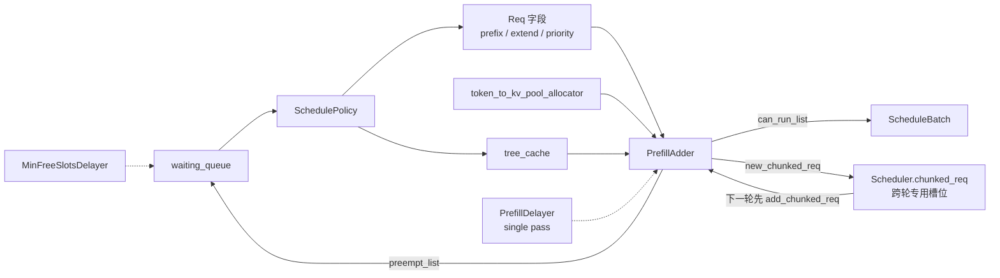

# SchedulePolicy · 数据流

## 你为什么要读

SchedulePolicy 只负责“先看谁”，并不保证“谁能进本轮 batch”。本文沿 waiting `Req` 经过 prefix match、优先级排序和 `PrefillAdder` 预算，直到形成可运行列表；这样可以把排序问题与 KV/token budget 准入问题分开。

这篇只看数据怎么流动：哪些对象进来，哪些字段被改，哪些状态被传到下一轮。

## 对象总览

| 对象 | 生命周期 | 本模块读什么 | 本模块写什么 |
|------|----------|--------------|--------------|
| `waiting_queue: List[Req]` | Scheduler 持有 | 请求顺序、采样参数、priority、routing key | 原地排序，移除已准入请求 |
| `Req` | 单请求状态 | `origin_input_ids`、`output_ids`、`extra_key`、`sampling_params` | `prefix_indices`、`last_node`、`extend_range`、chunk 状态 |
| `SchedulePolicy` | Scheduler 初始化时创建 | policy 配置、tree cache 能力 | `waiting_queue` 顺序 |
| `PrefillAdder` | 每轮 prefill 临时创建 | allocator、running batch、输入与 chunk 预算 | `can_run_list`、`new_chunked_req`、`preempt_list`、统计字段 |
| `PrefillDelayerSinglePassExecutor` | 每轮 prefill 临时创建 | token usage、全局 rank 信息 | 本轮 allow/delay 结果 |
| `ScheduleBatch` | `can_run_list` 非空后创建 | 准入后的请求列表 | 执行批次张量与 extend metadata |

## 数据流主图



## `Req` 字段如何变化

| 阶段 | 关键字段 | 变化 |
|------|----------|------|
| 排序前 | `origin_input_ids + output_ids` | 作为 prefix match 的 key |
| prefix match 后 | `prefix_indices`、`last_node`、`host_hit_length`、`num_matched_prefix_tokens` | `SchedulePolicy` 写入命中元数据 |
| 准入前 | `full_untruncated_fill_ids` | `req.init_next_round_input` 更新下一轮输入 |
| 准入后 | `extend_range` | `PrefillAdder` 决定本轮 extend 的 token 范围 |
| 分块后 | `new_chunked_req`、`inflight_middle_chunks` | Scheduler 记录下一轮必须继续 |

一个重要边界：`prefix_indices` 说明哪些 token 已经有 KV，`extend_range` 说明本轮要算哪些 token。这两个字段共同定义 prefill 输入，不应该单独解释。

## 预算字段如何流动

`PrefillAdder` 不是保存一组静态“剩余值”，而是保存 offset，再用 allocator 当前可用量与 cache 当前可驱逐量动态计算 `rem_total_tokens`、`cur_rem_tokens` 和 `rem_swa_tokens`。因此加锁、host load back 或驱逐状态变化后，同一个请求会再次过容量门。

读预算时至少分成六个口径：

| 层 | 字段 | 用途 |
|----|------|------|
| 总生命周期预算 | `rem_total_tokens` | 覆盖本次 prefill 输入加未来 decode 估算 |
| 本轮即时预算 | `cur_rem_tokens` | 覆盖当前 extend 分配 |
| 输入预算 | `rem_input_tokens` | 对应 `max_prefill_tokens` |
| 分块预算 | `rem_chunk_tokens` | 普通 chunked prefill 本轮还能提交多少 token |
| diffusion 预算 | `rem_dllm_tokens` | DLLM block 本轮还能提交多少 token |
| 特殊 allocator 预算 | `rem_swa_tokens`、`rem_mamba_slots` | 防止 SWA 子池或 Mamba 可恢复容量被 full-KV 口径掩盖 |

预算扣减集中在 `_update_prefill_budget`：

```python
# 来源：sglang/python/sglang/srt/managers/schedule_policy.py L677-L720
    def _update_prefill_budget(
        self,
        prefix_len: int,
        extend_input_len: int,
        max_new_tokens: int,
        retracted_stain: bool,
        mamba_gap_reserve: int = 0,
    ):
        # TODO(lsyin): check this workaround logic, which only ensures the prefill will not out of memory, and may be too conservative
        extend_input_len = self.ceil_paged_tokens(extend_input_len)

        # alloc_extend reserves an extra page_size per request to make sure the budget doesn't over-commit
        page_overhead = self.page_size
        # `mamba_gap_reserve` (shared Mamba pool only; 0 otherwise) charges the new
        # mamba state's shared-gap cost to BOTH full budgets: the slot is allocated
        # immediately (counts against `cur_rem`) and held for the request lifetime
        # (counts against `rem_total`). See `_mamba_gap_budget_for_req`.
        self.rem_total_token_offset += (
            extend_input_len + max_new_tokens + page_overhead + mamba_gap_reserve
        )
        self.cur_rem_token_offset += (
            extend_input_len + page_overhead + mamba_gap_reserve
        )
        # The new mamba slot also consumes one mamba-recoverable slot (gated
        # separately so full_evictable can't cover it — see __init__).
        if mamba_gap_reserve and self.rem_mamba_slots is not None:
            self.rem_mamba_slots -= 1
        self.rem_input_tokens -= extend_input_len

        if self.is_hybrid_swa:
            self.rem_swa_token_offset += self._swa_budget_for_req(extend_input_len)

        if self.dllm_config is not None:
            self.rem_dllm_tokens -= extend_input_len
        elif self.rem_chunk_tokens is not None:
            self.rem_chunk_tokens -= extend_input_len

        # reprocessed_log_* is a subset of log_*; metrics_reporter subtracts it
        # when computing the first-attempt prefix cache hit rate.
        self.log_hit_tokens += prefix_len
        self.log_input_tokens += extend_input_len
        if retracted_stain:
            self.reprocessed_log_hit_tokens += prefix_len
            self.reprocessed_log_input_tokens += extend_input_len
```

读这段时，抓住两点：

- `extend_input_len` 会 page 对齐，再扣输入预算。
- chunked prefill 中间块传入的 `max_new_tokens` 是 0，最后一块才预留输出预算。

## Chunked prefill 的状态回路

如果上一轮留下 `self.chunked_req`，Scheduler 会先把它交给 `add_chunked_req`，并且跳过普通等待队列的 slot 延迟。

```python
# 来源：sglang/python/sglang/srt/managers/scheduler.py L2823-L2842
        if self.chunked_req is not None:
            self.chunked_req.init_next_round_input()
            self.chunked_req = adder.add_chunked_req(self.chunked_req)

        if self.enable_lora:
            running_loras = {
                req.lora_id for req in self.running_batch.reqs if not req.finished()
            }
            # Account for LoRAs that are already loaded in the adder, such as chunked requests
            running_loras.update(req.lora_id for req in adder.can_run_list)

            if self.lora_drainer:
                self.lora_drainer.update_draining_state(
                    self.waiting_queue,
                    self.running_batch.reqs,
                )

        mamba_allocator = getattr(self.req_to_token_pool, "mamba_allocator", None)
        if mamba_allocator is not None:
            mamba_allocator.alloc_group_begin(len(self.waiting_queue))
```

`add_chunked_req` 的返回值就是下一轮状态：返回 `req` 表示还没结束，返回 `None` 表示这一轮已经提交最后一块。

```python
# 来源：sglang/python/sglang/srt/managers/schedule_policy.py L797-L835
    def add_chunked_req(self, req: Req):
        if self.dllm_config is not None:
            _rem_tokens = self._get_dllm_remain_tokens()
        else:
            _rem_tokens = min(self.rem_chunk_tokens, int(self.rem_total_tokens))
            if self.is_hybrid_swa:
                # alloc_extend needs extend_num_tokens + page_size per request,
                # so reserve one page here to avoid OOM
                _rem_tokens = min(
                    _rem_tokens, int(self.rem_swa_tokens) - self.page_size
                )
            # The chunked_req must be added to the list; otherwise, it will cause a memory leak.
            # Therefore, in certain cases where _rem_tokens <= 0, it should be replaced with rem_chunk_tokens.
            if _rem_tokens <= 0:
                if self.is_hybrid_swa:
                    return req
                _rem_tokens = self.rem_chunk_tokens

        cand_extend_input_len = len(req.full_untruncated_fill_ids) - len(
            req.prefix_indices
        )
        truncated = cand_extend_input_len > _rem_tokens
        new_len = min(cand_extend_input_len, _rem_tokens)
        req.set_extend_range(len(req.prefix_indices), len(req.prefix_indices) + new_len)
        self.can_run_list.append(req)
        self._update_prefill_budget(
            0,
            req.extend_range.length,
            (
                min(req.sampling_params.max_new_tokens, CLIP_MAX_NEW_TOKENS)
                if not truncated
                else 0
            ),
            req.retracted_stain,
            mamba_gap_reserve=self._mamba_gap_budget_for_req(req),
        )

        # Return if chunked prefill not finished
        return req if truncated else None
```

这里的状态边界很清楚：未完成请求返回同一个 `req`，Scheduler 把它继续保存在 `self.chunked_req`，而不是塞回普通 `waiting_queue`；下一轮在扫描普通等待请求前先调用 `add_chunked_req`。对 hybrid SWA，若本轮连安全的一块都放不下，函数直接返回 `req` 且不加入 `can_run_list`，让专用槽位保留状态等待下一轮，而不是冒险分配。

## PrefillDelayer 的 single-pass 数据

`PrefillDelayerSinglePassExecutor` 缓存一次协商结果。即使 `PrefillAdder.add_one_req` 被多次调用，底层 delayer 也只在第一次真正协商。

```python
# 来源：sglang/python/sglang/srt/managers/prefill_delayer.py L331-L368
class PrefillDelayerSinglePassExecutor:
    def __init__(self, prefill_delayer: PrefillDelayer, token_usage: float):
        self._prefill_delayer = prefill_delayer
        self._token_usage = token_usage
        self._result: Optional[_NegotiateOutput] = None

    @property
    def _called(self) -> bool:
        return self._result is not None

    def finalize(self, *, actual_prefill: bool):
        if not self._called:
            self.negotiate_should_allow_prefill(local_prefillable=False)

        _record_single_pass_result(
            actual_execution=actual_prefill,
            output=self._result,
            metrics_collector=self._prefill_delayer._metrics_collector,
        )

    def negotiate_should_allow_prefill(
        self,
        local_prefillable: bool,
        running_batch: int = 0,
        max_prefill_bs: int = 0,
        max_running_requests: int = 0,
        waiting_queue_len: int = 0,
    ) -> bool:
        if not self._called:
            self._result = self._prefill_delayer._negotiate_should_allow_prefill(
                local_prefillable=local_prefillable,
                token_usage=self._token_usage,
                running_batch=running_batch,
                max_prefill_bs=max_prefill_bs,
                max_running_requests=max_running_requests,
                waiting_queue_len=waiting_queue_len,
            )
        return self._result.output_allow
```

所以 metrics 里的 delayer outcome 是一轮 prefill 的结果，不是每个请求的结果。

## 跨 rank 协商的数据形状

`PrefillDelayer` 的每个参与 rank 打包 5 个整数再 `all_gather`；buffer 形状是 `(dp_size_dim, attn_tp_size, 5)`，决策只读取每个 DP 组的 attention-rank 0 切片 `[:, 0, :]`。未启用 DP attention 时 `dp_size_dim=1`，不要把这个张量机械理解成所有配置下都有 `dp_size × attn_tp_size` 个独立决策者。

| 字段 | 含义 |
|------|------|
| `prefillable` | 本 rank 是否有可 prefill 请求 |
| `token_watermark_force_allow` | token usage 低于水位时是否强制放行 |
| `running_batch` | 本 rank running batch 大小 |
| `max_prefill_bs` | 观察到的最大 prefill batch |
| `waiting_queue_len` | 本轮开始时等待队列长度 |

源码里 buffer 维度也直接反映这个形状：

```python
# 来源：sglang/python/sglang/srt/managers/prefill_delayer.py L96-L113
        # Fields packed per rank into the all-gather tensor: prefillable,
        # token_watermark_force_allow, running_batch, max_prefill_bs,
        # waiting_queue_len.
        self._global_info_buffer = torch.empty(
            (dp_size_dim, attn_tp_size, 5),
            dtype=torch.int64,
            device=self._gather_device,
        )

        self._metrics_collector = metrics_collector

        self._curr_state: Optional[_State] = None
        self.skip_first_delayer = True

        assert (
            not server_args.disable_overlap_schedule
        ), "To use PrefillDelayer, disable_overlap_schedule must be False."
```

## 与 Scheduler 的交接结果

`PrefillAdder` 的输出只有三类会被 Scheduler 消费：

| 输出 | Scheduler 后续动作 |
|------|-------------------|
| `can_run_list` | 从 `waiting_queue` 删除，并传入 `ScheduleBatch.init_new` |
| `preempt_list` | 被抢占请求重新加入等待队列 |
| `new_chunked_req` | 记录到 `self.chunked_req`，下一轮优先继续 |

这也解释了为什么调试时应该同时看 `waiting_queue` 和 `can_run_list`。只看排序后的等待队列，无法知道本轮真正执行哪些请求。

## 运行验证入口

| 目标 | 观测点 | 预期 |
|------|--------|------|
| 验证 prefix match 写回 | 在 `match_prefix_for_req` 后看 `req.prefix_indices` 与 `req.num_matched_prefix_tokens` | LPM 场景中共享长前缀请求数值更大 |
| 验证预算扣减 | 在 `_update_prefill_budget` 后看 `rem_*` 偏移 | 每加入一个请求，输入预算和总预算递减 |
| 验证 chunk 回路 | 在 `add_chunked_req` 看返回值 | 未完成时返回同一个 `req`，完成时返回 `None` |
| 验证 delayer 粒度 | 在 `PrefillDelayerSinglePassExecutor._called` 看状态 | 一轮 prefill 内只协商一次 |
