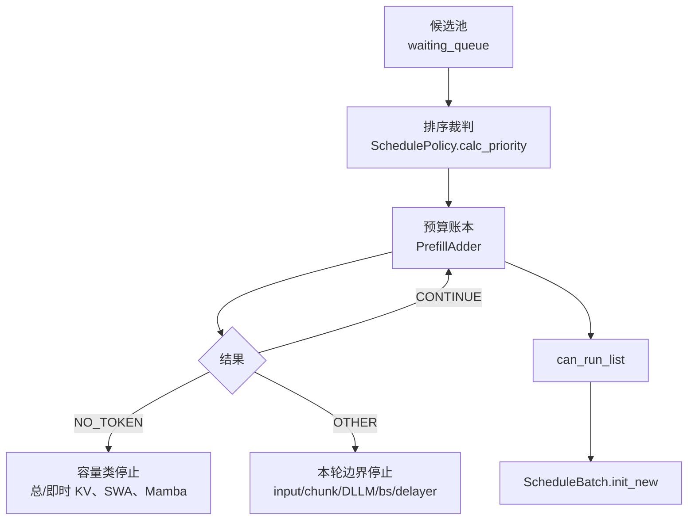

# SchedulePolicy · 核心概念

这篇先回答三件事：为什么要有调度策略，策略和预算为什么要拆开，读源码时应该抓住哪些对象。

## 读者任务

你读这个模块，不是为了记住每个 policy 名字，而是为了能解释：

- 一个等待请求在进入 prefill 前，哪些字段会被写入。
- prefix cache 命中如何影响排队顺序，却不等于已经执行了模型。
- 为什么本轮 prefill 会以 `NO_TOKEN` 或 `OTHER` 停下，以及为什么枚举名不能替代具体返回点。

## 心理模型：排序、准入、提交三层裁决

把一轮 prefill 看成四个连续动作：



这套模型有两个分离点：

- `SchedulePolicy` 只回答“先看谁”，它会原地调整 `waiting_queue`。
- `PrefillAdder` 才回答“本轮能放谁”。它保存本轮 offset 与配额，但容量属性仍会读取 allocator/cache 的最新状态。

## 策略分两类

```python
# 来源：sglang/python/sglang/srt/managers/schedule_policy.py L139-L153
class CacheAwarePolicy(Enum):
    """Scheduling policies that are aware of the tree cache."""

    LPM = "lpm"  # longest prefix match
    DFS_WEIGHT = "dfs-weight"  # depth-first search weighting


class CacheAgnosticPolicy(Enum):
    """Scheduling policies that are not aware of the tree cache."""

    FCFS = "fcfs"  # first come first serve
    LOF = "lof"  # longest output first
    RANDOM = "random"
    ROUTING_KEY = "routing-key"  # prioritize by routing key frequency in running batch
```

| 策略 | 读法 | 适合先问的问题 |
|------|------|----------------|
| `lpm` | longest prefix match | 谁已经命中最长 prefix cache |
| `dfs-weight` | cache 分支聚集 | 哪个 Radix 分支上等待请求更多 |
| `fcfs` | 先到先服务 | 是否要保持等待顺序 |
| `lof` | long output first | 谁声明的 `max_new_tokens` 更长 |
| `random` | 随机 | 是否要打散顺序做压测 |
| `routing-key` | routing 亲和 | 谁和 running batch 的 routing key 更接近 |

注意：cache-aware 只说明排序会读取 prefix tree。真正的 KV 复用发生在后续 `ScheduleBatch.prepare_for_extend` 与 attention 执行路径中。

## Prefix match 写回的是请求元数据

`match_prefix_for_req` 的关键不是返回一个值，而是把 prefix cache 命中结果写回 `Req`。后续排序、host load back、extend range 都依赖这些字段。

```python
# 来源：sglang/python/sglang/srt/managers/schedule_policy.py L91-L136
def match_prefix_for_req(
    tree_cache: BasePrefixCache,
    req: Req,
    token_ids: Optional[array[int]] = None,
    *,
    cow_mamba: bool = False,
    include_req: bool = False,
):
    if token_ids is None:
        token_ids = req.origin_input_ids + req.output_ids

    match_result = tree_cache.match_prefix(
        MatchPrefixParams(
            key=RadixKey(token_ids=token_ids, extra_key=req.extra_key),
            cow_mamba=cow_mamba,
            req=req if include_req else None,
        )
    )
    if envs.SGLANG_RADIX_FORCE_MISS.get():
        match_result = zero_match_result(tree_cache, match_result)
    (
        req.prefix_indices,
        req.last_node,
        req.last_host_node,
        req.best_match_node,
        req.host_hit_length,
        req.swa_host_hit_length,
        req.mamba_host_hit_length,
    ) = (
        match_result.device_indices,
        match_result.last_device_node,
        match_result.last_host_node,
        match_result.best_match_node,
        match_result.host_hit_length,
        match_result.swa_host_hit_length,
        match_result.mamba_host_hit_length,
    )
    max_len = req._compute_max_prefix_len(len(token_ids))
    req.num_matched_prefix_tokens = min(
        len(req.prefix_indices) + req.host_hit_length, max_len
    )
    if match_result.mamba_branching_seqlen is not None:
        req.mamba_branching_seqlen = match_result.mamba_branching_seqlen
    if match_result.cache_protected_len is not None:
        req.cache_protected_len = match_result.cache_protected_len
    return match_result
```

字段读法：

| 字段 | 含义 | 影响 |
|------|------|------|
| `prefix_indices` | device 侧已命中 KV 的 token 索引 | 后续只 extend 未命中部分 |
| `last_node` | prefix tree 上最后命中的节点 | 准入期间要加锁，避免被驱逐 |
| `host_hit_length` | host 层命中长度 | 可能触发 `init_load_back` |
| `num_matched_prefix_tokens` | device 命中加 host 命中的排序长度 | `lpm` 的主要排序依据 |
| `extra_key` | prefix cache 命名空间的一部分 | LoRA、租户或额外条件不同则不能混用命中 |

## 批内前缀不是已经存在的 KV

有一类场景容易误读：等待队列里很多请求彼此共享长前缀，但全局 RadixCache 还没有这段前缀。此时一起放进同一轮 prefill 会重复算相同前缀。源码用一棵临时 radix tree 检查 waiting queue 内部共享前缀，并临时降低后续同前缀请求优先级。

这不是“已经命中 KV”，而是“先让一个请求把共享前缀算出来，其余请求下一轮再复用”的策略。

## 预算账本有三种返回值

```python
# 来源：sglang/python/sglang/srt/managers/schedule_policy.py L427-L430
class AddReqResult(Enum):
    CONTINUE = auto()  # Continue to add requests
    NO_TOKEN = auto()  # No token left
    OTHER = auto()  # Other reasons to stop adding requests
```

`CONTINUE` 表示当前请求已处理完，并且账本仍允许继续看下一个请求。`NO_TOKEN` 是“容量口径已经不能安全继续”的停止信号，可能来自总生命周期 KV、当前 extend 峰值、SWA 子池、Mamba 可恢复 slot，也可能来自 `ignore_eos` 的保守生存期检查。`OTHER` 是“本轮到边界了”的停止信号，包括输入/chunk/DLLM 配额耗尽、delayer 拒绝、请求数上限、context-parallel 单请求限制或 chunk 对齐后无可提交 token。

源码收口在 `budget_state`：

```python
# 来源：sglang/python/sglang/srt/managers/schedule_policy.py L654-L675
    def budget_state(self):
        no_token = self.rem_total_tokens <= 0 or self.cur_rem_tokens <= 0
        if not no_token and self.is_hybrid_swa:
            no_token = self.rem_swa_tokens <= 0
        # Gate new mamba slots separately: rem_total_tokens' full_evictable can't
        # cover a mamba slot, which needs mamba-recoverable bytes (see __init__).
        if not no_token and self.rem_mamba_slots is not None:
            no_token = self.rem_mamba_slots <= 0
        if no_token:
            return AddReqResult.NO_TOKEN

        if self.rem_input_tokens <= 0:
            return AddReqResult.OTHER

        if self.dllm_config is not None:
            if self.rem_dllm_tokens <= 0:
                return AddReqResult.OTHER
        else:
            if self.rem_chunk_tokens is not None and self.rem_chunk_tokens <= 0:
                return AddReqResult.OTHER

        return AddReqResult.CONTINUE
```

这个三态首先是 Scheduler 的控制协议，不是完美的根因分类器：两者都会终止本轮 waiting-queue 扫描；只有 `NO_TOKEN` 会触发 `batch_is_full` 更新，而且 hierarchical cache 分支还要看本轮或 running batch 是否已有可服务请求。排障时必须回到具体返回点，不能只凭枚举名下结论。

## 两个延迟器解决不同问题

| 延迟器 | 位置 | 作用域 | 解决的问题 |
|--------|------|--------|------------|
| `MinFreeSlotsDelayer` | prefill raw 入口 | 单 rank | 空闲 request slot 太少时，先攒一攒，避免昂贵 prefill 一次只进一个 |
| `PrefillDelayer` | `PrefillAdder.add_one_req` 内 | 跨 DP rank | overlap 场景下协调各 rank，避免 prefill 插入破坏 decode batch 利用率 |

`MinFreeSlotsDelayer` 的判断很小：

```python
# 来源：sglang/python/sglang/srt/managers/min_free_slots_delayer.py L28-L41
class MinFreeSlotsDelayer:
    """Delay fresh prefill admissions until at least ``min_free_slots`` running-
    request slots free up, batching them into one admission instead of one at a
    time. Useful when each admission is expensive (e.g. DFlash's draft prefill).

    Per-rank local: running-batch slots are private to each DP rank, so a rank
    with free slots does not wait for a congested peer.
    """

    def __init__(self, min_free_slots: int):
        self._min_free_slots = min_free_slots

    def should_delay(self, *, running_bs: int, num_allocatable_reqs: int) -> bool:
        return running_bs > 0 and num_allocatable_reqs < self._min_free_slots
```

`PrefillDelayer` 则更像一次 prefill pass 级别的同步闸门。每个参与 rank 先用本地 token usage 计算一个 `token_watermark_force_allow` 布尔量，再 all-gather 五个整数：是否可 prefill、是否低水位强制放行、running batch 大小、历史最大 prefill batch 和等待队列长度。原始 token usage 浮点值不会跨 rank 传输。

它还有四个不能省略的安全边界：第一次满足 delay 条件时由 `skip_first_delayer` 放行；任一 rank 命中低水位就强制放行；`mixed` 状态最多等待配置的 pass 数；queue trigger 受墙钟超时约束。`disable_overlap_schedule=True` 时构造器直接断言，因此它不是非 overlap 模式的通用节流器。

## 核心不变量

| 不变量 | 为什么重要 | 破坏后的表现 |
|--------|------------|--------------|
| 排序阶段不创建 `ScheduleBatch` | 防止把 policy 和执行混在一起 | 难以定位谁改变了请求字段 |
| `prefix_indices` 必须与 `extend_range` 配套 | 命中部分不应重复 prefill | 重算前缀、KV 对齐错误或吞吐下降 |
| `PrefillAdder` 只活一轮，但容量属性仍动态读取 allocator/cache | offset 属于本轮，真实可用与可驱逐容量可能在锁前后变化 | 把它误当静态快照会漏掉二次容量检查 |
| chunked prefill 未完成块的 `max_new_tokens` 记为 0，最后一块才计入输出估算 | 同一个请求不能每块都重复预留 decode 空间 | 长 prompt 被过早判定资源不足 |
| delayer 只决定“这轮是否先等等” | 它不改变请求停止条件 | 把 TTFT 变差误判成采样或模型问题 |

## 运行验证

调度策略的验证重点是“排序、前缀命中、预算准入、延迟器”四段边界，而不是只看最终 batch 是否生成。

```powershell
rg -n 'class SchedulePolicy|def calc_priority|def _compute_prefix_matches|class AddReqResult|class PrefillAdder|AddReqResult\.NO_TOKEN|AddReqResult\.OTHER|class MinFreeSlotsDelayer|class PrefillDelayer|def should_delay' sglang/python/sglang/srt/managers/schedule_policy.py sglang/python/sglang/srt/managers/min_free_slots_delayer.py sglang/python/sglang/srt/managers/prefill_delayer.py
```

读输出时先看 `SchedulePolicy.calc_priority` 和 `_compute_prefix_matches`，确认排序与 prefix cache 写回仍在 policy 层；再看 `PrefillAdder` 的 `AddReqResult`，确认预算不足和其他停止原因被分开；最后看两个 delayer，确认它们只决定本轮是否延后 prefill。
