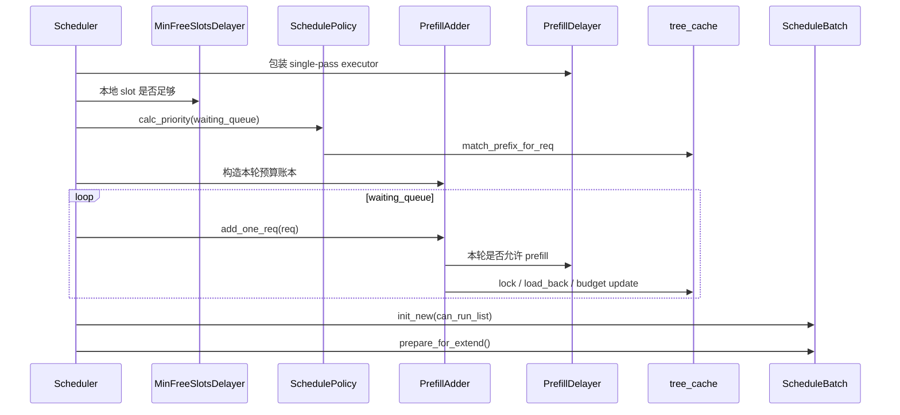

# SchedulePolicy · 源码走读

这篇沿一轮 prefill 调度走源码：一个请求已经进了 `waiting_queue`，Scheduler 要决定它能不能进入本轮 `ScheduleBatch`。

## 读者任务

读完这篇，你应该能拿着一次线上现象反推源码入口：

- 请求一直排队：看入口是否被 `batch_is_full`、slot delayer 或 prefill delayer 拦住。
- 共享前缀没有复用：看 `match_prefix_for_req` 是否写回了 `prefix_indices` 与 `num_matched_prefix_tokens`。
- 本轮只放了很少请求：看 `PrefillAdder` 返回的是 `NO_TOKEN` 还是 `OTHER`。
- 长 prompt 分块后卡住：看 `chunked_req` 是否被下一轮继续推进。

## 长文读法

这篇按 prefill 准入链路读：Scheduler 先让 delayer 以“一轮 prefill pass”为粒度做协商，再检查本地 slot，随后由 `SchedulePolicy.calc_priority` 只重排 `waiting_queue`，真正能不能进入本轮 batch 由 `PrefillAdder` 的预算账本决定，最后 `can_run_list` 才会变成 `ScheduleBatch`。

| 读者任务 | 先读 | 要抓住的判断 |
|----------|------|--------------|
| 首次建立 prefill 调度主线 | 贯穿场景、步骤 1 到 2 | delayer 和 slot 门发生在排序前，请求可能还没进入 policy 就被延后 |
| 排查共享前缀为什么没优先 | 步骤 3 到 4 | cache-aware policy 会写 prefix match 元数据，批内 prefix caching 可能临时后移相似请求 |
| 排查本轮只放少量请求 | 步骤 5 到 7 | `PrefillAdder` 同时管 token、chunk、request 数、LoRA、HiCache、Mamba/SWA 等预算 |
| 区分 `NO_TOKEN` 和 `OTHER` | 步骤 6 到 7 | 它们是两种“停止扫描”协议；必须回到具体返回点判断容量不足还是本轮边界 |
| 排查长 prompt 分块卡住 | 步骤 2、6、8 | `chunked_req` 会绕过部分 slot 门，并经 `new_chunked_req → Scheduler.chunked_req` 专用槽位延续状态 |
| 确认请求真正进 batch | 步骤 8、运行验证 | 只有从 `waiting_queue` 移入 `can_run_list` 后，才会构造 `ScheduleBatch.init_new` 并 `prepare_for_extend` |

读的时候保持三层分开：policy 只决定等待队列顺序，`PrefillAdder` 决定本轮准入，`ScheduleBatch` 才是模型执行前的批对象。

## 贯穿场景

假设服务里已有一批 decode 请求，同时来了三条新请求：

| 请求 | 特征 | 期望 |
|------|------|------|
| A | 与历史请求共享长 system prompt | 在 `lpm` 下优先 |
| B | 同样共享 A 的前缀，但全局 cache 还没写入 | 可能被批内前缀逻辑临时后移 |
| C | prompt 很长，需要 chunked prefill | 本轮只提交一段，下一轮继续 |

这三条请求会经过同一条主线：



## 步骤 1：Scheduler 先给 delayer 一个单轮执行器

`get_new_batch_prefill` 包住 raw 调度逻辑。这样 `PrefillDelayer` 的协商粒度是一轮 prefill pass，而不是每个请求单独 all-gather。

```python
# 来源：sglang/python/sglang/srt/managers/scheduler.py L2721-L2738
    def get_new_batch_prefill(self) -> Optional[ScheduleBatch]:
        prefill_delayer_single_pass = None
        if self.prefill_delayer:
            # Get max usage across all pools for prefill delay decision
            max_pool_usage = (
                self.pool_stats_observer.get_pool_stats().get_max_pool_usage()
            )
            prefill_delayer_single_pass = PrefillDelayerSinglePassExecutor(
                self.prefill_delayer, token_usage=max_pool_usage
            )

        ret = self._get_new_batch_prefill_raw(
            prefill_delayer_single_pass=prefill_delayer_single_pass
        )

        if self.prefill_delayer:
            prefill_delayer_single_pass.finalize(actual_prefill=ret is not None)
```

判断依据：`finalize(actual_prefill=ret is not None)` 在 raw 调度之后记录结果，所以 delayer 既知道自己是否放行，也知道本轮实际有没有产生 batch。

## 步骤 2：本地 slot 门先挡掉太碎的 prefill

进入 raw 分支后，`MinFreeSlotsDelayer` 先检查本地可分配 request slot。chunked prefill 正在进行时跳过这道门，因为中间块必须继续推进。

```python
# 来源：sglang/python/sglang/srt/managers/scheduler.py L2762-L2788
        running_bs = len(self.running_batch.reqs)
        # Skipped during a chunked prefill: that pass must proceed regardless.
        if (
            self.min_free_slots_delayer is not None
            and self.chunked_req is None
            and self.min_free_slots_delayer.should_delay(
                running_bs=running_bs,
                num_allocatable_reqs=self.get_num_allocatable_reqs(running_bs),
            )
        ):
            return None

        # Ignore the check if self.chunked_req is not None.
        # In the non-PP case, when self.chunked_req is not None, num_allocatable_reqs should always be greater than 0,
        # as the space for the chunked requests has just been released.
        # In PP case, chunked requests (or dllm requests) can start in one microbatch and end in another microbatch, so the max_running_requests per microbatch should not be strict.
        # Instead, we should always allow chunked requests to be added, otherwise, there will be a memory leak.
        if (
            self.get_num_allocatable_reqs(running_bs) <= 0
            and self.chunked_req is None
            and not self.enable_priority_preemption
        ):
            self.running_batch.batch_is_full = True
            return None

        # Get priority queue
        self.policy.calc_priority(self.waiting_queue, self.running_batch)
```

这里的系统压力是 TTFT 和吞吐的取舍：立即让一个请求 prefill 可以降低它的等待时间，但如果每次只合并一个请求，decode batch 可能长期跑不满。源码用 `chunked_req is None` 保护分块中间态，说明“攒 slot”不能打断已经开始的长 prompt。

## 步骤 3：排序阶段只改变 waiting_queue

`calc_priority` 的第一件事是确定本轮 active policy。之后 cache-aware 策略先写 prefix match 元数据，再排序；cache-agnostic 策略可能按输出长度、随机或 routing key 排序。

```python
# 来源：sglang/python/sglang/srt/managers/schedule_policy.py L176-L228
    def calc_priority(
        self, waiting_queue: List[Req], running_batch: Optional[ScheduleBatch] = None
    ) -> None:
        policy = self._determine_active_policy(waiting_queue)

        # Populate req.num_matched_prefix_tokens at schedule time. Cache-aware policies
        # set it in _compute_prefix_matches; do the same full match for
        # cache-agnostic policies when the radix supports it, so the load
        # snapshot has it. Skip on decode (never prefills).
        if (
            not isinstance(policy, CacheAwarePolicy)
            and self.tree_cache.supports_fast_match_prefix()
            and get_global_server_args().disaggregation_mode != "decode"
        ):
            for r in waiting_queue:
                match_prefix_for_req(self.tree_cache, r, include_req=True)

        if self.policy == CacheAgnosticPolicy.FCFS:
            if self.enable_priority_scheduling:
                SchedulePolicy._sort_by_priority_and_fcfs(
                    waiting_queue, self.priority_sign
                )
            return

        if isinstance(policy, CacheAwarePolicy):
            temporary_deprioritized = self._compute_prefix_matches(
                waiting_queue, policy
            )
            if policy == CacheAwarePolicy.LPM:
                SchedulePolicy._sort_by_longest_prefix(
                    waiting_queue, temporary_deprioritized
                )
            elif policy == CacheAwarePolicy.DFS_WEIGHT:
                SchedulePolicy._sort_by_dfs_weight(waiting_queue, self.tree_cache)
            else:
                raise ValueError(f"Unknown CacheAware Policy: {policy=}")
        else:
            if policy == CacheAgnosticPolicy.FCFS:
                pass
            elif policy == CacheAgnosticPolicy.LOF:
                SchedulePolicy._sort_by_longest_output(
                    waiting_queue,
                    self.enable_priority_scheduling,
                    self.priority_sign,
                )
            elif policy == CacheAgnosticPolicy.RANDOM:
                SchedulePolicy._sort_randomly(waiting_queue)
            elif policy == CacheAgnosticPolicy.ROUTING_KEY:
                if running_batch is not None:
                    SchedulePolicy._sort_by_routing_key(waiting_queue, running_batch)
            else:
                raise ValueError(f"Unknown CacheAgnostic Policy: {policy=}")
```

一个细节：`lpm` 队列超过 128 时，active `policy` 会临时变成 `FCFS`，但 `self.policy` 仍是 `LPM`。因此这条路径不会走 `self.policy == CacheAgnosticPolicy.FCFS` 的 priority+FCFS 早返回，而是在 `else` 分支里 `pass`，保持当前队列顺序。被关闭的是 LPM 专属的 `_compute_prefix_matches` 临时树与最长命中排序；如果 tree cache 支持 fast match 且不是 PD decode，前面的通用 metadata 填充仍可能逐请求调用 `match_prefix_for_req`，所以不能笼统说“完全不做 prefix match”。

```python
# 来源：sglang/python/sglang/srt/managers/schedule_policy.py L229-L251
    def _determine_active_policy(self, waiting_queue: List[Req]) -> Policy:
        if self.policy == CacheAwarePolicy.LPM and len(waiting_queue) > 128:
            # Turn off the expensive prefix matching and sorting when the #queue is large.
            return CacheAgnosticPolicy.FCFS
        return self.policy

    def _validate_and_adjust_policy(
        self, policy: str, tree_cache: BasePrefixCache
    ) -> Policy:
        """
        Validates the policy and adjusts it if necessary based on tree cache settings.
        """
        try:
            policy_enum = CacheAwarePolicy(policy)
            if getattr(tree_cache, "disable", True):
                # If tree_cache is disabled, using CacheAgnosticPolicy policy
                return CacheAgnosticPolicy.FCFS
            return policy_enum
        except ValueError:
            try:
                return CacheAgnosticPolicy(policy)
            except ValueError:
                raise ValueError(f"Unknown schedule_policy: {policy=}")
```

这里有两个退化点：启动或构造策略时，如果 tree cache disabled，cache-aware 策略会被调整为 `FCFS`；每轮运行时，如果 `LPM` 等待队列太长，只临时关闭昂贵 prefix matching 与排序。

## 步骤 4：批内 prefix caching 避免重复算同一段 prompt

如果 A 和 B 在全局 cache 中都只命中很短前缀，但二者在 waiting queue 里共享长前缀，那么同一轮都 prefill 会重复算。源码用 `waiting_queue_radix_tree` 做临时检查，命中过长的请求进入 `temporary_deprioritized`。

```python
# 来源：sglang/python/sglang/srt/managers/schedule_policy.py L253-L301
    def _compute_prefix_matches(
        self, waiting_queue: List[Req], policy: CacheAwarePolicy
    ) -> Set[int]:
        """
        Computes and caches the matching prefixes for requests in the waiting queue,
            and handles in-batch prefix caching logic.
        """
        temporary_deprioritized: Set[int] = set()
        self.waiting_queue_radix_tree.reset()

        for r in waiting_queue:
            prefix_ids = r.origin_input_ids + r.output_ids
            extra_key = r.extra_key
            match_result = match_prefix_for_req(
                self.tree_cache, r, prefix_ids, include_req=True
            )

            # NOTE(sang): This logic is for in-batch prefix caching;
            # If there are more than 1 request that have small matching prefix from
            # existing cache, but all those requests share the same prefix, we prefer
            # to schedule only one of them so that we can increase the cache hit rate.
            # We prefer to set IN_BATCH_PREFIX_CACHING_CHECK_THRESHOLD > 0 because too small
            # threshold means we cannot use in-batch prefix caching for short prefixes.
            # It is kind of common when the engine is long running (e.g., imagine the prefix "the").
            if len(r.prefix_indices) <= IN_BATCH_PREFIX_CACHING_CHECK_THRESHOLD:
                match_result = self.waiting_queue_radix_tree.match_prefix(
                    MatchPrefixParams(
                        key=RadixKey(token_ids=prefix_ids, extra_key=extra_key)
                    )
                )
                if envs.SGLANG_RADIX_FORCE_MISS.get():
                    match_result = zero_match_result(
                        self.waiting_queue_radix_tree, match_result
                    )
                in_batch_matching_prefixes = match_result.device_indices
                if (
                    len(in_batch_matching_prefixes)
                    >= IN_BATCH_PREFIX_CACHING_DEPRIORITIZE_THRESHOLD
                ):
                    temporary_deprioritized.add(r.rid)
                else:
                    # Insert with a dummy key
                    self.waiting_queue_radix_tree.insert(
                        InsertParams(
                            key=RadixKey(token_ids=prefix_ids, extra_key=extra_key),
                            value=torch.empty(len(prefix_ids), dtype=torch.bool),
                        )
                    )
        return temporary_deprioritized
```

随后 `lpm` 的排序 key 会把被临时降权的请求排到后面：

```python
# 来源：sglang/python/sglang/srt/managers/schedule_policy.py L303-L314
    @staticmethod
    def _sort_by_longest_prefix(
        waiting_queue: List[Req], temporary_deprioritized: Set[int]
    ) -> None:
        """Sorts the waiting queue based on the longest prefix match."""
        waiting_queue.sort(
            key=lambda r: (
                -r.num_matched_prefix_tokens
                if r.rid not in temporary_deprioritized
                else float("inf")
            )
        )
```

这一步的心理模型是“不要同时派多个人去挖同一条还没修好的路”。先让一个请求算出共享前缀并写入全局 cache，后续请求再通过真正的 prefix cache 命中获益。

## 步骤 5：Scheduler 构造一轮预算账本

排序以后，Scheduler 创建 `PrefillAdder`。这个对象只代表本轮 prefill：它接收 allocator、running batch、`max_prefill_tokens`、chunk size、prefill delayer、等待队列长度等事实，然后逐个尝试请求。

```python
# 来源：sglang/python/sglang/srt/managers/scheduler.py L2804-L2821
        # Prefill policy
        adder = PrefillAdder(
            self.page_size,
            self.tree_cache,
            self.token_to_kv_pool_allocator,
            self.running_batch,
            self.new_token_ratio_tracker.current,
            self.max_prefill_tokens,
            chunked_prefill_size,
            running_bs if self.is_mixed_chunk else 0,
            self.priority_scheduling_preemption_threshold,
            max_prefill_bs=self.max_prefill_bs,
            max_running_requests=self.max_running_requests,
            prefill_max_requests=self.server_args.prefill_max_requests,
            prefill_delayer_single_pass=prefill_delayer_single_pass,
            dllm_config=self.dllm_config,
            waiting_queue_len=len(self.waiting_queue),
        )
```

`PrefillAdder` 初始化时已经扣掉混合 chunk/decode 的输入预算，也会把 running batch 未来可能消耗的 token 纳入估算。

```python
# 来源：sglang/python/sglang/srt/managers/schedule_policy.py L433-L486
class PrefillAdder:
    def __init__(
        self,
        page_size: int,
        tree_cache: BasePrefixCache,
        token_to_kv_pool_allocator: BaseTokenToKVPoolAllocator,
        running_batch: ScheduleBatch,
        new_token_ratio: float,
        rem_input_tokens: int,
        rem_chunk_tokens: Optional[int],
        num_mixed_decode_tokens: int = 0,
        priority_scheduling_preemption_threshold: int = 0,
        max_prefill_bs: int = 0,
        max_running_requests: Optional[int] = None,
        prefill_max_requests: Optional[int] = None,
        prefill_delayer_single_pass: Optional[PrefillDelayerSinglePassExecutor] = None,
        dllm_config: Optional[DllmConfig] = None,
        waiting_queue_len: int = 0,
    ):
        self.page_size = page_size
        self.tree_cache = tree_cache
        self.token_to_kv_pool_allocator = token_to_kv_pool_allocator
        self.running_batch = running_batch
        self.new_token_ratio = new_token_ratio
        self.rem_input_tokens = rem_input_tokens - num_mixed_decode_tokens
        self.rem_chunk_tokens = rem_chunk_tokens
        self.dllm_config = dllm_config

        if self.dllm_config is not None:
            self._init_dllm_meta(dllm_config)

        if self.rem_chunk_tokens is not None:
            self.rem_chunk_tokens -= num_mixed_decode_tokens
        self.rem_total_token_offset = num_mixed_decode_tokens
        self.cur_rem_token_offset = num_mixed_decode_tokens

        self.req_states = None
        self.can_run_list = []
        self.preempt_list = []
        self.new_chunked_req = None
        self.log_hit_tokens = 0
        self.reprocessed_log_hit_tokens = 0
        # TODO(lsyin): report the real input tokens excluding page alignment
        self.log_input_tokens = 0
        self.reprocessed_log_input_tokens = 0

        if running_batch is not None:
            # Estimate the offset in the remaining token space
            self.rem_total_token_offset += sum(
                [
                    self._get_running_request_total_token_offset(r)
                    for r in running_batch.reqs
                ]
            )
```

这里不要把 `PrefillAdder` 理解成全局调度器。它是一个临时账本：`can_run_list`、`preempt_list`、`new_chunked_req` 都只服务本轮。

## 步骤 6：逐个请求准入，沿返回点定位第一道停止门

Scheduler 遍历排序后的等待队列，先处理 LoRA、slot、HiCache staging，再调用 `req.init_next_round_input` 和 `adder.add_one_req`。

```python
# 来源：sglang/python/sglang/srt/managers/scheduler.py L2843-L2879
        # Get requests from the waiting queue to a new prefill batch
        for req in self.waiting_queue:
            if self.enable_lora and not self._can_schedule_lora_req(req, running_loras):
                continue

            running_bs = len(self.running_batch.reqs)
            if len(adder.can_run_list) >= self.get_num_allocatable_reqs(running_bs):
                self.running_batch.batch_is_full = True
            if self.disaggregation_mode == DisaggregationMode.PREFILL:
                # In prefill mode, prealloc queue and transfer queue can also take memory,
                # so we need to check if the available size for the actual available size.
                if len(adder.can_run_list) >= self.req_to_token_pool.available_size():
                    self.running_batch.batch_is_full = True

            if self.running_batch.batch_is_full:
                if (
                    not self.enable_priority_preemption
                    or not adder.preempt_to_schedule(req, self.server_args)
                ):
                    break

            if self.enable_hicache_storage:
                prefetch_done = self.tree_cache.check_prefetch_progress(req.rid)
                if not prefetch_done:
                    # skip staging requests that are ongoing prefetch
                    continue
                # Pop the number of tokens loaded from storage (L3 hits)
                req.storage_hit_length = self.tree_cache.pop_prefetch_loaded_tokens(
                    req.rid
                )

            req.init_next_round_input(self.tree_cache)
            res = adder.add_one_req(
                req,
                has_chunked_req=(self.chunked_req is not None),
                truncation_align_size=self.truncation_align_size,
            )
```

`add_one_req` 开头先问 prefill delayer、本轮最大请求数、上下文并行限制。如果任一条件不满足就返回 `OTHER`；这只说明 Scheduler 不应把它当作容量耗尽来设置 `batch_is_full`，不代表原因一定“很软”或下一轮必然成功。

```python
# 来源：sglang/python/sglang/srt/managers/schedule_policy.py L968-L1006
    def add_one_req(
        self, req: Req, has_chunked_req: bool, truncation_align_size: Optional[int]
    ):
        if (self.prefill_delayer_single_pass is not None) and (
            not self.prefill_delayer_single_pass.negotiate_should_allow_prefill(
                local_prefillable=True,
                running_batch=self.running_batch.batch_size(),
                max_prefill_bs=self.max_prefill_bs,
                max_running_requests=self.max_running_requests,
                waiting_queue_len=self.waiting_queue_len,
            )
        ):
            return AddReqResult.OTHER
        # TODO support cp with multiple requests
        # Enabling context parallelism currently presents precision issues;
        # therefore, the prefill-batch setting is temporarily set to 1.
        if (self.dsa_prefill_cp_in_seq_split) and len(self.can_run_list) >= 1:
            return AddReqResult.OTHER

        if (x := self.prefill_max_requests) is not None and len(self.can_run_list) >= x:
            return AddReqResult.OTHER

        if req.sampling_params.ignore_eos and getattr(self.tree_cache, "disable", True):
            return self.add_one_req_ignore_eos(req)

        # Reserve page_size for page-alignment overhead: the paged allocator may
        # consume one extra page per request (see alloc_extend), which
        # _update_prefill_budget also deducts.
        max_new = min(
            max(req.sampling_params.max_new_tokens - len(req.output_ids), 0),
            CLIP_MAX_NEW_TOKENS,
        )
        cand_extend_input_len = len(req.full_untruncated_fill_ids) - len(
            req.prefix_indices
        )
        total_tokens = cand_extend_input_len + max_new + self.page_size
        # Shared Mamba pool: fold the new mamba state's shared-gap cost into
        # `total_tokens` so both `rem_total_tokens` gates reflect the joint budget.
        total_tokens += self._mamba_gap_budget_for_req(req)
```

接着检查总 KV 与 SWA 容量，并在临时锁住 prefix 节点后复查。`rem_total_tokens` 等属性由 allocator 可用量、cache 可驱逐量减 offset 动态计算，不是构造 `PrefillAdder` 时冻结的常数；host load back 还会增长 `prefix_indices`，所以输入长度也必须重算。

```python
# 来源：sglang/python/sglang/srt/managers/schedule_policy.py L1008-L1059
        # adjusting the input_tokens based on host_hit_length and page_size
        real_input_tokens = cand_extend_input_len - req.host_hit_length
        real_input_tokens = self.ceil_paged_tokens(real_input_tokens)
        prefix_len = len(req.prefix_indices)

        if total_tokens >= self.rem_total_tokens:
            return AddReqResult.NO_TOKEN

        if self.is_hybrid_swa:
            swa_needed = self._swa_budget_for_req(
                cand_extend_input_len, swa_host_hit_length=req.swa_host_hit_length
            )
            if swa_needed >= self.rem_swa_tokens:
                return AddReqResult.NO_TOKEN

        if (
            self.rem_chunk_tokens is None
            and len(self.can_run_list) != 0
            and real_input_tokens >= self.rem_input_tokens
        ):
            # If without chunked prefill:
            # - if the can_run_list is not empty, we satisfy the constraint of (max_prefill_tokens)
            # - if the can_run_list is empty, always accept the first prefill request
            return AddReqResult.OTHER

        with self._lock_node(req.last_node):
            # self.rem_total_tokens may decrease after the lock acquisition
            if total_tokens >= self.rem_total_tokens:
                return AddReqResult.NO_TOKEN

            if self.is_hybrid_swa:
                swa_needed = self._swa_budget_for_req(
                    cand_extend_input_len, swa_host_hit_length=req.swa_host_hit_length
                )
                if swa_needed >= self.rem_swa_tokens:
                    return AddReqResult.NO_TOKEN

            if req.needs_host_load_back():
                new_indices, req.last_node = self.tree_cache.init_load_back(
                    InitLoadBackParams(
                        best_match_node=req.best_match_node,
                        host_hit_length=req.host_hit_length,
                        req=req,
                    )
                )
                req.prefix_indices = torch.cat([req.prefix_indices, new_indices])
                prefix_len = len(req.prefix_indices)
                req.cache_protected_len = prefix_len

            input_tokens = self.ceil_paged_tokens(
                len(req.full_untruncated_fill_ids) - len(req.prefix_indices)
            )
```

如果请求能整段 prefill，本轮设置 `extend_range` 到完整输入末尾，并扣掉输入、输出预估、page overhead 和可能的 Mamba gap。

```python
# 来源：sglang/python/sglang/srt/managers/schedule_policy.py L1081-L1098
            elif self.rem_chunk_tokens is None or input_tokens <= self.rem_chunk_tokens:
                # Non-chunked prefill — the whole sequence is committed this iter.
                req.set_extend_range(
                    len(req.prefix_indices), len(req.full_untruncated_fill_ids)
                )
                self.can_run_list.append(req)

                self._req_inc_lock_ref(req)
                self._update_prefill_budget(
                    prefix_len,
                    input_tokens,
                    min(
                        req.sampling_params.max_new_tokens,
                        CLIP_MAX_NEW_TOKENS,
                    ),
                    req.retracted_stain,
                    mamba_gap_reserve=self._mamba_gap_budget_for_req(req),
                )
```

如果请求太长，本轮只提交一块，把 `new_chunked_req` 交还给 Scheduler。中间块的 `max_new_tokens` 传 0，防止同一个请求被重复预留 decode 空间。

```python
# 来源：sglang/python/sglang/srt/managers/schedule_policy.py L1099-L1141
            else:
                # Make sure at least one page is available
                trunc_len = self.rem_chunk_tokens // self.page_size * self.page_size

                if trunc_len <= 0:
                    return AddReqResult.OTHER

                # When truncation align size is set, we want to assert that the prefill prefix length is multiple of truncation align size
                # A typical use case is when deterministic inference is enabled with flashinfer attention backend,
                # we need the prefill prefix length to be multiple of attention split size
                if truncation_align_size is not None:
                    if trunc_len < truncation_align_size:
                        return AddReqResult.OTHER
                    else:
                        trunc_len = truncation_align_size * (
                            trunc_len // truncation_align_size
                        )

                now_input_len = trunc_len + len(req.prefix_indices)
                now_input_len = now_input_len // self.page_size * self.page_size
                trunc_len = now_input_len - len(req.prefix_indices)

                if trunc_len <= 0:
                    return AddReqResult.OTHER

                # Chunked prefill
                req.set_extend_range(
                    len(req.prefix_indices), len(req.prefix_indices) + trunc_len
                )

                self.can_run_list.append(req)
                self.new_chunked_req = req

                self._req_inc_lock_ref(req)
                self._update_prefill_budget(
                    prefix_len,
                    trunc_len,
                    0,
                    req.retracted_stain,
                    mamba_gap_reserve=self._mamba_gap_budget_for_req(req),
                )

        return self.budget_state()
```

## 步骤 7：返回值决定 Scheduler 怎么停

Scheduler 不会无限遍历等待队列。只要 `add_one_req` 不再返回 `CONTINUE`，它会根据结果收尾。

```python
# 来源：sglang/python/sglang/srt/managers/scheduler.py L2884-L2907
            if res != AddReqResult.CONTINUE:
                if res == AddReqResult.NO_TOKEN:
                    if self.enable_hierarchical_cache:
                        # Set batch_is_full after making sure there are requests that can be served
                        self.running_batch.batch_is_full = len(
                            adder.can_run_list
                        ) > 0 or (not self.running_batch.is_empty())
                    else:
                        self.running_batch.batch_is_full = True
                # revert matched mamba idx to avoid memory leak, if req is not added.
                # Only free if the slot was freshly allocated in this batch (not
                # pre-existing from a session). Session-held slots have their own
                # lifecycle and freeing them here causes double-free.
                added = len(adder.can_run_list) > 0 and req is adder.can_run_list[-1]
                if (
                    not added
                    and req.mamba_pool_idx is not None
                    and not getattr(req, "session", None)
                ):
                    self.tree_cache.req_to_token_pool.mamba_allocator.free(
                        req.mamba_pool_idx.unsqueeze(-1)
                    )
                    req.mamba_pool_idx = None
                break
```

所以排障时不要只看“停了”，也不要把枚举机械翻译成“硬/软”。应记录命中的具体 return site：

| 返回值 | 含义 | 下一步看 |
|--------|------|----------|
| `NO_TOKEN` | 容量口径不能安全继续 | 总/即时 KV、SWA、Mamba slot、ignore-eos 生存期估算 |
| `OTHER` | 本轮边界不允许继续扫描 | 输入/chunk/DLLM 配额、对齐后零长度、delayer、`prefill_max_requests`、上下文并行限制 |
| 空 `can_run_list` | 没有请求真正准入 | delayer、grammar、LoRA、HiCache prefetch、slot 门 |

还有一个容易漏掉的分支：`add_chunked_req` 不是 `AddReqResult` 协议。它直接返回“仍未完成的 `req`”或 `None`；hybrid SWA 暂时没有安全空间时，也会返回原请求但不把它加入本轮 `can_run_list`。因此排查长 prompt 必须同时看返回对象与本轮列表，不能套用 `NO_TOKEN`/`OTHER` 表格。

## 步骤 8：can_run_list 才进入 ScheduleBatch

只有 `can_run_list` 非空，Scheduler 才更新等待队列、记录 chunked 状态、创建 `ScheduleBatch`，并调用 `prepare_for_extend`。

```python
# 来源：sglang/python/sglang/srt/managers/scheduler.py L2912-L2956
        # Update waiting queue
        can_run_list: List[Req] = adder.can_run_list
        if len(can_run_list) == 0:
            return None

        can_run_set = set(can_run_list)
        self.waiting_queue = [x for x in self.waiting_queue if x not in can_run_set]
        if adder.preempt_list:
            for req in adder.preempt_list:
                self._add_request_to_queue(req)

        if adder.new_chunked_req is not None:
            # Update chunked prefill
            assert self.chunked_req is None
            self.chunked_req = adder.new_chunked_req

        if self.chunked_req is not None:
            self.chunked_req.inflight_middle_chunks += 1

        set_time_batch(can_run_list, "set_forward_entry_time")

        # Create a new batch
        new_batch = ScheduleBatch.init_new(
            can_run_list,
            self.req_to_token_pool,
            self.token_to_kv_pool_allocator,
            self.tree_cache,
            self.model_config,
            self.enable_overlap,
            self.spec_algorithm,
            chunked_req=self.chunked_req,
        )

        new_batch.contains_last_prefill_chunk = (
            self.chunked_req is None or len(can_run_list) != 1
        )

        self.max_prefill_bs = max(self.max_prefill_bs, len(can_run_list))
        if self.enable_hierarchical_cache:
            # todo (zhiqiang): disable cuda graph execution if hicache loading triggered
            new_batch.hicache_consumer_index = (
                self.tree_cache.ready_to_load_host_cache()
            )

        new_batch.prepare_for_extend()
```

到这里，本专题的职责结束。`ScheduleBatch` 后续如何把 `Req` 字段变成 `ForwardBatch`，见 [[SGLang-ScheduleBatch数据结构-源码走读]]。

## 运行验证

最小验证思路不是直接改源码，而是用三组对照观察调度行为：

| 验证 | 做法 | 预期现象 |
|------|------|----------|
| LPM 是否改变顺序 | 固定模型、并发、输入与输出长度，对比 `--schedule-policy lpm` 与 `--schedule-policy fcfs` | 先确认 waiting 顺序与 prefix-hit 口径变化；TTFT 是否改善取决于 workload，不预设必胜 |
| prefix cache 收益是否真实 | 设置 `SGLANG_RADIX_FORCE_MISS=1` 后复测同一 workload | 应先看到命中归零或下降；prefill 成本与 TTFT 的变化再结合硬件和并发解释 |
| delayer 是否过强 | 开启 prefill delayer debug 日志或 metrics，观察 `output_reason` | 如果大量 `delay` 且 `actual_execution=false`，说明 prefill 被持续推迟 |

如果只能加断点，优先放在这四处：

| 断点 | 观察 |
|------|------|
| `SchedulePolicy.calc_priority` | `waiting_queue` 顺序、`num_matched_prefix_tokens` |
| `PrefillAdder.add_one_req` | `cand_extend_input_len`、`total_tokens`、返回值 |
| `PrefillDelayerSinglePassExecutor.negotiate_should_allow_prefill` | 本轮是否被跨 rank delay |
| `ScheduleBatch.init_new` | 最终 `can_run_list` 是否符合预期 |

## 复盘

这条源码主线可以压缩成一句话：`SchedulePolicy` 排队，`PrefillAdder` 放行，Scheduler 收口成 `ScheduleBatch`。

读这个模块时，最容易犯的错是把“排序结果”当成“执行结果”。真正能跑的请求必须同时满足 prefix 元数据、KV/SWA/Mamba 预算、slot 上限、chunk 状态、delayer 节奏和 Scheduler 收尾逻辑。
