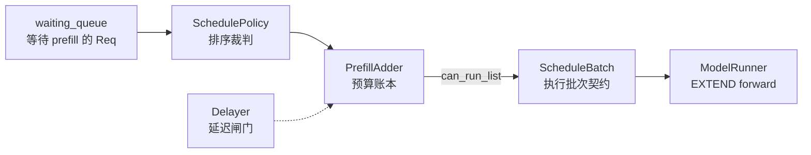

# SchedulePolicy

这一组笔记回答一个问题：Scheduler 手里有一串等待请求时，为什么本轮 prefill 只放进这些请求，而不是另一些请求。

读完以后，你应该能解释三类现象：

- 共享 system prompt 的请求为什么在 `lpm` 下更容易被提前安排。
- `NO_TOKEN`、`OTHER`、空 prefill batch 分别说明哪一层门被卡住。
- 分块 prefill、优先级抢占、prefill delayer 为什么会改变 TTFT 与吞吐的平衡。

## 模块位置

严格说，`SchedulePolicy` 类只负责给 `waiting_queue` 排序，并在需要时写回 prefix match 元数据；把候选请求变成 `can_run_list` 的是同文件中的 `PrefillAdder`，维护专用 `chunked_req` 槽位、更新等待队列并创建 `ScheduleBatch` 的是 `Scheduler`。本专题把这三层作为一条 prefill 准入链来读，但不会把它们混成一个类的职责。

这张图里的关键边界是：排序只改变等待队列顺序，准入才决定本轮能跑哪些请求，`ScheduleBatch.init_new` 才把请求列表变成执行批次。

## 阅读顺序

| 顺序 | 文件 | 读者任务 |
|------|------|----------|
| 1 | [[SGLang-SchedulePolicy-核心概念]] | 先建立“排序—准入—提交”三层心理模型 |
| 2 | [[SGLang-SchedulePolicy-源码走读]] | 沿一轮 prefill 调度追踪真实调用顺序 |
| 3 | [[SGLang-SchedulePolicy-数据流]] | 看清 `Req` 字段、预算字段、delayer 状态如何流动 |
| 4 | [[SGLang-SchedulePolicy-排障指南]] | 按症状排查策略退化、预算不足、延迟过强与 chunked prefill |
| 5 | [[SGLang-SchedulePolicy-学习检查]] | 用清单验收自己是否能读懂和改动这条路径 |

## 源码范围

| 文件 | 在本专题中的角色 |
|------|------------------|
| `sglang/python/sglang/srt/managers/schedule_policy.py` | 策略枚举、前缀匹配、`PrefillAdder` 预算准入、优先级抢占 |
| `sglang/python/sglang/srt/managers/scheduler.py` | prefill 调度入口、等待队列更新、`ScheduleBatch` 创建 |
| `sglang/python/sglang/srt/managers/prefill_delayer.py` | overlap + DP 下跨 rank 协商是否暂缓 prefill |
| `sglang/python/sglang/srt/managers/min_free_slots_delayer.py` | 本地 slot 阈值式 prefill 延迟 |

## 先抓住一句话

这条链路有三个裁决点：`SchedulePolicy` 决定“先看谁”，`PrefillAdder` 决定“本轮收谁”，Scheduler 决定“如何把结果提交为可执行批次并保存跨轮状态”。

## 首次阅读路径

如果你第一次读，先只跟一条主线：

1. `Scheduler._get_new_batch_prefill_raw` 进入 prefill 分支。
2. `SchedulePolicy.calc_priority` 原地调整 `waiting_queue`。
3. `PrefillAdder.add_one_req` 逐个检查请求能不能进入本轮。
4. Scheduler 删除已准入请求，把 `can_run_list` 交给 `ScheduleBatch.init_new`。
5. `ScheduleBatch.prepare_for_extend` 接着负责执行批次的张量准备。

暂时不要从策略枚举开始背，也不要先钻进所有 allocator 分支。先看“等待队列如何变成本轮 prefill batch”，再回头补策略和预算细节。

## 与相邻专题的边界

| 相邻专题 | 边界 |
|----------|------|
| [[SGLang-Scheduler]] | Scheduler 决定下一轮走 prefill 还是 decode；本专题只解释 prefill 分支内部的排序与准入 |
| [[SGLang-ScheduleBatch数据结构]] | ScheduleBatch 定义请求批次契约；本专题只产出 `can_run_list` 与 chunked 状态 |
| [[SGLang-RadixAttention]] | RadixCache 维护 prefix tree；本专题只消费 `match_prefix` 结果并写回 `Req` |
| [[SGLang-KV-Cache]] | KV allocator 管真实 slot；本专题只根据可用与可驱逐容量做准入估算 |
