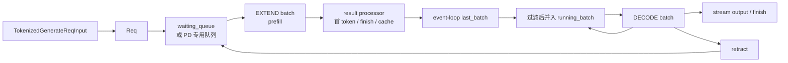

# Scheduler · 学习检查

## 读者能做什么

- [ ] 能把 Scheduler 讲成状态机，而不是“一个接请求的循环”。
- [ ] 能画出请求的 waiting/prefill/commit/running/decode 状态，并说明 `last_batch`、`cur_batch` 是事件循环批次引用，不是请求状态。
- [ ] 能沿 `run_scheduler_process → dispatch_event_loop → recv_requests → process_input_requests → handle_generate_request → _add_request_to_queue → get_next_batch_to_run → run_batch → process_batch_result` 复述一条 generate 请求。
- [ ] 能解释为什么只有入口 rank 从 ZMQ 收包，其他 rank 通过 broadcast 或 PP P2P 获得同一批请求。
- [ ] 能解释 `PrefillAdder` 为什么不是简单 FIFO，而是一次资源准入。
- [ ] 能判断 KV 紧张时为什么触发 retract，而不是让 decode 继续跑到 OOM。
- [ ] 能区分 normal、default overlap、普通 PP、PD Prefill PP、PD Decode PP 的状态推进方式。
- [ ] 能区分 live batch、结果处理 snapshot、GPU result、FutureMap relay 和 `copy_done`。
- [ ] 能把“输出晚一拍”“请求迟迟不 prefill”“KV pool 满”“pause 后不 forward”分别落到源码入口和验证方法。

## 状态机复画

先不要看源码，画出下面这条线：



验收标准：

- 能说明 `last_batch` 为什么存在，以及为什么 forward 返回、结果提交、并入 running batch 是三个不同时间点。
- 能说明 `running_batch` 为什么每轮 decode 前要重新过滤和检查 KV。
- 能说明 `cur_batch` 只是本轮要 launch 的 batch，不等于所有正在服务的请求。
- 能说明 overlap 下 `result_queue` 会让“forward 完成”和“结果处理完成”分离。

## 主线定位练习

1. 找到进程启动和事件循环分派。

目标：确认 Scheduler 是独立子进程，初始化成功后通过 pipe 回报父进程，再进入事件循环；事件循环会根据 PD、PP、MLX overlap、默认 overlap、normal 分派。

证据入口：

```python
# 定位：python/sglang/srt/managers/scheduler.py L4252-L4311（压缩调用链）
scheduler = Scheduler(...)
pipe_writer.send(scheduler.get_init_info())
scheduler.run_event_loop()
```

```python
# 定位：python/sglang/srt/managers/scheduler.py L4164-L4192（保留关键分支）
def dispatch_event_loop(scheduler: "Scheduler"):
    ...
    elif server_args.pp_size > 1:
        scheduler.event_loop_pp()
    elif scheduler.enable_overlap:
        scheduler.event_loop_overlap()
    else:
        scheduler.event_loop_normal()
```

2. 找到收包和 rank 同步。

目标：指出谁读 ZMQ，谁只拿同步后的 pyobj，以及为什么这样能避免重复消费请求。

证据入口：

```python
# 定位：python/sglang/srt/managers/scheduler_components/request_receiver.py L72-L99
recv_reqs = self._pull_raw_reqs()
recv_reqs = self._broadcast_reqs_across_ranks(recv_reqs)
```

```python
# 定位：python/sglang/srt/managers/scheduler_components/request_receiver.py L101-L141（压缩入口条件）
if self.ps.pp_rank == 0:
    if self.ps.attn_tp_rank == 0 and self.ps.attn_cp_rank == 0:
        recv_req = sock_recv(self.recv_from_tokenizer, zmq.NOBLOCK)
```

3. 找到外部请求变成内部 `Req` 的位置。

目标：说明 `TokenizedGenerateReqInput` 不是直接参与调度；Scheduler 会先补齐 session、embedding、sampling、bootstrap 等状态，再构造 `Req`。

证据入口：

```python
# 定位：python/sglang/srt/managers/io_struct.py L777-L830（字段索引）
class TokenizedGenerateReqInput(BaseReq, kw_only=True):
    input_ids: Optional[array]
    sampling_params: SamplingParams
    stream: bool
    bootstrap_host: Optional[str] = None
```

```python
# 定位：python/sglang/srt/managers/scheduler.py L2022-L2135（构造参数索引）
req = Req(
    recv_req.rid,
    recv_req.input_text,
    recv_req.input_ids,
    recv_req.sampling_params,
    ...
)
```

4. 找到入队分流。

目标：说明普通 serving、PD prefill、PD decode 为什么不是同一个队列。

证据入口：

```python
# 定位：python/sglang/srt/managers/scheduler.py L2288-L2310（队列分支摘要）
if self.disaggregation_mode == DisaggregationMode.NULL:
    self.waiting_queue.append(req)
elif self.disaggregation_mode == DisaggregationMode.PREFILL:
    self.disagg_prefill_bootstrap_queue.add(req, ...)
elif self.disaggregation_mode == DisaggregationMode.DECODE:
    self.disagg_decode_prealloc_queue.add(req, is_retracted=is_retracted)
```

5. 找到每轮如何选 batch。

目标：按顺序说出三件事：合并上轮 prefill、尝试新 prefill、没有 prefill 时推进 decode。

证据入口：

```python
# 定位：python/sglang/srt/managers/scheduler.py L2586-L2714（选择顺序摘要）
if self.last_batch and self.last_batch.forward_mode.is_extend():
    self.running_batch.merge_batch(self.last_batch)

new_batch = self.get_new_batch_prefill()
if new_batch is not None:
    ret = new_batch
else:
    self.running_batch = self.update_running_batch(self.running_batch)
```

6. 找到 prefill 准入。

目标：指出 `PrefillAdder` 使用哪些资源约束，为什么 waiting queue 里的请求可能本轮不进入 prefill。

证据入口：

```python
# 定位：python/sglang/srt/managers/scheduler.py L2804-L2879（构造参数索引）
adder = PrefillAdder(
    self.page_size,
    self.tree_cache,
    self.token_to_kv_pool_allocator,
    self.running_batch,
    self.new_token_ratio_tracker.current,
    self.max_prefill_tokens,
    ...
)
```

```python
# 定位：python/sglang/srt/managers/scheduler.py L2884-L2965（组批摘要）
can_run_list: List[Req] = adder.can_run_list
self.waiting_queue = [x for x in self.waiting_queue if x not in can_run_set]
new_batch = ScheduleBatch.init_new(...)
new_batch.prepare_for_extend()
```

7. 找到 decode 前的 KV 保护。

目标：说明 retract 释放了什么、请求如何回队列、为什么这是延迟和稳定性的折中。

证据入口：

```python
# 定位：python/sglang/srt/managers/scheduler.py L3026-L3114（retract 摘要）
if kv_full_retract_flag := not batch.check_decode_mem():
    retracted_reqs, new_token_ratio, reqs_to_abort = batch.retract_decode(
        self.server_args
    )
    for req in retracted_reqs:
        self._add_request_to_queue(req, is_retracted=True)
```

8. 找到 forward 和结果处理边界。

目标：说明 `run_batch` 只负责把 `ScheduleBatch` 交给 worker 并处理 stream/FutureMap，真正更新请求输出在 result processor。

证据入口：

```python
# 定位：python/sglang/srt/managers/scheduler.py L3176-L3295（worker 调用入口）
batch_result = self.model_worker.forward_batch_generation(batch, **fwd_kwargs)
```

```python
# 定位：python/sglang/srt/managers/scheduler.py L3434-L3464（mode 分发表）
if batch.forward_mode.is_decode():
    self.batch_result_processor.process_batch_result_decode(batch, result)
elif batch.forward_mode.is_extend():
    self.batch_result_processor.process_batch_result_prefill(batch, result)
```

```python
# 定位：python/sglang/srt/managers/scheduler_components/batch_result_processor.py L629-L722（提交顺序摘要）
if result.copy_done is not None:
    result.copy_done.synchronize()
...
req.output_ids.extend(next_token_id)
req.update_finish_state(new_accept_len)
self.output_streamer.stream_output(batch.reqs, batch.return_logprob)
```

## 静态排障演练

给自己四个症状，先判断源码入口，再决定怎么验证。

| 症状 | 优先入口 | 你应该看到什么 |
|------|----------|----------------|
| 默认模式输出晚一拍 | `event_loop_overlap`、`result_queue` | 当前 batch forward 和上一轮 result processing 分离 |
| ZMQ 已收包但请求不 prefill | `PrefillAdder`、`get_new_batch_prefill` | token/KV/LoRA/priority/HiCache/chunked prefill 任一条件可能阻塞准入 |
| 日志出现 KV pool full | `update_running_batch`、`retract_decode` | 部分请求释放 KV 后带 `is_retracted=True` 回队列 |
| pause 后仍收请求但不 forward | `pause_generation`、event loop paused check | `process_input_requests` 仍运行，`get_next_batch_to_run` 被跳过 |

## 可执行验证

在能启动 SGLang serving 的环境中，先用 normal loop 建立基线：

```powershell
python -m sglang.launch_server --model-path <model> --disable-overlap-schedule
```

预期现象：

- `event_loop_normal` 中收包、调度、forward、结果处理严格串行。
- 日志和状态更容易对应到单轮 batch。

再启动默认路径：

```powershell
python -m sglang.launch_server --model-path <model>
```

预期现象：

- 单 PP CUDA 路径默认进入 overlap。
- 高并发下 CPU 结果处理和 GPU forward 有重叠。
- 排查状态时要同时看 `cur_batch`、`last_batch` 和 `result_queue`。

做一次 KV 压力验证：

```powershell
# 使用较小 max-running-requests 或 max-total-tokens，再发起并发长输出请求
rg -n "Retract requests|KV cache pool is full" logs
```

预期现象：

- KV 紧张时服务应出现 retract 相关日志，而不是直接整批 OOM。
- 若 retract 高频出现，回头检查最大并发、最大输出长度、KV cache 预算和 prefix cache 命中。

## 复述练习

用三分钟讲清楚：

> 一个 tokenized generate 请求进入 Scheduler 后，为什么它先变成 `Req`，为什么可能进入不同队列，什么时候变成 EXTEND batch，result processor 提交了哪些状态，EXTEND batch 何时并入 `running_batch`，decode 前如何检查 KV，overlap 中五类对象如何对应，最后为何可能经 Detokenizer 或直接回 TokenizerManager？

能讲完这段，再进入 [[SGLang-KV-Cache]] 或 [[SGLang-ModelRunner]]。
