# Scheduler · 数据流

## 读者任务

这一篇只看对象怎么跨边界移动：跨进程的 ZMQ 请求、跨 rank 的 broadcast/P2P、Scheduler 内部的 `Req/ScheduleBatch`、跨 CUDA stream 的 forward result、PP stage 间的 proxy tensor。

## 总数据流

```mermaid
flowchart LR
    HTTP["HTTP/gRPC"] --> TM["TokenizerManager<br/>tokenize"]
    TM -->|"TokenizedGenerateReqInput"| ZMQ["ZMQ / RPC socket"]
    ZMQ --> RR["SchedulerRequestReceiver<br/>入口 rank 拉取"]
    RR --> BCast["TP/CP broadcast<br/>PP P2P"]
    BCast --> SCH["Scheduler<br/>Req + batch 状态机"]
    SCH --> MW["TpWorker / ModelRunner<br/>GPU forward"]
    MW --> BR["GenerationBatchResult"]
    BR --> PROC["BatchResultProcessor<br/>更新 Req"]
    PROC --> OUT["OutputStreamer<br/>生成通常到 Detokenizer<br/>skip/control 可直达 TokenizerManager"]
```



Scheduler 的交互边界不是一条线，而是四层边界叠在一起：进程边界、rank 边界、batch 状态边界、CUDA stream 边界。

## 对象 1：跨进程输入是 `TokenizedGenerateReqInput`

TokenizerManager 发给 Scheduler 的不是 HTTP JSON，而是已经 tokenize 后的结构体。它携带 token ids、sampling 参数、stream/logprob、session、LoRA、disaggregation bootstrap、多模态包装等字段。

```python
# 定位骨架（非逐行摘录）：来源 python/sglang/srt/managers/io_struct.py L777-L830
class TokenizedGenerateReqInput(BaseReq, kw_only=True):
    input_text: Optional[Union[str, List[Union[str, List[str]]]]]
    # The input token ids
    input_ids: Optional[array]  # Optional[array[int]]
    # The input embeds
    input_embeds: Optional[List[List[float]]]
    # The multimodal inputs
    mm_inputs: Optional[PickleWrapper]  # Pickled Optional[MultimodalProcessorOutput]
    token_type_ids: Optional[List[int]]
    # The sampling parameters
    sampling_params: SamplingParams
    # Whether to return the logprobs
    return_logprob: bool
    # Whether to stream output
    stream: bool
    ...
    # For disaggregated inference
    bootstrap_host: Optional[str] = None
    bootstrap_port: Optional[int] = None
    bootstrap_room: Optional[int] = None
```

数据含义：

- `input_ids` 是 Scheduler admission 的长度基础。
- `sampling_params` 会进入 `Req`，影响 stop、grammar、max new tokens 等。
- `bootstrap_*` 字段只在 disaggregation 下有意义，缺失会被 Scheduler 拒绝。
- `mm_inputs` 的 wrapper 让 opaque 载荷可跨 IPC；若使用 SHM feature，广播阶段只传播 pointer metadata，必要时在承载广播的 CPU group barrier，随后各 rank 才物化并解除共享内存生命周期。这里的核心是序列化与跨 rank 所有权，不是泛化的“延迟处理”。

## 对象 2：入口 rank 拉取，其他 rank 同步

`SchedulerRequestReceiver.recv_requests()` 是外部输入进入 Scheduler 的真实边界。它先从入口 rank 拉取 raw requests，再过 input blocker、broadcast、pickle unwrap、多模态 receiver 和 shared memory feature 收尾。

```python
# 来源：python/sglang/srt/managers/scheduler_components/request_receiver.py L73-L99
def recv_requests(
    self,
) -> List[Union[TokenizedGenerateReqInput, TokenizedEmbeddingReqInput, Any]]:
    """Receive results at tp_rank = 0 and broadcast it to all other TP ranks."""

    if self.scripted_scheduler_hook is not None:
        self.scripted_scheduler_hook.step()

    if self.recv_skipper is not None:
        if not self.recv_skipper.handle(self.get_last_forward_mode()):
            return []

    recv_reqs = self._pull_raw_reqs()

    if self.input_blocker is not None:
        recv_reqs = self.input_blocker.handle(recv_reqs)

    recv_reqs = self._broadcast_reqs_across_ranks(recv_reqs)

    if self.ps.pp_rank == 0:
        self.unwrap_pickle_wrapper(recv_reqs)

    recv_reqs = self._apply_mm_receiver(recv_reqs)

    self._finalize_shm_features(recv_reqs)

    return recv_reqs
```

入口 rank 的拉取规则：

```python
# 定位：python/sglang/srt/managers/scheduler_components/request_receiver.py L101-L139（跨 stage 摘要）
def _pull_raw_reqs(self) -> Optional[List]:
    if self.ps.pp_rank == 0:
        if self.ps.attn_tp_rank == 0 and self.ps.attn_cp_rank == 0:
            recv_reqs = []

            while True:
                try:
                    if self.recv_limit_reached(len(recv_reqs)):
                        break
                    recv_req = sock_recv(self.recv_from_tokenizer, zmq.NOBLOCK)
                except zmq.ZMQError:
                    break
                recv_reqs.append(recv_req)
            ...
        else:
            recv_reqs = None
    else:
        if self.ps.attn_tp_rank == 0 and self.ps.attn_cp_rank == 0:
            recv_reqs = point_to_point_pyobj(...)
        else:
            recv_reqs = None
    return recv_reqs
```

数据含义：

- `pp_rank==0 && attn_tp_rank==0 && attn_cp_rank==0` 是 ZMQ 消费入口。
- DP attention 下，work/control 请求可能分开 broadcast，减少全局同步。
- PP 非 0 stage 通过上一 stage 的 P2P pyobj 获取请求。

## 对象 3：控制面和数据面共用入口，但不同生命周期

`process_input_requests()` 对每个收到的对象调用 dispatcher。数据面 generate/embedding 通常进入队列；控制面 flush、abort、pause、权重更新等可能立即产生 output。

```python
# 来源：python/sglang/srt/managers/scheduler.py L1652-L1675
def process_input_requests(self, recv_reqs: List):
    now = time.monotonic()
    self.session_controller.maybe_reap(now)
    for recv_req in recv_reqs:
        # Skip health check when server is busy — ongoing requests already carry health info.
        if is_health_check_generate_req(recv_req) and not self.is_fully_idle(
            for_health_check=True
        ):
            self.return_health_check_ipcs.append(
                getattr(recv_req, "http_worker_ipc", None)
            )
            continue

        output = self._request_dispatcher(recv_req)
        if output is not None:
            if not isinstance(output, RpcReqOutput):
                self.ipc_channels.send_to_tokenizer.send_output(output, recv_req)
            else:
                if self.ipc_channels.recv_from_rpc is not None:
                    sock_send(self.ipc_channels.recv_from_rpc, output)

    self.flush_wrapper.check_pending()
    if self.external_corpus_manager is not None:
        self.external_corpus_manager.check_pending_load()
```

边界规则：

- 数据面请求被转成 `Req` 后进入 Scheduler 状态机。
- 控制面请求应该尽快完成，不能长期阻塞事件循环。
- health check 在 busy 时延迟返回信号，避免插入重调度主路径。

## 对象 4：`Req` 在 waiting/running 间迁移

普通模式下，`_add_request_to_queue()` 把 `Req` 放入 `waiting_queue`。Prefill 准入后，`ScheduleBatch.init_new()` 把它变成 EXTEND batch；forward 结束后，下一轮 `get_next_batch_to_run()` 把 last prefill batch merge 到 `running_batch`。

```python
# 来源：python/sglang/srt/managers/scheduler.py L2288-L2304
def _add_request_to_queue(self, req: Req, is_retracted: bool = False):
    if not self._set_or_validate_priority(req):
        return
    if self.disaggregation_mode == DisaggregationMode.NULL:
        if self._abort_on_queued_limit(req):
            return
        self._prefetch_kvcache(req)
        self.waiting_queue.append(req)
        req.time_stats.set_wait_queue_entry_time()
    elif self.disaggregation_mode == DisaggregationMode.PREFILL:
        self._prefetch_kvcache(req)
        self.disagg_prefill_bootstrap_queue.add(
            req, self.model_config.num_key_value_heads
        )
        req.time_stats.set_prefill_bootstrap_queue_entry_time()
    elif self.disaggregation_mode == DisaggregationMode.DECODE:
        self.disagg_decode_prealloc_queue.add(req, is_retracted=is_retracted)
```

`ScheduleBatch` 构造：

```python
# 定位骨架（非逐行摘录）：来源 python/sglang/srt/managers/scheduler.py L2912-L2957
can_run_list: List[Req] = adder.can_run_list
if len(can_run_list) == 0:
    return None

can_run_set = set(can_run_list)
self.waiting_queue = [x for x in self.waiting_queue if x not in can_run_set]
...
new_batch = ScheduleBatch.init_new(
    can_run_list,
    self.req_to_token_pool,
    self.token_to_kv_pool_allocator,
    self.tree_cache,
    self.model_config,
    self.enable_overlap,
    self.spec_algorithm,
    chunked_req=self.chunked_req,
)
...
new_batch.prepare_for_extend()
```

数据含义：

- `waiting_queue` 删除的是本轮真正准入的请求集合，不一定是队首连续一段。
- `ScheduleBatch` 绑定 req pool、KV allocator、tree cache 和 speculative 配置，已经是 GPU forward 的准备对象。
- `running_batch` 不是新请求队列，而是已经有 KV 状态、可进入 decode 的请求集合。

## 对象 5：GPU forward 的结果跨 stream 返回

在 overlap generation 路径中，Scheduler 在 `forward_stream` 上调用 worker，在 `copy_stream` 上把结果拷到 CPU。结果处理前，processor 会同步 `copy_done`。

```python
# 定位骨架（非逐行摘录）：来源 python/sglang/srt/managers/scheduler.py L3204-L3286
if self.is_generation:
    if self.enable_overlap:
        self.future_map.resolve_seq_lens_cpu(batch)

        with self.forward_stream_ctx:
            self.forward_stream.wait_stream(self.schedule_stream)
            resolve_forward_inputs(batch, self.future_map)

            with self._forward_isolation(batch, overlap=True):
                future_indices = batch.req_pool_indices
                ...
                batch_result = self.model_worker.forward_batch_generation(
                    batch, **fwd_kwargs
                )
                if batch.spec_algorithm.is_none():
                    self.future_map.publish(future_indices, batch.seq_lens + 1)
                ...
                batch_result.copy_done = self.device_module.Event()
                if batch_result.delay_sample_func is None:
                    self._relay_forward_payload(future_indices, batch_result)
                    self.copy_stream.wait_stream(self.forward_stream)
                    with self.copy_stream_ctx:
                        batch_result.copy_to_cpu(
                            return_logprob=batch.return_logprob,
                            return_hidden_states=batch.return_hidden_states,
                        )

        # Next-iter input_ids relayed via future_map.
        batch.input_ids = None
```

结果分发：

```python
# 来源：python/sglang/srt/managers/scheduler.py L3434-L3453
def process_batch_result(
    self,
    batch: ScheduleBatch,
    result: Union[GenerationBatchResult, EmbeddingBatchResult],
):
    self.publish_load_snapshot(force=batch.forward_mode.is_extend())

    if batch.forward_mode.is_decode():
        self.batch_result_processor.process_batch_result_decode(batch, result)
    elif batch.forward_mode.is_extend():
        if batch.is_dllm():
            self.process_batch_result_dllm(batch, result)
        elif self.disaggregation_mode == DisaggregationMode.PREFILL:
            self.process_batch_result_disagg_prefill(batch, result)
        else:
            self.batch_result_processor.process_batch_result_prefill(batch, result)
    elif batch.forward_mode.is_prebuilt():
        self.batch_result_processor.process_batch_result_prebuilt(batch)
    elif batch.forward_mode.is_idle():
        self.batch_result_processor.process_batch_result_idle(batch, result)
```

数据含义：

- `batch_result.copy_done` 是 CPU 读结果的边界。
- `forward_mode` 决定后处理路径。
- overlap 下 `batch.copy()` 被放入 `result_queue`。它只保存 `process_batch_result` 需要的字段并浅拷贝请求列表外壳；live `last_batch` 仍供下一轮 merge/filter，FutureMap 保存下一轮 forward payload，三者不能互换。

## 对象 6：decode result 更新 `Req` 并输出

decode processor 把 worker 返回的 token 归一化成 per-request list，追加到 `req.output_ids`，更新 finish state，再通过 streamer 输出。

```python
# 定位骨架（非逐行摘录）：来源 python/sglang/srt/managers/scheduler_components/batch_result_processor.py L629-L722
def process_batch_result_decode(
    self,
    batch: ScheduleBatch,
    result: GenerationBatchResult,
):
    if result.copy_done is not None:
        result.copy_done.synchronize()
    ...
    next_token_ids, next_token_logprobs = self._normalize_decode_outputs(
        batch=batch,
        result=result,
        logits_output=logits_output,
        next_token_ids=next_token_ids,
    )

    self.metrics_reporter.num_generated_tokens += len(batch.reqs)
    self.token_to_kv_pool_allocator.free_group_begin()

    for i, req in enumerate(batch.reqs):
        if (self.enable_overlap or self.enable_overlap_mlx) and (
            req.finished() or req.is_retracted
        ):
            continue

        next_token_id = next_token_ids[i]
        req.output_ids.extend(next_token_id)
        new_accept_len = len(next_token_id)
        req.time_stats.set_last_decode_finish_time()
        req.update_finish_state(new_accept_len)
        self._handle_finish_state_updated_req(req, batch, result, i, logits_output)
        ...

    self.output_streamer.stream_output(batch.reqs, batch.return_logprob)
    self.token_to_kv_pool_allocator.free_group_end()
```

失败边界：

- 如果 copy 未完成就读 CPU 结果，会读到未同步数据。
- overlap 下 finished/retracted 请求可能已被其他路径处理，processor 必须跳过。
- 输出流和 KV 释放要在同一批处理边界内完成，避免已完成请求继续占用资源。

## 对象 7：PP 有 typed request/proxy/output 流和三套事件循环

PP loop 每个 stage 维护 `mbs/last_mbs/running_mbs/mb_metadata` 槽位。pyobj request 只由 attention TP/CP leader 做 stage P2P 后再组内 broadcast；tensor dict 用 `proxy` / `output` 类型标签解复用，错序到达的消息进入 inbox。XPU 等可能阻塞的 backend 还按 PP rank 奇偶安排 send/recv 次序，避免所有 rank 先 send 形成环形死锁。

```python
# 定位：python/sglang/srt/managers/scheduler_pp_mixin.py L67-L168（PP 循环骨架）
def event_loop_pp(self: Scheduler):
    """
    A scheduler loop for pipeline parallelism.
    Notes:
    1. Each stage runs in the same order and is notified by the previous stage.
    2. We use async send but sync recv to avoid desynchronization while minimizing the communication overhead.
    3. We can use async batch depth to buffer the outputs in the last stage for to allow overlapping the GPU computation and CPU processing and avoid last PP rank staggler.
    """
    self.init_pp_loop_state()
    while True:
        server_is_idle = True
        for mb_id in range(self.pp_loop_size):
            self.running_batch = self.running_mbs[mb_id]
            self.last_batch = self.last_mbs[mb_id]
            recv_reqs = self.request_receiver.recv_requests()
            self.process_input_requests(recv_reqs)
            if not self.pp_group.is_last_rank:
                self._pp_commit_comm_work(self.send_req_work)
                self.send_req_work = self._pp_send_pyobj_to_next_stage(
                    recv_reqs,
                    async_send=True,
                )
            self.mbs[mb_id] = self.get_next_batch_to_run()
            self.running_mbs[mb_id] = self.running_batch
            self.cur_batch: Optional[ScheduleBatch] = self.mbs[mb_id]
            if self.cur_batch:
                server_is_idle = False
                pp_proxy_tensors = self._pp_recv_proxy_tensors()
            ...
            if self.cur_batch:
                result, self.launch_event = self._pp_launch_batch(...)
            ...
            if self.mbs[next_mb_id] is not None:
                d2h_event.synchronize()
                self._pp_process_batch_result(
                    self.mbs[next_mb_id],
                    next_batch_result,
                )
```

PP 的可跳过输出优化默认还受环境开关门控，只允许单请求、纯 chunked prefill 中间 chunk且无 logprob 时，用 placeholder result 维持结果处理契约。PD PP 则另有 bootstrap/retract/prealloc/transfer/release 的跨 stage 集合交并与回环。

```python
# 来源：python/sglang/srt/managers/scheduler_pp_mixin.py L49-L58
def _pp_can_skip_output_comm(batch: ScheduleBatch) -> bool:
    """Check if output send/recv can be skipped for this batch."""
    return (
        envs.SGLANG_PP_SKIP_PURE_CHUNKED_OUTPUT_COMM.get()
        and batch is not None
        and batch.forward_mode == ForwardMode.EXTEND
        and len(batch.reqs) == 1
        and not batch.contains_last_prefill_chunk
        and not batch.return_logprob
    )
```

## 数据流排障索引

| 现象 | 首看对象 | 源码入口 |
|------|----------|----------|
| 只有 rank0 有请求，其他 rank 不动 | broadcast/P2P | `SchedulerRequestReceiver.recv_requests` |
| 请求已经到达但没有进入 GPU | `waiting_queue` / PrefillAdder | `_add_request_to_queue`、`get_new_batch_prefill` |
| forward 已结束但输出慢一拍 | `result_queue` / `copy_done` | `event_loop_overlap`、`process_batch_result_decode` |
| PP 模式和 overlap 行为不同 | microbatch / proxy | `event_loop_pp` |
| KV 满后请求又回到队列 | retracted `Req` | `update_running_batch` |

## 复盘

Scheduler 的数据流有两个“回环”：prefill 完成后进入 `running_batch`，decode KV 不足时又可能回到入队路径。理解这两个回环，比背所有组件名更重要。
