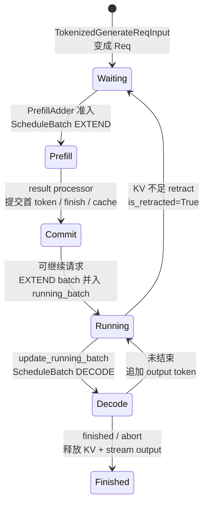

# Scheduler · 核心概念

## 读者任务

这一篇先不追 4000 行源码细节，只建立 Scheduler 的状态机。读完后，你应该能看懂三个问题：

- 为什么 Scheduler 必须同时维护 `waiting_queue`、`running_batch`、`cur_batch`、`last_batch`。
- 为什么 prefill 和 decode 是两种不同资源问题。
- 为什么默认 overlap 会让“当前 forward”和“上一轮结果处理”错开一拍。

## 心理模型：请求状态与批次提交不是同一条线



这张状态图比“函数列表”更重要。`last_batch` 不是一个请求状态，而是事件循环保存的上一轮批次引用；overlap 的 `result_queue` 又保存受限 `batch.copy()` 与 GPU result。Scheduler 每轮同时回答：哪些请求可准入、哪个 batch 可执行、上一轮结果能否提交、KV 是否足够、跨 stream/rank 通信是否已经完成。

## Scheduler 是 GPU 子进程里的资源仲裁器

`Scheduler` 类通过 mixin 组合不同运行模式，但主类承担同一个核心职责：管理 tensor parallel GPU worker 的调度。

```python
# 来源：python/sglang/srt/managers/scheduler.py L298-L306
class Scheduler(
    SchedulerDisaggregationDecodeMixin,
    SchedulerDisaggregationPrefillMixin,
    SchedulerMultiplexMixin,
    SchedulerPPMixin,
    SchedulerDllmMixin,
    SchedulerMlxOverlapMixin,
):
    """A scheduler that manages a tensor parallel GPU worker."""
```

它不做 HTTP 接入，也不做 detokenize；它接收已经 tokenize 的内部请求，构造 `Req`，维护 batch 生命周期，调用 `model_worker.forward_batch_generation`，再把结果交给输出组件。

## 四个核心状态变量

Scheduler 的 continuous batching 不是单队列模型。源码在 `init_running_status` 中初始化核心状态：

```python
# 定位骨架（非逐行摘录）：来源 python/sglang/srt/managers/scheduler.py L965-L984
def init_running_status(self):
    self.gracefully_exit = False
    self.waiting_queue: List[Req] = []
    # The running decoding batch for continuous batching
    self.running_batch: ScheduleBatch = ScheduleBatch(reqs=[], batch_is_full=False)
    # The current forward batch
    self.cur_batch: Optional[ScheduleBatch] = None
    # The last forward batch
    self.last_batch: Optional[ScheduleBatch] = None
    self.forward_ct = 0
    self.return_health_check_ipcs: Deque[Optional[str]] = deque()
    self.flush_wrapper = SchedulerFlushWrapper(
        flush_cache=self.flush_cache,
        is_fully_idle=self.is_fully_idle,
        ipc_channels=self.ipc_channels,
    )
    self.session_controller = SessionController(self.tree_cache)
    self.forward_sleep_time = None
    self._engine_paused = False
```

读这几个变量时按生命周期理解：

- `waiting_queue`：还没 prefill 的请求。它们等待 token budget、KV slot、priority、LoRA、HiCache prefetch 等条件。
- `running_batch`：已经 prefill、正在 decode 的请求集合。每轮 decode 前会过滤 finished、检查 KV、可能 retract。
- `cur_batch`：本轮要送进 GPU forward 的 `ScheduleBatch`，可能是 EXTEND，也可能是 DECODE。
- `last_batch`：上一轮 forward 的 batch。normal loop 里它只是记录；overlap loop 里它决定何时处理上一轮结果并 merge 到 `running_batch`。

## Prefill 和 decode 是两类资源问题

`get_next_batch_to_run()` 每轮先处理历史状态，再决定本轮 forward。它先把上一轮 prefill merge 进 `running_batch`，再尝试构造新 prefill batch；只有没有新 prefill 时，才推进 running decode。

```python
# 定位骨架（非逐行摘录）：来源 python/sglang/srt/managers/scheduler.py L2586-L2714
def get_next_batch_to_run(self) -> Optional[ScheduleBatch]:
    self.process_pending_chunked_abort()
    self._abort_on_waiting_timeout()
    self._abort_on_running_timeout()

    if (
        not self.enable_hisparse
        and self.last_batch
        and self.last_batch.forward_mode.is_extend()
    ):
        self.last_batch.filter_batch(
            chunked_req_to_exclude=list(chunked_req_to_exclude)
        )
        if not self.last_batch.is_empty():
            if self.running_batch.is_empty():
                self.running_batch = self.last_batch
            else:
                self.running_batch.merge_batch(self.last_batch)

    new_batch = self.get_new_batch_prefill()

    if new_batch is not None:
        # Run prefill first if possible
        ret = new_batch
    else:
        # Run decode (skip for prefill-only batches)
        if (
            not self.running_batch.is_empty()
            and not self.running_batch.is_prefill_only
        ):
            self.running_batch = self.update_running_batch(self.running_batch)
            ret = self.running_batch if not self.running_batch.is_empty() else None
        else:
            ret = None

    if ret:
        set_schedule_time_batch(ret)
    return ret
```

源码能证明的是“若 `get_new_batch_prefill()` 返回非空 batch，本轮选择它；否则推进 decode”，不能仅凭这段代码归因于某个单一性能目标。真正是否产生新 prefill，受 `PrefillAdder`、token/KV 预算、batch-full、prefill delayer、LoRA、HiCache 和优先级共同约束；连续 prefill 是否允许 overlap 还受独立环境开关控制。

## PrefillAdder 是准入控制，不只是队列弹出

当 Scheduler 尝试新 prefill，它不是直接从 `waiting_queue` pop 请求，而是构造 `PrefillAdder`，结合 page size、prefix cache、KV allocator、running batch、新 token ratio、max prefill token、chunked prefill、priority 等约束逐个尝试。

```python
# 定位骨架（非逐行摘录）：来源 python/sglang/srt/managers/scheduler.py L2804-L2879
adder = PrefillAdder(
    self.page_size,
    self.tree_cache,
    self.token_to_kv_pool_allocator,
    self.running_batch,
    self.new_token_ratio_tracker.current,
    self.max_prefill_tokens,
    chunked_prefill_size,
    running_bs if self.is_mixed_chunk else 0,
    self.priority_scheduling_preemption_threshold,
    max_prefill_bs=self.max_prefill_bs,
    max_running_requests=self.max_running_requests,
    prefill_max_requests=self.server_args.prefill_max_requests,
    prefill_delayer_single_pass=prefill_delayer_single_pass,
    dllm_config=self.dllm_config,
    waiting_queue_len=len(self.waiting_queue),
)

for req in self.waiting_queue:
    if self.enable_lora and not self._can_schedule_lora_req(req, running_loras):
        continue
    if len(adder.can_run_list) >= self.get_num_allocatable_reqs(running_bs):
        self.running_batch.batch_is_full = True
    if self.running_batch.batch_is_full:
        if (
            not self.enable_priority_preemption
            or not adder.preempt_to_schedule(req, self.server_args)
        ):
            break
    req.init_next_round_input(self.tree_cache)
    res = adder.add_one_req(
        req,
        has_chunked_req=(self.chunked_req is not None),
        truncation_align_size=self.truncation_align_size,
    )
```

心理模型：`waiting_queue` 只是候选池，`PrefillAdder` 才是本轮 admission controller。它决定哪些请求能进入 EXTEND batch，哪些因为 token/KV/LoRA/priority/chunk 约束继续等待。

## Decode 的危险边界是 KV 不足

Decode 每轮都可能需要新的 KV slot。`update_running_batch()` 先过滤已完成请求，再检查 decode memory；不足时调用 `retract_decode`，把一部分请求撤回并重新入队。

```python
# 定位骨架（非逐行摘录）：来源 python/sglang/srt/managers/scheduler.py L3026-L3114
def update_running_batch(self, batch: ScheduleBatch) -> Optional[ScheduleBatch]:
    initial_bs = batch.batch_size()

    batch.filter_batch()
    if batch.is_empty():
        batch.batch_is_full = False
        return batch

    # Check if decode out of memory
    if (kv_full_retract_flag := not batch.check_decode_mem()) or (
        TEST_RETRACT and self.forward_ct % TEST_RETRACT_INTERVAL == 0
    ):
        old_available_tokens = self.token_to_kv_pool_allocator.available_size()
        old_ratio = self.new_token_ratio_tracker.current
        retracted_reqs, new_token_ratio, reqs_to_abort = batch.retract_decode(
            self.server_args
        )
        new_available_tokens = self.token_to_kv_pool_allocator.available_size()
        new_token_gained = new_available_tokens - old_available_tokens
        self.metrics_reporter.num_retracted_reqs = len(retracted_reqs)
        self.new_token_ratio_tracker.current = new_token_ratio
        logger.warning(msg_prefix + msg_details)

        for req in retracted_reqs:
            self._add_request_to_queue(req, is_retracted=True)
    else:
        self.new_token_ratio_tracker.decay_step()

    if batch.is_empty():
        return batch

    # Update batch tensors
    batch.prepare_for_decode()
    return batch
```

Retract 是 Scheduler 把 OOM 变成可恢复分支的方式：牺牲被撤回请求的延迟，换取服务不整批失败。排障时看到 retract 日志，要同时看 KV pool、`max_running_requests`、prefix 命中、长输出请求和 `new_token_ratio`。

## Overlap 是两拍流水线

normal loop 是最容易理解的串行路径：收请求、组 batch、forward、立刻处理结果。

```python
# 定位骨架（非逐行摘录）：来源 python/sglang/srt/managers/scheduler.py L1521-L1548
def event_loop_normal(self):
    """A normal scheduler loop."""
    while True:
        if self.gracefully_exit:
            break
        recv_reqs = self.request_receiver.recv_requests()
        self.process_input_requests(recv_reqs)
        if self._engine_paused:
            continue

        batch = self.get_next_batch_to_run()
        self.cur_batch = batch

        if batch:
            result = self.run_batch(batch)
            self.process_batch_result(batch, result)
        else:
            self.on_idle()

        self.last_batch = batch
```

overlap loop 则把“当前 batch 的 GPU forward”和“上一轮 batch 的 CPU result processing”错开。`result_queue` 存上一轮结果，`last_batch` 指向上一轮 batch；某些场景会强制同步处理。

```python
# 定位骨架（非逐行摘录）：来源 python/sglang/srt/managers/scheduler.py L1551-L1613
def event_loop_overlap(self):
    """A scheduler loop that overlaps the CPU processing and GPU computation."""
    self.result_queue: Deque[
        Tuple[ScheduleBatch, Union[GenerationBatchResult, EmbeddingBatchResult]]
    ] = deque()

    def pop_and_process():
        tmp_batch, tmp_result = self.result_queue.popleft()
        self.process_batch_result(tmp_batch, tmp_result)

    while True:
        recv_reqs = self.request_receiver.recv_requests()
        self.process_input_requests(recv_reqs)
        if self._engine_paused:
            continue

        self._apply_war_barrier()
        batch = self.get_next_batch_to_run()
        self.cur_batch = batch
        disable_overlap_for_batch = self.is_disable_overlap_for_batch(batch)

        if disable_overlap_for_batch:
            pop_and_process()

        if batch:
            batch_result = self.run_batch(batch)
            self.result_queue.append((batch.copy(), batch_result))
        else:
            batch_result = None

        if self.last_batch:
            if not disable_overlap_for_batch:
                pop_and_process()
        elif batch is None:
            self.on_idle()

        if self.is_generation:
            self.launch_batch_sample_if_needed(batch_result)

        self.last_batch = batch
```

这就是为什么调试 race 或状态时，`--disable-overlap-schedule` 往往让问题更容易复现和定位：状态更新顺序重新变成串行。

## PP 是三套循环族，不是默认 overlap 的小变体

当 `pp_size > 1`，统一推理走 `event_loop_pp()`；PD Prefill 和 PD Decode 分别走额外的 PP 事件循环。除了 request/proxy/output 三条流，PD Prefill 还要跨 stage 对 bootstrap、transfer、release 达成共识，PD Decode 还要处理 retract、prealloc、transfer/release 共识。它们都不能套用默认 `result_queue` 两拍模型。

```python
# 来源：python/sglang/srt/managers/scheduler.py L4168-L4178
if disaggregation_mode == DisaggregationMode.NULL:
    if scheduler.enable_pdmux:
        scheduler.event_loop_pdmux()
    elif server_args.pp_size > 1:
        scheduler.event_loop_pp()
    elif scheduler.enable_overlap_mlx:
        scheduler.event_loop_overlap_mlx()
    elif scheduler.enable_overlap:
        scheduler.event_loop_overlap()
    else:
        scheduler.event_loop_normal()
```

所以读 PP 时不要把 `result_queue` 心理模型直接套过去。PP 需要单独看 [[SGLang-Scheduler-数据流]] 里的 microbatch 和 stage 通信。

## 运行验证

维护这篇时，先用一个命令确认 Scheduler 的核心状态机仍然是“收请求、选 batch、跑 batch、处理结果、按模式分派事件循环”：

```powershell
rg -n 'class Scheduler|def event_loop_normal|def event_loop_overlap|recv_requests|process_input_requests|def get_next_batch_to_run|class PrefillAdder|def run_batch|def process_batch_result|event_loop_pp|enable_overlap|pp_size|DisaggregationMode' sglang/python/sglang/srt/managers/scheduler.py
```

如果输出显示事件循环分派条件变了，优先重读本文最后两节：normal / overlap 的差异和 PP 独立事件循环。它们决定读者应该把一次调度轮次理解成串行状态机、CPU/GPU overlap，还是 pipeline microbatch 流。
