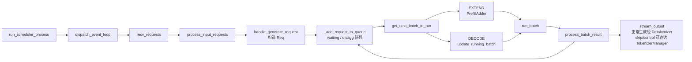

# Scheduler · 源码走读

## 读者任务

这一篇沿一条 generate 请求读 Scheduler：请求已经在 TokenizerManager 里完成 tokenize，通过 ZMQ 到达 Scheduler；Scheduler 把它变成内部 `Req`，放进 `waiting_queue`，组 prefill batch，forward 后合并到 `running_batch`，再一轮轮 decode，直到输出或 abort。

你读完后应该能定位：

- Scheduler 子进程如何启动并进入事件循环。
- 只有哪个 rank 从 ZMQ 拉请求，其他 rank 如何同步。
- `TokenizedGenerateReqInput` 如何变成 `Req` 并进入队列。
- `get_next_batch_to_run` 为什么先处理 last prefill，再尝试新 prefill，最后推进 decode。
- overlap 下为什么结果处理会慢一拍。
- KV 不足时为什么不是 OOM，而是 retract。

## 长文读法

这篇按 Scheduler 的状态机边界读：先看子进程如何启动，再看请求如何从 ZMQ 进入 `waiting_queue`，之后只围绕 `last_batch`、`running_batch`、KV pool 和 forward result 四个状态切换。排障时不需要完整重读十二步，先按症状跳到对应边界。

| 读者任务 | 先读 | 要抓住的判断 |
|----------|------|--------------|
| 第一次建立 Scheduler 主线 | 主线图、第一步到第五步 | Scheduler 接收的已经是 tokenized request，它的职责是资源仲裁和状态推进 |
| 请求没有进入 waiting queue | 第三步到第六步 | 只有入口 rank 拉 ZMQ，请求还会经过类型分发、session/disagg/grammar 等入队分支 |
| 首 token 慢或 prefill 堆积 | 第七步、第八步、运行验证 | `get_next_batch_to_run` 先消化上轮 prefill，再用 `PrefillAdder` 做本轮准入 |
| decode 过程中 KV 不足 | 第九步 | KV 不足优先 retract running request，把容量让给能继续推进的 batch |
| GPU forward 后输出没回来 | 第十步、第十一步 | `run_batch` 只把 batch 交给 worker，真正输出还要经过 mode-specific result processor |
| pipeline parallel 行为不一致 | 第十二步 | PP 有独立 microbatch loop，不等同于普通 overlap decode 主线 |

读完后要能画出一圈事件循环：收请求、入队、选 batch、forward、处理结果、再回到队列。只要能定位状态卡在这六个动作中的哪一个，后续排障就能落到具体源码入口。

## 主线图



读这条线时，不要把 Scheduler 当成单个函数，而要把它当成状态机：事件循环每转一圈，状态都会从 `waiting_queue`、`last_batch`、`running_batch`、KV pool 和控制请求里重新计算。

## 第一步：子进程启动后先握手，再进入事件循环

**系统压力：** SGLang 是多进程、多 rank serving。Scheduler 初始化失败时，父进程必须知道；初始化成功后，父进程也需要知道 GPU 侧可用资源和状态。

**设计选择：** `run_scheduler_process` 先加载插件、配置进程和 tracing，构造 `Scheduler`，通过 pipe 发送 `get_init_info()`，最后才进入阻塞的 `run_event_loop()`。

**源码证据：**

```python
# 定位骨架（非逐行摘录）：来源 python/sglang/srt/managers/scheduler.py L4252-L4311
def run_scheduler_process(
    server_args: ServerArgs,
    port_args: PortArgs,
    gpu_id: int,
    tp_rank: int,
    attn_cp_rank: int,
    moe_dp_rank: int,
    moe_ep_rank: int,
    pp_rank: int,
    dp_rank: Optional[int],
    pipe_writer,
):
    # Load plugins so hooks can override Scheduler and its dependencies.
    load_plugins()
    dp_rank = configure_scheduler_process(
        server_args,
        gpu_id,
        tp_rank,
        attn_cp_rank,
        moe_dp_rank,
        moe_ep_rank,
        pp_rank,
        dp_rank,
    )
    ...
    scheduler = Scheduler(
        server_args,
        port_args,
        gpu_id,
        tp_rank,
        moe_ep_rank,
        pp_rank,
        attn_cp_rank,
        moe_dp_rank,
        dp_rank,
    )

    # Send initialization info back to the parent process
    pipe_writer.send(scheduler.get_init_info())

    # Run the event loop (blocks until a ShutdownReq sets gracefully_exit)
    scheduler.run_event_loop()
```

**执行逻辑：**

- `load_plugins()` 必须在构造 Scheduler 前执行，因为插件可能覆盖 Scheduler 或依赖组件。
- `configure_scheduler_process()` 设置当前子进程的 rank、device、日志等运行环境。
- `pipe_writer.send(...)` 是父子进程握手。它必须发生在 blocking event loop 之前。
- `run_event_loop()` 进入后，Scheduler 由请求和控制消息驱动，直到 graceful shutdown。

**不变量与失败模式：**

- 如果握手之前进入事件循环，父进程无法判断 worker 是否初始化成功。
- 如果某个 rank 初始化失败但不通知父进程，其他 rank 可能卡在通信原语里。

## 第二步：`Scheduler.__init__` 装配资源图

**系统压力：** Scheduler 不是只创建几个队列。它必须拿到模型 worker、KV cache allocator、prefix tree、IPC socket、metrics、dispatcher、overlap stream、request receiver 等组件。顺序错了，后续状态机会访问未初始化资源。

**设计选择：** 构造函数按资源依赖顺序装配：先解析配置和并行状态，再建 IPC/tokenizer/model worker，再建 KV cache，最后初始化 running 状态、调度策略、disaggregation、overlap 和各类组件。

**源码证据：**

```python
# 定位：python/sglang/srt/managers/scheduler.py L298-L430（初始化顺序骨架）
class Scheduler(
    SchedulerDisaggregationDecodeMixin,
    SchedulerDisaggregationPrefillMixin,
    SchedulerMultiplexMixin,
    SchedulerPPMixin,
    SchedulerDllmMixin,
    SchedulerMlxOverlapMixin,
):
    """A scheduler that manages a tensor parallel GPU worker."""

    def __init__(
        self,
        server_args: ServerArgs,
        port_args: PortArgs,
        gpu_id: int,
        tp_rank: int,
        moe_ep_rank: int,
        pp_rank: int,
        attn_cp_rank: int,
        moe_dp_rank: int,
        dp_rank: Optional[int],
    ):
        self.is_initializing = True
        self.forward_ct: int = 0
        self.cur_batch: Optional[ScheduleBatch] = None
        self.init_soft_watchdog(server_args)
        ...
        self.enable_overlap = not server_args.disable_overlap_schedule and not use_mlx()
        self.enable_overlap_mlx = not server_args.disable_overlap_schedule and use_mlx()
        ...
        self.ps = ParallelState(...)
        self.init_model_config()
        self.init_metrics_collector(tp_rank, pp_rank, dp_rank)
        self.init_ipc_channels(port_args)
        self.init_idle_sleeper()
        ...
        maybe_revert_pr_fix()
        self.init_model_worker()
        ...
        result = kv_cache_builder.build_kv_cache(...)
```

**源码证据：**

```python
# 定位骨架（非逐行摘录）：来源 python/sglang/srt/managers/scheduler.py L427-L520
# Init cache and memory pool
result = kv_cache_builder.build_kv_cache(
    server_args=self.server_args,
    model_config=self.model_config,
    tp_worker=self.tp_worker,
    page_size=self.page_size,
    spec_algorithm=self.spec_algorithm,
    attn_tp_cpu_group=self.attn_tp_cpu_group,
    tp_cpu_group=self.tp_cpu_group,
    attn_cp_cpu_group=self.attn_cp_cpu_group,
    enable_metrics=self.server_args.enable_metrics,
    enable_kv_cache_events=bool(
        self.server_args.kv_events_config
        and self.ps.pp_rank == 0
        and self.ps.attn_tp_rank == 0
        and self.ps.attn_cp_rank == 0
    ),
    ps=self.ps,
    tp_group=self.tp_group,
    pp_group=self.pp_group,
    enable_hierarchical_cache=self.enable_hierarchical_cache,
)
self.req_to_token_pool = result.req_to_token_pool
self.token_to_kv_pool_allocator = result.token_to_kv_pool_allocator
self.tree_cache = result.tree_cache
...
# Init running status
self.init_running_status()
...
# Init schedule policy and new token estimation
self.init_schedule_policy()
...
# Init overlap schedule
self.init_overlap()
```

**执行逻辑：**

- `ParallelState` 把 TP/PP/DP/CP/EP rank 信息集中起来，后续 socket、broadcast、PP loop 都依赖它。
- KV cache builder 返回 `req_to_token_pool`、`token_to_kv_pool_allocator` 和 `tree_cache`，这些对象决定 prefill admission 和 decode retract。
- running status 和 schedule policy 必须在 cache allocator 之后，因为它们要引用这些资源。
- overlap 基础设施必须在 worker、device、pool 都可用后初始化。

**不变量与失败模式：**

- `init_model_worker()` 前不能构造依赖 worker stream 或 attention backend 的对象。
- `init_overlap()` 前必须已有 `req_to_token_pool`，否则 FutureMap 不能建立。
- `init_request_dispatcher()` 必须在 handler 依赖组件完成后注册。

## 第三步：只有入口 rank 拉 ZMQ，其余 rank 同步请求

**系统压力：** 如果每个 TP rank 都从 TokenizerManager 拉 ZMQ，同一请求可能被重复消费或乱序。另一方面，非入口 rank 也必须获得相同的请求和控制消息，才能同步 forward。

**设计选择：** `init_ipc_channels` 只有 `pp_rank==0 && attn_tp_rank==0 && attn_cp_rank==0` 的 rank 初始化外部 IPC；`SchedulerRequestReceiver` 在入口 rank 拉取，再通过 TP/CP broadcast 或 PP P2P 同步。

**源码证据：**

```python
# 来源：python/sglang/srt/managers/scheduler.py L605-L621
def init_ipc_channels(self, port_args: PortArgs):
    is_rank_zero = (
        self.ps.pp_rank == 0
        and self.ps.attn_tp_rank == 0
        and self.ps.attn_cp_rank == 0
    )
    self.ipc_channels = SchedulerIpcChannels.create(
        port_args=port_args,
        is_rank_zero=is_rank_zero,
        skip_tokenizer_init=self.server_args.skip_tokenizer_init,
        metrics_enabled=self.server_args.enable_metrics
        and (
            self.ps.attn_tp_rank == 0
            or self.server_args.enable_metrics_for_all_schedulers
        ),
        enable_scripted_runtime=envs.SGLANG_TEST_SCRIPTED_RUNTIME.get(),
    )
```

**源码证据：**

```python
# 定位骨架（非逐行摘录）：来源 python/sglang/srt/managers/scheduler_components/request_receiver.py L72-L99
def recv_requests(
    self,
) -> List[Union[TokenizedGenerateReqInput, TokenizedEmbeddingReqInput, Any]]:
    """Receive results at tp_rank = 0 and broadcast it to all other TP ranks."""

    if self.scripted_scheduler_hook is not None:
        self.scripted_scheduler_hook.step()

    if self.recv_skipper is not None:
        if not self.recv_skipper.handle(self.get_last_forward_mode()):
            return []

    recv_reqs = self._pull_raw_reqs()

    if self.input_blocker is not None:
        recv_reqs = self.input_blocker.handle(recv_reqs)

    recv_reqs = self._broadcast_reqs_across_ranks(recv_reqs)

    if self.ps.pp_rank == 0:
        self.unwrap_pickle_wrapper(recv_reqs)

    recv_reqs = self._apply_mm_receiver(recv_reqs)
    self._finalize_shm_features(recv_reqs)

    return recv_reqs
```

**源码证据：**

```python
# 定位：python/sglang/srt/managers/scheduler_components/request_receiver.py L101-L141（跨 stage 摘要）
def _pull_raw_reqs(self) -> Optional[List]:
    if self.ps.pp_rank == 0:
        if self.ps.attn_tp_rank == 0 and self.ps.attn_cp_rank == 0:
            recv_reqs = []

            while True:
                try:
                    if self.recv_limit_reached(len(recv_reqs)):
                        break
                    recv_req = sock_recv(self.recv_from_tokenizer, zmq.NOBLOCK)
                except zmq.ZMQError:
                    break
                recv_reqs.append(recv_req)

            while True:
                try:
                    if self.recv_limit_reached(len(recv_reqs)):
                        break
                    recv_rpc = sock_recv(self.recv_from_rpc, zmq.NOBLOCK)
                except zmq.ZMQError:
                    break
                recv_reqs.append(recv_rpc)
        else:
            recv_reqs = None
    else:
        if self.ps.attn_tp_rank == 0 and self.ps.attn_cp_rank == 0:
            recv_reqs = point_to_point_pyobj(...)
        else:
            recv_reqs = None
    return recv_reqs
```

**执行逻辑：**

- 入口 PP stage 且入口 attention TP/CP rank 才从 ZMQ 和 RPC socket 读。
- PP 非 0 stage 从前一 stage 收 pyobj。
- `recv_skipper` 可以在 decode 繁忙时跳过收包，减少调度开销。
- pickle 字段只在 PP0 unwrap；SHM feature 必须先以 pointer metadata 完成 broadcast，并在必要的 CPU group barrier 后才物化，避免源 rank 过早 unlink。

**不变量与失败模式：**

- 控制请求和数据请求必须同步到需要参与决策的 rank。
- `max_recv_per_poll` 限制单轮收包数量，避免接收阶段抢占过多调度时间。
- 非入口 rank 不能直接访问 tokenizer socket。

## 第四步：请求先按类型分发，再变成内部 `Req`

**系统压力：** Scheduler 收到的消息不只有 generate，还有 embedding、abort、flush、LoRA、pause、权重更新、health/load 查询等。事件循环不能把所有 `isinstance` 分支铺在主路径里。

**设计选择：** `TypeBasedDispatcher` 把消息类型映射到 handler。数据面请求通常没有立即返回输出，而是构造 `Req` 并入队；控制面请求可以立即执行并回传。

**源码证据：**

```python
# 定位：python/sglang/srt/managers/scheduler.py L1352-L1395（dispatcher 节选）
def init_request_dispatcher(self):
    self._request_dispatcher = TypeBasedDispatcher(
        [
            (TokenizedGenerateReqInput, self.handle_generate_request),
            (TokenizedEmbeddingReqInput, self.handle_embedding_request),
            (BatchTokenizedGenerateReqInput, self.handle_batch_generate_request),
            (BatchTokenizedEmbeddingReqInput, self.handle_batch_embedding_request),
            (FlushCacheReqInput, self.flush_wrapper.handle),
            (ClearHiCacheReqInput, self.clear_hicache_storage_wrapped),
            (AttachHiCacheStorageReqInput, self.attach_hicache_storage_wrapped),
            (DetachHiCacheStorageReqInput, self.detach_hicache_storage_wrapped),
            (AbortReq, self.abort_request),
            (OpenSessionReqInput, self.open_session),
            (CloseSessionReqInput, self.close_session),
            (UpdateWeightFromDiskReqInput, self.weight_updater.update_weights_from_disk),
            (InitWeightsUpdateGroupReqInput, self.weight_updater.init_weights_update_group),
            (DestroyWeightsUpdateGroupReqInput, self.weight_updater.destroy_weights_update_group),
        ]
    )
```

**源码证据：**

```python
# 来源：python/sglang/srt/managers/scheduler.py L1652-L1675
def process_input_requests(self, recv_reqs: List):
    now = time.monotonic()
    self.session_controller.maybe_reap(now)
    for recv_req in recv_reqs:
        # Skip health check when server is busy — ongoing requests already carry health info.
        if is_health_check_generate_req(recv_req) and not self.is_fully_idle(
            for_health_check=True
        ):
            self.return_health_check_ipcs.append(
                getattr(recv_req, "http_worker_ipc", None)
            )
            continue

        output = self._request_dispatcher(recv_req)
        if output is not None:
            if not isinstance(output, RpcReqOutput):
                self.ipc_channels.send_to_tokenizer.send_output(output, recv_req)
            else:
                if self.ipc_channels.recv_from_rpc is not None:
                    sock_send(self.ipc_channels.recv_from_rpc, output)

    self.flush_wrapper.check_pending()
    if self.external_corpus_manager is not None:
        self.external_corpus_manager.check_pending_load()
```

**执行逻辑：**

- health check 在 busy 时不会强行穿透调度主路径，而是排队返回信号。
- dispatcher 返回普通 output 时回 TokenizerManager；返回 RPC output 时回 RPC socket。
- control handler 执行完后还能触发 flush wrapper 和 external corpus pending 检查。

**不变量与失败模式：**

- 新增请求类型必须注册 dispatcher。
- 控制面 handler 不能长时间阻塞，否则会拖慢 forward launch 节奏。

## 第五步：`handle_generate_request` 把外部请求压缩成调度对象

**系统压力：** TokenizerManager 发送的是 tokenized 请求结构；Scheduler 后续 admission 和 batch 构造需要内部 `Req`，其中要携带 sampling、session、LoRA、disaggregation bootstrap、metrics、多模态、routing 等状态。

**设计选择：** `handle_generate_request` 先处理 session 和 input embeds，再构造 `Req`；disaggregation 请求缺 bootstrap 信息会直接 abort，而不是进入队列后再失败。

**源码证据：**

```python
# 定位骨架（非逐行摘录）：来源 python/sglang/srt/managers/io_struct.py L777-L830
class TokenizedGenerateReqInput(BaseReq, kw_only=True):
    input_text: Optional[Union[str, List[Union[str, List[str]]]]]
    # The input token ids
    input_ids: Optional[array]  # Optional[array[int]]
    # The input embeds
    input_embeds: Optional[List[List[float]]]
    # The multimodal inputs
    mm_inputs: Optional[PickleWrapper]  # Pickled Optional[MultimodalProcessorOutput]
    token_type_ids: Optional[List[int]]
    # The sampling parameters
    sampling_params: SamplingParams
    # Whether to return the logprobs
    return_logprob: bool
    # Whether to stream output
    stream: bool
    ...
    # For disaggregated inference
    bootstrap_host: Optional[str] = None
    bootstrap_port: Optional[int] = None
    bootstrap_room: Optional[int] = None
```

**源码证据：**

```python
# 定位骨架（非逐行摘录）：来源 python/sglang/srt/managers/scheduler.py L2022-L2135
def handle_generate_request(
    self,
    recv_req: TokenizedGenerateReqInput,
):
    session_id = (
        recv_req.session_params.id if recv_req.session_params is not None else None
    )
    radix_native_session = (
        recv_req.session_id is not None
        and self.server_args.enable_session_radix_cache
    )

    if session_id is None or radix_native_session:
        if recv_req.input_embeds is not None:
            seq_length = len(recv_req.input_embeds)
            recv_req.input_ids = array("q", [1]) * seq_length

        if recv_req.bootstrap_port is None:
            recv_req.bootstrap_port = self.server_args.disaggregation_bootstrap_port

        req = Req(
            recv_req.rid,
            recv_req.input_text,
            recv_req.input_ids,
            recv_req.sampling_params,
            return_logprob=recv_req.return_logprob,
            top_logprobs_num=recv_req.top_logprobs_num,
            token_ids_logprob=recv_req.token_ids_logprob,
            stream=recv_req.stream,
            lora_id=recv_req.lora_id,
            session_id=recv_req.session_id,
            input_embeds=recv_req.input_embeds,
            ...
            time_stats=recv_req.time_stats,
            multi_item_delimiter_indices=recv_req.multi_item_delimiter_indices,
        )
        req.tokenizer = self.tokenizer

        if self.disaggregation_mode != DisaggregationMode.NULL:
            if (
                recv_req.bootstrap_room is None
                and self.transfer_backend != TransferBackend.FAKE
            ):
                error_msg = (
                    f"Invalid request: Disaggregated request received without "
                    f"bootstrap room id. {req.rid=}"
                )
                prepare_abort(req, error_msg, status_code=HTTPStatus.BAD_REQUEST)
                self.output_streamer.stream_output([req], req.return_logprob)
                return
```

**执行逻辑：**

- `input_embeds` 请求会生成 fake `input_ids`，让后续长度和 KV 预算仍能按 token 形状处理。
- 普通请求和 radix-native session 进入同一构造路径。
- session 请求也会被转换成 `Req`，但来源是 session controller。
- disaggregation 模式下 bootstrap 信息是硬约束，缺失就立即 abort。

**不变量与失败模式：**

- 进入 `waiting_queue` 前必须完成最大新 token、长度、多模态、grammar 等预处理。
- `Req` 是 Scheduler 内部状态对象，后续不再回头理解 HTTP 原始请求。

## 第六步：入队不是只有 `waiting_queue`

**系统压力：** unified serving、disaggregation prefill、disaggregation decode 的第一站不同。把所有请求都塞进 `waiting_queue` 会破坏 PD 的 bootstrap/prealloc 流程。

**设计选择：** `_add_request_to_queue` 按 `DisaggregationMode` 分流：普通模式进 `waiting_queue`，PREFILL 模式进 bootstrap queue，DECODE 模式进 prealloc queue；retracted 请求带 `is_retracted=True` 进入 decode prealloc。

**源码证据：**

```python
# 来源：python/sglang/srt/managers/scheduler.py L2288-L2310
def _add_request_to_queue(self, req: Req, is_retracted: bool = False):
    if not self._set_or_validate_priority(req):
        return
    if self.disaggregation_mode == DisaggregationMode.NULL:
        if self._abort_on_queued_limit(req):
            return
        self._prefetch_kvcache(req)
        self.waiting_queue.append(req)
        req.time_stats.set_wait_queue_entry_time()
    elif self.disaggregation_mode == DisaggregationMode.PREFILL:
        self._prefetch_kvcache(req)
        self.disagg_prefill_bootstrap_queue.add(
            req, self.model_config.num_key_value_heads
        )
        req.time_stats.set_prefill_bootstrap_queue_entry_time()
    elif self.disaggregation_mode == DisaggregationMode.DECODE:
        self.disagg_decode_prealloc_queue.add(req, is_retracted=is_retracted)
        if not is_retracted:
            req.time_stats.set_decode_prealloc_queue_entry_time()
        else:
            req.time_stats.set_retract_time()
    else:
        raise ValueError(f"Invalid {self.disaggregation_mode=}")
```

**执行逻辑：**

- 普通模式里，HiCache prefetch 可以在入 waiting queue 前启动。
- priority 校验在所有模式前执行。
- decode disaggregation 的 retracted 请求不是普通 waiting，而是带回 decode prealloc 流程。

**不变量与失败模式：**

- 队列满时普通请求应早 abort，避免无界 waiting。
- PD 模式下不能绕过 bootstrap/prealloc 队列，否则 KV transfer 关系会丢失。

## 第七步：每轮先处理上轮 prefill，再选本轮 batch

**系统压力：** Continuous batching 的核心难点是同一时刻有三类状态：上一轮 prefill 结束但还没并入 decode 的请求、waiting 里的新请求、running 里的 decode 请求。顺序错误会让请求丢失、重复 decode 或延迟失控。

**设计选择：** result processor 先完成上一轮输出状态提交；下一轮 `get_next_batch_to_run()` 再过滤并合并 `last_batch` 中可继续的 EXTEND 请求，然后尝试新 prefill；没有新 prefill 时才推进 decode。overlap 中结果快照与 live `last_batch` 分离，因此“forward 已返回”不等于“结果已提交”。

**源码证据：**

```python
# 定位骨架（非逐行摘录）：来源 python/sglang/srt/managers/scheduler.py L2586-L2714
def get_next_batch_to_run(self) -> Optional[ScheduleBatch]:
    self.process_pending_chunked_abort()
    self._abort_on_waiting_timeout()
    self._abort_on_running_timeout()

    # Merge the prefill batch into the running batch
    chunked_req_to_exclude = set()
    ...
    if (
        not self.enable_hisparse
        and self.last_batch
        and self.last_batch.forward_mode.is_extend()
    ):
        self.last_batch.filter_batch(
            chunked_req_to_exclude=list(chunked_req_to_exclude)
        )
        if not self.last_batch.is_empty():
            if self.running_batch.is_empty():
                self.running_batch = self.last_batch
            else:
                self.running_batch.merge_batch(self.last_batch)

    new_batch = self.get_new_batch_prefill()

    if new_batch is not None:
        # Run prefill first if possible
        ret = new_batch
    else:
        # Run decode (skip for prefill-only batches)
        if (
            not self.running_batch.is_empty()
            and not self.running_batch.is_prefill_only
        ):
            self.running_batch = self.update_running_batch(self.running_batch)
            ret = self.running_batch if not self.running_batch.is_empty() else None
        else:
            ret = None

    if ret:
        set_schedule_time_batch(ret)
    return ret
```

**执行逻辑：**

- chunked prefill 的中间请求会被排除，避免过早 merge。
- prefill-only batch 会过滤 finished 请求，避免 load reporting 统计脏状态。
- new prefill 优先；decode 在没有 prefill 可跑时推进。

**不变量与失败模式：**

- `last_batch` 的 EXTEND merge 必须发生在选择新 batch 之前，否则刚完成 prefill 的请求不会进入 decode。
- chunked prefill 中间 chunk 不能当成完整 prefill 结果 merge。

## 第八步：`PrefillAdder` 做准入，构造 EXTEND batch

**系统压力：** 新请求能不能 prefill，取决于 token budget、KV pool、running batch、chunked prefill、LoRA、priority preemption、HiCache prefetch 等条件。简单 FIFO pop 会很快把 GPU 或 KV pool 打满。

**设计选择：** Scheduler 构造 `PrefillAdder`，逐个尝试 waiting queue 请求。能跑的请求进入 `can_run_list`，随后从 waiting queue 移除并构造 `ScheduleBatch.init_new(...).prepare_for_extend()`。

**源码证据：**

```python
# 定位骨架（非逐行摘录）：来源 python/sglang/srt/managers/scheduler.py L2804-L2879
adder = PrefillAdder(
    self.page_size,
    self.tree_cache,
    self.token_to_kv_pool_allocator,
    self.running_batch,
    self.new_token_ratio_tracker.current,
    self.max_prefill_tokens,
    chunked_prefill_size,
    running_bs if self.is_mixed_chunk else 0,
    self.priority_scheduling_preemption_threshold,
    max_prefill_bs=self.max_prefill_bs,
    max_running_requests=self.max_running_requests,
    prefill_max_requests=self.server_args.prefill_max_requests,
    prefill_delayer_single_pass=prefill_delayer_single_pass,
    dllm_config=self.dllm_config,
    waiting_queue_len=len(self.waiting_queue),
)
...
for req in self.waiting_queue:
    if self.enable_lora and not self._can_schedule_lora_req(req, running_loras):
        continue
    ...
    req.init_next_round_input(self.tree_cache)
    res = adder.add_one_req(
        req,
        has_chunked_req=(self.chunked_req is not None),
        truncation_align_size=self.truncation_align_size,
    )
```

**源码证据：**

```python
# 定位骨架（非逐行摘录）：来源 python/sglang/srt/managers/scheduler.py L2884-L2965
if res != AddReqResult.CONTINUE:
    if res == AddReqResult.NO_TOKEN:
        if self.enable_hierarchical_cache:
            self.running_batch.batch_is_full = len(
                adder.can_run_list
            ) > 0 or (not self.running_batch.is_empty())
        else:
            self.running_batch.batch_is_full = True
    break

can_run_list: List[Req] = adder.can_run_list
if len(can_run_list) == 0:
    return None

can_run_set = set(can_run_list)
self.waiting_queue = [x for x in self.waiting_queue if x not in can_run_set]
...
new_batch = ScheduleBatch.init_new(
    can_run_list,
    self.req_to_token_pool,
    self.token_to_kv_pool_allocator,
    self.tree_cache,
    self.model_config,
    self.enable_overlap,
    self.spec_algorithm,
    chunked_req=self.chunked_req,
)
...
new_batch.prepare_for_extend()
```

**执行逻辑：**

- `AddReqResult.NO_TOKEN` 会把 running batch 标记为 full，阻止本轮继续加请求。
- `can_run_list` 是本轮真正进入 prefill 的请求集合。
- waiting queue 会删除已准入请求；preempted 请求可能重新入队。
- EXTEND batch 创建后会 `prepare_for_extend()`，准备进入 worker forward。

**不变量与失败模式：**

- 没有任何可运行请求时，不能构造空 prefill batch。
- `waiting_queue` 删除必须按对象集合，不是简单删除头部，因为中间请求可能被 LoRA/HiCache/priority 跳过。

## 第九步：Decode 前必须检查 KV，必要时 retract

**系统压力：** Decode 每生成一个 token 都要占用新的 KV slot。长输出、低 prefix 命中、大 batch 或显存紧张时，继续 decode 可能直接 OOM。

**设计选择：** `update_running_batch()` 过滤完成请求后，调用 `batch.check_decode_mem()`。不足时 `retract_decode()` 释放部分请求资源，更新 metrics 和 `new_token_ratio`，再把撤回请求重新入队。

**源码证据：**

```python
# 定位骨架（非逐行摘录）：来源 python/sglang/srt/managers/scheduler.py L3026-L3114
def update_running_batch(self, batch: ScheduleBatch) -> Optional[ScheduleBatch]:
    initial_bs = batch.batch_size()

    batch.filter_batch()
    if batch.is_empty():
        batch.batch_is_full = False
        return batch

    # Check if decode out of memory
    if (kv_full_retract_flag := not batch.check_decode_mem()) or (
        TEST_RETRACT and self.forward_ct % TEST_RETRACT_INTERVAL == 0
    ):
        old_available_tokens = self.token_to_kv_pool_allocator.available_size()
        old_ratio = self.new_token_ratio_tracker.current
        retracted_reqs, new_token_ratio, reqs_to_abort = batch.retract_decode(
            self.server_args
        )
        new_available_tokens = self.token_to_kv_pool_allocator.available_size()
        new_token_gained = new_available_tokens - old_available_tokens
        self.metrics_reporter.num_retracted_reqs = len(retracted_reqs)
        self.new_token_ratio_tracker.current = new_token_ratio
        logger.warning(msg_prefix + msg_details)

        for req in retracted_reqs:
            self._add_request_to_queue(req, is_retracted=True)
    else:
        self.new_token_ratio_tracker.decay_step()

    if batch.is_empty():
        return batch

    # Update batch tensors
    batch.prepare_for_decode()
    return batch
```

**执行逻辑：**

- finished 请求先被过滤，释放它们占用的状态。
- KV 不足时，retract 释放部分请求的 KV 和 slot。
- 被 retract 的请求带 `is_retracted=True` 回到入队路径。
- 不触发 retract 时，`new_token_ratio_tracker` 衰减，表示可逐步恢复 prefill 激进程度。

**不变量与失败模式：**

- `prepare_for_decode()` 必须在 KV 检查之后执行。
- retract 是延迟和吞吐的折中；频繁 retract 通常意味着 max running、max total tokens、prefix cache 或输出长度配置有问题。

## 第十步：`run_batch` 把 `ScheduleBatch` 交给 worker

**系统压力：** Overlap 模式下，schedule stream、forward stream、copy stream 和 FutureMap 同时参与一个 batch 生命周期。简单共享 batch 对象会产生跨 stream 生命周期问题。

**设计选择：** `run_batch()` 在 overlap generation 路径中先解析 FutureMap，再在 `forward_stream` 上调用 `model_worker.forward_batch_generation`，把 D2H 拷贝放到 `copy_stream`，并把下一轮输入通过 FutureMap relay。

**源码证据：**

```python
# 定位：python/sglang/srt/managers/scheduler.py L3176-L3295（overlap forward 骨架）
def run_batch(
    self,
    batch: ScheduleBatch,
    pp_proxy_tensors: Optional[PPProxyTensors] = None,
) -> Union[GenerationBatchResult, EmbeddingBatchResult]:
    """Run a batch."""
    self.forward_ct += 1
    batch.forward_iter = self.forward_ct
    ...
    if self.is_generation:
        if self.enable_overlap:
            self.future_map.resolve_seq_lens_cpu(batch)

            with self.forward_stream_ctx:
                self.forward_stream.wait_stream(self.schedule_stream)
                resolve_forward_inputs(batch, self.future_map)

                with self._forward_isolation(batch, overlap=True):
                    future_indices = batch.req_pool_indices
                    fwd_kwargs = (
                        {"on_publish": partial(self.future_map.publish, future_indices)}
                        if not batch.spec_algorithm.is_none()
                        else {}
                    )

                    # FIXME: pp is not compatible with overlap
                    batch_result = self.model_worker.forward_batch_generation(
                        batch, **fwd_kwargs
                    )
                    if batch.spec_algorithm.is_none():
                        self.future_map.publish(future_indices, batch.seq_lens + 1)
                    ...
                    if batch_result.delay_sample_func is None:
                        self._relay_forward_payload(future_indices, batch_result)
                        self.copy_stream.wait_stream(self.forward_stream)
                        with self.copy_stream_ctx:
                            batch_result.copy_to_cpu(
                                return_logprob=batch.return_logprob,
                                return_hidden_states=batch.return_hidden_states,
                            )

            # Next-iter input_ids relayed via future_map.
            batch.input_ids = None
```

**执行逻辑：**

- `forward_ct` 是全局 forward 计数，也用于 metrics 和部分测试/排障。
- overlap 下，schedule stream 准备完成后 forward stream 才能读 batch。
- `_forward_isolation` 临时隔离 worker 构造执行视图时会消费或修改的 Scheduler batch 字段；结果队列使用的则是另一个受限浅快照机制。
- D2H copy 放到 copy stream，给下一轮 forward 留并行空间。
- `batch.input_ids = None` 表示下一轮输入从 FutureMap 重建，而不是继续共享旧 tensor。

**不变量与失败模式：**

- `resolve_forward_inputs` 必须在 forward 前完成。
- PP 不走默认 overlap，源码里也把这条路径标为尚未统一的限制。
- 结果 CPU 可读之前，后续 process path 需要同步 `copy_done`。

## 第十一步：结果处理按 forward mode 分发

**系统压力：** 同一个 `GenerationBatchResult` 的后处理取决于 forward mode：decode 要追加 token 和更新 finish state；extend 要处理 prefill、logprob、merge 语义；prebuilt 是 PD decode 快捷路径；idle 只是输出保活。

**设计选择：** Scheduler 主类只按 mode 分发，细节交给 `SchedulerBatchResultProcessor` 或 disaggregation/dllm 专用路径。

**源码证据：**

```python
# 定位骨架（非逐行摘录）：来源 python/sglang/srt/managers/scheduler.py L3434-L3464
def process_batch_result(
    self,
    batch: ScheduleBatch,
    result: Union[GenerationBatchResult, EmbeddingBatchResult],
):
    self.publish_load_snapshot(force=batch.forward_mode.is_extend())

    if batch.forward_mode.is_decode():
        self.batch_result_processor.process_batch_result_decode(batch, result)
    elif batch.forward_mode.is_extend():
        if batch.is_dllm():
            self.process_batch_result_dllm(batch, result)
        elif self.disaggregation_mode == DisaggregationMode.PREFILL:
            self.process_batch_result_disagg_prefill(batch, result)
        else:
            self.batch_result_processor.process_batch_result_prefill(batch, result)
    elif batch.forward_mode.is_prebuilt():
        self.batch_result_processor.process_batch_result_prebuilt(batch)
    elif batch.forward_mode.is_idle():
        self.batch_result_processor.process_batch_result_idle(batch, result)

    self.metrics_reporter.log_batch_result_stats(batch, result)
    if self.enable_fpm:
        self.metrics_reporter._emit_forward_pass_metrics(batch, result)
    self._maybe_clear_mm_inputs(batch)
    self.maybe_send_health_check_signal()
    self.metrics_reporter.update_device_timer()
```

**源码证据：**

```python
# 定位骨架（非逐行摘录）：来源 python/sglang/srt/managers/scheduler_components/batch_result_processor.py L629-L722
def process_batch_result_decode(
    self,
    batch: ScheduleBatch,
    result: GenerationBatchResult,
):
    if result.copy_done is not None:
        result.copy_done.synchronize()
    ...
    next_token_ids, next_token_logprobs = self._normalize_decode_outputs(
        batch=batch,
        result=result,
        logits_output=logits_output,
        next_token_ids=next_token_ids,
    )
    self.metrics_reporter.num_generated_tokens += len(batch.reqs)
    self.token_to_kv_pool_allocator.free_group_begin()

    for i, req in enumerate(batch.reqs):
        if (self.enable_overlap or self.enable_overlap_mlx) and (
            req.finished() or req.is_retracted
        ):
            continue
        next_token_id = next_token_ids[i]
        req.output_ids.extend(next_token_id)
        new_accept_len = len(next_token_id)
        req.time_stats.set_last_decode_finish_time()
        req.update_finish_state(new_accept_len)
        self._handle_finish_state_updated_req(req, batch, result, i, logits_output)
        ...

    self.output_streamer.stream_output(batch.reqs, batch.return_logprob)
    self.token_to_kv_pool_allocator.free_group_end()
```

**执行逻辑：**

- Decode result 先等 `copy_done`，确保 CPU 侧可读。
- spec 和非 spec 输出都归一化成 per-request token list。
- 每个 req 追加 output token，更新 finish state，再处理 logprob/grammar/hidden state 等附加需求。
- 输出通过 `output_streamer` 发回上游。
- free group 包住批量释放，降低 allocator 频繁操作开销。

**不变量与失败模式：**

- overlap 下 finished/retracted 请求可能已经被处理或释放，decode result processor 要跳过。
- 输出处理必须在 CPU copy 完成后读结果。

## 第十二步：PP 有独立 microbatch 循环

**系统压力：** Pipeline Parallelism 下，每个 stage 都要接收上一 stage 的请求/proxy，运行本地 forward，再把 proxy 或 output 发往下一 stage。默认 overlap 的 `result_queue` 不能表达跨 stage 的 microbatch 和通信依赖。

**设计选择：** 普通 `event_loop_pp` 为每个 microbatch 槽维护独立 `running_mbs/last_mbs/mbs/mb_metadata`，通过 async send、sync recv和 last-rank output queue 控制顺序；typed tensor dict 把 proxy 与 output 解复用。PD Prefill/Decode 另有独立 PP loop，在同一 microbatch 环上执行 bootstrap/transfer/release 或 retract/prealloc/transfer 共识。

**源码证据：**

```python
# 定位：python/sglang/srt/managers/scheduler_pp_mixin.py L67-L168（PP 循环骨架）
def event_loop_pp(self: Scheduler):
    """
    A scheduler loop for pipeline parallelism.
    Notes:
    1. Each stage runs in the same order and is notified by the previous stage.
    2. We use async send but sync recv to avoid desynchronization while minimizing the communication overhead.
    3. We can use async batch depth to buffer the outputs in the last stage for to allow overlapping the GPU computation and CPU processing and avoid last PP rank staggler.
    """
    self.init_pp_loop_state()
    while True:
        server_is_idle = True
        for mb_id in range(self.pp_loop_size):
            self.running_batch = self.running_mbs[mb_id]
            self.last_batch = self.last_mbs[mb_id]
            next_first_rank_mb_id = (mb_id + self.ps.pp_size) % self.pp_loop_size
            next_mb_id = (mb_id + 1) % self.pp_loop_size
            recv_reqs = self.request_receiver.recv_requests()
            self.process_input_requests(recv_reqs)
            if not self.pp_group.is_last_rank:
                self._pp_commit_comm_work(self.send_req_work)
                self.send_req_work = self._pp_send_pyobj_to_next_stage(
                    recv_reqs,
                    async_send=True,
                )
            self.mbs[mb_id] = self.get_next_batch_to_run()
            self.running_mbs[mb_id] = self.running_batch
            self.cur_batch: Optional[ScheduleBatch] = self.mbs[mb_id]
            if self.cur_batch:
                server_is_idle = False
                pp_proxy_tensors = self._pp_recv_proxy_tensors()
            ...
            if self.cur_batch:
                result, self.launch_event = self._pp_launch_batch(...)
            ...
            if self.mbs[next_mb_id] is not None:
                d2h_event.synchronize()
                self._pp_process_batch_result(
                    self.mbs[next_mb_id],
                    next_batch_result,
                )
                self.last_mbs[next_mb_id] = self.mbs[next_mb_id]
            ...
        if server_is_idle:
            self.on_idle()
```

**不变量与失败模式：**

- PP request/proxy/output 三条流不能错位；typed inbox 只能缓存乱序消息，不能修复缺失消息。
- async send 后，buffer 复用前必须 commit 通信 work。
- last stage 的 CPU result processing 要等 D2H event。
- 非 CUDA backend 若 send 近似阻塞，需要遵守源码的奇偶 rank send/recv 顺序以避免环死锁。

## 运行验证

最小行为验证：

```powershell
python -m sglang.launch_server --model-path <model> --disable-overlap-schedule
```

预期：事件循环走 normal，forward 与 result processing 严格串行。适合先排除 overlap 状态竞争。

对比验证：

```powershell
python -m sglang.launch_server --model-path <model>
```

预期：默认单 PP CUDA 路径走 overlap。高并发下吞吐通常更好；状态排障时注意上一轮 batch 的处理会延后一拍。

KV 压力验证：

```powershell
# 设小 max-running-requests 或 max-total-tokens，再用并发请求压测
rg -n "Retract requests|KV cache pool is full" logs
```

预期：KV 紧张时出现 retract 日志，服务应继续运行而不是整批 OOM。

## 复盘

- Scheduler 的核心是状态机，不是单个队列。
- `waiting_queue` 只表示候选请求，真正能否 prefill 由 `PrefillAdder` 和资源预算决定。
- `running_batch` 每轮 decode 前都要检查 KV，资源不足时可能 retract。
- overlap 把结果处理延后一拍，提高吞吐，也增加状态推理难度。
- PP 不是默认 overlap 的增强版，而是独立 microbatch + stage 通信循环。
