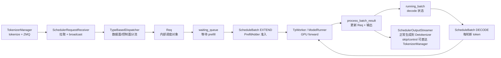

# Scheduler

> Scheduler 不是“把请求送进 GPU”的薄封装，而是 SGLang serving runtime 的资源仲裁器：它把已 tokenize 的请求变成 `Req`，维护 `waiting_queue/running_batch/cur_batch`，在 prefill、decode、overlap、retract、PP 和控制请求之间做取舍。

## 你为什么要读

如果你在排查 TTFT 尖刺、decode 吞吐下降、KV pool 满、pause 后请求不动、PP 模式行为不同，Scheduler 是第一入口。读完这一组笔记，应该能回答三类问题：

- 第一次读：一条 generate 请求如何从 TokenizerManager 到 Scheduler，再进入 prefill、decode 和输出回传。
- 正在排障：为什么默认 overlap、什么时候单轮禁用 overlap、KV 不足为什么 retract、为什么只有部分 rank 拉 ZMQ。
- 准备改代码：新增请求类型、改 batch admission、改输出处理或 PP 通信时，哪些不变量不能破坏。

## 主线图



这张图的关键是状态迁移与提交边界：请求不是直接从队列到模型再结束。Prefill 结果处理会先提交首个输出 token、finish/grammar/cache 状态；可继续生成的请求随后才作为上轮 EXTEND batch 并入 `running_batch`。后续每轮 decode 都会重新过滤、检查 KV、准备执行，并可能 retract。开启 overlap 后，live batch、结果处理快照、GPU result 和下一轮 FutureMap payload 还是四个不同对象。

## 源码范围

- 进程入口和事件循环分派在 `scheduler.py`。每个 GPU worker 进程构造 `Scheduler`，向父进程回报初始化信息，再进入阻塞事件循环。

```python
# 来源：python/sglang/srt/managers/scheduler.py L4292-L4311
# Create a scheduler and run the event loop
scheduler = None
try:
    scheduler = Scheduler(
        server_args,
        port_args,
        gpu_id,
        tp_rank,
        moe_ep_rank,
        pp_rank,
        attn_cp_rank,
        moe_dp_rank,
        dp_rank,
    )

    # Send initialization info back to the parent process
    pipe_writer.send(scheduler.get_init_info())

    # Run the event loop (blocks until a ShutdownReq sets gracefully_exit)
    scheduler.run_event_loop()
```

- 运行模式由 `dispatch_event_loop` 选择。普通单 PP、非 disaggregation、非 MLX、未禁用 overlap 时，进入 `event_loop_overlap`。

```python
# 定位骨架（非逐行摘录）：来源 python/sglang/srt/managers/scheduler.py L4164-L4192
def dispatch_event_loop(scheduler: Scheduler):
    server_args = scheduler.server_args
    disaggregation_mode: DisaggregationMode = scheduler.disaggregation_mode
    if disaggregation_mode == DisaggregationMode.NULL:
        if scheduler.enable_pdmux:
            scheduler.event_loop_pdmux()
        elif server_args.pp_size > 1:
            scheduler.event_loop_pp()
        elif scheduler.enable_overlap_mlx:
            scheduler.event_loop_overlap_mlx()
        elif scheduler.enable_overlap:
            scheduler.event_loop_overlap()
        else:
            scheduler.event_loop_normal()
```

- 请求接收和广播在 `scheduler_components/request_receiver.py`。只有入口 rank 从 ZMQ 拉请求，之后广播或 PP 链式传递到其他 rank。

```python
# 来源：python/sglang/srt/managers/scheduler_components/request_receiver.py L101-L113
def _pull_raw_reqs(self) -> Optional[List]:
    if self.ps.pp_rank == 0:
        if self.ps.attn_tp_rank == 0 and self.ps.attn_cp_rank == 0:
            recv_reqs = []

            while True:
                try:
                    if self.recv_limit_reached(len(recv_reqs)):
                        break
                    recv_req = sock_recv(self.recv_from_tokenizer, zmq.NOBLOCK)
                except zmq.ZMQError:
                    break
                recv_reqs.append(recv_req)
```

## 阅读顺序

1. [[SGLang-Scheduler-核心概念]]：先建立 `waiting_queue/running_batch/cur_batch/last_batch` 的状态机。
2. [[SGLang-Scheduler-源码走读]]：沿一条 generate 请求走 `recv → dispatch → Req → prefill → decode → output`。
3. [[SGLang-Scheduler-数据流]]：看跨进程、跨 rank、跨 stream，以及普通 PP / PD Prefill PP / PD Decode PP 的对象流动。
4. [[SGLang-Scheduler-排障指南]]：按症状排障 overlap、retract、pause、PP、ZMQ rank。
5. [[SGLang-Scheduler-学习检查]]：用源码定位、日志和压测现象验收自己是否读通。

## 和相邻专题的关系

- 上游是 [[SGLang-TokenizerManager]]：TokenizerManager 接 HTTP/gRPC、tokenize、维护前台请求状态。
- 下游是 [[SGLang-ModelRunner]]：Scheduler 选出 `ScheduleBatch`，ModelRunner 把它变成实际 GPU forward。
- Admission 细节在 [[SGLang-SchedulePolicy]]：Scheduler 调用 `PrefillAdder`，具体优先级和 token 预算在调度策略专题展开。
- KV 资源细节在 [[SGLang-KV-Cache]]：Scheduler 触发分配、释放和 retract，但 KV pool 的数据结构另读。
