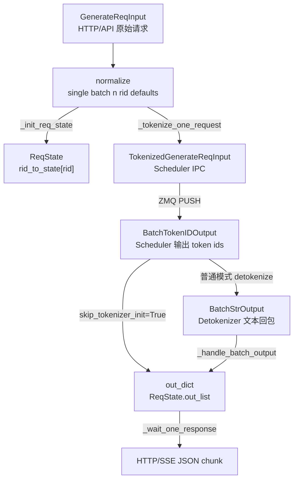

# TokenizerManager · 数据流

## 你为什么要读

本篇不重复源码走读，而是把 TokenizerManager 内外的对象形态和边界列清楚。读者应该能顺着一个 `rid` 判断：现在对象在哪里、长什么样、下一跳是谁、谁持有状态。

## 生命周期总览



这个生命周期里每个实际 `rid` 的前台等待状态由 owner TokenizerManager 进程中的 `ReqState` 持有。Scheduler 不知道 HTTP 协程，HTTP 协程也不直接读 Scheduler 回包；多 worker 模式还必须先把输出路由回持有该 state 的进程。

## 对象形态变化

| 阶段 | 对象 | 持有者 | 关键字段 | 下一跳 |
|------|------|--------|----------|--------|
| API 输入 | `GenerateReqInput` | HTTP route / Engine | `text`、`input_ids`、`stream`、`sampling_params`、`rid` | `generate_request` |
| 请求整形 | 同一个 `GenerateReqInput` 的规范化状态 | TokenizerManager 前台协程 | `is_single`、`batch_size`、`parallel_sample_num`、展开后的 per-item 参数 | `_init_req_state` |
| 等待状态 | `ReqState` | `TokenizerManager.rid_to_state` | `event`、`out_list`、`finished`、`text_chunks`、`output_ids` | 前台等待和后台写入共享 |
| 后端请求 | `TokenizedGenerateReqInput` | Scheduler IPC | `input_ids`、`sampling_params`、`lora_id`、`http_worker_ipc`、routing 字段 | Scheduler |
| token 回程 | `BatchTokenIDOutput` | Scheduler/TokenizerManager | `rids`、`decode_ids`、`read_offsets`、`output_ids`、finish/meta | Detokenizer 或 skip path |
| 文本回程 | `BatchStrOutput` | Detokenizer/TokenizerManager | `output_strs`、`output_ids`、logprobs、token counts、customized info | `_handle_batch_output` |
| HTTP 输出 | `out_dict` | `ReqState.out_list` | `text` 或 `output_ids`、`meta_info`、可选 `prompt_token_ids` | `_wait_one_response` |

parallel sampling 不能只画成一条 rid。对 `B` 个 prompt、`N>1` 个 samples，当前基线实际出现三组内部 state：normalization 先创建 `B×N` 个 placeholder state；每个 prompt 再创建一个预热 state；最后创建 `B×N` 个实际 sample state。预热和 sample state 有正常 finished 回包清理，展开代码还显式删除前 `B` 个 placeholder state，但剩余 `B×(N-1)` 个 placeholder state 在正常路径上没有对应输出或删除。这是数据流中一个未闭合的所有权边界。

## IPC 边界

`PortArgs` 定义了 TokenizerManager、Scheduler、Detokenizer 的 IPC 名称：

```python
# 来源：sglang/python/sglang/srt/server_args.py L7602-L7621
@dataclasses.dataclass
class PortArgs:
    # The ipc filename for tokenizer to receive inputs from detokenizer (zmq)
    tokenizer_ipc_name: str
    # The ipc filename for scheduler (rank 0) to receive inputs from tokenizer (zmq)
    scheduler_input_ipc_name: str
    # The ipc filename for detokenizer to receive inputs from scheduler (zmq)
    detokenizer_ipc_name: str

    # The port for nccl initialization (torch.dist)
    nccl_port: int

    # The ipc filename for rpc call between Engine and Scheduler
    rpc_ipc_name: str

    # The ipc filename for Scheduler to send metrics
    metrics_ipc_name: str

    # The ipc filename for MultiTokenizerRouter to receive inputs from TokenizerWorker processes (zmq)
    tokenizer_worker_ipc_name: Optional[str]
```

普通单 worker 下：

```text
TokenizerManager.send_to_scheduler -> scheduler_input_ipc_name
DetokenizerManager -> tokenizer_ipc_name -> TokenizerManager.recv_from_detokenizer
```

多 tokenizer、单 detokenizer 的典型回程：

```text
TokenizerWorker -> tokenizer_worker_ipc_name -> MultiTokenizerRouter -> Scheduler
Scheduler/Detokenizer -> MultiTokenizerRouter -> owner tokenizer_ipc_name
```

多 detokenizer 时则是：

```text
Scheduler -> MultiDetokenizerRouter
  -> hash(http_worker_ipc) 固定 detokenizer worker
  -> DetokenizerManager
  -> owner tokenizer_ipc_name
```

固定哈希的目的不是负载均衡本身，而是让同一请求持续落到同一个 detokenizer，保护它的增量 `decode_status`。

## `rid` 和 `http_worker_ipc` 是两套身份

| 身份 | 粒度 | 用途 |
|------|------|------|
| `rid` | 请求 | 在 TokenizerManager 内找到 `ReqState`，在 Scheduler/Detokenizer 输出中标识请求 |
| `http_worker_ipc` | worker | 多 HTTP worker 时，把输出送回拥有该请求状态的 worker |

`rid` 解决“这是谁的请求”，`http_worker_ipc` 解决“哪个进程持有这个请求的 `ReqState`”。多 worker 路由回程依赖后者：

```python
# 来源：sglang/python/sglang/srt/managers/multi_tokenizer_mixin.py L488-L498
    async def _distribute_result_to_workers(self, recv_obj):
        if isinstance(recv_obj, BaseReq):
            ipc_names = [recv_obj.http_worker_ipc]
        elif isinstance(recv_obj, BaseBatchReq):
            ipc_names = recv_obj.http_worker_ipcs
        else:
            raise ValueError(f"Unknown recv_obj type: {type(recv_obj)}")

        for i, ipc_name in enumerate(ipc_names):
            new_recv_obj = _handle_output_by_index(recv_obj, i)
            self.socket_mapping.send_output(ipc_name, new_recv_obj)
```

如果结果回到了错误 worker，即使 `rid` 正确，也会出现 `state is None`，因为那个 worker 的 `rid_to_state` 里没有这条请求。

## 三条输出路径

| 输出类型 | 入口 | HTTP 输出形态 | 典型场景 |
|----------|------|---------------|----------|
| `BatchStrOutput` | Detokenizer 回包 | `text`、`output_ids`、`meta_info` | 普通 generate |
| `BatchTokenIDOutput` | Scheduler 直接回包 | `output_ids`、`meta_info` | `skip_tokenizer_init=True` |
| `BatchEmbeddingOutput` | Scheduler/worker 回包 | `embedding`、`meta_info` | embedding/classify/score embedding path |

`BatchTokenIDOutput` 的 schema 说明它同时带有 incremental decode 所需字段和 skip-tokenizer 输出 ids：

```python
# 来源：sglang/python/sglang/srt/managers/io_struct.py L1194-L1206
class BatchTokenIDOutput(BaseBatchReq, kw_only=True):
    # The finish reason
    finished_reasons: List[Optional[FinishReasonDict]]
    # For incremental decoding
    decoded_texts: List[str]
    decode_ids: List[array]  # List[array[int]]
    read_offsets: List[int]
    # Only used when `--skip-tokenizer-init` is on
    output_ids: Optional[List[array]]  # Optional[List[array[int]]]
    # Detokenization configs
    skip_special_tokens: List[bool]
    spaces_between_special_tokens: List[bool]
    no_stop_trim: List[bool]
```

普通模式下这些字段先给 Detokenizer；skip tokenizer 模式下 TokenizerManager 自己处理 `output_ids`。

## 前台和后台的同步协议

`ReqState.event` 是唯一唤醒机制：

1. 前台 `_wait_one_response` 等 `state.event.wait()`。
2. 后台 `_handle_batch_output` 把 `out_dict` append 到 `state.out_list`。
3. 后台处理同一个 `Batch*Output` 时，每累计 `batch_notify_size` 个待通知 rid 就 `event.set()` 并让出一次 event loop；遍历结束后会立即通知剩余 rid。
4. 前台醒来后一次性 drain `out_list`，然后 `event.clear()`。

这个协议解释两个现象：

| 现象 | 原因 |
|------|------|
| 流式输出可能一次 yield 多个 token 的合并结果 | 前台消费速度或协程调度使同一 rid 在醒来前积压多个 out_dict，incremental 模式会 coalesce |
| 后台已经删除 `rid_to_state`，前台仍能返回最后一包 | 删除发生在 finished 分支，但局部 `state` 仍持有最后的 out_list 和 event |
| 只有 `n>1` 时 `rid_to_state` 完成后仍净增长 | normalization 创建的 placeholder rid 多于 `_handle_batch_request` 实际消费并显式删除的原始 rid；比较 `B×N` 次创建与 `B` 次删除 |

## pause 和权重更新的数据流

权重更新不是普通请求，但会影响普通请求准入：

```text
update_weights_* control request
  -> model_update_lock.writer_lock
  -> Scheduler weight update

generate_request
  -> wait is_pause_cond
  -> model_update_lock.reader_lock
  -> tokenize/send
```

也就是说，正在写权重时，新请求不会进入 tokenized send 阶段。读者排查“请求卡在 TokenizerManager”时，应该同时看 pause 状态和 writer lock。

## 配置分叉矩阵

| 配置 | 对数据流的影响 |
|------|----------------|
| `--skip-tokenizer-init` | 不加载 tokenizer；text 请求被拒绝；主回程不产出文本，只处理 token ids |
| `--enable-tokenizer-batch-encode` | batch text 请求可以先批量 tokenizer，再构造多个 tokenized objects |
| `--incremental-streaming-output` | streaming chunk 是互不重叠的 delta；多个 chunk backlog 需要 coalesce |
| `--tokenizer-worker-num > 1` | 请求先到 router；输出按 `http_worker_ipc` 回 owner worker；pause/continue 要广播到所有 worker |
| `--batch-notify-size` | 处理一个批回包时每通知多少个 rid 就让出 event loop；末尾余数仍立即通知，它不是跨多个后端消息攒 token 的缓冲区 |

## 和相邻模块的数据接口

| 相邻模块 | 交互对象 |
|----------|----------|
| [[SGLang-OpenAI-API]] | OpenAI/Ollama/HTTP handler 最终构造 `GenerateReqInput` 或 `EmbeddingReqInput` |
| [[SGLang-ScheduleBatch数据结构]] | Scheduler 把 `TokenizedGenerateReqInput` 转成 `Req`、`ScheduleBatch`、`ForwardBatch` |
| [[SGLang-Detokenizer]] | Detokenizer 把 `BatchTokenIDOutput` 转成 `BatchStrOutput`，再推回 TokenizerManager |
| [[SGLang-可观测性]] | `time_stats`、metrics、request logger 在 TokenizerManager 输出路径写入请求账 |

## 运行验证

数据流排查先确认 IPC、owner worker、输出对象和权重更新锁。下面的检索覆盖 Tokenizer/Detokenizer IPC、multi worker 路由、前台等待回包和 pause/update 的同步边界。

```powershell
rg -n 'tokenizer_ipc_name|detokenizer_ipc_name|class MultiTokenizerRouter|http_worker_ipc|class BatchTokenIDOutput|class BatchStrOutput|model_update_lock|is_pause_cond|PauseReq|UpdateWeight|async def _handle_batch_output|async def _wait_one_response' sglang/python/sglang/srt/server_args.py sglang/python/sglang/srt/managers/tokenizer_manager.py sglang/python/sglang/srt/managers/multi_tokenizer_mixin.py sglang/python/sglang/srt/managers/io_struct.py
```

读输出时先看 `PortArgs` 的 IPC 名称，再看 `MultiTokenizerRouter` / `MultiDetokenizerRouter` 如何使用 `http_worker_ipc`。如果请求卡住，继续看 `_wait_one_response`、`_handle_batch_output`、`is_pause_cond` 和 `model_update_lock`，区分是后台没回包，还是权重更新暂停了前台发送。
