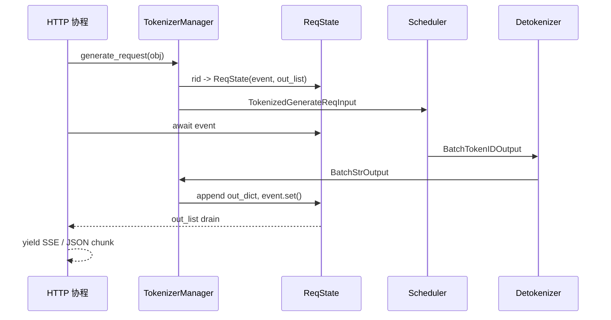

# TokenizerManager · 核心概念

TokenizerManager 最容易被误读成“分词器包装类”。更准确的模型是：它是前台请求调度台，左手面对 HTTP/Engine 协程，右手面对 Scheduler/Detokenizer 的 ZMQ 通道，中间用 `ReqState` 保存每个 `rid` 的可唤醒状态。

## 读者任务

读完本篇，需要能解释：

| 场景 | 应能说清 |
|------|----------|
| `stream=True` 为什么能持续 yield | 前台 `_wait_one_response` 等 event；后台 `handle_loop` 收包后写 `out_list` 并唤醒 |
| 权重更新时新请求为什么等待 | `generate_request` 在分词前等待 `is_pause_cond`，再进入 `model_update_lock.reader_lock` |
| skip tokenizer 为什么不能传 text | `self.tokenizer is None` 时 `_tokenize_one_request` 只接受 `input_ids` 或 `input_embeds` |
| 多 HTTP worker 为什么不串包 | 请求对象被写入 `http_worker_ipc`，router 用它把回包发回 owner worker |

## 心理模型：双协程调度台



这张图里有两个循环：

| 循环 | 入口 | 主要职责 |
|------|------|----------|
| 前台请求循环 | `generate_request` / `_wait_one_response` | 注册 state、发送请求、等待输出、处理断连、yield 给 HTTP |
| 后台收包循环 | `handle_loop` / `_handle_batch_output` | 从 `recv_from_detokenizer` 收对象、按 rid 更新 state、唤醒等待者 |

不要把它想成同步函数 `tokenize(prompt) -> response`。真实行为更像前台窗口给每个客户一张号码牌，后台分拣台收到批量结果后按号码牌叫号。

## 五个核心对象

| 对象 | 位置 | 心理模型 |
|------|------|----------|
| `GenerateReqInput` / `EmbeddingReqInput` | API 层输入 | 用户请求原始意图，可能是 text、input ids、多模态、采样参数或 embedding 参数 |
| `ReqState` | TokenizerManager 内存 | 单个 `rid` 的等待室，保存 event、输出列表、累积 text/token ids 和时间统计 |
| `TokenizedGenerateReqInput` / `TokenizedEmbeddingReqInput` | Scheduler IPC | 已经分词、校验、包装后的后端请求 |
| `BatchStrOutput` | Detokenizer 回包 | 字符串增量、token ids、finish reason、logprob/meta 等批量结果 |
| `BatchTokenIDOutput` | Scheduler 直接回包 | skip tokenizer bypass 下的 token id 结果，TokenizerManager 不做文本 decode |

源码中的输入对象已经把多 HTTP worker 路由字段放进 schema：

```python
# 来源：sglang/python/sglang/srt/managers/io_struct.py L246-L256
    # For DP routing — external router assigns a specific DP worker
    routed_dp_rank: Optional[int] = None
    # For PD disagg — hint telling decode which prefill DP worker has the KV cache
    disagg_prefill_dp_rank: Optional[int] = None
    # Routing key for routing-key schedule policy
    routing_key: Optional[str] = None
    # Conversation id used for tracking requests
    conversation_id: Optional[str] = None
    # Internal IPC endpoint of the HTTP/tokenizer worker that owns this request.
    # Used to route outputs back in multi-tokenizer mode.
    http_worker_ipc: Optional[str] = field(default=None, kw_only=True)
```

这个字段不是 HTTP 协议的一部分，而是内部路由事实。多 worker 模式下，如果它没有被正确 stamp，结果就无法稳定回到发起请求的 worker。

## `ReqState` 是请求状态的核心

`ReqState` 不只是一个输出列表。它同时承担四类账本：

| 字段 | 用途 |
|------|------|
| `out_list` / `event` | 后台收包和前台等待之间的同步队列 |
| `finished` | 告诉 `_wait_one_response` 何时记录日志、释放状态并结束 generator |
| `text_chunks` / `output_ids` | 避免每步重建完整字符串，同时保留 token id 累积 |
| `time_stats` / logprob lists / custom info | 输出 meta、metrics、trace 和调试信息 |

```python
# 来源：sglang/python/sglang/srt/managers/tokenizer_manager.py L153-L182
class ReqState:
    """Store the state a request."""

    out_list: List[Dict[Any, Any]]
    finished: bool
    event: asyncio.Event
    obj: Union[GenerateReqInput, EmbeddingReqInput]

    # For performance metrics
    time_stats: APIServerReqTimeStats
    last_completion_tokens: int = 1
    ttft_observed: bool = False

    # For streaming output
    last_output_offset: int = 0

    # Accumulate text lazily so incremental streaming can emit the incoming
    # delta directly without rebuilding the full output prefix.
    text: str = ""
    text_chunks: List[str] = dataclasses.field(default_factory=list)

    def append_text(self, chunk: str):
        if chunk:
            self.text_chunks.append(chunk)

    def get_text(self) -> str:
        if self.text_chunks:
            self.text += "".join(self.text_chunks)
            self.text_chunks.clear()
        return self.text
```

`text_chunks` 解释了一个常见现象：非 incremental streaming 的中间结果可能暂时不带完整 `text`，因为完整字符串只在必要时通过 `get_text()` materialize，避免每个 token step 都做 O(n) 拼接。

## 数据面和控制面分开

TokenizerManager 主类处理数据面请求：每个请求有 `rid`，回包按 `rid` 进入 `ReqState`。控制面请求如 flush cache、权重更新、LoRA 管理不应该伪装成普通 generate；它们需要 fan-out 到一个或多个 Scheduler rank，再聚合控制回复。

```python
# 来源：sglang/python/sglang/srt/managers/tokenizer_control_mixin.py L124-L142
class TokenizerControlMixin:
    """Mixin for TokenizerManager's control-plane operations (weights, cache, lora,
    profile, internal state, etc.) -- everything that talks to the scheduler via
    FanOutCommunicator, as opposed to data-plane inference requests multiplexed by rid.
    """

    def init_communicators(self: TokenizerManager, server_args: ServerArgs):
        dispatch_pairs = []
        for spec in _COMMUNICATOR_SPECS:
            name, resp_type = spec[0], spec[1]
            mode = spec[2] if len(spec) > 2 else "queueing"
            comm = FanOutCommunicator(
                self._dispatch_to_scheduler,
                server_args.dp_size,
                mode,
            )
            setattr(self, f"{name}_communicator", comm)
            dispatch_pairs.append((resp_type, comm.handle_recv))
        self._result_dispatcher += TypeBasedDispatcher(dispatch_pairs)
```

边界判断很直接：

| 如果对象是 | 走哪条路 |
|------------|----------|
| `BatchStrOutput` / `BatchEmbeddingOutput` / `BatchTokenIDOutput` | `_handle_batch_output`，按 `rid` 写 `ReqState` |
| 权重、cache、profile 等响应 | `_result_dispatcher`，由对应 communicator 或 handler 接收 |

## 分词不是唯一职责

TokenizerManager 确实做分词，但分词只是进入 Scheduler 前的一道转换。单请求路径会依次判断：

1. `input_embeds` 是否存在，并要求关闭 radix cache。
2. `input_ids` 是否已经给定。
3. 是否允许用 tokenizer 处理 `text`。
4. 是否要跑多模态 processor。
5. 是否构造 generation 或 embedding 的 tokenized IPC object。

```python
# 来源：sglang/python/sglang/srt/managers/tokenizer_manager.py L805-L832
        if obj.input_embeds is not None:
            if not self.server_args.disable_radix_cache:
                raise ValueError(
                    "input_embeds is provided while disable_radix_cache is False. "
                    "Please add `--disable-radix-cache` when you launch the server "
                    "if you want to use input_embeds as inputs."
                )
            input_embeds = obj.input_embeds
            input_ids = obj.input_ids
        elif obj.input_ids is not None:
            input_ids = obj.input_ids
        else:
            if self.tokenizer is None:
                raise ValueError(
                    "The engine initialized with skip_tokenizer_init=True cannot "
                    "accept text prompts. Please provide input_ids or re-initialize "
                    "the engine with skip_tokenizer_init=False."
                )

            # For audio-only requests (e.g., Whisper), text may be empty.
            # The multimodal processor will provide input_ids later.
            if not input_text and self.mm_processor and obj.contains_mm_input():
                # Use empty placeholder - multimodal processor will override
                input_ids = []
            else:
                input_ids, token_type_ids = await self._tokenize_texts(
                    input_text, is_cross_encoder_request
                )
```

所以排查输入问题时，不要只问“tokenizer 有没有加载”。还要看输入形态、radix cache、多模态 processor 和 `skip_tokenizer_init` 的组合。

## 三个配置分叉

| 配置 | 改变的不是 | 真正改变的是 |
|------|-------------|--------------|
| `skip_tokenizer_init=True` | 不只是少加载 tokenizer | 主 generate 回路可能收到 `BatchTokenIDOutput`，并且 text prompt 不可用 |
| `incremental_streaming_output=True` | 不只是 SSE 格式 | `_handle_batch_output` 和 `_wait_one_response` 都按 delta 处理 token ids/text/meta |
| `tokenizer_worker_num > 1` | 不只是多进程分词 | 前向请求经 `MultiTokenizerRouter`，回包必须按 `http_worker_ipc` 拆回 owner worker |

这些分叉共同说明：TokenizerManager 不是一个可替换的工具函数，而是 API 侧请求生命周期的状态机。

## 运行验证

TokenizerManager 的核心链路可以按“输入对象、请求状态、分词、等待回包、后台处理、HTTP worker 归属”检索。

```powershell
rg -n 'class GenerateReqInput|class ReqState|class TokenizerManager|class TokenizerControlMixin|async def _tokenize_one_request|async def _wait_one_response|async def handle_loop|async def _handle_batch_output|skip_tokenizer_init|incremental_streaming_output|stamp_http_worker_ipc|http_worker_ipc' sglang/python/sglang/srt/managers/tokenizer_manager.py sglang/python/sglang/srt/managers/tokenizer_control_mixin.py sglang/python/sglang/srt/managers/io_struct.py
```

读输出时先看 `GenerateReqInput` 和 `ReqState`，确认 TokenizerManager 保存的是请求生命周期状态；再看 `_tokenize_one_request` 和 `_wait_one_response`，确认前向请求和回包处理是两条协程路径；最后看 `stamp_http_worker_ipc`，确认多 worker 回包不会只靠 request id 猜 owner。
