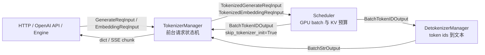

# TokenizerManager

## 你为什么要读

TokenizerManager 是 SGLang 请求链路里的前台调度台：它不做 GPU forward，也不做 continuous batching；它负责把 API 请求变成 Scheduler 能消费的 tokenized IPC 对象，再把 Detokenizer 或 Scheduler 回来的批输出拆回每个 HTTP 请求。

读完本专题，读者应该能解决三类问题：

| 读者任务 | 能回答的问题 |
|----------|--------------|
| 首次读源码 | 一个 `/generate` 请求如何从 FastAPI 进入 Scheduler，又如何回到 SSE/JSON |
| 排查线上问题 | 为什么请求在 pause/weight update 时卡住、为什么流式中间包可能没有完整 text、为什么 skip-tokenizer 不能传 text |
| 准备改代码 | 哪些状态属于 `ReqState`，哪些控制面操作走 `FanOutCommunicator`，多 HTTP worker 如何保证回包不串线 |

## 模块位置



核心主线是：

```text
GenerateReqInput
  -> ReqState
  -> TokenizedGenerateReqInput
  -> Scheduler
  -> BatchStrOutput 或 BatchTokenIDOutput
  -> ReqState.out_list + event
  -> HTTP yield
```

TokenizerManager 的关键不是“会分词”，而是同时维护三条边界：

| 边界 | TokenizerManager 做什么 | 不做什么 |
|------|--------------------------|----------|
| API 到 Scheduler | normalize、分词、多模态处理、采样参数校验、LoRA 解析、IPC 发送 | 不决定 GPU batch 准入 |
| 后端输出到 HTTP | 按 `rid` 找 `ReqState`、累加文本/token ids、设置 event、yield chunk | 不负责 token id 到字符串的增量 decode，除非 skip tokenizer bypass |
| 数据面到控制面 | 数据面按 `rid` 多路复用；控制面用 communicator 等待 Scheduler rank 回复 | 不把权重更新、flush cache 当作普通 generate 请求 |

在这三条边界之前还有一道容易被忽略的“请求整形”：`normalize_batch_and_arguments()` 会判断 single/batch、生成或扩展 `rid`、补默认参数，并把 `sampling_params.n > 1` 改写成 parallel-sampling 路径。因此 API 传入的 `GenerateReqInput` 不是只读 DTO；进入 `ReqState` 前，它的对象形态已经可能发生变化。

当前基线还有一个值得带着问题意识阅读的边界：parallel sampling 会先按 `B×N` 个规范化 rid 建立 `ReqState`，随后只按原始 batch size `B` 取 prompt、预热前缀并重新生成实际 sample rid。正常展开末尾只显式删除前 `B` 个规范化 state；当 `N>1` 时，其余 `B×(N-1)` 个 placeholder state 没有在这条路径上看到对应删除。本文把它作为已由静态调用链确认、仍需 live 压测量化影响的生命周期风险，而不是把所有规范化 rid 都称为“实际请求”。

## 阅读顺序

| 顺序 | 文档 | 读者目标 |
|------|------|----------|
| 1 | [[SGLang-TokenizerManager-核心概念]] | 建立“双协程调度台”和 `ReqState` 心理模型 |
| 2 | [[SGLang-TokenizerManager-源码走读]] | 沿一条 generate 请求读源码证据 |
| 3 | [[SGLang-TokenizerManager-数据流]] | 看清对象形态、IPC 路由和多 worker 分叉 |
| 4 | [[SGLang-TokenizerManager-排障指南]] | 用症状表定位 pause、streaming、skip-tokenizer、abort 等问题 |
| 5 | [[SGLang-TokenizerManager-学习检查]] | 自检是否能画图、追生命周期、设计验证实验 |

## 源码范围

| upstream 文件 | 读法 |
|---------------|------|
| `sglang/python/sglang/srt/managers/tokenizer_manager.py` | 主线文件：`generate_request`、分词、发送、等待、收包、`ReqState` |
| `sglang/python/sglang/srt/managers/io_struct.py` | API 对象和 IPC 对象形态 |
| `sglang/python/sglang/srt/managers/tokenizer_control_mixin.py` | 权重、cache、profile 等控制面 fan-out |
| `sglang/python/sglang/srt/managers/tokenizer_manager_score_mixin.py` | score API 如何复用 generate/embedding 数据面 |
| `sglang/python/sglang/srt/managers/multi_tokenizer_mixin.py` | 多 HTTP worker 的 router、回包拆分和 pause broadcast |
| `sglang/python/sglang/srt/entrypoints/http_server.py` | FastAPI 如何消费 `generate_request` async generator |
| `sglang/python/sglang/srt/server_args.py` | `skip_tokenizer_init`、`batch_notify_size`、`incremental_streaming_output`、IPC port |

## 和相邻专题的关系

| 上一跳 | 本专题 | 下一跳 |
|--------|--------|--------|
| [[SGLang-OpenAI-API]] 把 OpenAI/Ollama/HTTP 请求转成内部 input object | TokenizerManager 注册状态、分词、发送、等待输出 | [[SGLang-ScheduleBatch数据结构]] 和 [[SGLang-Detokenizer]] 解释请求进入 Scheduler 后的对象形态和回程 |

如果只想先跑通请求链路，先读核心概念、源码走读和学习检查；如果在排查生产流式输出或多 worker 问题，直接进入数据流和排障指南。
