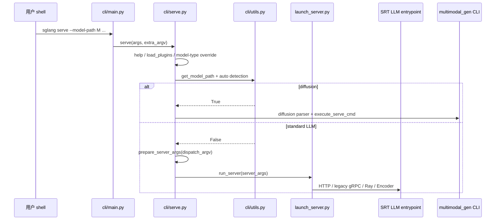

# 阅读方法 · 数据流

## 你为什么要读

这篇追踪的不是一次模型请求，而是“阅读线索”本身：命令行如何指向入口，入口如何分派运行模式，目录和包又如何暴露真实责任边界。把这条线走通后，你拿到任何新版本，都能从可执行命令反推出该读的模块，而不是靠文件名猜谜。

## 1. 架构位置

本模块覆盖知识图谱中的 **文档层 → 入口层 → 公共 API 层**，尚未进入 `srt` 内部进程模型（从 TokenizerManager 起）。



---

## 2. 输入 / 输出

| 阶段 | 输入 | 输出 | 定义位置 |
|------|------|------|----------|
| CLI 解析 | `sys.argv` | `args.subcommand`, `extra_argv` | `cli/main.py` |
| help / 插件 | `extra_argv` | 通用 help 或已加载插件环境 | `cli/serve.py` |
| 模型类型覆盖 | `--model-type` | `model_type`, `dispatch_argv` | `cli/serve.py::_extract_model_type_override` |
| 自动检测 | model path、registry、文件或远端 metadata | diffusion / LLM 判断 | `cli/utils.py::get_is_diffusion_model` |
| LLM 参数对象 | `dispatch_argv` | 一次启动使用的 `ServerArgs` 实例 | `srt/server_args.py` |
| 运行入口 | `ServerArgs` | encoder、legacy gRPC、Ray HTTP 或默认 HTTP | `launch_server.py::run_server` |
| diffusion 入口 | diffusion argv | multimodal generation serve | `multimodal_gen/.../cli/serve.py` |

**读法：** `ServerArgs` 是 server-wide 配置结构，不是全局单例。标准 LLM 分支为本次启动解析出一个实例；字段、派生值和校验见 [[SGLang-启动链路-核心概念]]。

**源码锚点：**

```python
# 来源：python/sglang/srt/server_args.py L375-L398
class ServerArgs:
    """Server-wide configuration for SGLang.

    Adding new arguments
    --------------------
    1. **Place the field in the right section.** Arguments are grouped by
       comment blocks (``# Model and tokenizer``, ``# LoRA``, etc.).
       Add new fields to the matching section, or create a new section
       with a ``# ---`` banner when none fits.

    2. **Use the ``A[T, ...]`` annotation.**  ``A`` is an alias for
       ``typing.Annotated``.  The primary CLI flag is auto-derived from the
       field name (``tp_size`` → ``--tp-size``).  Use ``aliases`` for
       longer alternate names
       (``aliases=["--tensor-parallel-size"]``)::

           # Bare string — simplest form (just help text):
           host: A[str, "The host of the HTTP server."] = "127.0.0.1"
           trust_remote_code: A[bool, "Whether to allow custom models."] = False

           # Arg(...) — when you need choices, aliases, type_parser, etc.:
           load_format: A[str, Arg(help="...", choices=CHOICES)] = "auto"
           model_path: A[str, Arg(help="...", aliases=["--model"])]

```

**源码锚点：**

```python
# 来源：python/sglang/cli/serve.py L124-L128
            from sglang.srt.server_args import prepare_server_args

            server_args = prepare_server_args(dispatch_argv)

            run_server(server_args)
```

**要点：** `dispatch_argv` 是剥掉 `--model-type` 后交给对应 server parser 的 argv。它与兼容入口的 `sys.argv[1:]` 形态相似，但 `sglang serve` 在此之前已经执行 help、插件与 diffusion 分流，不能把两条入口视为完全等价。

---

## 3. 上下游连接（知识图谱 edges）

| 上游 | 下游 | 关系 | 代码体现 |
|------|------|------|----------|
| `pyproject.toml` | `cli/main.py` | configures | `[project.scripts]` 注册 |
| `cli/main.py` | `cli/serve.py` | calls | `serve(args, extra_argv)` |
| `cli/serve.py` | `cli/utils.py` | detects | model path 与 diffusion 类型判断 |
| `cli/serve.py` | `launch_server.py` | calls on LLM branch | `prepare_server_args → run_server` |
| `cli/serve.py` | `multimodal_gen` | calls on diffusion branch | 专用 parser 与 `execute_serve_cmd` |
| `launch_server.py` | `srt/*` | depends_on | 延迟 import 各 entrypoint |
| `__init__.py` | `lang/*` | imports | Frontend API |
| `__init__.py` | `srt/*` | LazyImport | Engine, ServerArgs |

---

## 4. 典型数据流：从命令到 HTTP 服务（默认路径）

### 步骤 1 — 用户命令

```powershell
sglang serve --model-path meta-llama/Llama-3.1-8B-Instruct --port 30000
```

### 步骤 2 — CLI 分发（内嵌源码）

**源码锚点：**

```python
# 来源：python/sglang/cli/main.py L37-L40
    if args.subcommand == "serve":
        from sglang.cli.serve import serve

        serve(args, extra_argv)
```

**要点：** `extra_argv` ≈ `['--model-path', 'meta-llama/...', '--port', '30000']`。

### 步骤 3 — 先判定 server 类型

**源码锚点：**

```python
# 来源：python/sglang/cli/serve.py L96-L101
        if model_type == "auto":
            is_diffusion_model = get_is_diffusion_model(model_path)
            if is_diffusion_model:
                logger.info("Diffusion model detected")
        else:
            is_diffusion_model = model_type == "diffusion"
```

**要点：** 自动检测不是简单读取 HF `architectures`。它可能检查 overlay registry、本地或远端 `model_index.json`、已知模型和注册表；失败时返回 `False`，落到 LLM 分支。显式 `--model-type` 会跳过自动检测。

### 步骤 4 — LLM 分支才解析 `ServerArgs`

```python
# 来源：python/sglang/cli/serve.py L121-L128
        else:
            # Logic for Standard Language Models
            from sglang.launch_server import run_server
            from sglang.srt.server_args import prepare_server_args

            server_args = prepare_server_args(dispatch_argv)

            run_server(server_args)
```

**要点：** diffusion 分支使用自己的参数 parser；不能先把两类参数都压成 SRT `ServerArgs`。

### 步骤 5 — `run_server` 选择 LLM runtime 入口

**源码锚点：**

```python
# 来源：python/sglang/launch_server.py L47-L51
    else:
        # Default mode: HTTP mode.
        from sglang.srt.entrypoints.http_server import launch_server

        launch_server(server_args)
```

**要点：** 此后进入 FastAPI/uvicorn 与 TokenizerManager 进程树（[[SGLang-HTTP-Server|HTTP Server]]、[[SGLang-TokenizerManager|TokenizerManager]]）。本模块数据流在 **HTTP 监听启动前** 结束；请求进入 GPU 的路径见 [[SGLang-HTTP请求全链路]]。

### 步骤 6 — 进程清理（退出时）

**源码锚点：**

```python
# 来源：python/sglang/cli/serve.py L129-L130
    finally:
        kill_process_tree(os.getpid(), include_parent=False)
```

**要点：** SGLang 使用多进程架构；主进程退出时必须回收 scheduler/worker 子进程。

---

## 5. Frontend 与 Runtime 两条使用路径

| 路径 | 用户操作 | 代码入口 | 数据去向 |
|------|----------|----------|----------|
| **服务模式** | `sglang serve` | CLI → launch_server → srt | HTTP 请求 → Scheduler |
| **编程 Frontend** | `import sglang as sgl`，使用 `gen/user/function` 等 | `__init__.py` → `lang.api` | 由配置的 backend / Runtime endpoint 执行程序 |
| **编程 Runtime** | `sglang.Engine(...)` | LazyImport → `srt.entrypoints.engine.Engine` | 复用 SRT 子进程拓扑，通过 Python 方法调用，不启动 FastAPI |

**源码锚点（Frontend 连接远程服务）：**

```python
# 来源：python/sglang/__init__.py L60
from sglang.lang.backend.runtime_endpoint import RuntimeEndpoint
```

**要点：** `RuntimeEndpoint` 是远端 runtime 连接入口，但不能由这一行推导“所有 Frontend 调用都只走 HTTP”。先看调用方设置了哪种 backend，再判断传输与执行边界。

---

## 6. 与 monorepo 其他组件的边界

| 组件 | 与本模块入口的关系 |
|------|------------------|
| `sgl-kernel` | 独立 kernel 包；只有具体模型、量化或 backend 的 dispatch 才能证明本次执行使用它 |
| `sgl-model-gateway` | 独立网关/路由组件；不要与 legacy `--grpc-mode` wrapper 或仓库内 native gRPC capability 合并 |
| `multimodal_gen` | `cli/serve` 检测 diffusion 时切换，与 LLM 路径互斥 |
| `proto/`、`rust/sglang-grpc/` | native gRPC 契约与实现能力；当前默认 Python 启动链是否接线需单独验证 |

---

## 7. 本模块数据流一句话

> **`sglang serve` 先处理 help、插件和模型类型；diffusion 进入独立 CLI，标准 LLM 才把 argv 解析成 `ServerArgs`，再由 `run_server` 选择 encoder、legacy gRPC、Ray HTTP 或默认 HTTP。**

## 8. 运行验证

这篇是方法论文档，验证重点不是启动真实服务，而是确认主线入口仍在上游代码里：

```powershell
rg -n 'def main|add_parser\("serve"|def serve|_extract_model_type_override|get_is_diffusion_model|prepare_server_args|def run_server|RuntimeEndpoint|kill_process_tree' sglang/python/sglang/cli/main.py sglang/python/sglang/cli/serve.py sglang/python/sglang/cli/utils.py sglang/python/sglang/launch_server.py sglang/python/sglang/srt/server_args.py sglang/python/sglang/__init__.py
```

预期输出应覆盖顶层子命令、serve help/插件/类型分流、diffusion 检测、LLM 参数解析、`run_server` 和公共 API。若只找到 `prepare_server_args` 而没有类型分流，说明阅读主线仍把 diffusion 与 LLM 错压成了一条链。
