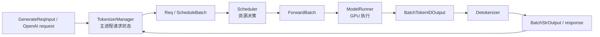

# 阅读方法 · 核心概念

## 你为什么要读

读 SGLang 最容易犯的错，是从熟悉的类名直接下钻，随后把 HTTP route、主进程状态、Scheduler 子进程和 GPU kernel 混成一个调用栈。本篇提供一套可在版本变化后重建的读法：从读者任务出发，先找入口和对象所有者，再画跨进程交接，最后用源码与运行信号验证。

## 一套稳定的五步读法

```text
读者任务
→ 外部入口
→ 贯穿对象
→ 所有者与进程边界
→ 源码分支 / 运行验证
```

| 步骤 | 先问什么 | 产物 |
|------|----------|------|
| 1. 定任务 | 我要理解、排障还是改代码？ | 明确终点，不从目录树随机游走 |
| 2. 找入口 | 用户实际执行什么命令或 API？ | CLI、HTTP route、Python `Engine` 等入口 |
| 3. 选对象 | 追 request、`Req`、batch、KV slot 还是 tensor？ | 一条连续生命周期 |
| 4. 标所有者 | 哪个进程或组件读写该对象？ | TokenizerManager、Scheduler、ModelRunner、Detokenizer 边界 |
| 5. 验假设 | 哪个分支、测试、日志或 metric 能证伪？ | 可重复的源码或运行证据 |

## 先分清仓库中的四类边界

| 边界 | 主要路径 | 解决的问题 |
|------|----------|------------|
| 安装与入口 | `python/pyproject.toml`、`python/sglang/cli/`、`launch_server.py` | 命令进入哪个 Python 函数，参数何时解析 |
| SRT serving runtime | `python/sglang/srt/` | 请求状态、调度、模型执行、KV、协议回程 |
| Frontend language | `python/sglang/lang/` | `gen/user/assistant` 等结构化生成表达与 backend 调用 |
| 原生与外围组件 | `sgl-kernel/`、`sgl-model-gateway/`、`rust/sglang-grpc/`、`proto/` | kernel、网关和跨语言协议能力 |

`python/sglang/README.md` 把 `lang` 定位为 frontend language，把 `srt` 定位为运行本地模型的 backend engine。日常“跑模型服务”的第一主线在 SRT；使用 DSL、网关或原生 gRPC 时再进入对应边界。

## 命令入口不是 server 本体

安装配置把 `sglang` console script 绑定到 CLI 主路由：

```toml
# 来源：python/pyproject.toml L178-L180
[project.scripts]
sglang = "sglang.cli.main:main"
killall_sglang = "sglang.cli.killall:main"
```

随后职责继续分层：

| 文件 | 只负责什么 | 下一跳 |
|------|------------|--------|
| `cli/main.py` | 识别 `serve/generate/version`，保留子命令的额外 argv | `cli/serve.py` 等子命令实现 |
| `cli/serve.py` | help、插件加载、`--model-type` 处理、diffusion/LLM 分流 | diffusion CLI 或 `prepare_server_args → run_server` |
| `launch_server.py` | 根据已经生成的 `ServerArgs` 选择 encoder、legacy gRPC、Ray HTTP 或默认 HTTP | 具体 entrypoint |

因此，看到 `sglang serve --model-path M` 时不能直接画成 `CLI → HTTP`。`cli/serve.py` 会先处理 help 和插件，再提取 model path 与 `--model-type`；自动模式还会调用 diffusion 检测。只有标准 LLM 分支才构造 SRT `ServerArgs` 并进入 `run_server`。

## `ServerArgs` 是配置对象，不是全局单例

`ServerArgs` 是带注解字段的 dataclass 风格配置结构，CLI flag 由字段名和 `Arg(...)` metadata 生成。`prepare_server_args` 为本次启动解析出一个实例，再进行派生值与合法性处理。

阅读规则：

- “server-wide”表示字段覆盖整个 server 的配置范围，不表示进程中永远只有一个全局单例。
- 不要把 `global_config` 与 `ServerArgs` 混在一起：前者主要服务 frontend language，后者服务 SRT 启动与运行时。
- 新增 flag 时要追字段、解析、校验和实际消费者四个位置；只加字段不等于功能已接线。

## Diffusion 自动检测不是“读 architecture 字段”这么简单

当前 `get_is_diffusion_model(model_path)` 的顺序包括：overlay registry、本地 `model_index.json`、已知 non-diffusers 模型、注册表、ModelScope/Hugging Face 下载 `model_index.json`，以及 gated repository metadata fallback。网络错误、404 或离线失败会返回 `False`，让调用方落到标准 LLM 路径。

所以排查错误分流时要同时检查：

- 用户是否显式传了 `--model-type {llm,diffusion}`。
- model path 是本地目录、HF ID 还是 ModelScope ID。
- diffusion extra 是否安装，registry 是否可 import。
- 自动检测失败是否静默 fallback 到 LLM。

入口证据位于 `cli/serve.py` 与 `cli/utils.py`；详细启动分支进入 [[SGLang-启动链路-源码走读]]。

## `Engine` 名称只有一个运行时实现，却有两层公开包装

`lang.api.Engine` 不是第二套推理引擎，它是一个延迟 import 包装：调用时导入并返回 `srt.entrypoints.engine.Engine`。

```python
# 来源：python/sglang/lang/api.py L42-L46
def Engine(*args, **kwargs):
    # Avoid importing unnecessary dependency
    from sglang.srt.entrypoints.engine import Engine

    return Engine(*args, **kwargs)
```

包级 `sglang.Engine` 随后又被替换成指向同一个 runtime class 的 `LazyImport`：

```python
# 来源：python/sglang/__init__.py L78-L79
ServerArgs = LazyImport("sglang.srt.server_args", "ServerArgs")
Engine = LazyImport("sglang.srt.entrypoints.engine", "Engine")
```

结论是“两个公开入口、同一个 SRT Engine 实现”，不是“Frontend Engine 与 Runtime Engine 两套系统”。读 traceback 时仍要区分自己经过了 wrapper、LazyImport 还是已经进入 `srt.entrypoints.engine.Engine`。

## 从对象生命周期建立进程模型



每读一个函数先写下三件事：它在哪个进程、读什么对象、把什么交给谁。这样可以避免以下典型错位：

- 在 HTTP route 中寻找 KV allocator。
- 在 Scheduler 中寻找增量 Unicode 解码。
- 用 `Req` 的字段直接推断 CUDA kernel 参数。
- 把 Detokenizer 回程延迟误判成 GPU forward 卡住。

完整请求证据见 [[SGLang-HTTP请求全链路]]，文件反查见 [[SGLang-源码地图]]。

## 把结论分成三个证据等级

| 等级 | 允许怎样写 | 示例 |
|------|------------|------|
| 已证明 | 有当前基线的分支、字段、测试或运行信号 | 默认 `run_server` 的最后分支进入 HTTP entrypoint |
| 待验证假设 | 明确写出所需 workload 和观测 | prefix hit 可能降低本 workload 的 prefill 工作量 |
| 类比 | 映射到真实对象并写失效边界 | Scheduler 像资源仲裁者；类比不覆盖 kernel 内部并行 |

性能、设计动机和跨框架优劣尤其不能只靠类名或 README 推断。框架比较单独进入 [[SGLang-框架对比与设计决策]]，并按双方当前版本核对；阅读方法页不维护容易过期的 vLLM 细节表。

## 推荐阅读顺序

1. [[SGLang-项目总览]]：建立仓库和系统边界。
2. [[SGLang-阅读方法-源码走读]]：从 packaging 进入 CLI、版本与 import 副作用。
3. [[SGLang-阅读方法-数据流]]：画出真实 argv 分流。
4. [[SGLang-启动链路]]：进入 Engine 进程拓扑。
5. [[SGLang-HTTP请求全链路]]：沿 request 生命周期下钻。
6. 按问题选择 Scheduler、KV、Attention、模型执行或高级路径。

本目录提供脚手架，不替代 upstream。准备修改实现、核对版本漂移或遇到证据争议时，必须回到 `sglang/` 基线和对应测试。

## 运行验证

```powershell
rg -n '\[project.scripts\]|sglang =' sglang/python/pyproject.toml
rg -n 'def main|parse_known_args|def serve|_extract_model_type_override|get_is_diffusion_model|prepare_server_args' sglang/python/sglang/cli
rg -n 'def run_server|grpc_mode|use_ray|Default mode: HTTP mode' sglang/python/sglang/launch_server.py
rg -n 'def Engine|Engine = LazyImport|ServerArgs = LazyImport' sglang/python/sglang/lang/api.py sglang/python/sglang/__init__.py
```

预期：四组结果分别证明 console script、CLI 分流、runtime entrypoint 选择，以及两个公开 `Engine` 入口最终指向同一个 SRT class。命中字符串只建立入口证据，不能替代后续行为验证。
