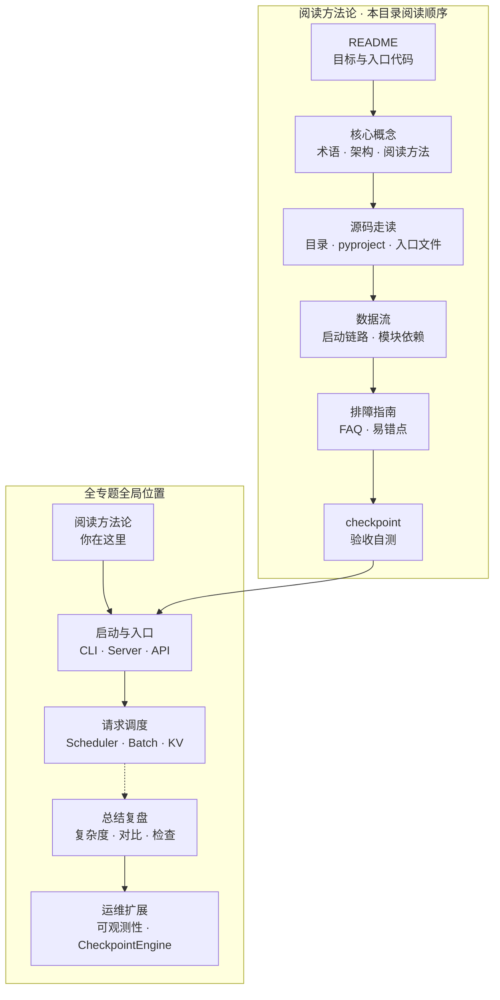

# 阅读方法

> SGLang 阅读地基 · Git：`70df09b` · 本模块负责阅读方法与入口定位

## 本模块目标

读完本目录的主线后，你应能先不依赖逐文件搜索，回答：

1. SGLang 是什么、解决什么问题？
2. 仓库顶层有哪些组件、各自职责？
3. 用户执行 `sglang serve` 时，代码大致从哪进、往哪走？
4. 本 `sglang_reading/` 项目如何组织、如何阅读（主线、专题地图、验证方式）？

本目录提供连续的阅读脚手架，不替代 upstream。准备修改实现、核对版本漂移或遇到证据争议时，仍应按 `70df09b` 基线打开 `sglang/` 源码验证。

## 零基础读者提示

若你**尚未安装 SGLang**、或不熟悉 LLM 推理服务基本概念，请先读：

→ **[[SGLang-零基础先修]]**

该文档用约 10 分钟说明：pip 安装、`sglang serve` 最小示例、Runtime（SRT）与 Frontend（lang）的区别。读完再回本模块，术语表与架构图会顺很多。

**本模块不要求：** 跑 GPU、读 CUDA、或理解 Scheduler 细节；这些从启动链路起逐步展开。

## 阅读地图



## 文档职责

| 文件 | 读什么 | 建议用时 |
|------|--------|----------|
| [[SGLang-阅读方法-核心概念]] | 五步读法、Monorepo 边界、CLI/公开 Engine 入口与证据等级 | 15 min |
| [[SGLang-阅读方法-源码走读]] | **主文档**：按文件精读 README、pyproject、CLI、launch_server | 25 min |
| [[SGLang-阅读方法-数据流]] | `sglang serve` 启动链、模块间依赖关系 | 15 min |
| [[SGLang-阅读方法-排障指南]] | 排障问答 + 文末可动手验证建议 | 10 min |
| [[SGLang-阅读方法-学习检查]] | 读者自测清单；全部打勾再进入 启动链路 | 5 min |

## 最关键的一段入口代码

入口读法：现代 SGLang 推荐的启动方式是 `sglang serve`。CLI 在确认模型为 LLM（非 diffusion）后，会解析 `server_args` 并调用 `run_server`；这是后续启动链路与 HTTP Server 的展开起点。

**源码锚点：**

```python
# 来源：python/sglang/cli/serve.py L121-L128
        else:
            # Logic for Standard Language Models
            from sglang.launch_server import run_server
            from sglang.srt.server_args import prepare_server_args

            server_args = prepare_server_args(dispatch_argv)

            run_server(server_args)
```

读法：

- `prepare_server_args` 把命令行 argv 解析为统一的 `ServerArgs` 对象（启动链路 详述）。
- `run_server` 根据 flags 选择 HTTP / gRPC / Ray / Encoder 路径（见 [[SGLang-阅读方法-源码走读]]）。
- CLI 的 `finally` 块调用 `kill_process_tree` 回收当前进程树中的子进程；它不是 Python `Engine`、legacy module 或外部进程管理器的通用退出协议。

## 下一模块预告

→ **[[SGLang-启动链路|启动链路与 CLI]]**

启动链路 将展开 `prepare_server_args` 的字段全貌、`run_server` 四条分支（HTTP / gRPC / Ray / Encoder），以及 `sglang serve` 完整 argv 解析与插件加载时机。
