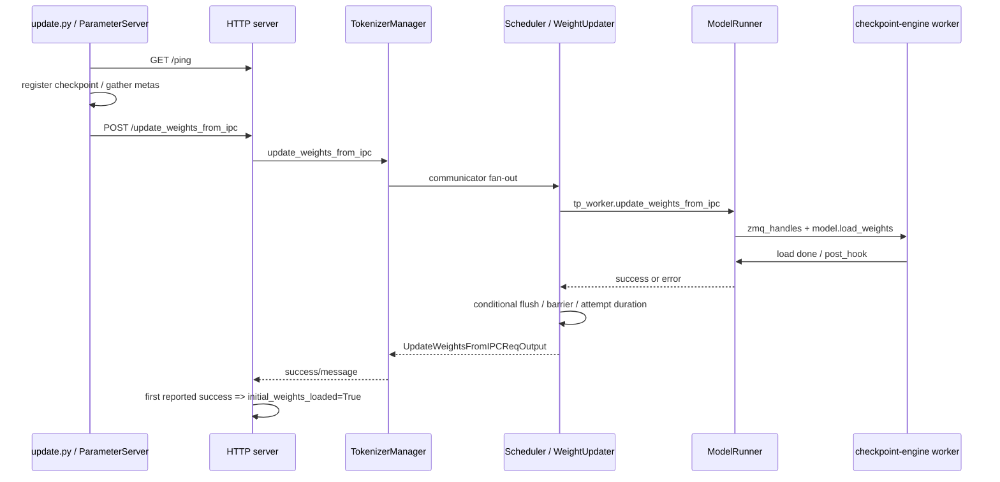

# CheckpointEngine · 数据流

## 读者任务

这篇只拆数据流和状态边界。读完后，你应该能回答：一个热更新信号什么时候只是 HTTP 控制请求，什么时候进入 Scheduler，什么时候真正触碰模型权重，什么时候释放初始 ready。

## 总图：三个进程域，四条状态线



四条状态线分别是：

- 启动状态线：`initial_weights_loaded=False -> bounded wait -> warmup -> Up`；成功 IPC 可在等待期间把状态翻为 True，超时则只记 error 后继续。
- 控制面状态线：HTTP request -> 非 paused writer lock / paused bypass -> communicator result `[0]`。
- 执行面状态线：WeightUpdater -> TPWorker -> ModelRunner -> worker extension。
- 权重数据线：ParameterServer/ZMQ -> checkpoint-engine worker -> `model.load_weights`。

## 启动状态线

等待模式启动时，状态位先被置为 `False`，warmup 前轮询它。

```python
# 来源：python/sglang/srt/managers/tokenizer_manager.py L459-L463
    def init_weight_update(self):
        # Initial weights status
        self.initial_weights_loaded = True
        if self.server_args.checkpoint_engine_wait_weights_before_ready:
            self.initial_weights_loaded = False
```

成功 POST 后，HTTP endpoint 才把它翻回 `True`。

```python
# 来源：python/sglang/srt/entrypoints/http_server.py L1316-L1320
    content = {"success": success, "message": message}
    if success:
        if _global_state.tokenizer_manager.initial_weights_loaded is False:
            _global_state.tokenizer_manager.initial_weights_loaded = True
        return ORJSONResponse(content)
```

这条线记录“IPC endpoint 是否接受过一次 success”。不要把它和 `/ping` 混为一谈，也不要把它当成永久 readiness gate：`_wait_weights_ready` 超时后不会抛错或 return failure，而是继续 warmup。

## 外部脚本控制线

外部脚本先等 SGLang HTTP 可达，再触发 ParameterServer update。`check_sglang_ready` 只看 `/ping`。

```python
# 来源：python/sglang/srt/checkpoint_engine/update.py L49-L64
def check_sglang_ready(
    endpoint: str, inference_parallel_size: int, uds: str | None = None
):
    rank = int(os.getenv("RANK", 0))
    if rank != rank // inference_parallel_size * inference_parallel_size:
        return
    retry_num = 0
    transport = None
    if uds is not None:
        transport = httpx.HTTPTransport(uds=uds)
    with httpx.Client(transport=transport) as client:
        while True:
            try:
                response = client.get(f"{endpoint}/ping", timeout=10)
                response.raise_for_status()
                break
```

`req_inference` 才是把外部 handles 送入 SGLang 的回调。

```python
# 来源：python/sglang/srt/checkpoint_engine/update.py L118-L132
    def req_func(socket_paths: list[tuple[str, str]]):
        if rank == src:
            with httpx.Client(transport=httpx.HTTPTransport(uds=uds)) as client:
                resp = client.post(
                    f"{endpoint}/update_weights_from_ipc",
                    json={
                        "zmq_handles": dict(
                            socket_paths[src : src + inference_parallel_size]
                        ),
                        "flush_cache": True,
                        "weight_version": weight_version,
                    },
                    timeout=timeout,
                )
                resp.raise_for_status()
```

这条线的核心对象是 `inference_parallel_size`。它决定 torchrun rank 分组、src rank 和 socket path 切片；单机示例常与 TP 相等，多节点 TP 示例则取跨节点 inference process 总数。不要把它简化成“永远等于单节点 `--tp`”。

## SGLang 控制面线

TokenizerManager 的 communicator spec 里注册了 IPC update 类型。后续 `update_weights_from_ipc_communicator` 就来自这张声明表。

```python
# 来源：python/sglang/srt/managers/tokenizer_control_mixin.py L91-L101
_COMMUNICATOR_SPECS = [
    ("init_weights_update_group", InitWeightsUpdateGroupReqOutput),
    ("destroy_weights_update_group", DestroyWeightsUpdateGroupReqOutput),
    ("update_weights_from_distributed", UpdateWeightsFromDistributedReqOutput),
    (
        "init_weights_send_group_for_remote_instance",
        InitWeightsSendGroupForRemoteInstanceReqOutput,
    ),
    ("send_weights_to_remote_instance", SendWeightsToRemoteInstanceReqOutput),
    ("update_weights_from_tensor", UpdateWeightsFromTensorReqOutput),
    ("update_weights_from_ipc", UpdateWeightsFromIPCReqOutput),
```

控制面 fan-out 之前会处理 pause 和 writer lock。pause 状态下直接下发；非 pause 状态下拿 writer lock。

```python
# 来源：python/sglang/srt/managers/tokenizer_control_mixin.py L500-L509
            async with self.is_pause_cond:
                is_paused = self.is_pause
                if is_paused:
                    result = (await self.update_weights_from_ipc_communicator(obj))[0]
                    success, message = result.success, result.message

            if not is_paused:
                async with self.model_update_lock.writer_lock:
                    result = (await self.update_weights_from_ipc_communicator(obj))[0]
                    success, message = result.success, result.message
```

这条线回答并发问题：非 paused 路径用 writer lock 与推理 reader lock互斥；paused 路径则在 `is_pause_cond` 内直接 fan-out，不再次获取 writer lock，依赖既有 pause 语义。两条路径都不是 WeightUpdater 主动执行 pause。

还要注意结果语义：communicator 会收齐 fan-out response，但 IPC 路径只取结果列表 `[0]`；它不像 distributed/tensor update 那样合并所有 success。因此 DP-Attention 下 HTTP success 与 weight-version 更新不能证明每个 scheduler response 都成功。

## Scheduler 执行线

Scheduler 先按请求类型路由到 WeightUpdater。

```python
# 来源：python/sglang/srt/managers/scheduler.py L1390-L1397
                (
                    UpdateWeightsFromTensorReqInput,
                    self.weight_updater.update_weights_from_tensor,
                ),
                (
                    UpdateWeightsFromIPCReqInput,
                    self.weight_updater.update_weights_from_ipc,
                ),
```

WeightUpdater 再包上 observe、TP worker、draft worker、flush 和 barrier。

```python
# 来源：python/sglang/srt/managers/scheduler_components/weight_updater.py L166-L178
    def update_weights_from_ipc(self, recv_req: UpdateWeightsFromIPCReqInput):
        """Update the online model parameter from IPC for checkpoint-engine integration."""
        with self._observe_weight_load("ipc"):
            success, message = self.tp_worker.update_weights_from_ipc(recv_req)
            tp_success = success
            if success and self.draft_worker is not None:
                success, message = self.draft_worker.update_weights_from_ipc(recv_req)
            if tp_success:
                self.flush_cache_after_weight_update(recv_req)
            if not success:
                logger.error(message)
            torch.distributed.barrier(group=self.tp_cpu_group)
            return UpdateWeightsFromIPCReqOutput(success=success, message=message)
```

这里有三个状态边界：target 成功才调用 flush helper；是否真正 flush 由请求开关决定；最终 success 还可能受 draft worker 影响。target 已成功而 draft 失败时没有回滚。

## 模型适配线

TPWorker 是薄转发，ModelRunner 才创建 worker extension。

```python
# 来源：python/sglang/srt/managers/tp_worker.py L176-L179
    def update_weights_from_ipc(self, recv_req: UpdateWeightsFromIPCReqInput):
        """Update weights from IPC for checkpoint-engine integration."""
        success, message = self.model_runner.update_weights_from_ipc(recv_req)
        return success, message
```

```python
# 来源：python/sglang/srt/model_executor/model_runner.py L3246-L3256
    def update_weights_from_ipc(self, recv_req):
        """Update weights from IPC for checkpoint-engine integration."""
        try:
            from sglang.srt.checkpoint_engine.checkpoint_engine_worker import (
                SGLangCheckpointEngineWorkerExtensionImpl,
            )

            # Create a worker extension that integrates with SGLang's model
            worker = SGLangCheckpointEngineWorkerExtensionImpl(self)
            worker.update_weights_from_ipc(recv_req.zmq_handles)
            return True, "IPC weight update completed successfully"
```

这条线回答依赖问题：普通 serving 不需要 checkpoint-engine 包，只有执行 IPC update 时才导入这段 integration。

## 权重数据线

worker extension 是 SGLang 到第三方 checkpoint-engine worker 的边界。它传入的是 ZMQ context、socket path、device id、模型 loader 和 post hook。

```python
# 来源：python/sglang/srt/checkpoint_engine/checkpoint_engine_worker.py L75-L89
        if self._zmq_ctx is None:
            self._zmq_ctx = zmq.Context()
        device_uuid = self.get_device_uuid()
        device_id = self.get_device_id()
        if device_uuid not in zmq_handles:
            raise ValueError(
                f"Device UUID {device_uuid} not found in zmq_handles: {list(zmq_handles.keys())}"
            )
        update_weights_from_ipc(
            self._zmq_ctx,
            zmq_handles[device_uuid],
            device_id=device_id,
            run=self.get_model_loader(),
            post_hook=self.get_post_hook(),
        )
```

这条线和 HTTP 控制面是分离的：HTTP 不传 tensor；worker extension 根据 handles 去接权重。

## Cache 与 metrics 线

target 权重成功替换后通常应 flush cache，因为 KV cache 与旧权重绑定；但协议允许调用方关闭。源码只在 target success 且请求 `flush_cache=True` 时执行真正 flush。

```python
# 来源：python/sglang/srt/managers/scheduler_components/weight_updater.py L101-L106
    def flush_cache_after_weight_update(self, recv_req) -> None:
        if recv_req.flush_cache:
            flush_cache_success = self.flush_cache(
                empty_cache=recv_req.torch_empty_cache
            )
            assert flush_cache_success, "Cache flush failed after updating weights"
```

duration metrics 在 `_observe_weight_load` 的 finally 里写。

```python
# 来源：python/sglang/srt/managers/scheduler_components/weight_updater.py L92-L99
        t0 = time.perf_counter()
        try:
            yield
        finally:
            if self.metrics_collector is not None:
                self.metrics_collector.observe_weight_load(
                    time.perf_counter() - t0, source
                )
```

所以热更新面板应把 `weight_load_duration_seconds{source="ipc"}`、HTTP success、逐 scheduler 日志和 `cache_hit_rate` 分开看。duration 在 `finally` 写，失败尝试也会更新；它不是 success counter。当前基线的 `num_paused_reqs` 只有发布与归零路径，未找到递增生产者，不应作为 IPC 热更新影响量。

## Join 与 metadata 复用

`join` 是外部脚本的辅助路径：它从文件加载已有 metas，重新初始化 process group，等待 SGLang HTTP 可达，然后用 p2p 更新。

```python
# 来源：python/sglang/srt/checkpoint_engine/update.py L175-L196
def join(
    ps: ParameterServer,
    checkpoint_name: str,
    load_metas_file: str,
    req_func: Callable[[list[tuple[str, str]]], None],
    inference_parallel_size: int,
    endpoint: str,
    uds: str | None = None,
):
    assert load_metas_file, "load_metas_file is required"
    with open(load_metas_file, "rb") as f:
        metas = pickle.load(f)
    ps.init_process_group()
    check_sglang_ready(endpoint, inference_parallel_size, uds)
    dist.barrier()
    with timer("Gather metas before join"):
        ps.gather_metas(checkpoint_name)
    ps.load_metas(metas)
    with timer(
        f"Update weights with setting ranks as range(0, {inference_parallel_size}) by using p2p"
    ):
        ps.update(checkpoint_name, req_func, ranks=list(range(inference_parallel_size)))
```

这条路径仍然会回调 SGLang 的同一个 `/update_weights_from_ipc`，只是 metadata 来源不同。

## 交互矩阵

| 现象 | 哪条线 | 源码入口 | 验证动作 |
|------|--------|----------|----------|
| `/ping` 一直连不上 | 外部脚本控制线 | `check_sglang_ready` | 检查 endpoint、端口、UDS |
| `/ping` 成功但等待期内 warmup 尚未继续 | 启动状态线 | `_wait_weights_ready` | 查状态位和剩余超时；超时后应看到 error 并继续 |
| HTTP 400 | 控制面或执行面 | HTTP endpoint、TokenizerManager、ModelRunner | 看 response message 和 server log |
| `dp_size` 报错 | 控制面线 | `TokenizerManager.update_weights_from_ipc` | 开 DP attention 或改为单 DP |
| DP-Attention 某个非首 scheduler 失败却 HTTP 200 | 控制面线 | IPC communicator 结果 `[0]` | 逐个核对 scheduler log；不要只信首 response |
| UUID mismatch | 权重数据线 | worker extension | 比对 `zmq_handles` keys 与本机 CUDA UUID |
| 热更新后 cache hit 降 | cache 线 | `flush_cache_after_weight_update` | 默认 helper 发送 `flush_cache=True`；自定义请求需核对开关 |
| duration metric 变化但 HTTP 失败 | metrics 线 | `_observe_weight_load` | 正常：gauge 记录尝试耗时，不表示成功 |
| draft model 失败 | Scheduler 执行线 | `WeightUpdater.update_weights_from_ipc` | 看最终 success/message 和 draft worker log |

## 复盘

- CheckpointEngine 有三类状态：HTTP 可达、初始权重状态位、server warmup 完成；状态位等待超时不是 fail closed。
- HTTP 控制面只传 handles；权重数据线走 checkpoint-engine worker 和 ZMQ。
- TokenizerManager 负责并发控制和控制面结果；Scheduler WeightUpdater 负责执行、条件 flush、barrier 与尝试耗时，但没有事务回滚。
- GPU UUID、`inference_parallel_size` 与该 endpoint 覆盖的实际 inference process 集合必须一致；单节点 TP 只是常见特例。
- cache flush 是可关闭的正确性保护；metrics 是尝试观测，二者都不能替代逐 rank 成功校验。

下一篇 [[SGLang-CheckpointEngine-排障指南]] 按症状排障。
