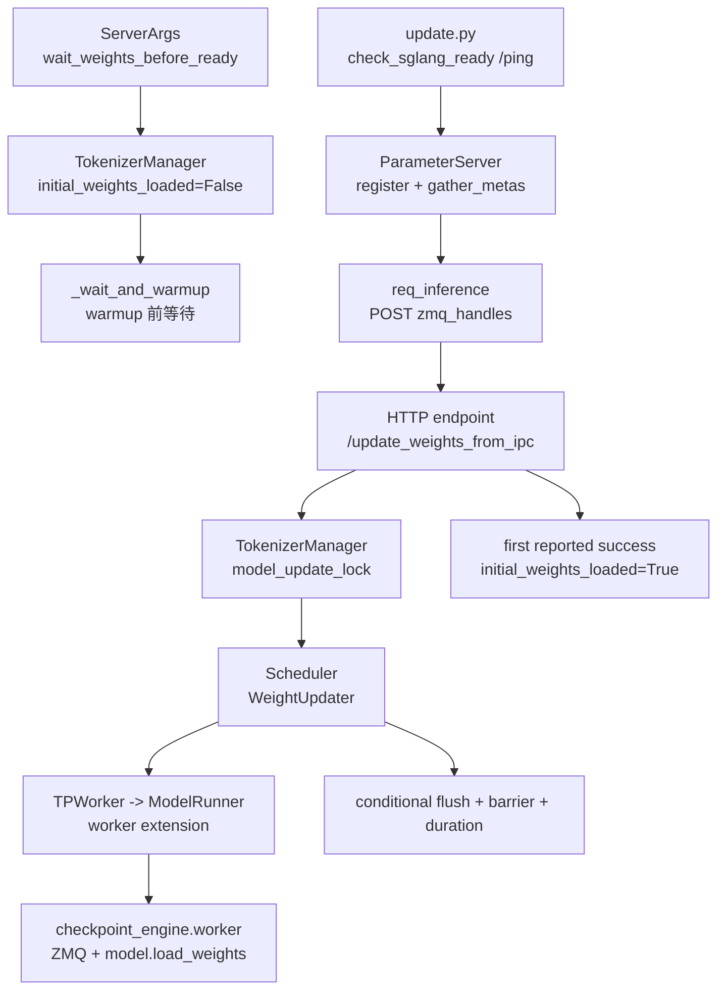

# CheckpointEngine · 源码走读

## 读者任务

这篇沿一次真实 IPC 热更新走源码：SGLang 用 dummy 权重启动并做有界等待；外部 `update.py` 通过 `/ping` 确认 HTTP 可达；ParameterServer 暴露每张 GPU 的 ZMQ handle；HTTP `/update_weights_from_ipc` 通知 SGLang；TokenizerManager 做并发控制，Scheduler 执行 target/draft 加载、条件 flush、barrier 和耗时记录；endpoint 根据控制面 success 翻转 `initial_weights_loaded`。

读完后要能判断：一个失败发生在外部脚本、HTTP 控制面、TokenizerManager 锁、Scheduler 执行面、ModelRunner 适配层，还是第三方 checkpoint-engine worker。

## 长文读法

这篇按“server 先 ready 到 HTTP，warmup 前用状态位有界等待 IPC 权重”读：SGLang 启动时把 `initial_weights_loaded` 置为 False，外部 `update.py` 只等 `/ping` 可达，再通过 ParameterServer 和 `/update_weights_from_ipc` 把 ZMQ handles 交给执行面。正常路径在超时前成功并翻转状态；异常路径超时后仍会继续 warmup。

| 读者任务 | 先读 | 要抓住的判断 |
|----------|------|--------------|
| 第一次建立 IPC 热更新主线 | 贯穿场景、1 到 3 | HTTP listen、状态位、warmup ready 是三个不同状态；等待超时会继续 |
| 排查外部脚本卡住 | 4 到 6 | `update.py` 先等 `/ping`，再注册 checkpoint、gather metas、调用 ParameterServer update |
| 排查 HTTP update 失败 | 7 到 8 | endpoint 负责转发，TokenizerManager 用 update lock 串行化执行 |
| 排查执行面失败 | 9 到 12 | Scheduler 把 IPC 请求交给 WeightUpdater，再下沉到 TPWorker 和 ModelRunner |
| 排查 GPU handle 对不上 | 13 | worker extension 用当前 GPU UUID 从 `zmq_handles` 里取对应 socket |
| 排查量化或加载后异常 | 14 | post hook 会补做 quant method postprocess 和模型级 post-load hook |

读的时候不要只看 `/update_weights_from_ipc` endpoint。真正的失败边界分布在外部更新脚本、TokenizerManager 控制面、Scheduler/Worker 执行面和 checkpoint-engine worker 四段。

## 贯穿场景

假设你启动：

```text
python -m sglang.launch_server \
  --load-format dummy \
  --checkpoint-engine-wait-weights-before-ready \
  --tensor-parallel-size 2
```

另一个终端运行：

```text
python -m sglang.srt.checkpoint_engine.update \
  --update-method broadcast \
  --checkpoint-path /path/to/checkpoint \
  --inference-parallel-size 2
```

主线如下：



这张图先给排障坐标：`/ping` 卡住看 D；HTTP 400 看 G 到 K；等待不释放看 M；更新后输出异常看 L 和 post hook。

## 第 1 步：启动参数选择等待模式

等待权重不是默认行为。源码把它做成显式参数，避免普通 serving 被 CheckpointEngine 语义影响。

```python
# 来源：python/sglang/srt/server_args.py L2505-L2508
    checkpoint_engine_wait_weights_before_ready: A[
        bool,
        "If set, the server will wait for initial weights to be loaded via checkpoint-engine or other update methods before serving inference requests.",
    ] = False
```

这个参数的系统压力是启动顺序反转：server 先起，真实权重后到。没有这个参数，普通冷启动路径会按已有模型加载和 warmup 继续走。

## 第 2 步：TokenizerManager 维护初始权重状态位

等待模式下，`initial_weights_loaded` 被置为 `False`。这不是 HTTP 是否 listen，也不是模型路径是否存在，而是“初始权重是否通过 update method 成功灌入”的状态位。

```python
# 来源：python/sglang/srt/managers/tokenizer_manager.py L459-L472
    def init_weight_update(self):
        # Initial weights status
        self.initial_weights_loaded = True
        if self.server_args.checkpoint_engine_wait_weights_before_ready:
            self.initial_weights_loaded = False

        # Weight updates
        # The event to notify the weight sync is finished.
        self.model_update_lock = RWLock()
        self.model_update_result: Optional[Awaitable[UpdateWeightFromDiskReqOutput]] = (
            None
        )
        self.is_pause = False
        self.is_pause_cond = asyncio.Condition()
```

同一处还初始化了更新锁和 pause 条件。后续 IPC update 会复用这些控制结构，不是在 HTTP handler 里临时加全局变量。

## 第 3 步：warmup 前等待权重

`_wait_and_warmup` 在 warmup 前检查等待开关。开启后，`_wait_weights_ready` 每秒轮询 `initial_weights_loaded`。关键边界是：超时只记录 error，函数正常返回，调用方随后继续 warmup。

```python
# 来源：python/sglang/srt/entrypoints/http_server.py L2145-L2158
def _wait_and_warmup(
    server_args: ServerArgs,
    launch_callback: Optional[Callable[[], None]] = None,
    execute_warmup_func: Callable = _execute_server_warmup,
):
    if server_args.checkpoint_engine_wait_weights_before_ready:
        _wait_weights_ready()

    # Send a warmup request
    if not server_args.skip_server_warmup:
        if not execute_warmup_func(server_args):
            return
    else:
        _global_state.tokenizer_manager.server_status = ServerStatus.Up
```

```python
# 来源：python/sglang/srt/entrypoints/http_server.py L2173-L2191
def _wait_weights_ready():
    """Wait for weights to be ready within the specified timeout."""
    timeout = WAIT_WEIGHTS_READY_TIMEOUT
    start_time = time.time()

    for _ in range(timeout):
        if _global_state.tokenizer_manager.initial_weights_loaded:
            logger.info(
                f"Weights are ready after {time.time() - start_time:.2f} seconds"
            )
            return
        time.sleep(1)

    # Timeout reached without weights being ready
    logger.error(
        f"Weights are not ready after waiting {timeout} seconds. "
        f"Consider increasing SGLANG_WAIT_WEIGHTS_READY_TIMEOUT environment variable. "
        f"Current status: initial_weights_loaded={_global_state.tokenizer_manager.initial_weights_loaded}"
    )
```

这一步解释两个常见误解：外部脚本能访问 `/ping`，不代表 warmup 已完成；状态位一直为 False，也不代表服务会永久停在门外。若 update 晚于超时，warmup 可能已经开始或结束，因此部署必须把超时当成严重故障，而不是安全等待。

## 第 4 步：外部脚本只等 HTTP 可达

`update.py` 的 `check_sglang_ready` 只轮询 `/ping`。只有每个 inference group 的 src rank 执行探活，其他 rank 直接返回。

```python
# 来源：python/sglang/srt/checkpoint_engine/update.py L49-L71
def check_sglang_ready(
    endpoint: str, inference_parallel_size: int, uds: str | None = None
):
    rank = int(os.getenv("RANK", 0))
    if rank != rank // inference_parallel_size * inference_parallel_size:
        return
    retry_num = 0
    transport = None
    if uds is not None:
        transport = httpx.HTTPTransport(uds=uds)
    with httpx.Client(transport=transport) as client:
        while True:
            try:
                response = client.get(f"{endpoint}/ping", timeout=10)
                response.raise_for_status()
                break
            except (httpx.ConnectError, httpx.HTTPStatusError) as e:
                if retry_num % 10 == 0:
                    logger.warning(
                        f"fail to check sglang ready, retry {retry_num} times, error: {e}"
                    )
                retry_num += 1
                time.sleep(0.1)
```

这里的 ready 是“HTTP endpoint 可连接”。脚本随后才会让 ParameterServer gather metadata，并触发 SGLang IPC load。

## 第 5 步：外部脚本把 ZMQ handles POST 给 SGLang

`req_inference` 负责生成回调函数。每个 inference group 只让 src rank 发 POST，请求体包含本 group 的 socket paths、默认 `flush_cache=True` 和可选 `weight_version`。

```python
# 来源：python/sglang/srt/checkpoint_engine/update.py L108-L134
def req_inference(
    endpoint: str,
    inference_parallel_size: int,
    timeout: float = 300.0,
    uds: str | None = None,
    weight_version: str | None = None,
) -> Callable[[list[tuple[str, str]]], None]:
    rank = int(os.getenv("RANK", 0))
    src = rank // inference_parallel_size * inference_parallel_size

    def req_func(socket_paths: list[tuple[str, str]]):
        if rank == src:
            with httpx.Client(transport=httpx.HTTPTransport(uds=uds)) as client:
                resp = client.post(
                    f"{endpoint}/update_weights_from_ipc",
                    json={
                        "zmq_handles": dict(
                            socket_paths[src : src + inference_parallel_size]
                        ),
                        "flush_cache": True,
                        "weight_version": weight_version,
                    },
                    timeout=timeout,
                )
                resp.raise_for_status()

    return req_func
```

注意这里没有 tensor payload。真实权重通过 checkpoint-engine 的 ZMQ 通道传，HTTP 只传控制信息。

## 第 6 步：ParameterServer 完成注册、元数据和 update

`update_weights` 串联外部侧的动作：注册 checkpoint、初始化 process group、等待 SGLang HTTP 可达、gather metas、可选保存 metas，然后根据 `update_method` 调用 `ps.update`。

```python
# 来源：python/sglang/srt/checkpoint_engine/update.py L137-L172
def update_weights(
    ps,
    checkpoint_name: str,
    checkpoint_files: list[str],
    named_tensors: dict[str, torch.Tensor],
    req_func: Callable[[list[tuple[str, str]]], None],
    inference_parallel_size: int,
    endpoint: str,
    save_metas_file: str | None = None,
    update_method: Literal["broadcast", "p2p", "all"] = "broadcast",
    uds: str | None = None,
):
    ps.register_checkpoint(
        checkpoint_name, files=checkpoint_files, named_tensors=named_tensors
    )
    ps.init_process_group()
    check_sglang_ready(endpoint, inference_parallel_size, uds)
    dist.barrier()
    with timer("Gather metas"):
        ps.gather_metas(checkpoint_name)
    if save_metas_file and int(os.getenv("RANK")) == 0:
        with open(save_metas_file, "wb") as f:
            pickle.dump(ps.get_metas(), f)

    if update_method == "broadcast" or update_method == "all":
        with timer("Update weights without setting ranks"):
            ps.update(checkpoint_name, req_func)

    if update_method == "p2p" or update_method == "all":
        if update_method:
            # sleep 2s to wait destroy process group
            time.sleep(2)
        with timer("Update weights with setting ranks"):
            ps.update(
                checkpoint_name, req_func, ranks=list(range(inference_parallel_size))
            )
```

SGLang 侧只看到 `req_func` 发来的 HTTP update 请求；checkpoint 注册、metadata、broadcast/p2p 策略属于外部 checkpoint-engine 流程。

脚本层还有两个边界：`all` 会顺序执行 broadcast 与 p2p 两次 `ps.update`；`--update-method` 没有 argparse `choices`，未知字符串会跳过两个分支而不主动报“方法非法”。因此脚本退出码和 SGLang 是否真的收到 POST 要分开验收。

## 第 7 步：HTTP endpoint 只转发并释放 ready

SGLang 的 HTTP endpoint 很薄。它调用 TokenizerManager，成功后释放初始权重等待；失败时返回 400。

```python
# 来源：python/sglang/srt/entrypoints/http_server.py L1306-L1322
@app.post("/update_weights_from_ipc")
@auth_level(AuthLevel.ADMIN_OPTIONAL)
async def update_weights_from_ipc(
    obj: Annotated[UpdateWeightsFromIPCReqInput, Body()], request: Request
):
    """Update the weights from IPC (Inter-Process Communication) for checkpoint-engine integration."""
    success, message = await _global_state.tokenizer_manager.update_weights_from_ipc(
        obj, request
    )

    content = {"success": success, "message": message}
    if success:
        if _global_state.tokenizer_manager.initial_weights_loaded is False:
            _global_state.tokenizer_manager.initial_weights_loaded = True
        return ORJSONResponse(content)
    else:
        return ORJSONResponse(content, status_code=HTTPStatus.BAD_REQUEST)
```

这一步的设计选择是让 HTTP 层不碰模型对象。它只负责控制面入口和 ready 状态翻转。

## 第 8 步：TokenizerManager 串行化更新

TokenizerManager 对 IPC update 做三件事：创建 handle loop，校验 DP 条件，按 pause 状态选择直接 fan-out 或拿 writer lock 后 fan-out。

```python
# 来源：python/sglang/srt/managers/tokenizer_control_mixin.py L486-L519
    async def update_weights_from_ipc(
        self: TokenizerManager,
        obj: UpdateWeightsFromIPCReqInput,
        request: Optional[fastapi.Request] = None,
    ) -> Tuple[bool, str]:
        """Update weights via IPC for checkpoint-engine integration."""
        self.auto_create_handle_loop()
        try:
            # For now, we only support single data parallel instance
            assert (
                self.server_args.dp_size == 1 or self.server_args.enable_dp_attention
            ), "dp_size must be 1 or dp attention must be enabled for update weights from IPC"
            logger.info("Starting IPC weight update")

            async with self.is_pause_cond:
                is_paused = self.is_pause
                if is_paused:
                    result = (await self.update_weights_from_ipc_communicator(obj))[0]
                    success, message = result.success, result.message

            if not is_paused:
                async with self.model_update_lock.writer_lock:
                    result = (await self.update_weights_from_ipc_communicator(obj))[0]
                    success, message = result.success, result.message
        except Exception as e:
            error_msg = f"IPC weight update failed: {str(e)}"
            logger.error(error_msg)
            success, message = False, error_msg

        if success and obj.weight_version is not None:
            self._update_weight_version_if_provided(obj.weight_version)
            message += f" Weight version updated to {obj.weight_version}."

        return success, message
```

这段有三个重要边界：`dp_size` 不满足条件会直接失败；非 paused 状态下，update 要等 writer lock，与推理持有的 reader lock 互斥；paused 状态下则在 `is_pause_cond` 内直接 fan-out，不再获取 writer lock，依赖既有 pause 语义。

```python
# 来源：python/sglang/srt/managers/tokenizer_manager.py L619-L626
            async with self.is_pause_cond:
                await self.is_pause_cond.wait_for(lambda: not self.is_pause)

            async with self.model_update_lock.reader_lock:
                await self._validate_and_resolve_lora(obj)

                # Tokenize the request and send it to the scheduler
                if obj.is_single:
```

还有一个容易漏掉的控制面缺口：`FanOutCommunicator` 会收齐 `dp_size` 个 response，但 IPC 路径只取结果列表 `[0]`。因此 DP-Attention 下第一个 scheduler 的 success 会决定 HTTP 返回和 weight-version 更新，后续 response 没有被 merge。

```python
# 来源：python/sglang/srt/managers/communicator.py L86-L96
    def handle_recv(self, recv_obj: T):
        self._result_values.append(recv_obj)
        if len(self._result_values) == self._fan_out:
            self._result_event.set()

    @staticmethod
    def merge_results(results):
        all_success = all([r.success for r in results])
        all_message = [r.message for r in results]
        all_message = " | ".join(all_message)
        return all_success, all_message
```

`weight_version` 的所有权也在这里：它没有传给 checkpoint-engine worker 做内容校验，而是在首 response success 后更新 TokenizerManager 的 `server_args.weight_version`。因此“版本字符串已更新”是控制面声明，不是权重 checksum 证明。

## 第 9 步：Scheduler 把 IPC 请求交给 WeightUpdater

Scheduler 的控制消息分发表把 `UpdateWeightsFromIPCReqInput` 绑定到 `weight_updater.update_weights_from_ipc`。

```python
# 来源：python/sglang/srt/managers/scheduler.py L1390-L1397
                (
                    UpdateWeightsFromTensorReqInput,
                    self.weight_updater.update_weights_from_tensor,
                ),
                (
                    UpdateWeightsFromIPCReqInput,
                    self.weight_updater.update_weights_from_ipc,
                ),
```

这一层只做请求类型到 handler 的路由。WeightUpdater 负责 worker 调用、条件 flush、barrier 和 duration；它不会在这里主动 pause，请求并发控制已经发生在 TokenizerManager。

## 第 10 步：WeightUpdater 负责 flush、metrics 和 barrier

IPC update 在 `_observe_weight_load("ipc")` 里执行。它先更新 target TP worker，再按需更新 draft worker；target 成功时调用 flush helper，但是否真正 flush 仍取决于 `recv_req.flush_cache`；最后做 TP CPU-group barrier。

```python
# 来源：python/sglang/srt/managers/scheduler_components/weight_updater.py L166-L178
    def update_weights_from_ipc(self, recv_req: UpdateWeightsFromIPCReqInput):
        """Update the online model parameter from IPC for checkpoint-engine integration."""
        with self._observe_weight_load("ipc"):
            success, message = self.tp_worker.update_weights_from_ipc(recv_req)
            tp_success = success
            if success and self.draft_worker is not None:
                success, message = self.draft_worker.update_weights_from_ipc(recv_req)
            if tp_success:
                self.flush_cache_after_weight_update(recv_req)
            if not success:
                logger.error(message)
            torch.distributed.barrier(group=self.tp_cpu_group)
            return UpdateWeightsFromIPCReqOutput(success=success, message=message)
```

`_observe_weight_load` 是 Observability 的连接点。它在更新结束时写 `weight_load_duration_seconds{source="ipc"}`。

```python
# 来源：python/sglang/srt/managers/scheduler_components/weight_updater.py L86-L99
    @contextmanager
    def _observe_weight_load(self, source: str) -> Iterator[None]:
        # Edge-trigger weight_load_duration_seconds at the end of each
        # update_weights_from_* call. Engine is paused during the update so
        # the periodic log_stats path can't carry this.
        # `source` distinguishes disk vs distributed vs tensor vs ipc.
        t0 = time.perf_counter()
        try:
            yield
        finally:
            if self.metrics_collector is not None:
                self.metrics_collector.observe_weight_load(
                    time.perf_counter() - t0, source
                )
```

这里解释了为什么热更新 duration 是边沿触发，而不是普通 stats tick 写入。因为 observe 位于 `finally`，失败或抛异常的尝试也可能刷新 gauge；它记录的是整个 context 的耗时，不是 success。

## 第 11 步：TPWorker 下沉到 ModelRunner

TPWorker 对 IPC update 只是薄转发。

```python
# 来源：python/sglang/srt/managers/tp_worker.py L176-L179
    def update_weights_from_ipc(self, recv_req: UpdateWeightsFromIPCReqInput):
        """Update weights from IPC for checkpoint-engine integration."""
        success, message = self.model_runner.update_weights_from_ipc(recv_req)
        return success, message
```

这保持了层次清晰：TPWorker 管 rank 入口，ModelRunner 才知道模型对象和 worker extension。

## 第 12 步：ModelRunner 延迟加载 checkpoint-engine integration

ModelRunner 在真正执行 IPC update 时才 import worker extension。缺包会转成失败消息；普通 serving 不受影响。

```python
# 来源：python/sglang/srt/model_executor/model_runner.py L3246-L3261
    def update_weights_from_ipc(self, recv_req):
        """Update weights from IPC for checkpoint-engine integration."""
        try:
            from sglang.srt.checkpoint_engine.checkpoint_engine_worker import (
                SGLangCheckpointEngineWorkerExtensionImpl,
            )

            # Create a worker extension that integrates with SGLang's model
            worker = SGLangCheckpointEngineWorkerExtensionImpl(self)
            worker.update_weights_from_ipc(recv_req.zmq_handles)
            return True, "IPC weight update completed successfully"
        except ImportError as e:
            return False, f"IPC weight update failed: ImportError {e}"
        except Exception as e:
            logger.error(f"IPC weight update failed: {e}")
            return False, str(e)
```

这一步是 SGLang 内部和外部 checkpoint-engine worker API 的适配点。

## 第 13 步：worker extension 用 UUID 选 handle 并调用第三方 worker

worker extension 拿当前 GPU UUID，在 `zmq_handles` 中取 socket path，然后调用第三方 `checkpoint_engine.worker.update_weights_from_ipc`。

```python
# 来源：python/sglang/srt/checkpoint_engine/checkpoint_engine_worker.py L69-L89
    def update_weights_from_ipc(self, zmq_handles: Dict[str, str]):
        """
        Update weights from IPC communication.
        Args:
            zmq_handles: Dict mapping device UUID to ZMQ socket path
        """
        if self._zmq_ctx is None:
            self._zmq_ctx = zmq.Context()
        device_uuid = self.get_device_uuid()
        device_id = self.get_device_id()
        if device_uuid not in zmq_handles:
            raise ValueError(
                f"Device UUID {device_uuid} not found in zmq_handles: {list(zmq_handles.keys())}"
            )
        update_weights_from_ipc(
            self._zmq_ctx,
            zmq_handles[device_uuid],
            device_id=device_id,
            run=self.get_model_loader(),
            post_hook=self.get_post_hook(),
        )
```

`run=self.get_model_loader()` 指向 `model_runner.model.load_weights`。这就是外部传输与 SGLang 模型加载的交界。

## 第 14 步：post hook 对齐量化和模型加载后处理

热更新后还要跑加载后处理。SGLang 的 post hook 处理 `quant_method.process_weights_after_loading`，并调用模型级 `post_load_weights`。

```python
# 来源：python/sglang/srt/checkpoint_engine/checkpoint_engine_worker.py L122-L141
        def post_hook():
            # Perform post-processing after weight loading similar to DefaultModelLoader
            try:
                from sglang.srt.model_loader.loader import device_loading_context

                # Process quantization methods after loading weights
                for _, module in self.model_runner.model.named_modules():
                    quant_method = getattr(module, "quant_method", None)
                    if quant_method is not None:
                        # Move parameters to device if needed for quantization processing
                        target_device = torch.device(
                            "cuda", torch.cuda.current_device()
                        )
                        with device_loading_context(module, target_device):
                            quant_method.process_weights_after_loading(module)
                # Call model-specific post-loading hook if available
                if hasattr(self.model_runner.model, "post_load_weights"):
                    self.model_runner.model.post_load_weights()
            except Exception as e:
                logger.warning(f"Post-hook processing failed: {e}")
```

因为异常只写 warning，量化模型热更新后需要把这个 warning 纳入验证，而不能只看 HTTP response 成功。

## 运行验证

| 验证点 | 方法 | 预期 |
|--------|------|------|
| 等待模式 | 加 `--checkpoint-engine-wait-weights-before-ready` 启动，并故意不推权重直到超时 | 出现 error 后继续进入 warmup 路径，证明它不是 fail-closed gate |
| HTTP 可达 | 外部脚本轮询 `/ping` | `/ping` 成功只表示 HTTP listen |
| 初始权重状态位 | 首次成功 POST `/update_weights_from_ipc` | HTTP endpoint 把 `initial_weights_loaded` 置为 `True`；DP-Attention 下仍需逐 scheduler 验证 |
| DP 约束 | `dp_size > 1` 且未开 DP attention 时调用 IPC update | TokenizerManager 返回失败消息 |
| UUID 对齐 | 打印 `zmq_handles` keys 和当前 GPU UUID | 当前 UUID 必须存在于请求 dict |
| cache flush | 分别用 `flush_cache=True/False` 热更新 | 只有 target 成功且开关为 True 时调用真正 flush；False 必须由调用方承担旧 KV 风险 |
| metrics | 开启 metrics 后分别做成功和失败更新 | 两次都可能更新 `weight_load_duration_seconds{source="ipc"}` |
| post hook | 量化模型热更新 | 不应出现 `Post-hook processing failed` warning |

## 复盘

- CheckpointEngine 主线是控制面和适配层，不是 SGLang 内部实现 ParameterServer。
- `/ping` 可达、初始权重状态位、warmup 完成是三件事；等待超时不会 fail closed。
- IPC HTTP body 传 handles，真实 tensor 走外部 checkpoint-engine ZMQ 通道。
- TokenizerManager 负责 reader/writer 或 paused 分支；WeightUpdater 负责 target/draft、条件 flush、barrier 和尝试耗时。当前实现没有事务回滚，也没有合并 IPC 的全部 DP response。
- GPU UUID 是 handles 和本地 worker 对齐的关键不变量。

下一篇 [[SGLang-CheckpointEngine-数据流]] 会把这条链路按进程边界和状态流再拆一遍。
