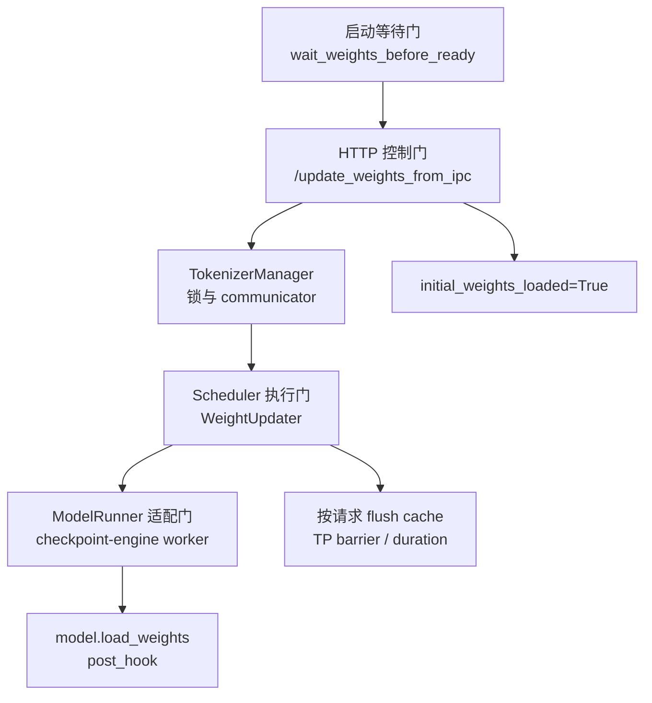

# CheckpointEngine

## 读者任务

这一组笔记解决一个生产问题：SGLang server 已经占住 GPU 并开始运行，训练侧或外部参数服务生成了新 base model 权重，如何在不重启 serving 进程的情况下把新权重灌进去。

读完要能做四件事：

- 区分 HTTP `/ping` 可达、`initial_weights_loaded` 状态位、warmup 完成、业务可服务这四种状态，并知道等待超时并不会 fail closed。
- 沿 `/update_weights_from_ipc` 追到 TokenizerManager、Scheduler、WeightUpdater、TPWorker、ModelRunner 和 checkpoint-engine worker extension。
- 解释为什么 IPC 请求只传 `zmq_handles`，不把 tensor 放进 HTTP body。
- 排查热更新失败：缺 checkpoint-engine 包、GPU UUID 不匹配、DP 约束不满足、cache flush 后命中率下降、draft worker 更新失败。

## 先建立模型

CheckpointEngine 在 SGLang 侧不是一个新的模型加载器，而是一条运行时权重替换通道。外部 checkpoint-engine 包负责 ParameterServer、ZMQ handle 和权重传输；SGLang 负责 serving 侧四道门：



这张图的读法是：外部脚本先等 HTTP 可连接，再 POST IPC handles；HTTP endpoint 依据 TokenizerManager 返回的 success 翻转初始权重状态。这个状态是“有界等待”的条件，不是永久硬门：超时只记 error，随后仍会继续 warmup。cache 只在 `flush_cache=True` 且主 target worker 成功时刷新；duration 即使失败也会在 `finally` 更新。

## 源码范围

| 责任 | 源码入口 |
|------|----------|
| 启动等待开关与等待循环 | `python/sglang/srt/server_args.py`、`python/sglang/srt/entrypoints/http_server.py` |
| HTTP update endpoint | `python/sglang/srt/entrypoints/http_server.py` |
| 权重 ready 状态、锁、communicator | `python/sglang/srt/managers/tokenizer_manager.py`、`python/sglang/srt/managers/tokenizer_control_mixin.py` |
| Scheduler 控制消息路由 | `python/sglang/srt/managers/scheduler.py` |
| 并发锁、paused 分支、DP 结果处理 | `python/sglang/srt/managers/tokenizer_control_mixin.py`、`python/sglang/srt/managers/communicator.py` |
| metrics、条件 flush、barrier | `python/sglang/srt/managers/scheduler_components/weight_updater.py` |
| rank 侧执行与模型加载适配 | `python/sglang/srt/managers/tp_worker.py`、`python/sglang/srt/model_executor/model_runner.py` |
| checkpoint-engine worker extension | `python/sglang/srt/checkpoint_engine/checkpoint_engine_worker.py` |
| 外部 torchrun 更新脚本 | `python/sglang/srt/checkpoint_engine/update.py` |

## 最小源码证据

HTTP 入口证明 SGLang 的 IPC update 是控制面请求。请求成功后，如果初始权重尚未 ready，才把 `initial_weights_loaded` 翻成 `True`。

```python
# 来源：python/sglang/srt/entrypoints/http_server.py L1306-L1322
@app.post("/update_weights_from_ipc")
@auth_level(AuthLevel.ADMIN_OPTIONAL)
async def update_weights_from_ipc(
    obj: Annotated[UpdateWeightsFromIPCReqInput, Body()], request: Request
):
    """Update the weights from IPC (Inter-Process Communication) for checkpoint-engine integration."""
    success, message = await _global_state.tokenizer_manager.update_weights_from_ipc(
        obj, request
    )

    content = {"success": success, "message": message}
    if success:
        if _global_state.tokenizer_manager.initial_weights_loaded is False:
            _global_state.tokenizer_manager.initial_weights_loaded = True
        return ORJSONResponse(content)
    else:
        return ORJSONResponse(content, status_code=HTTPStatus.BAD_REQUEST)
```

真正跨到 checkpoint-engine 的点在 worker extension。它按当前 GPU UUID 从 `zmq_handles` 里取 socket path，再把模型 loader 和 post hook 交给第三方 worker。

```python
# 来源：python/sglang/srt/checkpoint_engine/checkpoint_engine_worker.py L69-L89
    def update_weights_from_ipc(self, zmq_handles: Dict[str, str]):
        """
        Update weights from IPC communication.
        Args:
            zmq_handles: Dict mapping device UUID to ZMQ socket path
        """
        if self._zmq_ctx is None:
            self._zmq_ctx = zmq.Context()
        device_uuid = self.get_device_uuid()
        device_id = self.get_device_id()
        if device_uuid not in zmq_handles:
            raise ValueError(
                f"Device UUID {device_uuid} not found in zmq_handles: {list(zmq_handles.keys())}"
            )
        update_weights_from_ipc(
            self._zmq_ctx,
            zmq_handles[device_uuid],
            device_id=device_id,
            run=self.get_model_loader(),
            post_hook=self.get_post_hook(),
        )
```

所以排障时不要把 SGLang 文档读成“它实现了 ParameterServer”。SGLang 实现的是 serving 侧适配：接 HTTP 控制请求、在非 paused 路径用 writer lock 排除推理 reader、调用本 rank loader、按请求刷新 cache，并返回控制面结果。它不提供事务回滚；paused 路径也不会再次获取 writer lock。

## 阅读顺序

| 目标 | 先读 |
|------|------|
| 第一次建立整体模型 | [[SGLang-CheckpointEngine-核心概念]] |
| 沿一次 IPC 热更新追源码 | [[SGLang-CheckpointEngine-源码走读]] |
| 看跨进程、跨 rank、cache、metrics 数据流 | [[SGLang-CheckpointEngine-数据流]] |
| 排查 not ready、UUID mismatch、缺包、flush 后命中率下降 | [[SGLang-CheckpointEngine-排障指南]] |
| 自检是否真正读懂 | [[SGLang-CheckpointEngine-学习检查]] |

## 关联专题

- 冷启动和其他权重加载路径见 [[SGLang-ModelLoader]]。
- 热更新期间的 `weight_load_duration_seconds`、`cache_hit_rate` 与 HTTP 结果见 [[SGLang-可观测性]]；当前基线的 `num_paused_reqs` 未找到递增写入，不能拿来量化 IPC 影响。
- base model 与 LoRA adapter 的边界见 [[SGLang-LoRA]]。
- Slime 侧训练到 rollout 权重推送见 [[Slime-分布式权重同步]]、[[Slime-RL训练全链路]]。

## 下一步

先读 [[SGLang-CheckpointEngine-核心概念]]。如果正在排障，直接跳到 [[SGLang-CheckpointEngine-排障指南]] 的症状表。
