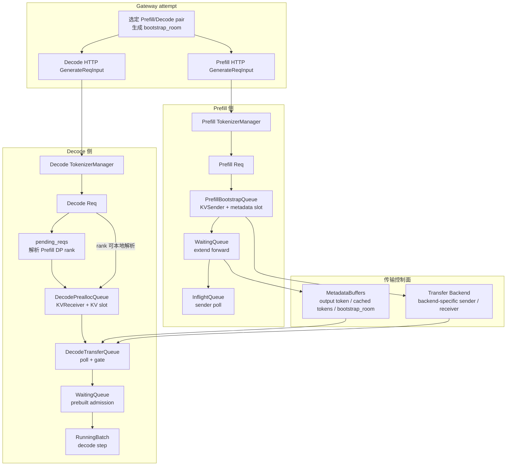
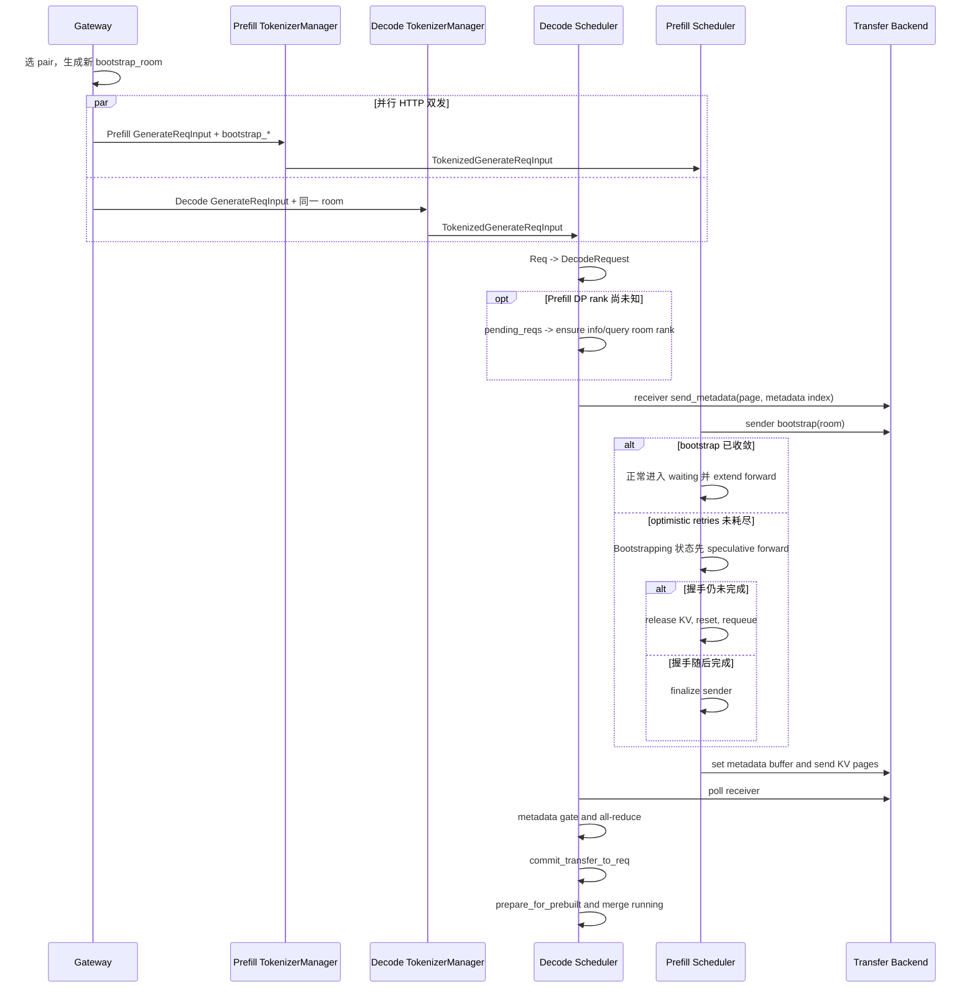

# PD分离 · 数据流

## 你为什么要读

这篇回答“对象在跨 Gateway、两套服务、transfer、Decode 时长什么样”。如果 [[SGLang-PD分离-源码走读]] 关注执行顺序，本篇关注状态归属：Gateway 的一次 attempt 如何生成两个 HTTP 请求，哪个字段把它们重新关联，哪个 buffer 是跨节点 metadata，哪个队列持有请求，哪个对象最终进入 running batch。

读完应能解决三类问题：

1. 判断一个请求卡在 room 路由、Decode prealloc、KV transfer、metadata gate 还是 `PREBUILT` merge。
2. 看懂 `bootstrap_room` 为什么同时出现在请求、metadata buffer、DP controller 和 transfer queue。
3. 修改 PD 相关配置时，知道它改的是容量、传输、缓存还是调度账。

## 怎么读这篇

先按症状选择一条线，不要同时追完所有队列：

| 现象 | 先读 |
|------|------|
| Prefill 已完成，Decode 迟迟不开始 | metadata 线、执行线 |
| room 找不到或跨节点关联失败 | 请求线 |
| Decode 侧看似有显存却无法接单 | 队列线、容量线 |
| KV 传输完成但结果校验失败 | metadata 线、交互时序 |
| 改配置后容量或行为和预期相反 | 配置线、排查入口 |

每次只跟一个 `bootstrap_room`，同时记录 Prefill 请求、transfer 状态、Decode prealloc 和最终 `PREBUILT` merge。否则多个并发请求的日志会把因果顺序搅在一起。

## 一张对象地图



把数据流拆成四条线：

| 线 | 起点 | 终点 | 判断问题 |
|----|------|------|----------|
| 请求线 | Gateway attempt | Prefill/Decode 两个 `Req` | pair、room、prompt 是否一致进入两套 Scheduler |
| KV 线 | Prefill KV pool | Decode KV pool | page indices 和 state indices 是否收发完成 |
| metadata 线 | `MetadataBuffers.set_buf` | `_commit_transfer_to_req` | 首 token、cached tokens、room 校验是否落地 |
| 执行线 | transferred `Req` | `RunningBatch` | `PREBUILT` 是否补齐 batch metadata |

## 请求线：room 是跨节点主键

Gateway 向两套服务各发一个请求；每套服务都独立完成 normalize、建 `ReqState`、tokenize 和向本地 Scheduler 投递。PD 字段不是共享对象引用，而是复制进两侧请求并分别进入两个 `Req`，随后贯穿调度、路由和校验。

```python
# 来源：python/sglang/srt/managers/io_struct.py L822-L827
    # For disaggregated inference
    bootstrap_host: Optional[str] = None
    bootstrap_port: Optional[int] = None
    bootstrap_room: Optional[int] = None
    bootstrap_pair_key: Optional[str] = None
    decode_tp_size: Optional[int] = None
```

batch 或 parallel sample 会对 room 做规范化：没有 room 时填 `None`，单个 room 会扩成连续 room，已有 list 会按 parallel sample 数复制。

```python
# 来源：python/sglang/srt/managers/io_struct.py L659-L665
        # Normalize bootstrap_room
        if self.bootstrap_room is None:
            self.bootstrap_room = [None] * num
        elif not isinstance(self.bootstrap_room, list):
            self.bootstrap_room = [self.bootstrap_room + i for i in range(num)]
        elif isinstance(self.bootstrap_room, list):
            self.bootstrap_room = self.bootstrap_room * self.parallel_sample_num
```

Prefill 的默认 DP load balance 会跟随 room，把请求送到 `room % workers` 的 rank：

```python
# 来源：python/sglang/srt/managers/data_parallel_controller.py L628-L637
    def follow_bootstrap_room_scheduler(self, req: Req):
        if self.maybe_external_dp_rank_routing(req):
            return

        assert req.bootstrap_room is not None, (
            "req.bootstrap_room should not be None. Do not send requests directly to "
            "prefill or decode instances; send to the router instead."
        )
        target_rank = req.bootstrap_room % len(self.workers)
        sock_send(self.workers[target_rank], req)
```

不变量：

- 真实 backend 下 `bootstrap_room` 不能缺失。
- 同一次 Gateway attempt 的 Prefill/Decode 请求必须使用同一 room；下一次 Gateway retry 必须生成新 room，不能复用可能已有半成状态的旧 room。
- batch 请求不能让多个 parallel sample 复用同一 room。
- 直连 prefill/decode 调试时，必须手动补齐 gateway 平时会分配的 room。

## 队列线：Prefill 和 Decode 的等待区不是对称的

Prefill 的名义生命周期是 bootstrap、waiting、inflight。默认 `optimistic_prefill_retries=0` 时，GPU forward 发生在 bootstrap 完成后的 waiting；显式开启 optimistic 模式后，`Bootstrapping` 请求也可能先进入 waiting 做 speculative forward，若握手仍未完成则释放本轮 KV 并回到 bootstrap 路径。KV 传输完成仍发生在 inflight。

```python
# 来源：python/sglang/srt/disaggregation/prefill.py L1-L18
"""
Life cycle of a request in the prefill server

1. Bootstrap Queue
    a. Initialize a sender for each request
    b. Use the queue to store requests whose bootstrap (handshake and preallocation) has not finished
    c. Poll senders to check bootstrap state
    d. Once bootstrap is complete, move request to Waiting Queue

2. Waiting Queue
    a. Use PrefillAdder to pop requests
    b. Run forward
    c. Add the request to Inflight Queue

3. Inflight Queue
    a. Poll (non-blocking) the sender of the request
    b. Once the transfer has finished, return the request
"""
```

Decode 的生命周期是 prealloc、transfer、waiting、running。它先占 KV/metadata 位置，再等 Prefill 发数据。

```python
# 来源：python/sglang/srt/disaggregation/decode.py L1-L19
"""
Life cycle of a request in the decode server

1. PreallocQueue:
    a. Initialize a receiver for each request
    b. The request handshakes first, and pre-allocate kv once there is available kv.
    c. Move the request to TransferQueue.

2. TransferQueue:
    a. Poll the receiver to check the transfer state
    b. If the transfer has finished, move the request to waiting queue

3. WaitingQueue:
    a. Use the requests in the queue to construct a PrebuiltExtendBatch
    b. Skip the prefill forward but only populate metadata

4. RunningBatch:
    a. Merge the resolved PrebuiltExtendBatch into running batch to run decoding
"""
```

因此“请求在 PD 里等待”至少有七种含义：

| 队列 | 持有对象 | 等待的资源 |
|------|----------|------------|
| Prefill bootstrap | `Req` + `KVSender` | Decode handshake、metadata slot |
| Prefill waiting | `Req` | Prefill GPU/KV budget |
| Prefill inflight | `Req` + sender | KV transfer 完成 |
| Decode prealloc | `DecodeRequest` + receiver | KV slot、metadata slot、prefix restore |
| Decode transfer | `DecodeRequest` | receiver poll、metadata gate、all-reduce |
| Decode waiting | `Req` | running batch 空位、grammar ready |
| Decode running | `ScheduleBatch` | 普通 decode step |

## 容量线：Decode prealloc 有额外槽位

PD 的吞吐收益来自流水线重叠：Decode 可以预先为 in-transfer 请求占位，不必把它们全部计入 running 上限。

```python
# 来源：python/sglang/srt/disaggregation/decode.py L107-L133
class DecodeReqToTokenPool:
    """
    The difference of DecodeReqToTokenPool and ReqToTokenPool is that
    DecodeReqToTokenPool subscribes memory for pre-allocated requests.

    In ReqToTokenPool, if `--max-running-requests` is 8,
    #pre-allocated + #transfer + #running <= 8, but there are in fact more memory can carry pre-allocated requests.

    In DecodeReqToTokenPool, if `--max-running-requests` is 8,
    #running <= 8, #pre-allocated + #transfer <= pre_alloc_size, so we can use the free memory to pre-allocate requests to unblock prefill.
    """

    def __init__(
        self,
        size: int,
        max_context_len: int,
        device: str,
        enable_memory_saver: bool,
        pre_alloc_size: int,
    ):
        memory_saver_adapter = TorchMemorySaverAdapter.create(
            enable=enable_memory_saver
        )

        self.size = size
        # +1 padding row at index 0; see ReqToTokenPool for rationale.
        self._alloc_size = size + pre_alloc_size + 1
```

启动 hook 会给小 running batch 默认预留额外 prealloc slots：

```python
# 来源：python/sglang/srt/arg_groups/pd_disaggregation_hook.py L58-L70
        # Default the number of *extra* decode req_to_token slots reserved for
        # in-transfer (being-received-from-prefill) requests, on top of the
        # max_running_requests-derived pool. Large batches get none; small
        # per-worker batches reserve 2x the batch as cheap overlap headroom.
        if server_args.disaggregation_decode_extra_slots is None:
            extra_slots = 0
            if server_args.max_running_requests is not None:
                per_worker = server_args.max_running_requests // max(
                    1, server_args.dp_size
                )
                if per_worker <= 32:
                    extra_slots = per_worker * 2
            server_args.disaggregation_decode_extra_slots = extra_slots
```

这条线解释了一个常见现象：Prefill 堵住时，不一定是 Prefill GPU 忙，可能是 Decode 侧 prealloc slot、KV slot 或 metadata slot 耗尽，导致 Prefill sender 没有可用接收端。

## metadata 线：首 token 与校验值走共享 buffer

`MetadataBuffers` 不只是 logprob 附件。它是 Prefill 向 Decode 交接首 token、cache 统计、投机字段和 room 校验的控制面。

```python
# 来源：python/sglang/srt/disaggregation/utils.py L225-L282
        size: int,
        hidden_size: int,
        hidden_states_dtype: torch.dtype,
        max_top_logprobs_num: int = 128,
        custom_mem_pool: torch.cuda.MemPool = None,
    ):
        self.custom_mem_pool = custom_mem_pool
        bootstrap_room_dtype = torch.uint64
        device = "cpu"
        if is_npu():
            # For ascend backend, output tokens are placed in the NPU and will be transferred by D2D channel.
            device = "npu"
            # TODO: Fix me when npu backend supports torch.uint64
            bootstrap_room_dtype = torch.int64
        elif self.custom_mem_pool:
            # TODO(shangming): Fix me (use 'cuda') when nvlink_transport of Mooncake is bug-free
            device = "cpu"
        elif envs.SGLANG_MOONCAKE_CUSTOM_MEM_POOL.get() == "INTRA_NODE_NVLINK":
            device = "cuda"
        with (
            torch.cuda.use_mem_pool(self.custom_mem_pool)
            if self.custom_mem_pool
            else nullcontext()
        ):
            # TODO: abort top_logprobs_num > 128 in PD

            # We transfer the metadata of first output token to decode
            # The minimal size for RDMA is 64Bytes, so we pad it to > 64Bytes
            self.output_ids = torch.zeros((size, 16), dtype=torch.int32, device=device)
            self.cached_tokens = torch.zeros(
                (size, 16), dtype=torch.int32, device=device
            )
            self.output_token_logprobs_val = torch.zeros(
                (size, 16), dtype=torch.float32, device=device
            )
            self.output_token_logprobs_idx = torch.zeros(
                (size, 16), dtype=torch.int32, device=device
            )
            self.output_top_logprobs_val = torch.zeros(
                (size, max_top_logprobs_num), dtype=torch.float32, device=device
            )
            self.output_top_logprobs_idx = torch.zeros(
                (size, max_top_logprobs_num), dtype=torch.int32, device=device
            )
            # For PD + spec decode
            self.output_topk_p = torch.zeros(
                (size, 16), dtype=torch.float32, device=device
            )
            self.output_topk_index = torch.zeros(
                (size, 16), dtype=torch.int64, device=device
            )
            self.output_hidden_states = torch.zeros(
                (size, hidden_size), dtype=hidden_states_dtype, device=device
            )
            # Request validation: store bootstrap_room to detect metadata corruption
            self.bootstrap_room = torch.zeros(
                (size, 8), dtype=bootstrap_room_dtype, device=device
            )
```

buffer 对外暴露的是每个 tensor 的 data pointer 和长度，供 transfer backend 注册和搬运：

```python
# 来源：python/sglang/srt/disaggregation/utils.py L284-L307
    def get_buf_infos(self):
        ptrs = [
            self.output_ids.data_ptr(),
            self.cached_tokens.data_ptr(),
            self.output_token_logprobs_val.data_ptr(),
            self.output_token_logprobs_idx.data_ptr(),
            self.output_top_logprobs_val.data_ptr(),
            self.output_top_logprobs_idx.data_ptr(),
            self.output_topk_p.data_ptr(),
            self.output_topk_index.data_ptr(),
            self.output_hidden_states.data_ptr(),
            self.bootstrap_room.data_ptr(),
        ]
        data_lens = [
            self.output_ids.nbytes,
            self.cached_tokens.nbytes,
            self.output_token_logprobs_val.nbytes,
            self.output_token_logprobs_idx.nbytes,
            self.output_top_logprobs_val.nbytes,
            self.output_top_logprobs_idx.nbytes,
            self.output_topk_p.nbytes,
            self.output_topk_index.nbytes,
            self.output_hidden_states.nbytes,
            self.bootstrap_room.nbytes,
```

Prefill 最后写 room，Decode 用它判断 metadata 是否真正可见：

```python
# 来源：python/sglang/srt/disaggregation/utils.py L398-L401
        # Store bootstrap_room for validation on decode side
        self.bootstrap_room[req.metadata_buffer_index, 0] = (
            req.bootstrap_room if req.bootstrap_room is not None else 0
        )
```

metadata 的生命周期是：

1. Decode prealloc 分配 `metadata_buffer_index`，把 index 发给 receiver。
2. Prefill `finalize_bootstrap` 分配或复用同一 index，初始化 sender。
3. Prefill last chunk 前调用 `set_buf(req)` 写首 token 和 room。
4. Decode poll 时先看 `bootstrap_room[idx, 0]` 是否非 0。
5. Decode commit 后重置 room 为 0 并释放 index。

## 执行线：`PREBUILT` 是数据形态转换点

transfer 完成后，请求不再是“等待 prefill 的 prompt”，而是“Prefill 已经完成、等待接入 decode 的 batch item”。`prepare_for_prebuilt` 负责把它转成执行层需要的 batch 字段。

```python
# 来源：python/sglang/srt/disaggregation/decode_schedule_batch_mixin.py L77-L108
        # Set fields
        self.input_ids = torch.tensor(
            sum(input_ids, array("q")), dtype=torch.int32, device=self.device
        )
        self.req_pool_indices = torch.tensor(
            req_pool_indices, dtype=torch.int64, device=self.device
        )
        self.req_pool_indices_cpu = torch.tensor(req_pool_indices, dtype=torch.int64)
        self.seq_lens = torch.tensor(seq_lens, dtype=torch.int64, device=self.device)
        self.seq_lens_cpu = torch.tensor(seq_lens, dtype=torch.int64)
        self.orig_seq_lens = torch.tensor(
            seq_lens, dtype=torch.int32, device=self.device
        )
        self.out_cache_loc = out_cache_loc
        self.seq_lens_sum = sum(seq_lens)

        if self.return_logprob:
            self.top_logprobs_nums = [r.logprob.top_logprobs_num for r in reqs]
            self.token_ids_logprobs = [r.logprob.token_ids_logprob for r in reqs]

        self.extend_num_tokens = extend_num_tokens
        self.prefix_lens = [len(r.prefix_indices) for r in reqs]
        self.extend_lens = [r.extend_range.length for r in reqs]
        self.extend_logprob_start_lens = None
        self.extend_input_logprob_token_ids = None
        self.multimodal_inputs = [r.multimodal_inputs for r in reqs]

        # Build sampling info
        self.sampling_info = SamplingBatchInfo.from_schedule_batch(
            self,
            self.model_config.vocab_size,
        )
```

然后 `get_next_disagg_decode_batch_to_run` 把 prebuilt batch 过滤后合入 running batch：

```python
# 来源：python/sglang/srt/disaggregation/decode.py L1871-L1904
    @scheduler_nvtx_method("scheduler.get_next_batch_to_run")
    def get_next_disagg_decode_batch_to_run(
        self: Scheduler,
    ) -> Optional[ScheduleBatch]:
        """Process prebuilt batch and schedule the next decode batch."""
        # Process pending prebuilt batch: output processing + filter + merge
        new_prebuilt_batch = self.get_new_prebuilt_batch()
        if new_prebuilt_batch:
            assert self.chunked_req is None
            self.batch_result_processor.process_batch_result_prebuilt(
                new_prebuilt_batch
            )
            new_prebuilt_batch.filter_batch()
            if not new_prebuilt_batch.is_empty():
                if self.running_batch.is_empty():
                    self.running_batch = new_prebuilt_batch
                    if self.enable_hisparse:
                        self.running_batch.hisparse_coordinator = (
                            self.hisparse_coordinator
                        )
                else:
                    self.running_batch.merge_batch(new_prebuilt_batch)

        # Schedule decode batch
        if self.running_batch.is_empty():
            ret = None
        else:
            self.running_batch = self.update_running_batch(self.running_batch)
            ret = self.running_batch if not self.running_batch.is_empty() else None

        ret = self.dp_attn_adapter.maybe_prepare_mlp_sync_batch(ret)
        if ret:
            set_schedule_time_batch(ret)
        return ret
```

因此 dataflow 的终点不是 transfer backend 的 Success，而是 `running_batch.merge_batch(new_prebuilt_batch)` 或 `self.running_batch = new_prebuilt_batch`。

## 配置线：开关各自改哪本账

PD server args 定义了 mode、backend、bootstrap port、decode radix cache、offload、extra slots 和 polling interval。

```python
# 来源：python/sglang/srt/server_args.py L2334-L2372
    disaggregation_mode: A[
        Literal["null", "prefill", "decode"],
        'Only used for PD disaggregation. "prefill" for prefill-only server, and "decode" for decode-only server. If not specified, it is not PD disaggregated',
    ] = "null"
    disaggregation_transfer_backend: A[
        str,
        Arg(
            help="The backend for disaggregation transfer. Default is mooncake.",
            choices=DISAGG_TRANSFER_BACKEND_CHOICES,
        ),
    ] = "mooncake"
    disaggregation_bootstrap_port: A[
        int,
        "Bootstrap server port on the prefill server. Default is 8998.",
    ] = 8998
    disaggregation_ib_device: A[
        Optional[str],
        'The InfiniBand devices for disaggregation transfer. Supports a single device (e.g., --disaggregation-ib-device mlx5_0), a shared comma-separated list (e.g., --disaggregation-ib-device mlx5_0,mlx5_1), a per-GPU JSON mapping (e.g., --disaggregation-ib-device \'{"0": "mlx5_0,mlx5_1", "1": "mlx5_2"}\'), or a path to a JSON file containing that mapping. Default is None, which triggers automatic device detection when mooncake backend is enabled.',
    ] = None
    disaggregation_decode_enable_radix_cache: A[
        bool,
        "Enable radix cache on decode server (PD mode). Caches KV prefixes to avoid redundant transfers. Incompatible with --enable-hisparse, speculative decoding, and --disaggregation-transfer-backend fake.",
    ] = False
    disaggregation_decode_enable_offload_kvcache: A[
        bool,
        "Enable async KV cache offloading on decode server (PD mode).",
    ] = False
    num_reserved_decode_tokens: A[
        int,
        "Number of decode tokens that will have memory reserved when adding new request to the running batch.",
    ] = 512
    disaggregation_decode_extra_slots: A[
        Optional[int],
        "Number of extra decode req_to_token slots pre-allocated for in-transfer requests (PD mode). If unset, defaults to 0 (or 2x the per-worker running batch for small batches).",
    ] = None
    disaggregation_decode_polling_interval: A[
        int,
        "The interval to poll requests in decode server. Can be set to >1 to reduce the overhead of this.",
    ] = 1
```

启动 hook 会把 decode radix cache、fake backend、speculative、HiSparse 和 staging buffer 的互斥关系提前校验：

```python
# 来源：python/sglang/srt/arg_groups/pd_disaggregation_hook.py L29-L88
    if server_args.disaggregation_mode == "decode":
        if server_args.disaggregation_decode_enable_radix_cache:
            if server_args.enable_hisparse:
                raise ValueError(
                    "--disaggregation-decode-enable-radix-cache is incompatible "
                    "with --enable-hisparse"
                )
            if server_args.disaggregation_transfer_backend == "fake":
                raise ValueError(
                    "--disaggregation-decode-enable-radix-cache is incompatible "
                    "with --disaggregation-transfer-backend fake"
                )
            if server_args.speculative_algorithm is not None:
                raise ValueError(
                    "--disaggregation-decode-enable-radix-cache is incompatible "
                    "with speculative decoding "
                    f"(--speculative-algorithm {server_args.speculative_algorithm})"
                )
            if server_args.enable_dp_attention:
                logger.warning(
                    "EXPERIMENTAL: Decode radix cache with DP attention. "
                    "Requires prefix-aware DP rank routing for optimal cache hits."
                )
            server_args.disable_radix_cache = False
            logger.warning("EXPERIMENTAL: Radix cache is enabled for decode server")
        else:
            server_args.disable_radix_cache = True
            logger.warning("KV cache is forced as chunk cache for decode server")

        # Default the number of *extra* decode req_to_token slots reserved for
        # in-transfer (being-received-from-prefill) requests, on top of the
        # max_running_requests-derived pool. Large batches get none; small
        # per-worker batches reserve 2x the batch as cheap overlap headroom.
        if server_args.disaggregation_decode_extra_slots is None:
            extra_slots = 0
            if server_args.max_running_requests is not None:
                per_worker = server_args.max_running_requests // max(
                    1, server_args.dp_size
                )
                if per_worker <= 32:
                    extra_slots = per_worker * 2
            server_args.disaggregation_decode_extra_slots = extra_slots

    elif server_args.disaggregation_mode == "prefill":
        assert (
            server_args.disaggregation_transfer_backend != "fake"
        ), "Prefill server does not support 'fake' as the transfer backend"

        server_args.disable_cuda_graph = True

    if server_args.disaggregation_mode in ("prefill", "decode"):
        if (
            envs.SGLANG_DISAGG_STAGING_BUFFER.get()
            and server_args.disaggregation_transfer_backend not in ("mooncake", "nixl")
        ):
            raise ValueError(
                f"SGLANG_DISAGG_STAGING_BUFFER requires "
                f"disaggregation_transfer_backend='mooncake' or 'nixl', "
                f"got '{server_args.disaggregation_transfer_backend}'."
            )
```

配置影响表：

| 配置 | 改哪条线 | 典型现象 |
|------|----------|----------|
| `disaggregation_mode` | 队列线、执行线 | 进入 prefill/decode 专用 event loop |
| `disaggregation_transfer_backend` | KV 线、metadata 线 | receiver/sender 类与底层传输语义改变 |
| `disaggregation_bootstrap_port` | 请求线 | sender/receiver bootstrap 地址改变 |
| `disaggregation_decode_extra_slots` | 容量线 | Decode 可提前接收的 in-transfer 请求数改变 |
| `disaggregation_decode_enable_radix_cache` | metadata 线、执行线 | prefix match 和 committed KV 边界改变 |
| `SGLANG_DISAGG_STAGING_BUFFER` | KV 线 | receiver Success 还要等 staging scatter |
| `optimistic_prefill_retries` | Prefill 队列线、重算成本 | `Bootstrapping` 时可提前 forward；未收敛则释放 KV 并 requeue |

## 交互时序



读这张图时要同时守住两个边界：Gateway 是 pair、room 与 HTTP retry 的事实源；请求进入服务后，持续保存运行状态的是两侧各自的 `Req`、`DecodeRequest`、`MetadataBuffers` 和队列。Gateway 不转发 KV，也不持有一个跨两侧共享的 TokenizerManager 请求对象。

## 排查入口

| 现象 | 首先检查的对象 | 源码入口 |
|------|----------------|----------|
| prefill bootstrap 长时间不动 | `DecodePreallocQueue.queue`、receiver metadata | `_create_receiver_and_enqueue`、`send_metadata` |
| Decode 尚未开始 prealloc | `DecodePreallocQueue.pending_reqs` | `_ensure_prefill_info`、`_resolve_pending_reqs` |
| Prefill GPU 算过但没有发送 | `pending_bootstrap`、`prefill_retry_count` | `handle_pending_bootstrap`、`optimistic_release_and_requeue` |
| prefill forward 完成但没有返回 | `disagg_prefill_inflight_queue` | `process_disagg_prefill_inflight_queue` |
| decode transfer 一直 Transferring | `metadata_buffers.bootstrap_room` | `_apply_metadata_gate` |
| metadata mismatch abort | `metadata_buffer_index` 是否复用错 | `_commit_transfer_to_req` |
| decode waiting 堆积 | running batch 空位和 grammar | `get_new_prebuilt_batch` |
| 开 radix cache 失败 | 配置互斥 | `handle_pd_disaggregation` |

## 复盘

PD 数据流的核心不是网络传输，而是“同一请求在两个 scheduler 中保持同一个身份”。`bootstrap_room` 保身份，metadata buffer 保首 token 和校验，prealloc slot 保接收位置，`PREBUILT` 保执行连续性。排障时按这四个对象看，比按文件名翻源码更快。
