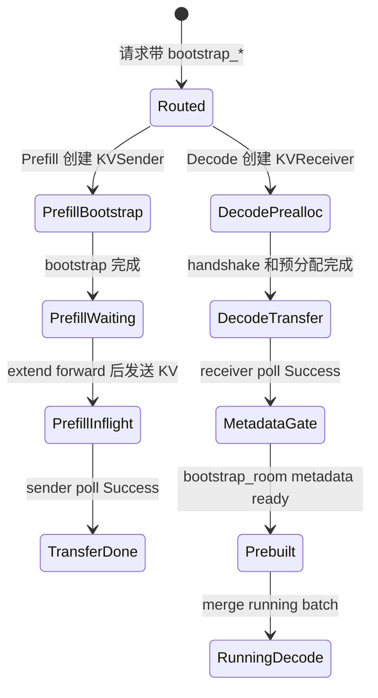

# PD分离 · 核心概念

PD 分离的难点不是“Prefill 和 Decode 分开跑”这句话，而是分开之后仍要保证一个请求的 KV、metadata、room、prefix cache 和 running batch 状态都对齐。只要其中一条账错了，Decode 可能拿空 KV 生成、不同 TP rank 状态不一致，或者 Prefill 长时间堵在 bootstrap。

读完这篇应能回答：

1. `DisaggregationMode` 只是角色标记，还是会改变 Scheduler event loop。
2. `bootstrap_room` 为什么是请求跨节点的主键。
3. Prefill 三队列和 Decode 四队列各自卡在哪里。
4. `KVPoll.Success` 为什么还不一定能进入 decode。
5. Decode 的 `Prebuilt` batch 为什么不是普通 prefill。

## 先建立模型

把 PD 分离想成“异地交付半成品”：

- Gateway 给请求分配 Decode 房间号，也就是 `bootstrap_room`。
- Decode 先在这个房间占 KV 槽，创建 receiver。
- Prefill 做长 prompt forward，把 KV 和首个输出 token 的 metadata 写进 transfer 通道。
- Decode 轮询 receiver，但还要确认 metadata 里的 room 已落地。
- Decode 构造 `ForwardMode.PREBUILT` batch，把请求并入 running batch 继续逐 token decode。



这个模型有五本账。

| 账本 | 核心对象 | 破坏后现象 |
|------|----------|------------|
| 角色账 | `DisaggregationMode`、event loop | 节点跑错循环，prefill/decode 行为混杂 |
| 房间账 | `bootstrap_host/port/room` | sender/receiver 对不上，或 DP rank 路由错 |
| 队列账 | Prefill 三队列、Decode 四队列 | P99 抖动、bootstrap 或 transfer 积压 |
| 就绪账 | `KVPoll`、metadata gate、HiCache restore gate | 成功过早上报，Decode 读空 KV 或旧 metadata |
| 执行账 | `ForwardMode.PREBUILT`、`process_prebuilt` | Decode 误跑 prefill，或首 token/grammar/spec 状态错 |

## 角色账：mode 会改 Scheduler 主循环

PD 不是在普通 loop 旁边加一个传输线程。Scheduler 根据 `DisaggregationMode` 直接选择不同 event loop。

```python
# 来源：python/sglang/srt/disaggregation/utils.py L60-L71
class DisaggregationMode(Enum):
    NULL = "null"
    PREFILL = "prefill"
    DECODE = "decode"

    @staticmethod
    def to_engine_type(mode: str) -> str:
        if mode == DisaggregationMode.PREFILL.value:
            return "prefill"
        elif mode == DisaggregationMode.DECODE.value:
            return "decode"
        return "unified"
```

```python
# 来源：python/sglang/srt/managers/scheduler.py L4164-L4192
def dispatch_event_loop(scheduler: Scheduler):
    # Dispatch to the appropriate event loop based on the disaggregation mode
    server_args = scheduler.server_args
    disaggregation_mode: DisaggregationMode = scheduler.disaggregation_mode
    if disaggregation_mode == DisaggregationMode.NULL:
        if scheduler.enable_pdmux:
            scheduler.event_loop_pdmux()
        elif server_args.pp_size > 1:
            scheduler.event_loop_pp()
        elif scheduler.enable_overlap_mlx:
            scheduler.event_loop_overlap_mlx()
        elif scheduler.enable_overlap:
            scheduler.event_loop_overlap()
        else:
            scheduler.event_loop_normal()
    elif disaggregation_mode == DisaggregationMode.PREFILL:
        if server_args.pp_size > 1:
            scheduler.event_loop_pp_disagg_prefill()
        elif scheduler.enable_overlap:
            scheduler.event_loop_overlap_disagg_prefill()
        else:
            scheduler.event_loop_normal_disagg_prefill()
    elif disaggregation_mode == DisaggregationMode.DECODE:
        if server_args.pp_size > 1:
            scheduler.event_loop_pp_disagg_decode()
        elif scheduler.enable_overlap:
            scheduler.event_loop_overlap_disagg_decode()
        else:
            scheduler.event_loop_normal_disagg_decode()
```

关键判断：`NULL` 不是“PD 但不分离”，而是 unified。`PREFILL` 和 `DECODE` 会进入不同 loop，意味着队列、batch 构造、结果处理都变了。

## 房间账：`bootstrap_room` 是跨节点对齐键

一个请求从 HTTP 或 OpenAI handler 进来时，要带上 decode 侧房间信息；tokenize 后这个字段继续进入 `TokenizedGenerateReqInput`。

```python
# 来源：python/sglang/srt/managers/io_struct.py L239-L245
    # For disaggregated inference
    bootstrap_host: Optional[Union[List[Optional[str]], str]] = None
    bootstrap_port: Optional[Union[List[Optional[int]], int]] = None
    bootstrap_room: Optional[Union[List[Optional[int]], int]] = None
    bootstrap_pair_key: Optional[Union[List[Optional[str]], str]] = None
    decode_tp_size: Optional[Union[List[Optional[int]], int]] = None
```

batch 请求还会把单个 room 展开成连续 room，避免 parallel samples 复用同一房间：

```python
# 来源：python/sglang/srt/managers/io_struct.py L659-L665
        # Normalize bootstrap_room
        if self.bootstrap_room is None:
            self.bootstrap_room = [None] * num
        elif not isinstance(self.bootstrap_room, list):
            self.bootstrap_room = [self.bootstrap_room + i for i in range(num)]
        elif isinstance(self.bootstrap_room, list):
            self.bootstrap_room = self.bootstrap_room * self.parallel_sample_num
```

`bootstrap_room` 还会影响 DP 路由。prefill 默认 load balance 是 `follow_bootstrap_room`，使同一个 room 落到对应 rank。

```python
# 来源：python/sglang/srt/managers/data_parallel_controller.py L628-L637
    def follow_bootstrap_room_scheduler(self, req: Req):
        if self.maybe_external_dp_rank_routing(req):
            return

        assert req.bootstrap_room is not None, (
            "req.bootstrap_room should not be None. Do not send requests directly to "
            "prefill or decode instances; send to the router instead."
        )
        target_rank = req.bootstrap_room % len(self.workers)
        sock_send(self.workers[target_rank], req)
```

因此直连 prefill/decode 调试时，如果 room 缺失或复用，问题可能不是 transfer backend，而是路由主键已经错了。

## 队列账：Prefill 和 Decode 卡点不同

Prefill 侧三段：bootstrap、waiting、inflight。它的 GPU forward 发生在 waiting 出队之后，transfer 完成发生在 inflight。

```python
# 来源：python/sglang/srt/disaggregation/prefill.py L1-L18
"""
Life cycle of a request in the prefill server

1. Bootstrap Queue
    a. Initialize a sender for each request
    b. Use the queue to store requests whose bootstrap (handshake and preallocation) has not finished
    c. Poll senders to check bootstrap state
    d. Once bootstrap is complete, move request to Waiting Queue

2. Waiting Queue
    a. Use PrefillAdder to pop requests
    b. Run forward
    c. Add the request to Inflight Queue

3. Inflight Queue
    a. Poll (non-blocking) the sender of the request
    b. Once the transfer has finished, return the request
"""
```

Decode 侧四段：prealloc、transfer、waiting、running。它的第一件事不是 decode，而是先创建 receiver 并预分配 KV。

```python
# 来源：python/sglang/srt/disaggregation/decode.py L1-L19
"""
Life cycle of a request in the decode server

1. PreallocQueue:
    a. Initialize a receiver for each request
    b. The request handshakes first, and pre-allocate kv once there is available kv.
    c. Move the request to TransferQueue.

2. TransferQueue:
    a. Poll the receiver to check the transfer state
    b. If the transfer has finished, move the request to waiting queue

3. WaitingQueue:
    a. Use the requests in the queue to construct a PrebuiltExtendBatch
    b. Skip the prefill forward but only populate metadata

4. RunningBatch:
    a. Merge the resolved PrebuiltExtendBatch into running batch to run decoding
"""
```

这解释了为什么 PD 的 P99 不能只看 GPU 利用率。一个请求可能还没进 GPU，就已经卡在 handshake、metadata buffer、prealloc KV slot 或 receiver poll。

## 就绪账：`Success` 只是候选成功，还要过 metadata gate

`KVPoll` 的数值顺序是故意设计的：`Failed=0`，`Success=4`，中间是未完成状态。跨 rank 用 MIN 时，任何 rank 未 ready 都能把全局状态压回未 ready。

```python
# 来源：python/sglang/srt/disaggregation/base/conn.py L79-L84
class KVPoll:
    Failed = 0
    Bootstrapping = 1
    WaitingForInput = 2
    Transferring = 3
    Success = 4
```

但 receiver poll 成功还不够。Decode 还要检查 metadata buffer 里的 `bootstrap_room` 是否已经写入，否则 Success 会被降级回 Transferring。

```python
# 来源：python/sglang/srt/disaggregation/utils.py L103-L118
def _apply_metadata_gate(polls, decode_reqs, metadata_buffers, server_args) -> None:
    """Downgrade Success → Transferring for requests whose metadata hasn't landed.

    Mutates `polls` in-place. Called before all-reduce so that MIN across TP
    ranks naturally prevents any rank from committing before all ranks are ready.
    """
    for i, poll_val in enumerate(polls):
        if poll_val == int(KVPoll.Success):
            decode_req = decode_reqs[i]
            if _is_fake_transfer(decode_req.req, server_args):
                continue
            actual_room = metadata_buffers.bootstrap_room[
                decode_req.metadata_buffer_index, 0
            ].item()
            if actual_room == 0:
                polls[i] = int(KVPoll.Transferring)
```

这段是 PD 正确性的核心之一：KV bytes 和 metadata 是两个 ready 条件。Fake backend 为测试跳过 gate，但真实 backend 不能跳。

## 执行账：Decode 走 `PREBUILT`，不是重跑 Prefill

Decode 收到 transfer 后，会构造 prebuilt batch。这个 batch 把 forward mode 改成 `PREBUILT`，填好 `input_ids`、`seq_lens`、`out_cache_loc`、sampling info 等执行 metadata。

```python
# 来源：python/sglang/srt/disaggregation/decode_schedule_batch_mixin.py L25-L42
    def prepare_for_prebuilt(self: ScheduleBatch):
        """
        Prepare a prebuilt extend by populate metadata
        Adapted from .prepare_for_extend().
        """

        self.forward_mode = ForwardMode.PREBUILT
        reqs = self.reqs
        input_ids = [r.get_fill_ids()[len(r.prefix_indices) :] for r in reqs]
        extend_num_tokens = sum(len(ids) for ids in input_ids)
        seq_lens = []
        pre_lens = []
        req_pool_indices = []

        # Pre-calculate total size
        total_size = sum(req.extend_range.length for req in reqs)
        out_cache_loc = torch.empty(total_size, dtype=torch.int64, device=self.device)
```

随后 `process_prebuilt` 把 prefill 侧传来的最后一个 token 作为下一轮 decode 的起点；如果启用投机，还会构造 disagg draft input。

```python
# 来源：python/sglang/srt/disaggregation/decode_schedule_batch_mixin.py L139-L157
        last_tokens_tensor = torch.tensor(
            last_tokens, dtype=torch.int64, device=self.device
        )

        spec_info = self.spec_algorithm.build_disagg_draft_input(
            self,
            server_args,
            last_tokens_tensor,
            future_map,
        )
        if spec_info is not None:
            self.spec_info = spec_info
        else:
            # Non-spec: stash last token into the relay so the first DECODE's
            # resolve_forward_inputs gathers it like any other decode iter.
            future_map.stash(
                self.req_pool_indices, RelayPayload(bonus_tokens=last_tokens_tensor)
            )
            self.input_ids = None
```

因此 PD 和投机解码并不是完全独立：prebuilt 阶段会把最后 token 交给普通 decode 或 speculative draft 的下一步。

## 配置账：decode 专用开关有互斥关系

Decode radix cache 能减少传输，但不是任意组合都能开。启动参数 hook 会在 decode mode 下做互斥校验，并设置 decode 侧 radix cache 行为和 extra slots 默认值。

```python
# 来源：python/sglang/srt/arg_groups/pd_disaggregation_hook.py L29-L70
    if server_args.disaggregation_mode == "decode":
        if server_args.disaggregation_decode_enable_radix_cache:
            if server_args.enable_hisparse:
                raise ValueError(
                    "--disaggregation-decode-enable-radix-cache is incompatible "
                    "with --enable-hisparse"
                )
            if server_args.disaggregation_transfer_backend == "fake":
                raise ValueError(
                    "--disaggregation-decode-enable-radix-cache is incompatible "
                    "with --disaggregation-transfer-backend fake"
                )
            if server_args.speculative_algorithm is not None:
                raise ValueError(
                    "--disaggregation-decode-enable-radix-cache is incompatible "
                    "with speculative decoding "
                    f"(--speculative-algorithm {server_args.speculative_algorithm})"
                )
            if server_args.enable_dp_attention:
                logger.warning(
                    "EXPERIMENTAL: Decode radix cache with DP attention. "
                    "Requires prefix-aware DP rank routing for optimal cache hits."
                )
            server_args.disable_radix_cache = False
            logger.warning("EXPERIMENTAL: Radix cache is enabled for decode server")
        else:
            server_args.disable_radix_cache = True
            logger.warning("KV cache is forced as chunk cache for decode server")

        # Default the number of *extra* decode req_to_token slots reserved for
        # in-transfer (being-received-from-prefill) requests, on top of the
        # max_running_requests-derived pool. Large batches get none; small
        # per-worker batches reserve 2x the batch as cheap overlap headroom.
        if server_args.disaggregation_decode_extra_slots is None:
            extra_slots = 0
            if server_args.max_running_requests is not None:
                per_worker = server_args.max_running_requests // max(
                    1, server_args.dp_size
                )
                if per_worker <= 32:
                    extra_slots = per_worker * 2
            server_args.disaggregation_decode_extra_slots = extra_slots
```

读配置时要从“能不能开”升级为“开了会改变哪本账”：radix cache 改 prefix/HiCache 账，extra slots 改 prealloc 容量账，staging buffer 改就绪账。

## 读者抓手

首次阅读时，按这句话复述：

`bootstrap_room` 把 Prefill 和 Decode 对齐；Decode 先占 KV 槽并等 receiver；Prefill 完成 extend 后把 KV 和 metadata 发过去；Decode 通过 receiver poll、metadata gate、all-reduce、HiCache gate 判断 ready；ready 后构造 `PREBUILT` batch 并入 running decode。

排障时从症状反推账本：

| 症状 | 先查账本 | 第一入口 |
|------|----------|----------|
| prefill bootstrap 堵住 | 房间账、Decode prealloc | `DecodePreallocQueue`、`PrefillBootstrapQueue.create_sender` |
| transfer Success 但 decode 不动 | 就绪账 | `_apply_metadata_gate`、`_poll_with_metadata_gate` |
| 多 rank 状态不一致 | 就绪账 | `poll_and_all_reduce`、`KVPoll` 数值顺序 |
| PD 比 unified 慢 | 队列账、TCO | Prealloc/Transfer/Inflight 队列深度 |
| decode radix cache 开不起来 | 配置账 | `handle_pd_disaggregation` |
| speculative + PD 行为异常 | 执行账 | `process_prebuilt`、`build_disagg_draft_input` |
