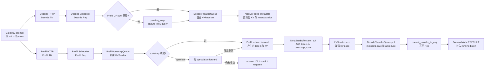

# PD分离 · 源码走读

这篇解决一个具体问题：Gateway 把一次 generate 拆成两个独立 HTTP 请求后，两套 TokenizerManager/Scheduler 如何用同一 room 重新关联，以及源码如何保证 Decode 不会在 KV、metadata 或 HiCache restore 未就绪时提前进入 running batch。

读完应能做三件事：

1. 从 `GenerateReqInput` 追到 `Req`，说清 `bootstrap_host/port/room` 在哪里被补齐、校验和保存。
2. 沿 Prefill 三队列与 Decode 四队列复述一次请求的状态转移。
3. 在 transfer 卡住、metadata mismatch 或 decode 不动时，知道断点该放在哪个函数。
4. 区分 Gateway 整对 retry、Decode DP-rank 解析等待和 Prefill optimistic retry 三种外观相似、语义不同的“重试/等待”。

## 长文读法

这篇按“同一客户端请求派生出的 Prefill/Decode 两个服务请求，分别卡在哪个 gate”来读。不要把 PD 分离理解成 Prefill 算完后直接把 KV 交给 Decode；源码实际拆成房间号、receiver 预分配、sender bootstrap、metadata 写入、KV chunk 发送、poll/all-reduce、commit、`PREBUILT` batch 八个边界。

| 读者任务 | 先读 | 要抓住的判断 |
|----------|------|--------------|
| 第一次建立 PD 主线 | 主线图、步骤 1 到 3 | Gateway 并行双发，两侧各有 TM；Decode 默认先创建 receiver，Prefill 不是唯一的起点 |
| 请求一开始就被拒绝 | 步骤 1、步骤 2 | 真实 backend 下 `bootstrap_room` 不能缺失，缺失会作为 bad request abort |
| Prefill 端没有发出 KV | 步骤 4、步骤 5 | 默认 sender 先 bootstrap；optimistic 分支可能先算后检查，失败时会释放 KV 并 requeue |
| Decode poll 一直不成功 | 步骤 6 | `KVPoll.Success` 还要经过 metadata gate、跨 rank MIN all-reduce、可选 HiCache/staging gate |
| metadata mismatch 或上下文串线 | 步骤 7 | Decode commit 前会校验 `bootstrap_room`，不匹配时 abort 并释放预分配资源 |
| KV 到了但请求没进入 decode | 步骤 8 | transfer 成功的请求先进入 waiting queue，再构造 `ForwardMode.PREBUILT` 合并到 running batch |
| 做回归验证 | 运行验证 | 先用静态检索确认 room、metadata、poll、commit、PREBUILT 这些边界仍存在 |

读完整篇后，最重要的自检问题是：Decode 此刻是在等 receiver、等 metadata、等跨 rank 共识、等 HiCache/staging，还是已经 commit 但尚未被调度成 `PREBUILT`。

## 主线图



这条链路最容易读错的地方有三个。第一，Gateway 发的是两个独立请求，两侧各自 tokenize 和建 `Req`，不是一个 TM 把同一对象扇出。第二，“Decode 先占位、Prefill 后计算”是默认稳态路径；显式开启 optimistic prefill 后，Prefill 可以先算，但未收敛就必须回收这轮结果。第三，只有 receiver poll、metadata gate、跨 rank 共识、可选 HiCache/staging restore 都通过后，Decode 才把请求变成 `PREBUILT` batch。

## 步骤 1：Gateway 双发两个请求，并用房间号关联

系统压力：PD 把一个客户端请求拆成发往两个服务的 HTTP 请求，必须有一个跨服务主键。model-gateway 每次 attempt 选择一对 worker、生成新 room，并行请求两侧；KV tensor 随后由 worker 间 transfer backend 搬运，不经过 Gateway。

两个服务分别执行自己的 `TokenizerManager.generate_request`、`_tokenize_one_request` 和 `_send_one_request`。相同的是 prompt 与 `bootstrap_*` 协议字段，不同的是进程内 `ReqState`、`TokenizedGenerateReqInput` 和 Scheduler 对象都各自独立。

`GenerateReqInput` 直接暴露 bootstrap 字段：

```python
# 来源：python/sglang/srt/managers/io_struct.py L239-L245
    # For disaggregated inference
    bootstrap_host: Optional[Union[List[Optional[str]], str]] = None
    bootstrap_port: Optional[Union[List[Optional[int]], int]] = None
    bootstrap_room: Optional[Union[List[Optional[int]], int]] = None
    bootstrap_pair_key: Optional[Union[List[Optional[str]], str]] = None
    decode_tp_size: Optional[Union[List[Optional[int]], int]] = None
```

分词时，fake backend 可以自动分配 room，真实 backend 则沿用外部传入的 room：

```python
# 来源：python/sglang/srt/managers/tokenizer_manager.py L1137-L1164
        if isinstance(obj, GenerateReqInput):
            session_params = (
                SessionParams(**obj.session_params) if obj.session_params else None
            )

            bootstrap_room = obj.bootstrap_room
            if (
                bootstrap_room is None
                and self.server_args.disaggregation_transfer_backend == "fake"
            ):
                bootstrap_room = self.fake_bootstrap_room_counter
                self.fake_bootstrap_room_counter += 1

            tokenized_obj = TokenizedGenerateReqInput(
                input_text=input_text,
                input_ids=input_ids_arr,
                mm_inputs=mm_inputs,
                sampling_params=sampling_params,
                return_logprob=obj.return_logprob,
                logprob_start_len=obj.logprob_start_len,
                top_logprobs_num=obj.top_logprobs_num,
                token_ids_logprob=obj.token_ids_logprob,
                stream=obj.stream,
                rid=obj.rid,
                http_worker_ipc=obj.http_worker_ipc,
                bootstrap_host=obj.bootstrap_host,
                bootstrap_port=obj.bootstrap_port,
                bootstrap_room=bootstrap_room,
```

执行逻辑不是“请求多了几个字段”这么简单。`bootstrap_room` 是 sender、receiver、metadata buffer 校验和 DP rank 路由共同使用的对齐键。fake backend 自动分配 room，只是为了测试路径能跑通；真实 PD 部署不能依赖这个分支。

## 步骤 2：Scheduler 把 bootstrap 字段写入 `Req`

系统压力：分词对象还在前台请求层，真正参与调度、prefix cache、KV pool 和输出流的是 `Req`。如果 bootstrap 字段不进入 `Req`，后面的 prealloc、sender 和 metadata gate 都没有稳定事实源。

```python
# 来源：python/sglang/srt/managers/scheduler.py L2043-L2105
            if recv_req.bootstrap_port is None:
                # Use default bootstrap port
                recv_req.bootstrap_port = self.server_args.disaggregation_bootstrap_port

            req = Req(
                recv_req.rid,
                recv_req.input_text,
                recv_req.input_ids,
                recv_req.sampling_params,
                return_logprob=recv_req.return_logprob,
                top_logprobs_num=recv_req.top_logprobs_num,
                token_ids_logprob=recv_req.token_ids_logprob,
                stream=recv_req.stream,
                lora_id=recv_req.lora_id,
                session_id=recv_req.session_id,
                input_embeds=recv_req.input_embeds,
                positional_embed_overrides=recv_req.positional_embed_overrides,
                token_type_ids=recv_req.token_type_ids,
                custom_logit_processor=recv_req.custom_logit_processor,
                require_reasoning=recv_req.require_reasoning,
                return_hidden_states=recv_req.return_hidden_states,
                return_routed_experts=recv_req.return_routed_experts,
                routed_experts_start_len=recv_req.routed_experts_start_len,
                return_indexer_topk=recv_req.return_indexer_topk,
                eos_token_ids=self.model_config.hf_eos_token_id,
                bootstrap_host=recv_req.bootstrap_host,
                bootstrap_port=recv_req.bootstrap_port,
                bootstrap_room=recv_req.bootstrap_room,
                disagg_mode=self.disaggregation_mode,
                routed_dp_rank=recv_req.routed_dp_rank,
                disagg_prefill_dp_rank=recv_req.disagg_prefill_dp_rank,
                vocab_size=self.model_config.vocab_size,
                priority=recv_req.priority,
                metrics_collector=(
                    self.metrics_collector
                    if self.metrics_reporter.enable_metrics
                    else None
                ),
                routing_key=recv_req.routing_key,
                extra_key=recv_req.extra_key,
                http_worker_ipc=recv_req.http_worker_ipc,
                dllm_config=self.dllm_config,
                time_stats=recv_req.time_stats,
                multi_item_delimiter_indices=recv_req.multi_item_delimiter_indices,
            )
            req.tokenizer = self.tokenizer

            if self.disaggregation_mode != DisaggregationMode.NULL:
                # Invalid request for disaggregated mode
                if (
                    recv_req.bootstrap_room is None
                    and self.transfer_backend != TransferBackend.FAKE
                ):
                    error_msg = (
                        f"Invalid request: Disaggregated request received without "
                        f"bootstrap room id. {req.rid=}"
                    )
                    logger.error(error_msg)
                    recv_req.time_stats.trace_ctx.abort(
                        abort_info={"reason": error_msg}
                    )
                    prepare_abort(req, error_msg, status_code=HTTPStatus.BAD_REQUEST)
                    self.output_streamer.stream_output([req], req.return_logprob)
```

这段给出两个判断：

- `bootstrap_port` 可以用服务端默认值补齐，`bootstrap_room` 在真实 backend 下不能缺失。
- room 缺失不是普通排队问题，而是直接变成 bad request 并走 abort 输出。

`Req` 本身也保存这些字段，并对 fake host 跳过 radix cache insert：

```python
# 来源：python/sglang/srt/managers/schedule_batch.py L985-L990
        # For disaggregation
        self.bootstrap_host: str = bootstrap_host
        self.bootstrap_port: Optional[int] = bootstrap_port
        self.bootstrap_room: Optional[int] = bootstrap_room
        self.skip_radix_cache_insert = bootstrap_host == FAKE_BOOTSTRAP_HOST
        self.disagg_kv_sender: Optional[BaseKVSender] = None
```

读者抓手：排查 PD 请求入口时，先确认 `TokenizedGenerateReqInput.bootstrap_room` 是否进入 `Req.bootstrap_room`，再看 sender/receiver。

## 步骤 3：Decode 解析 Prefill DP rank，再创建 receiver 并预分配

系统压力：Prefill 计算完 prompt 后要有明确的目标 Prefill/Decode rank 和接收位置。Decode 不能盲目初始化 receiver：它先尝试使用 Gateway 注入的 `disagg_prefill_dp_rank`，否则读取已缓存的 Prefill parallel info；若可证明对端采用 `follow_bootstrap_room`，本地计算 `room % dp_size`，再不行才把请求放入 `pending_reqs` 做异步 ensure/query。

因此 `DecodePreallocQueue.queue` 为空不等于请求没到；它可能还在 `pending_reqs` 等 parallel info。解析完成后 `kv_receiver.init(prefill_dp_rank)`，请求才继续 handshake 和 KV/metadata 预分配。

```python
# 来源：python/sglang/srt/disaggregation/decode.py L521-L539
    def _resolve_prefill_dp_rank(self, req: Req) -> Optional[int]:
        prefill_info = self.kv_manager.prefill_info_table.get(_bootstrap_addr(req))
        # If None, it will go to the slow path and resolve prefill_info by _ensure_prefill_info then cache it
        if prefill_info is None:
            return None

        if req.disagg_prefill_dp_rank is not None:
            return req.disagg_prefill_dp_rank

        if prefill_info.dp_size == 1:
            return 0

        if (
            prefill_info.follow_bootstrap_room
            and not envs.SGLANG_DISAGGREGATION_FORCE_QUERY_PREFILL_DP_RANK.get()
        ):
            return req.bootstrap_room % prefill_info.dp_size

        return None
```

这张证据卡只证明 rank 的三条本地快路径；返回 `None` 后，`_resolve_pending_reqs` 才负责 ensure parallel info 与远程 room query。

Decode prealloc 队列持有 req pool、KV allocator、metadata allocator、transfer queue 和并行上下文：

```python
# 来源：python/sglang/srt/disaggregation/decode.py L275-L337
class DecodePreallocQueue(DecodeHiCachePreallocMixin):
    """
    Store the requests that are preallocating.
    """

    def __init__(
        self,
        req_to_token_pool: ReqToTokenPool,
        token_to_kv_pool_allocator: BaseTokenToKVPoolAllocator,
        draft_token_to_kv_pool: Optional[KVCache],
        req_to_metadata_buffer_idx_allocator: ReqToMetadataIdxAllocator,
        metadata_buffers: MetadataBuffers,
        scheduler: Scheduler,
        transfer_queue: DecodeTransferQueue,
        tree_cache: BasePrefixCache,
        gloo_group: ProcessGroup,
        tp_rank: int,
        tp_size: int,
        dp_size: int,
        gpu_id: int,
        bootstrap_port: int,
        max_total_num_tokens: int,
        pp_rank: int,
        num_reserved_decode_tokens: int,
        transfer_backend: TransferBackend,
    ):
        self.req_to_token_pool = req_to_token_pool
        self.token_to_kv_pool_allocator = token_to_kv_pool_allocator
        self.token_to_kv_pool = token_to_kv_pool_allocator.get_kvcache()
        self.draft_token_to_kv_pool = draft_token_to_kv_pool
        self.is_mla_backend = is_mla_backend(self.token_to_kv_pool)
        self.metadata_buffers = metadata_buffers
        self.req_to_metadata_buffer_idx_allocator = req_to_metadata_buffer_idx_allocator
        self.scheduler = scheduler
        self.transfer_queue = transfer_queue
        self.tree_cache = tree_cache
        self.gloo_group = gloo_group
        self.tp_rank = tp_rank
        self.tp_size = tp_size
        self.dp_size = dp_size
        self.gpu_id = gpu_id
        self.bootstrap_port = bootstrap_port
        self.max_total_num_tokens = max_total_num_tokens
        self.pp_rank = pp_rank
        self.num_reserved_decode_tokens = num_reserved_decode_tokens
        self.transfer_backend = transfer_backend
        # Queue for requests pending pre-allocation
        self.queue: List[DecodeRequest] = []
        self.retracted_queue: List[Req] = []
        self.pending_reqs: List[DecodeRequest] = []
        self._ensure_retry_count: Dict[str, int] = {}
        self._max_ensure_retries: int = 15  # scheduling cycles
        self._ensure_last_attempt_time: Dict[str, float] = {}
        self._ensure_retry_interval: float = 1.0  # seconds
        self.enable_staging = envs.SGLANG_DISAGG_STAGING_BUFFER.get()
        if self.enable_staging and self.is_mla_backend:
            raise RuntimeError(
                "SGLANG_DISAGG_STAGING_BUFFER is designed for non-MLA models "
                "(e.g. GQA, MHA). MLA models should not set this flag."
            )
        self.kv_manager = self._init_kv_manager()
        if self.enable_staging:
            self.transfer_queue._init_staging_handler(self.kv_manager)
```

创建 receiver 时，Decode 用同一个 room 连接 bootstrap 地址：

```python
# 来源：python/sglang/srt/disaggregation/decode.py L541-L557
    def _create_receiver_and_enqueue(self, req: Req) -> DecodeRequest:
        backend = (
            TransferBackend.FAKE
            if _is_fake_transfer(req, self.scheduler.server_args)
            else self.transfer_backend
        )
        kv_receiver_class = get_kv_class(backend, KVClassType.RECEIVER)

        kv_receiver = kv_receiver_class(
            mgr=self.kv_manager,
            bootstrap_addr=_bootstrap_addr(req),
            bootstrap_room=req.bootstrap_room,
        )

        decode_req = DecodeRequest(req=req, kv_receiver=kv_receiver)
        self.queue.append(decode_req)
        return decode_req
```

预分配完成时，Decode 给 receiver 发送 page indices、metadata buffer index 和 decode prefix 长度：

```python
# 来源：python/sglang/srt/disaggregation/decode.py L1090-L1100
            decode_req.metadata_buffer_index = (
                self.req_to_metadata_buffer_idx_allocator.alloc()
            )
            assert decode_req.metadata_buffer_index is not None
            page_indices = kv_to_page_indices(kv_indices, kv_transfer_page_size)
            decode_req.kv_receiver.send_metadata(
                page_indices,
                decode_req.metadata_buffer_index,
                state_indices,
                decode_prefix_len=total_prefix_len,
            )
```

默认主线的心理模型是“Decode 先确认分店，再把收货地址、货架位置和收货单号发出去”。Prefill 后面发送的 KV page 和 metadata，都要落到这些预先约定的位置。

## 步骤 4：Prefill 创建 sender 并计算发送范围

系统压力：Prefill 要发的不是整个请求对象，而是已经算好的 KV page 与首 token metadata。若 Decode 侧已有 prefix，Prefill 只需要从 `decode_prefix_len` 后开始发送。

```python
# 来源：python/sglang/srt/disaggregation/prefill.py L230-L283
    def create_sender(self, req: Req, num_kv_heads: int) -> bool:
        """Create a KV sender for the request without enqueuing it.
        Returns False if the request exceeds KV capacity."""
        if self._check_if_req_exceed_kv_capacity(req):
            return False

        backend = (
            TransferBackend.FAKE
            if req.bootstrap_host == FAKE_BOOTSTRAP_HOST
            else self.transfer_backend
        )
        kv_sender_class = get_kv_class(backend, KVClassType.SENDER)

        dest_tp_ranks = [self.tp_rank]

        req.disagg_kv_sender = kv_sender_class(
            mgr=self.kv_manager,
            bootstrap_addr=f"{req.bootstrap_host}:{self.bootstrap_port}",
            bootstrap_room=req.bootstrap_room,
            dest_tp_ranks=dest_tp_ranks,
            pp_rank=self.pp_rank,
        )
        self._process_req(req)
        req.pending_bootstrap = True
        return True

    def ensure_metadata_buffer(self, req: Req) -> bool:
        if req.metadata_buffer_index >= 0:
            return True

        if self.req_to_metadata_buffer_idx_allocator.available_size() == 0:
            return False
        req.metadata_buffer_index = self.req_to_metadata_buffer_idx_allocator.alloc()
        assert req.metadata_buffer_index is not None
        return True

    def finalize_bootstrap(self, req: Req) -> bool:
        """Initialize the sender after bootstrap completes.
        Returns False if no metadata buffer is available (non-terminal)."""
        assert req.pending_bootstrap, "finalize_bootstrap is not idempotent"
        if not self.ensure_metadata_buffer(req):
            return False

        req.time_stats.set_bootstrap_done_time()
        decode_prefix_len = req.disagg_kv_sender.pop_decode_prefix_len()
        num_kv_indices = len(req.origin_input_ids)
        req.start_send_idx = decode_prefix_len
        num_kv_indices_to_send = num_kv_indices - decode_prefix_len
        num_pages = kv_to_page_num(
            num_kv_indices_to_send, self.token_to_kv_pool.page_size
        )
        req.disagg_kv_sender.init(num_pages, req.metadata_buffer_index)
        req.pending_bootstrap = False
        return True
```

默认配置下，`create_sender` 只建立连接对象，`finalize_bootstrap` 才分配 metadata slot、读取 Decode 已有 prefix、初始化要发送的 page 数，之后请求进入 waiting forward。

但这里不能写成绝对顺序。`optimistic_prefill_retries > 0` 时，`pop_bootstrapped` 看到 `KVPoll.Bootstrapping` 也可先分配 metadata slot并把请求放进 waiting。forward 后 `handle_pending_bootstrap` 再检查：若仍是 `Bootstrapping`，`optimistic_release_and_requeue` 会缓存/释放本轮 KV、`reset_for_retract`、清空 `output_ids` 与临时发送状态、增加 retry count，并回到 bootstrap queue；只有随后进入 `WaitingForInput` 并成功 finalize，才允许发送 KV。

这个分支默认关闭，而且 PP、hierarchical cache、Mamba radix cache 会在参数归一化时禁用。它不是 Gateway HTTP retry：不会重新选 worker pair 或生成新 room，而是在 Prefill Scheduler 内部为同一关联请求承担一次可能的重算。

```python
# 来源：python/sglang/srt/disaggregation/prefill.py L349-L369
            if poll == KVPoll.Failed:
                self.scheduler.handle_bootstrap_failure(req)
                indices_to_remove.add(i)
                failed_reqs.append(req)
            elif poll == KVPoll.Bootstrapping:
                if (
                    req.time_stats.prefill_retry_count
                    < self.scheduler.server_args.optimistic_prefill_retries
                    and not req.is_retracted  # engine paused
                ):
                    if not self.ensure_metadata_buffer(req):
                        continue  # no more metadata buffer
                    bootstrapped_reqs.append(req)
                    indices_to_remove.add(i)
                    req.time_stats.set_wait_queue_entry_time()
            elif poll == KVPoll.WaitingForInput:
                if should_force_retry(req):  # skip checking for testing
                    if not self.ensure_metadata_buffer(req):
                        continue  # no more metadata buffer
                elif not self.finalize_bootstrap(req):
                    continue
```

这里的命名容易误导：`bootstrapped_reqs` 在 optimistic 分支中包含“尚未完成 bootstrap、但获准先算”的请求，真正的提交资格仍要在 forward 后复查。

```python
# 来源：python/sglang/srt/disaggregation/prefill.py L1107-L1118
    def optimistic_release_and_requeue(self: Scheduler, req: Req) -> None:
        """Release KV cache and requeue an optimistic prefill request."""
        max_retries = self.server_args.optimistic_prefill_retries
        maybe_cache_unfinished_req(req, self.tree_cache)
        release_kv_cache(req, self.tree_cache)
        req.reset_for_retract()
        req.output_ids = array("q")
        req.start_send_idx = 0
        req.tmp_end_idx = -1
        req.hidden_states_tensor = None
        req.pending_bootstrap = True
        req.time_stats.reset_prefill_retry_time()
```

## 步骤 5：Prefill forward 后写 metadata 并发 KV

系统压力：Decode 不只需要 KV，还需要 Prefill 算出来的首个输出 token、cached token 统计、logprob、投机解码字段和 room 校验值。SGLang 把这些数据放进 `MetadataBuffers`。

Prefill 处理 batch 结果时，先把 next token 写入 `Req`，再缓存未完成请求，再发送最后一段 KV：

```python
# 来源：python/sglang/srt/disaggregation/prefill.py L630-L658

                req.output_ids.append(next_token_id)
                maybe_cache_unfinished_req(req, self.tree_cache)
                self.disagg_prefill_inflight_queue.append(req)
                if self.spec_algorithm.is_eagle() and batch.spec_info is not None:
                    req.output_topk_p = batch.spec_info.topk_p[i]
                    req.output_topk_index = batch.spec_info.topk_index[i]
                    req.hidden_states_tensor = (
                        batch.spec_info.hidden_states[i].cpu().clone()
                    )
                else:
                    req.hidden_states_tensor = None
                if req.return_logprob:
                    assert extend_logprob_start_len_per_req is not None
                    assert extend_input_len_per_req is not None
                    extend_logprob_start_len = extend_logprob_start_len_per_req[i]
                    extend_input_len = extend_input_len_per_req[i]
                    num_input_logprobs = extend_input_len - extend_logprob_start_len
                    self.batch_result_processor.logprob_result_processor.add_logprob_return_values(
                        i,
                        req,
                        logprob_pt,
                        next_token_ids,
                        num_input_logprobs,
                        logits_output,
                    )
                    logprob_pt += num_input_logprobs
                self.send_kv_chunk(req, last_chunk=True)
                req.time_stats.set_prefill_transfer_queue_entry_time()
```

`send_kv_chunk` 在最后一段发送前把 metadata 写入 buffer，然后调用 sender：

```python
# 来源：python/sglang/srt/disaggregation/prefill.py L972-L1010
    def send_kv_chunk(
        self: Scheduler,
        req: Req,
        last_chunk: bool = False,
        end_idx: Optional[int] = None,
    ) -> None:
        """
        Send a prefilled chunk to the decode server
        """
        page_size = self.token_to_kv_pool_allocator.page_size
        start_idx = req.start_send_idx
        transfer_input_len = len(req.origin_input_ids)
        end_idx = (
            end_idx
            if end_idx is not None
            else min(req.extend_range.end, transfer_input_len)
        )

        if not last_chunk:
            # if not the last chunk and the last page is partial, delay the last partial page to the next send
            end_idx = end_idx - end_idx % page_size

        if end_idx < start_idx:
            logger.debug(
                "send_kv_chunk skip: rid=%s start_send_idx=%s end_idx=%s",
                req.rid,
                start_idx,
                end_idx,
            )
            return

        kv_indices = (
            self.req_to_token_pool.req_to_token[req.req_pool_idx, start_idx:end_idx]
            .cpu()
            .numpy()
        )
        state_indices: Optional[List] = None
        if last_chunk:
            self.disagg_metadata_buffers.set_buf(req)
```

```python
# 来源：python/sglang/srt/disaggregation/prefill.py L1102-L1105
        if not req.disagg_kv_sender.should_send_kv_chunk(len(page_indices), last_chunk):
            return
        req.disagg_kv_sender.send(page_indices, state_indices)
        req.start_send_idx = end_idx
```

`MetadataBuffers.set_buf` 最后写入 `bootstrap_room`，这就是 Decode metadata gate 后面要看的值：

```python
# 来源：python/sglang/srt/disaggregation/utils.py L337-L401
    def set_buf(self, req: Req):

        self.output_ids[req.metadata_buffer_index][0] = req.output_ids[0]
        # The cached_tokens buffer is (size, 16); slots 0-3 hold cached token
        # counts and slots 4-6 are reused for multimodal prompt token counts
        # (slots 7-15 remain spare). This avoids adding new RDMA buffers.
        # Slot map: 0=cached 1=device 2=host 3=storage 4=image 5=audio 6=video.
        self.cached_tokens[req.metadata_buffer_index][0] = req.cached_tokens
        self.cached_tokens[req.metadata_buffer_index][1] = req.cached_tokens_device
        self.cached_tokens[req.metadata_buffer_index][2] = req.cached_tokens_host
        self.cached_tokens[req.metadata_buffer_index][3] = req.cached_tokens_storage

        # Compute multimodal prompt token counts on the prefill node so decode
        # can report them in usage.
        if req.multimodal_inputs:
            image_t, audio_t, video_t = req.multimodal_inputs.compute_mm_token_counts()
        else:
            image_t = audio_t = video_t = 0
        self.cached_tokens[req.metadata_buffer_index][4] = image_t
        self.cached_tokens[req.metadata_buffer_index][5] = audio_t
        self.cached_tokens[req.metadata_buffer_index][6] = video_t
        if req.return_logprob:
            if req.logprob.output_token_logprobs_val:  # not none or empty list
                self.output_token_logprobs_val[req.metadata_buffer_index][0] = (
                    req.logprob.output_token_logprobs_val[0]
                )
            if req.logprob.output_token_logprobs_idx:  # not none or empty list
                self.output_token_logprobs_idx[req.metadata_buffer_index][0] = (
                    req.logprob.output_token_logprobs_idx[0]
                )

            if req.logprob.output_top_logprobs_val:  # not none or empty list
                self.output_top_logprobs_val[req.metadata_buffer_index][
                    : len(req.logprob.output_top_logprobs_val[0])
                ] = torch.tensor(
                    req.logprob.output_top_logprobs_val[0],
                    dtype=torch.float32,
                    device="cpu",
                )
            if req.logprob.output_top_logprobs_idx:  # not none or empty list
                self.output_top_logprobs_idx[req.metadata_buffer_index][
                    : len(req.logprob.output_top_logprobs_idx[0])
                ] = torch.tensor(
                    req.logprob.output_top_logprobs_idx[0],
                    dtype=torch.int32,
                    device="cpu",
                )
        # For PD + spec decode
        if req.hidden_states_tensor is not None:
            # speculative_eagle_topk should not be greater than 16 currently
            topk = req.output_topk_p.size(0)

            self.output_topk_p[req.metadata_buffer_index, :topk].copy_(
                req.output_topk_p
            )
            self.output_topk_index[req.metadata_buffer_index, :topk].copy_(
                req.output_topk_index
            )
            self.output_hidden_states[req.metadata_buffer_index].copy_(
                req.hidden_states_tensor
            )
        # Store bootstrap_room for validation on decode side
        self.bootstrap_room[req.metadata_buffer_index, 0] = (
            req.bootstrap_room if req.bootstrap_room is not None else 0
        )
```

读者抓手：如果 Decode 看到 `KVPoll.Success` 但 metadata 仍是 0，问题不在 model forward，而是在 metadata 写入、buffer index 或传输可见性。

## 步骤 6：Decode poll 不是单点成功，而是多重 gate

系统压力：一个 TP/CP rank ready 不代表全部 rank ready；KV bytes ready 不代表 metadata ready；HiCache restore ready 也可能滞后于 receiver success。

`KVPoll` 的数值顺序允许用 MIN 表达最保守状态：

```python
# 来源：python/sglang/srt/disaggregation/base/conn.py L79-L84
class KVPoll:
    Failed = 0
    Bootstrapping = 1
    WaitingForInput = 2
    Transferring = 3
    Success = 4
```

metadata gate 会把 metadata 未落地的 success 降回 transferring，然后再 all-reduce：

```python
# 来源：python/sglang/srt/disaggregation/utils.py L103-L140
def _apply_metadata_gate(polls, decode_reqs, metadata_buffers, server_args) -> None:
    """Downgrade Success → Transferring for requests whose metadata hasn't landed.

    Mutates `polls` in-place. Called before all-reduce so that MIN across TP
    ranks naturally prevents any rank from committing before all ranks are ready.
    """
    for i, poll_val in enumerate(polls):
        if poll_val == int(KVPoll.Success):
            decode_req = decode_reqs[i]
            if _is_fake_transfer(decode_req.req, server_args):
                continue
            actual_room = metadata_buffers.bootstrap_room[
                decode_req.metadata_buffer_index, 0
            ].item()
            if actual_room == 0:
                polls[i] = int(KVPoll.Transferring)


def poll_and_all_reduce(
    pollers,
    gloo_group: dist.ProcessGroup,
    decode_reqs=None,
    metadata_buffers: Optional[MetadataBuffers] = None,
    server_args: Optional[ServerArgs] = None,
):
    # at a certain prob, the poll is failed to simulate failure
    polls = _poll_with_failure_injection(pollers)

    # Apply metadata gate on the decode requests to downgrade Success → Transferring for requests whose metadata hasn't landed.
    if (
        decode_reqs is not None
        and metadata_buffers is not None
        and server_args is not None
    ):
        _apply_metadata_gate(polls, decode_reqs, metadata_buffers, server_args)
    tensor_to_reduce = torch.tensor(polls, dtype=torch.uint8, device="cpu")
    dist.all_reduce(tensor_to_reduce, op=dist.ReduceOp.MIN, group=gloo_group)
    return tensor_to_reduce.tolist()
```

Decode transfer queue 把 HiCache gate 和 metadata gate 接到同一条 poll 路径：

```python
# 来源：python/sglang/srt/disaggregation/decode.py L1622-L1643
    def _poll_with_metadata_gate(self) -> List[int]:
        pollers = (
            [HiCacheRestoreGatedKVReceiver(dr) for dr in self.queue]
            if self.scheduler.enable_decode_hicache
            else [dr.kv_receiver for dr in self.queue]
        )
        return poll_and_all_reduce(
            pollers,
            self.gloo_group,
            decode_reqs=self.queue,
            metadata_buffers=self.metadata_buffers,
            server_args=self.scheduler.server_args,
        )

    def _poll_with_staging(self) -> list:
        return poll_and_all_reduce_with_staging(
            self.queue,
            self.staging_handler,
            self.gloo_group,
            metadata_buffers=self.metadata_buffers,
            server_args=self.scheduler.server_args,
        )
```

不变量：只有所有 rank 都不把状态压低，metadata buffer 中 room 非 0，可选 staging 和 HiCache restore 都完成，`pop_transferred` 才能进入 commit。

## 步骤 7：Decode 把 transfer metadata 写回 `Req`

系统压力：进入 running batch 前，`Req` 必须已经拥有首 token、cached token 统计、logprob、top-k 和 hidden states 等信息。否则 prebuilt 阶段无法和普通 decode 阶段接上。

先校验 metadata room，发现空 room 或 room mismatch 都 abort：

```python
# 来源：python/sglang/srt/disaggregation/decode.py L1511-L1573
    def _commit_transfer_to_req(self, decode_req: DecodeRequest):
        idx = decode_req.metadata_buffer_index
        (
            output_id,
            cached_tokens,
            output_token_logprobs_val,
            output_token_logprobs_idx,
            output_top_logprobs_val,
            output_top_logprobs_idx,
            output_topk_p,
            output_topk_index,
            output_hidden_states,
            output_bootstrap_room,
        ) = self.metadata_buffers.get_buf(idx)

        # Validate bootstrap_room to detect context corruption
        actual_room = output_bootstrap_room[0].item()
        expected_room = (
            decode_req.req.bootstrap_room
            if decode_req.req.bootstrap_room is not None
            else 0
        )

        if _is_fake_transfer(decode_req.req, self.scheduler.server_args):
            pass
        elif actual_room == 0:
            # Should never happen: _poll_with_metadata_gate already confirmed
            # readiness on all TP ranks. Abort deterministically to avoid
            # cross-rank queue divergence.
            logger.error(
                f"Metadata unexpectedly not ready after readiness gate: "
                f"request {decode_req.req.rid}, bootstrap_room={expected_room}, "
                f"metadata_buffer_index={idx}"
            )
            prepare_abort(
                decode_req.req,
                "Metadata unexpectedly not ready after readiness gate "
                "(bootstrap_room=0)",
                status_code=HTTPStatus.INTERNAL_SERVER_ERROR,
            )
            decode_req.kv_receiver.clear()
            decode_req.kv_receiver = None
            return
        elif actual_room != expected_room:
            # Real corruption detected (mismatch)
            # Abort the request and remove from the queue
            error_msg = (
                f"Context corruption detected: Request {decode_req.req.rid} "
                f"(bootstrap_room={expected_room}) received metadata from "
                f"bootstrap_room={actual_room}. "
                f"Metadata buffer index: {idx}. "
                f"This indicates metadata buffer index collision."
            )
            logger.error(error_msg)
            prepare_abort(
                decode_req.req,
                "Metadata corruption detected - bootstrap_room mismatch",
                status_code=HTTPStatus.INTERNAL_SERVER_ERROR,
            )
            decode_req.kv_receiver.clear()
            decode_req.kv_receiver = None
            return
```

校验通过后，Decode 把首 token 和 cached token 信息写回请求：

```python
# 来源：python/sglang/srt/disaggregation/decode.py L1574-L1588
        self._commit_hicache_local_restore_to_req(decode_req)

        # Case 3: Success - commit the transfer
        decode_req.req.output_ids.append(output_id[0].item())
        decode_req.req.cached_tokens = cached_tokens[0].item()
        # The prefill node already reported its prefix-cache hit in
        # cached_tokens[0]. Seed already_computed with it so that
        # prepare_for_prebuilt's `cached_tokens += pre_len - already_computed`
        # only adds decode-side reuse *beyond* what prefill counted, instead of
        # double-counting the shared prompt prefix (which would make
        # cached_tokens exceed prompt_tokens when decode radix cache is on).
        decode_req.req.already_computed = decode_req.req.cached_tokens
        decode_req.req.cached_tokens_device = cached_tokens[1].item()
        decode_req.req.cached_tokens_host = cached_tokens[2].item()
        decode_req.req.cached_tokens_storage = cached_tokens[3].item()
```

清理时会把 `bootstrap_room` buffer 重置为 0，再释放 metadata slot，避免下一位 owner 读到旧 room：

```python
# 来源：python/sglang/srt/disaggregation/decode.py L1761-L1770
            idx = self.queue[i].metadata_buffer_index
            assert idx != -1
            # Reset so the next owner sees actual_room == 0 ("not yet written")
            # instead of the stale value, avoiding a false-positive mismatch.
            self.metadata_buffers.bootstrap_room[idx] = 0
            self.req_to_metadata_buffer_idx_allocator.free(idx)

        self.queue = [
            entry for i, entry in enumerate(self.queue) if i not in indices_to_remove
        ]
```

这就是 metadata gate 的闭环：0 表示未写入，非 0 表示有可校验 room，释放前必须归零。

## 步骤 8：Decode 把 transferred request 变成 `PREBUILT`

系统压力：Decode 已经有 Prefill 算出的 KV 和首 token，不能再跑一次 prompt prefill。但它仍要构造 batch metadata，让后续 decode step 能复用普通执行管线。

`process_decode_queue` 把 prealloc、transfer 和 waiting 连接起来：

```python
# 来源：python/sglang/srt/disaggregation/decode.py L1973-L2005
    def process_decode_queue(self: Scheduler):
        if self.enable_decode_hicache:
            self.tree_cache.check_hicache_events()

        if self.server_args.disaggregation_decode_enable_offload_kvcache:
            self.decode_offload_manager.check_offload_progress()

        # try to resume retracted requests if there are enough space for another `num_reserved_decode_tokens` decode steps
        resumed_reqs = self.disagg_decode_prealloc_queue.resume_retracted_reqs()
        self.waiting_queue.extend(resumed_reqs)
        if len(self.disagg_decode_prealloc_queue.retracted_queue) > 0:
            # if there are still retracted requests, we do not allocate new requests
            return

        if not hasattr(self, "polling_count"):
            self.polling_count = 0
            self.polling_interval = (
                self.server_args.disaggregation_decode_polling_interval
            )

        self.polling_count = (self.polling_count + 1) % self.polling_interval

        if self.polling_count % self.polling_interval == 0:
            req_conns, _ = self.disagg_decode_prealloc_queue.pop_preallocated()
            self.disagg_decode_transfer_queue.extend(req_conns)
            transferred_reqs = (
                self.disagg_decode_transfer_queue.pop_transferred()
            )  # the requests which kv has arrived
            if self.enable_hisparse:
                for req in transferred_reqs:
                    # Direct-to-host: KV data already in host pool, skip staging
                    self.hisparse_coordinator.admit_request_direct(req)
            self.waiting_queue.extend(transferred_reqs)
```

新 prebuilt batch 的核心动作是 `prepare_for_prebuilt` 与 `process_prebuilt`：

```python
# 来源：python/sglang/srt/disaggregation/decode.py L1906-L1971
    def get_new_prebuilt_batch(self: Scheduler) -> Optional[ScheduleBatch]:
        """Create a schedulebatch for fake completed prefill"""
        if self.grammar_manager.has_waiting_grammars():
            ready_grammar_requests = self.grammar_manager.get_ready_grammar_requests()
            for req in ready_grammar_requests:
                self._add_request_to_queue(req)

        if len(self.waiting_queue) == 0:
            return None

        if self.enable_priority_scheduling:
            self.policy.calc_priority(self.waiting_queue, self.running_batch)

        curr_batch_size = self.running_batch.batch_size()

        batch_size = min(self.req_to_token_pool.size, self.max_running_requests)

        num_not_used_batch = batch_size - curr_batch_size

        # pop req from waiting queue
        can_run_list: List[Req] = []
        waiting_queue: List[Req] = []

        for i in range(len(self.waiting_queue)):
            req = self.waiting_queue[i]
            # we can only add at least `num_not_used_batch` new batch to the running queue
            if i < num_not_used_batch:
                can_run_list.append(req)
                # Decode-radix path: new requests already matched in
                # `pop_preallocated`. Retracted requests reset `last_node`,
                # so re-match only when that state is missing.
                if self.server_args.disaggregation_decode_enable_radix_cache:
                    tree_cache = self.tree_cache if req.last_node is None else None
                else:
                    tree_cache = self.tree_cache
                req.init_next_round_input(tree_cache)
                # Truncate fill_len to kv_committed_len so cache_unfinished_req
                # only sees committed KV (full array includes one uncommitted
                # token because init_next_round_input rebuilt it as full).
                if req.kv_committed_len is not None:
                    req.set_extend_range(len(req.prefix_indices), req.kv_committed_len)
            else:
                waiting_queue.append(req)

        self.waiting_queue = waiting_queue
        if len(can_run_list) == 0:
            return None

        set_time_batch(can_run_list, "set_forward_entry_time")

        # construct a schedule batch with those requests and mark as decode
        new_batch = ScheduleBatch.init_new(
            can_run_list,
            self.req_to_token_pool,
            self.token_to_kv_pool_allocator,
            self.tree_cache,
            self.model_config,
            self.enable_overlap,
            self.spec_algorithm,
        )

        # construct fake completed prefill
        new_batch.prepare_for_prebuilt()
        new_batch.process_prebuilt(self.server_args, self.future_map)

        return new_batch
```

`prepare_for_prebuilt` 把 batch 标成 `ForwardMode.PREBUILT` 并填执行 metadata：

```python
# 来源：python/sglang/srt/disaggregation/decode_schedule_batch_mixin.py L25-L42
    def prepare_for_prebuilt(self: ScheduleBatch):
        """
        Prepare a prebuilt extend by populate metadata
        Adapted from .prepare_for_extend().
        """

        self.forward_mode = ForwardMode.PREBUILT
        reqs = self.reqs
        input_ids = [r.get_fill_ids()[len(r.prefix_indices) :] for r in reqs]
        extend_num_tokens = sum(len(ids) for ids in input_ids)
        seq_lens = []
        pre_lens = []
        req_pool_indices = []

        # Pre-calculate total size
        total_size = sum(req.extend_range.length for req in reqs)
        out_cache_loc = torch.empty(total_size, dtype=torch.int64, device=self.device)
```

`process_prebuilt` 把 Prefill 传来的最后 token 接到普通 decode 或 speculative draft：

```python
# 来源：python/sglang/srt/disaggregation/decode_schedule_batch_mixin.py L110-L157
    def process_prebuilt(
        self: ScheduleBatch,
        server_args: ServerArgs,
        future_map: FutureMap,
    ):
        """Assign the buffered last input id to schedule batch"""
        last_tokens: List[int] = []
        for req in self.reqs:
            last_tokens.append(req.output_ids[-1])
            maybe_cache_unfinished_req(req, self.tree_cache)
            if req.grammar is not None:
                # FIXME: this try-except block is for handling unexpected xgrammar issue.
                try:
                    # if it is not None, then the grammar is from a retracted request, and we should not
                    # accept the token as it's already accepted
                    if req.grammar.current_token is None:
                        req.grammar.accept_token(req.output_ids[-1])
                except ValueError as e:
                    from sglang.srt.managers.schedule_batch import FINISH_ABORT

                    # Grammar accept_token can raise ValueError if the token is not in the grammar.
                    # This can happen if the grammar is not set correctly or the token is invalid.
                    # Use to_finish (not finished_reason) so that process_batch_result_prebuilt
                    # handles the release via update_finish_state -> release_kv_cache in one place.
                    error_message = f"Grammar accept_token failed for req {req.rid} with token {req.output_ids[-1]}: {e}"
                    req.to_finish = FINISH_ABORT(
                        error_message, HTTPStatus.INTERNAL_SERVER_ERROR
                    )
                req.grammar.finished = req.finished()
        last_tokens_tensor = torch.tensor(
            last_tokens, dtype=torch.int64, device=self.device
        )

        spec_info = self.spec_algorithm.build_disagg_draft_input(
            self,
            server_args,
            last_tokens_tensor,
            future_map,
        )
        if spec_info is not None:
            self.spec_info = spec_info
        else:
            # Non-spec: stash last token into the relay so the first DECODE's
            # resolve_forward_inputs gathers it like any other decode iter.
            future_map.stash(
                self.req_pool_indices, RelayPayload(bonus_tokens=last_tokens_tensor)
            )
            self.input_ids = None
```

这就是“跳过 prefill forward”的真实含义：不是跳过 batch metadata，而是把已经完成的 prefill 结果伪装成一个完成了 extend 的 batch，随后并入普通 decode 循环。

## 运行验证

最小验证不需要修改源码，可以从日志、断点和状态字段三层做：

| 验证点 | 断点或日志入口 | 预期现象 |
|--------|----------------|----------|
| 请求房间号 | `Scheduler.handle_generate_request` | 真实 backend 下 `recv_req.bootstrap_room` 不能为 `None` |
| Decode 预分配 | `DecodePreallocQueue._create_receiver_and_enqueue` | `kv_receiver.bootstrap_room` 与 `req.bootstrap_room` 一致 |
| Prefill DP rank | `_resolve_pending_reqs` | 注入 rank、本地 room 映射或远程 query 使 receiver 得到确定 rank |
| Prefill bootstrap | `PrefillBootstrapQueue.finalize_bootstrap` | `req.start_send_idx` 等于 receiver 回传的 `decode_prefix_len` |
| optimistic 回收 | `optimistic_release_and_requeue` | 未收敛时 KV 释放、状态 reset、retry count 增加 |
| metadata 写入 | `MetadataBuffers.set_buf` | `bootstrap_room[idx, 0]` 从 0 变成当前 room |
| Decode gate | `_apply_metadata_gate` | room 仍为 0 时 `Success` 被降级为 `Transferring` |
| commit | `_commit_transfer_to_req` | `req.output_ids` 追加 Prefill 侧首 token |
| prebuilt | `get_new_prebuilt_batch` | batch `forward_mode` 为 `PREBUILT` |

如果只能看现象，按这条顺序排：

1. Prefill 卡 bootstrap：先看 Decode 是否创建 receiver 并调用 `send_metadata`。
2. Prefill GPU 已算但没有 KV 发送：查 `optimistic_prefill_retries`、`pending_bootstrap` 和 release/requeue，而不是把 GPU 活跃误判为握手成功。
3. Decode 连 prealloc 都没进入：查 `pending_reqs`、Prefill info ensure 与 room→rank query。
4. Decode 卡 transfer：先看 `KVPoll`、metadata room、staging 和 HiCache gate。
5. Decode 进入 waiting 但不 running：看 `max_running_requests`、`req_to_token_pool.size`、grammar waiting 和 running batch 空位。

## 复盘

PD 分离不是“把 Prefill 和 Decode 拆成两个服务”这么粗的改造，而是给同一个请求建立两条半程流水线：

- 请求主键是 `bootstrap_room`，贯穿输入、DP 路由、sender、receiver 和 metadata 校验。
- 默认主线是 Decode 先预分配、Prefill 后发送；optimistic 分支允许 Prefill 提前算，但不允许在握手未收敛时提交结果。
- Decode 可能先在 `pending_reqs` 等 Prefill DP rank；队列为空不等于请求丢失。
- `KVPoll.Success` 只是候选成功，metadata gate、all-reduce、staging 和 HiCache restore 都可能把它压回未就绪。
- `PREBUILT` 是执行层的接缝：它不跑 prompt forward，但必须补齐普通 decode 所需的 batch metadata。
- 修改 PD 逻辑时，最危险的 bug 不是慢，而是 room 错配、metadata slot 复用和跨 rank 队列分歧。
