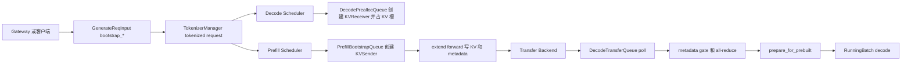

# PD分离

读本专题不是为了记住 Mooncake、NIXL、Fake 这些 backend 名字，而是为了判断：一个请求被拆到 Prefill 节点和 Decode 节点后，谁分配 `bootstrap_room`，谁写 KV，谁证明 metadata 已落地，Decode 又如何跳过 prefill forward 直接进入 decode。

读完应能解决三类问题：

1. PD 部署后 P99 变差，是 Prefill 算力、Decode 槽位、KV 传输还是 metadata gate 卡住。
2. Decode 明明收到 KV，为何仍不能进入 running batch。
3. `bootstrap_room`、`pre_alloc_size`、decode radix cache、staging buffer 和 transfer backend 这些配置的真实边界是什么。

## 阅读路径

| 读者任务 | 先读 | 再读 |
|----------|------|------|
| 建立 PD 分离整体模型 | [[SGLang-PD分离-核心概念]] | [[SGLang-分布式]] |
| 跟一次端到端请求 | [[SGLang-PD分离-源码走读]] | [[SGLang-ScheduleBatch数据结构]] |
| 查对象和队列状态 | [[SGLang-PD分离-数据流]] | [[SGLang-KV-Cache]] |
| 线上排障和选型 | [[SGLang-PD分离-排障指南]] | [[SGLang-可观测性]] |
| 自测是否读懂 | [[SGLang-PD分离-学习检查]] | [[SGLang-RadixAttention]] |

## 心理模型



把 PD 分离读成五本账：

| 账本 | 问题 | 源码入口 |
|------|------|----------|
| 角色账 | 当前进程是 unified、prefill 还是 decode | `DisaggregationMode`、`dispatch_event_loop` |
| 房间账 | 请求要把 KV 送到哪个 decode room | `bootstrap_host`、`bootstrap_port`、`bootstrap_room` |
| 队列账 | 请求在 Prefill/Decode 哪个等待区 | `PrefillBootstrapQueue`、`DecodePreallocQueue`、`DecodeTransferQueue` |
| 就绪账 | KV bytes、metadata、HiCache restore 是否都 ready | `KVPoll`、`_apply_metadata_gate`、`HiCacheRestoreGatedKVReceiver` |
| 执行账 | Decode 如何跳过 prefill forward 进入 running | `prepare_for_prebuilt`、`process_prebuilt`、`get_next_disagg_decode_batch_to_run` |

## 核心源码范围

| 文件 | 本专题关注点 |
|------|--------------|
| `python/sglang/srt/managers/io_struct.py` | 用户请求和 tokenized request 中的 bootstrap 字段 |
| `python/sglang/srt/managers/tokenizer_manager.py` | Fake backend 自动分配 room、初始化 bootstrap server |
| `python/sglang/srt/managers/scheduler.py` | 请求转 `Req`、按 `DisaggregationMode` 选择 event loop |
| `python/sglang/srt/managers/disagg_service.py` | Prefill 侧启动 bootstrap server |
| `python/sglang/srt/disaggregation/prefill.py` | Prefill bootstrap、forward 后发送 KV、inflight poll |
| `python/sglang/srt/disaggregation/decode.py` | Decode prealloc、transfer poll、metadata commit、prebuilt 入 running |
| `python/sglang/srt/disaggregation/decode_schedule_batch_mixin.py` | `ForwardMode.PREBUILT` 的 batch 形态 |
| `python/sglang/srt/disaggregation/utils.py` | mode、metadata buffer、metadata gate、transfer backend |
| `python/sglang/srt/disaggregation/base/conn.py` | `KVPoll` 状态数值 |
| `python/sglang/srt/disaggregation/decode_hicache_mixin.py` | Decode 侧 HiCache prefix restore gate |
| `python/sglang/srt/arg_groups/pd_disaggregation_hook.py` | 启动参数校验与 decode extra slots 默认值 |

## 最小源码锚点

请求必须携带或被补齐 bootstrap 信息，才能跨过 Prefill 和 Decode 两个节点：

```python
# 来源：python/sglang/srt/managers/io_struct.py L239-L245
    # For disaggregated inference
    bootstrap_host: Optional[Union[List[Optional[str]], str]] = None
    bootstrap_port: Optional[Union[List[Optional[int]], int]] = None
    bootstrap_room: Optional[Union[List[Optional[int]], int]] = None
    bootstrap_pair_key: Optional[Union[List[Optional[str]], str]] = None
    decode_tp_size: Optional[Union[List[Optional[int]], int]] = None
```

Prefill 进程启动 bootstrap server；Decode 进程作为 receiver 连接这个 server，后续通过 room 对齐请求：

```python
# 来源：python/sglang/srt/managers/disagg_service.py L14-L29
def start_disagg_service(
    server_args: ServerArgs,
):
    # Start kv bootstrap server on prefill
    disagg_mode = DisaggregationMode(server_args.disaggregation_mode)
    transfer_backend = TransferBackend(server_args.disaggregation_transfer_backend)

    if disagg_mode == DisaggregationMode.PREFILL:
        # only start bootstrap server on prefill tm
        kv_bootstrap_server_class = get_kv_class(
            transfer_backend, KVClassType.BOOTSTRAP_SERVER
        )
        bootstrap_server = kv_bootstrap_server_class(
            host=server_args.host,
            port=server_args.disaggregation_bootstrap_port,
        )
```

## 判断标准

- 看到 prefill 端等待，先看 decode 是否已经 prealloc 和 handshake，不要只看 prefill GPU 利用率。
- 看到 decode 卡在 transfer，先看 `KVPoll`、metadata buffer 的 `bootstrap_room` 和 all-reduce，而不是直接怀疑 model forward。
- 看到短 prompt P99 变差，要把 PD 的固定成本纳入 TCO：bootstrap、metadata、RDMA、双池路由都不是免费。
- 看到 decode radix cache 相关问题，先看启动校验；它与 fake backend、speculative decoding、HiSparse 有明确互斥。

## 相邻专题

| 专题 | 关系 |
|------|------|
| [[SGLang-Speculative]] | PD prebuilt 后可能还要构造 speculative draft input |
| [[SGLang-分布式]] | PD 状态需要 TP/CP/DP rank 达成一致 |
| [[SGLang-RadixAttention]] | Decode radix cache 和 HiCache 依赖 prefix match |
| [[SGLang-KV-Cache]] | PD 本质是在跨节点移动 KV slot 内容 |
| [[SGLang-可观测性]] | P99、transfer latency、queue depth 需要 metrics 支撑 |
