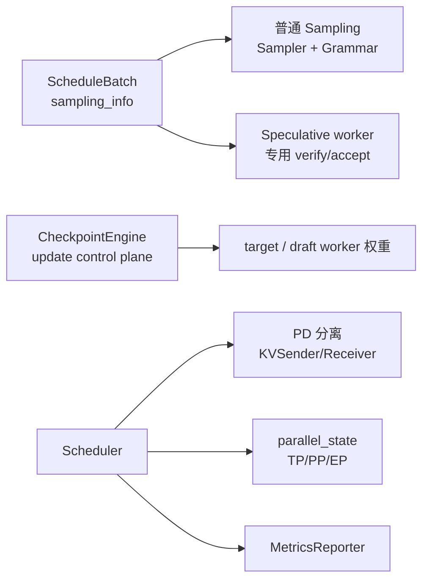

# 高级特性

> 本目录先提供连续的高级特性主线；准备修改实现、核对版本漂移或遇到证据争议时，仍应按 Git `70df09b` 打开 `sglang/` 源码验证。

---

## 本目录解决什么问题

内存与 Attention 部分解决了“算得动、存得下”。本目录回答：**生成质量如何控（采样/语法）？如何更快（投机）？如何扩规模（PD 分离、分布式）？如何运维（可观测、热更新）？**

| 专题 | 角色 | 一句话 |
|------|------|--------|
| [[SGLang-Sampling]] | 采样与约束 | temperature、penalty、json_schema / regex grammar |
| [[SGLang-Speculative]] | 投机解码 | EAGLE / NGRAM / DFLASH 候选与 target 验收 |
| [[SGLang-PD分离]] | PD 分离 | Prefill 集群 + Decode 集群，KV 跨节点传输 |
| [[SGLang-分布式]] | 分布式 | TP / PP / EP / DP，ProcessGroup 与 collective |
| [[SGLang-可观测性]] | 可观测性 | Prometheus、SchedulerStats、/metrics |
| [[SGLang-CheckpointEngine]] | 权重热更新 | 有界等待、控制面 fan-out 与多种更新方法 |

---

## 高级特性在请求路径中的挂载点



这张图的读法是：普通 Sampling 与 speculative verify 都消费 batch 级采样参数，但不是前后串联关系。普通路径走 `Sampler`；EAGLE/NGRAM 走 `eagle_sample` 的专用验收，DFLASH 又有自己的 block accept。PD 与分布式改变进程拓扑、状态所有权和通信路径；可观测性负责把运行状态暴露给 scrape/trace 消费者；CheckpointEngine 协调权重更新，但不提供事务回滚保证。

下面这张源码卡只证明一件事：连续批处理会把每个请求的采样参数压成 batch tensor，而不是证明后续一定走同一个 kernel。

```python
# 来源：python/sglang/srt/sampling/sampling_batch_info.py L93-L107
        top_ps = torch.tensor(
            [r.sampling_params.top_p for r in reqs],
            dtype=torch.float,
            pin_memory=_pin,
        ).to(device, non_blocking=True)
        top_ks = torch.tensor(
            [r.sampling_params.top_k for r in reqs],
            dtype=torch.int32,
            pin_memory=_pin,
        ).to(device, non_blocking=True)
        min_ps = torch.tensor(
            [r.sampling_params.min_p for r in reqs],
            dtype=torch.float,
            pin_memory=_pin,
        ).to(device, non_blocking=True)
```

读法：

- 普通 Sampling 会继续处理 min-p、custom logit processor、seed/backend 等分支。
- speculative verify 只复用部分参数；当前 `eagle_sample` 不应用 min-p 或 custom logit processor。
- greedy 还要区分普通 Sampler 与 speculative 平台条件；HIP/NPU speculative verify 会强制 argmax（见 [[SGLang-Speculative-源码走读]]）。

---

## 零基础一句话

**像高级餐厅增值服务：** Sampling 是口味与出菜规则，Speculative 是先做候选再由主厨验收，PD 分离是中央厨房与出餐区分工，Distributed 是门店与岗位组网，Observability 是运营仪表盘，CheckpointEngine 是营业中换菜单。类比的失效边界是：它不解释 KV slot、TP collective、overlap 状态或更新失败后的部分生效，工程判断仍以各专题源码证据为准。

---

## 推荐阅读顺序

| 顺序 | 文档 | 必读理由 |
|------|------|----------|
| 1 | [[SGLang-Sampling-源码走读]] | Sampler + Grammar 主路径 |
| 2 | [[SGLang-Speculative-数据流]] | 区分 tree verify、DFLASH block 与共同结果契约 |
| 3 | [[SGLang-PD分离-数据流]] | PD 六步数据流 |
| 4 | [[SGLang-分布式-核心概念]] | 并行维度术语 |
| 5 | [[SGLang-可观测性-排障指南]] | scrape 入口、rank 聚合与指标生命周期 |
| 6 | [[SGLang-CheckpointEngine-源码走读]] | 有界等待、fan-out、条件 flush 与无回滚边界 |

---

## 阶段衔接

| 方向 | 模块 | 衔接点 |
|------|------|--------|
| ← 内存与 Attention | KV Cache、Attention、MoE、量化 | Speculative 复用 KV；PD 分离传 KV；Sampling 读取 logits |
| → 扩展组件 | 多模态、LoRA、Gateway | 可选能力叠加在标准 serving 主路径之上 |
| → 设计比较 | [[SGLang-框架对比与设计决策]] | 对比 vLLM/TRT-LLM |

---

## 验证建议（零基础可试）

1. **Grammar：** 启动服务后发送带 `response_format: json_schema` 的请求；预期输出能被同一 schema 解析。若无服务环境，静态替代是定位 grammar mask 在普通与 speculative 路径中的应用点。
2. **投机：** 使用匹配 checkpoint 分别跑关闭投机与 EAGLE/NGRAM；固定模型、prompt、并发和输出长度，记录 accepted drafts、吞吐与延迟。预期不是“一定更快”，而是能解释收益是否覆盖 draft/verify/commit 成本。
3. **Metrics：** `--enable-metrics` 后访问实际服务的 `/metrics`；预期返回 Prometheus 文本并出现 SGLang 指标。若使用 gRPC sidecar，按其独立监听地址验证，不要默认主端口。

---

## 模块导航

| 专题 | 入口 |
|------|------|
| Sampling | [[SGLang-Sampling]] |
| Speculative | [[SGLang-Speculative]] |
| Disaggregation | [[SGLang-PD分离]] |
| Distributed | [[SGLang-分布式]] |
| Observability | [[SGLang-可观测性]] |
| CheckpointEngine | [[SGLang-CheckpointEngine]] |

← [[SGLang-内存与Attention]] · → [[SGLang-扩展组件]]
