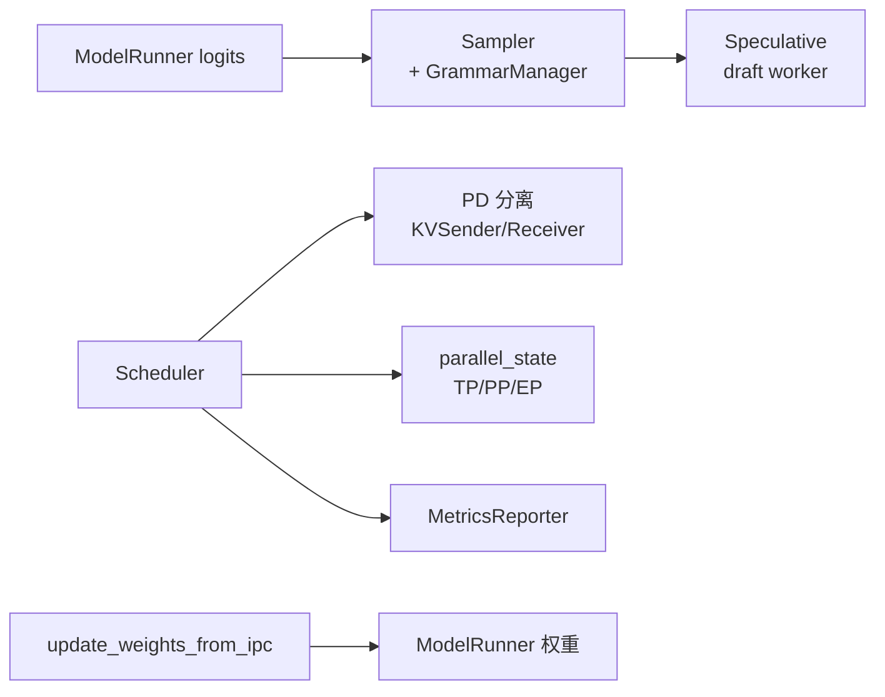

# 高级特性

> **你只需阅读本目录，不必打开 `sglang/` 源码。** 
> 内嵌代码对应 sglang Git commit `70df09b`。

---

## 本目录解决什么问题

内存与 Attention 部分解决了“算得动、存得下”。本目录回答：**生成质量如何控（采样/语法）？如何更快（投机）？如何扩规模（PD 分离、分布式）？如何运维（可观测、热更新）？**

| 模块 | 模块 | 一句话 |
|------|------|--------|
| [[SGLang-Sampling]] | 采样与约束 | temperature、penalty、json_schema / regex grammar |
| [[SGLang-Speculative]] | 投机解码 | EAGLE / N-gram draft，accept/reject 采样 |
| [[SGLang-PD分离]] | PD 分离 | Prefill 集群 + Decode 集群，KV 跨节点传输 |
| [[SGLang-分布式]] | 分布式 | TP / PP / EP / DP，ProcessGroup 与 collective |
| [[SGLang-可观测性]] | 可观测性 | Prometheus、SchedulerStats、/metrics |
| [[SGLang-CheckpointEngine]] | 权重热更新 | IPC 灌权重、不重启 serving |

---

## 高级特性在请求路径中的挂载点



这张图的读法是：采样发生在 Scheduler 收到 logits 之后、写回 next token 之前。投机解码在 Scheduler 层触发额外 draft forward。PD 与分布式改变进程拓扑和通信，不改变 HTTP API。可观测性与 CheckpointEngine 分别承担指标采集和 RLHF 权重热更新。

**源码锚点：**

```python
## 来源：python/sglang/srt/sampling/sampling_batch_info.py L89-L108
            )
            .to(device, non_blocking=True)
            .view(-1, 1)
        )
        top_ps = torch.tensor(
            [r.sampling_params.top_p for r in reqs],
            dtype=torch.float,
            pin_memory=_pin,
        ).to(device, non_blocking=True)
        top_ks = torch.tensor(
            [r.sampling_params.top_k for r in reqs],
            dtype=torch.int32,
            pin_memory=_pin,
        ).to(device, non_blocking=True)
        min_ps = torch.tensor(
            [r.sampling_params.min_p for r in reqs],
            dtype=torch.float,
            pin_memory=_pin,
        ).to(device, non_blocking=True)
        sampling_seed = (
```

读法：

- `vocab_mask` 由 GrammarManager 编译约束（json_schema / regex）后填入。
- batch 级张量与 continuous batching 对齐，每条 req 一行。
- greedy 时跳过 random sampling kernel（见 [[SGLang-Sampling-源码走读]]）。

---

## 零基础一句话

**像高级餐厅增值服务：** Sampling 是口味定制，Speculative 是预制菜加速，PD 分离是中央厨房与分店分工，Distributed 是连锁门店组网，Observability 是运营仪表盘，CheckpointEngine 是换菜单不换店面。

---

## 推荐阅读顺序

| 顺序 | 文档 | 必读理由 |
|------|------|----------|
| 1 | [[SGLang-Sampling-源码走读]] | Sampler + Grammar 主路径 |
| 2 | [[SGLang-Speculative-数据流]] | Scheduler 触发投机 |
| 3 | [[SGLang-PD分离-数据流]] | PD 六步数据流 |
| 4 | [[SGLang-分布式-核心概念]] | 并行维度术语 |
| 5 | [[SGLang-可观测性-排障指南]] | enable_metrics 与 weight_load |
| 6 | [[SGLang-CheckpointEngine-源码走读]] | IPC 热更新 |

---

## 阶段衔接

| 方向 | 模块 | 衔接点 |
|------|------|--------|
| ← 内存与 Attention | KV Cache、Attention、MoE、量化 | Speculative 复用 KV；PD 分离传 KV；Sampling 读取 logits |
| → 扩展组件 | 多模态、LoRA、Gateway | 可选能力叠加在标准 serving 主路径之上 |
| → 设计比较 | [[SGLang-框架对比与设计决策]] | 对比 vLLM/TRT-LLM |

---

## 验证建议（零基础可试）

1. **Grammar：** `response_format: json_schema` 请求，非法 JSON token 应被 mask（20）。
2. **投机：** `--speculative-algorithm EAGLE` 对比吞吐与 accept_rate 日志（见 [[SGLang-Speculative]]）。
3. **Metrics：** `--enable-metrics` 后 `curl localhost:30000/metrics | grep sglang`（见 [[SGLang-可观测性]]）。

---

## 模块导航

| 专题 | 入口 |
|------|------|
| Sampling | [[SGLang-Sampling]] |
| Speculative | [[SGLang-Speculative]] |
| Disaggregation | [[SGLang-PD分离]] |
| Distributed | [[SGLang-分布式]] |
| Observability | [[SGLang-可观测性]] |
| CheckpointEngine | [[SGLang-CheckpointEngine]] |

← [[SGLang-内存与Attention]] · → [[SGLang-扩展组件]]
