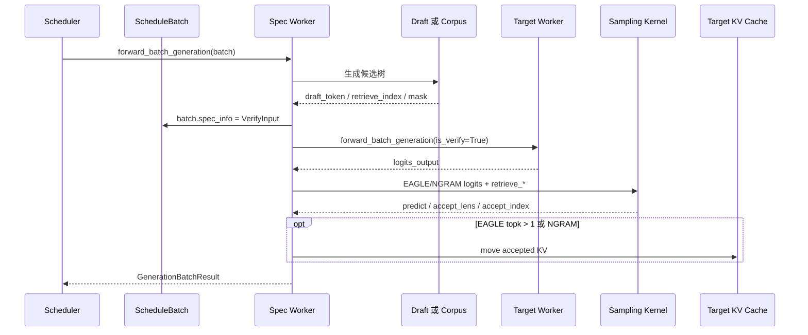

# Speculative · 数据流

## 你为什么要读

这篇只回答一个问题：一次投机 decode 中，对象什么时候改变形态，谁持有状态，下一跳消费者是谁。主线先跟 EAGLE/NGRAM 的树验收，再单列 DFLASH 的 block 验收；读完应能分清“共同调度结果”和“算法内部对象”，而不会把 `accept_index` 或 KV mover 当成所有算法都有的步骤。

## 总览：一条请求的对象形态



同一个对象在不同阶段的含义不同：

| 对象 | draft 前 | verify 中 | accept 后 |
|------|----------|-----------|-----------|
| `ScheduleBatch.input_ids` | 普通 decode 输入 | draft token 或 verify token | 下一轮输入由结果处理推进 |
| `ScheduleBatch.spec_info` | 空或上一轮输入 | `EagleVerifyInput` / `NgramVerifyInput` / `DFlashVerifyInput` | 结果里携带算法专用下一轮输入 |
| `batch.out_cache_loc` | 当前 forward 写入位置 | verify 临时位置 | EAGLE 树/NGRAM 视布局搬移；DFLASH 独立提交 |
| `accept_index`（tree verify） | 不存在 | accepted token 的 verify 位置索引 | EAGLE/NGRAM 的 KV mover 和 logprob 消费；DFLASH 不生产此对象 |
| `accept_lens` | 不存在 | 每请求接受长度，含 bonus | Scheduler 更新 `seq_lens` |

## 1. `EagleDraftInput`：draft 阶段的随身包

EAGLE draft 不是只传 token id。它还要携带 topk 分布、hidden states、MTP topk 记忆和 bonus token。这个对象会在多个 draft step 之间按引用共享，因此字段含义必须稳定。

```python
# 来源：python/sglang/srt/speculative/eagle_info.py L144-L176
@dataclass
class EagleDraftInput(SpecInput):
    # For idle stubs use `create_idle_input`, not the bare ctor: `filter_batch`
    # / `merge_batch` slice / cat `topk_p` / `topk_index` / `hidden_states` /
    # `bonus_tokens` unconditionally.

    # shape: (b, topk)
    topk_p: torch.Tensor = None
    topk_index: torch.Tensor = None
    # shape: (b, vocab) - single-step draft proposal q from draft-extend;
    # only set under rejection sampling.
    draft_probs: torch.Tensor = None
    # shape: (b, hidden_size) - one hidden per req, consumed by `draft` forward.
    # None when the spec algorithm's draft doesn't read hidden_states
    # (e.g., STANDALONE — vanilla LLM draft).
    hidden_states: Optional[torch.Tensor] = None
    capture_hidden_mode: CaptureHiddenMode = CaptureHiddenMode.FULL

    # Survives across draft steps: spec_info is shared by reference across the
    # per-step forwards (each runs on a copied ForwardBatch, dropping writebacks).
    mtp_topk_indices: Optional[torch.Tensor] = None

    # Per-req bonus token (the "+1" target prediction at end of each accept
    # chain); the worker copies it here post-extend for next iter's draft.
    bonus_tokens: torch.Tensor = None

    # shape: (b + 1,)
    kv_indptr: torch.Tensor = None
    kv_indices: torch.Tensor = None

    num_tokens_per_req: int = -1
    num_tokens_for_logprob_per_req: int = -1
```

读这段要抓住两条生命周期：

- `hidden_states` 是 EAGLE family draft 的输入，STANDALONE 可以没有。
- `bonus_tokens` 来自上一轮 target verify 的末尾预测，会成为下一轮 draft 的起点之一。

失败边界：如果 `filter_batch` 或 `merge_batch` 给 idle stub 留了空字段，后续无条件 slice/cat 会失败；源码注释要求用专门的 idle input 构造方式。

## 2. `EagleVerifyInput`：target verify 读的是树，不是线性 token 列表

verify 输入把 draft 生成的树压成几组张量：候选 token、custom mask、position、retrieve index、next token、next sibling、累计长度。Attention backend 靠这些张量一次性看完整棵候选树。

```python
# 来源：python/sglang/srt/speculative/eagle_info.py L17-L43
@dataclass
class EagleVerifyInput(SpecInput):
    draft_token: torch.Tensor
    custom_mask: torch.Tensor
    positions: torch.Tensor
    retrieve_index: torch.Tensor
    retrieve_next_token: torch.Tensor
    retrieve_next_sibling: torch.Tensor
    retrieve_cum_len: torch.Tensor
    spec_steps: int
    topk: int
    draft_token_num: int
    capture_hidden_mode: CaptureHiddenMode
    seq_lens_sum: int
    seq_lens_cpu: torch.Tensor
    grammar: BaseGrammarObject = None
    # Stacked per-step draft proposal distribution q, shape (bs, num_steps,
    # vocab); only set under rejection sampling. Consumed by the verify kernel.
    draft_probs: torch.Tensor = None

    # Shape info for padding
    num_tokens_per_req: int = -1  # -1 auto-fills from draft_token_num.

    def __post_init__(self):
        super().__init__(SpecInputType.EAGLE_VERIFY)
        if self.num_tokens_per_req < 0:
            self.num_tokens_per_req = self.draft_token_num
```

对象边界：

- `draft_token` 是被验收的候选。
- `retrieve_*` 描述树拓扑和可接受路径。
- `draft_probs` 只在 rejection sampling 需要 draft proposal distribution 时有意义。
- `__post_init__` 把对象身份固定成 `EAGLE_VERIFY`，后续 attention/padding 不需要知道具体 class 名称。

## 3. draft extend 会临时改写 `ScheduleBatch`

EAGLE draft extend 要把上一阶段预测 token 装进 batch，并把 `spec_info` 改成 draft extend 输入。这里最容易出错的是 stream 边界：不能在 plan stream 内做 dtype cast。

```python
# 来源：python/sglang/srt/speculative/base_spec_worker.py L92-L129
    def prepare_for_draft_extend(
        self,
        draft_extend_input: EagleDraftExtendInput,
        batch: ScheduleBatch,
        predict: torch.Tensor,
        num_draft_tokens: int,
        draft_model_runner: Any,
        cuda_graph_runner: Any,
    ):
        from sglang.srt.model_executor.forward_batch_info import (
            CaptureHiddenMode,
            ForwardBatch,
            ForwardMode,
        )
        from sglang.srt.utils.async_probe import maybe_detect_oob
        from sglang.srt.utils.common import is_npu

        bs = len(batch.seq_lens)
        extend_num_tokens = bs * num_draft_tokens
        # When seq_lens_cpu is absent, stay on GPU-only path -- no .tolist()/.cpu().
        gpu_only = batch.seq_lens_cpu is None

        batch.spec_info = draft_extend_input
        # Do NOT cast predict dtype here. The caller (e.g., _draft_extend_for_decode)
        # may run this under a plan stream; casting inside the plan stream creates a
        # cross-stream dependency that can lead to data races and break MTP acceptance.
        # The caller should cast to int64 before entering the plan stream context.
        batch.input_ids = predict
        maybe_detect_oob(
            batch.input_ids,
            0,
            batch.model_config.vocab_size,
            "v2 prepare_for_draft_extend input_ids",
        )
        # init_new requires both list or both Tensor;
        # gpu_only emits device tensors to skip H2D.
        if gpu_only:
            batch.prefix_lens = batch.seq_lens.to(torch.int32)
```

这段证明 `ScheduleBatch` 在投机路径里不是不可变数据包，而是被阶段性重装的执行快照。读者调试 draft extend 时，应检查 caller 是否已经把 `predict` 放到正确 dtype/device，而不是在这里补 cast。

## 4. topk draft 分支与 paged KV 的交界

topk 大于 1 时，每个 draft branch 有自己的 draft page。prefix 的 partial tail 必须复制到 branch 1 之后的首页 hole，否则 branch 按 block id 读 KV 时会看到错误上下文。

```python
# 来源：python/sglang/srt/speculative/base_spec_worker.py L22-L45
def duplicate_prefix_tail_to_draft_branches(
    token_to_kv_pool,
    rows: torch.Tensor,
    prefix_base: torch.Tensor,
    last_page: torch.Tensor,
    num_new_pages: torch.Tensor,
    topk: int,
    page_size: int,
) -> None:
    """Copy the prefix partial-tail page into each branch's first-page holes (page>1 + topk>1).

    The draft-decode expand pass reads each branch's own draft page by block id
    (cache_loc // page_size), so branch b>=1's hole slots [0, last_page) must hold the
    real prefix tail (branch 0's first page already is it). Mirrors V1 #7725.
    """
    if topk <= 1:
        return
    bs = rows.shape[0]
    page_off = torch.arange(page_size, device=rows.device, dtype=torch.int64)
    branches = torch.arange(1, topk, device=rows.device, dtype=torch.int64).view(
        1, topk - 1, 1
    )
    # Source: the prefix tail page [prefix_base, prefix_base + page_size), one per branch.
    src_pos = (prefix_base.view(bs, 1, 1) + page_off.view(1, 1, page_size)).expand(
```

这不是优化细节，而是正确性边界。`topk <= 1` 时没有分支页 hole；`topk > 1` 时 branch 1+ 必须补齐 prefix tail。

## 5. NGRAM 的 verify input 是不规则树

NGRAM 的候选来自 corpus BFS，树深度不等价于 `spec_steps`。因此 `NgramVerifyInput.max_tree_depth` 直接等于 draft token budget，`tree_topk` 返回 `-1` 表示不规则 branching。

```python
# 来源：python/sglang/srt/speculative/ngram_info.py L12-L61
class NgramVerifyInput(SpecInput):
    def __init__(
        self,
        draft_token: torch.Tensor = None,
        custom_mask: torch.Tensor = None,
        positions: torch.Tensor = None,
        retrieve_index: torch.Tensor = None,
        retrieve_next_token: torch.Tensor = None,
        retrieve_next_sibling: torch.Tensor = None,
        draft_token_num: int = None,
        grammar: BaseGrammarObject = None,
        future_indices: Optional[torch.Tensor] = None,
        new_seq_lens: Optional[torch.Tensor] = None,
        accept_tokens: Optional[torch.Tensor] = None,
        accept_lens: Optional[torch.Tensor] = None,
    ):
        super().__init__(SpecInputType.NGRAM_VERIFY)
        self.draft_token = draft_token
        self.custom_mask = custom_mask
        self.positions = positions
        self.retrieve_index = retrieve_index
        self.retrieve_next_token = retrieve_next_token
        self.retrieve_next_sibling = retrieve_next_sibling
        self.draft_token_num = draft_token_num
        self.grammar = grammar

        # Inputs for V2 overlap worker
        self.future_indices = future_indices
        self.new_seq_lens = new_seq_lens
        self.accept_tokens = accept_tokens
        self.accept_lens = accept_lens

        self.device = (
            custom_mask.device if custom_mask is not None else new_seq_lens.device
        )

    @property
    def max_tree_depth(self) -> int:
        # NGRAM trees are node-budgeted with no depth cap: the corpus BFS only
        # stops on the node budget, so a single long match can chain all
        # draft_token_num nodes (spec_steps is meaningless for this tree).
        return self.draft_token_num

    @property
    def tree_topk(self) -> int:
        # Irregular tree: per-level branching follows the corpus matches.
        return -1

    def get_spec_adjust_token_coefficient(self) -> Tuple[int, int]:
        return self.draft_token_num, self.draft_token_num
```

这解释了为什么不能把 EAGLE 的 `(bs, spec_steps + 1)` 宽度假设套到 NGRAM。NGRAM 的 `accept_index` 宽度和 logprob 参数使用 `draft_token_num`。

## 6. verify 结果到 Scheduler 的对象边界

EAGLE verify 结束后，worker 返回 `GenerationBatchResult`。对 Scheduler 来说，最重要的是下一批 token、是否可跑 CUDA graph、接受长度、新 seq_lens 和下一轮 draft input。

```python
# 来源：python/sglang/srt/speculative/eagle_worker_v2.py L1588-L1595
        if not batch.forward_mode.is_idle() and self.topk > 1:
            # topk == 1 needs nothing here: the accepted path is already the front
            # chain, so the whole compaction is an identity transform.
            predict = self._finalize_accept_tree_path(
                batch, accept_index, accept_lens, predict, logits_output, bs
            )

        next_draft_input = EagleDraftInput(bonus_tokens=bonus_tokens)
```

```python
# 来源：python/sglang/srt/speculative/eagle_worker_v2.py L1601-L1608
        return GenerationBatchResult(
            logits_output=logits_output,
            next_token_ids=predict,
            can_run_cuda_graph=can_run_cuda_graph,
            speculative_num_draft_tokens=self.speculative_num_draft_tokens,
            next_draft_input=next_draft_input,
            accept_lens=accept_lens,
            new_seq_lens=new_seq_lens,
```

这里有两个边界：topk 大于 1 时，返回给 Scheduler 前先 compact accepted path；`next_draft_input` 则把 bonus token 交给下一轮 draft。源码相邻注释还提醒，verify-time GPU tensors 需要跨过下一次 `batch.input_ids` rebind 的短期生命周期。

NGRAM 返回结果的形态类似，但 `next_draft_input` 是下一轮 NGRAM verify input，里面带新 seq_lens 和 accepted tokens。

```python
# 来源：python/sglang/srt/speculative/ngram_worker.py L503-L520
        # Construct the next draft input
        next_draft_input = NgramVerifyInput(
            draft_token_num=self.draft_token_num,
            new_seq_lens=new_seq_lens,
            accept_tokens=accept_tokens,
            accept_lens=accept_lens,
        )
        return GenerationBatchResult(
            logits_output=logits_output,
            next_token_ids=next_token_ids,
            can_run_cuda_graph=can_run_cuda_graph,
            accept_lens=accept_lens,
            # Consumed by the non-overlap V2 scheduler branch to advance
            # batch.seq_lens after the isolation restore; overlap mode relays
            # it via on_publish instead.
            new_seq_lens=new_seq_lens,
            next_draft_input=next_draft_input,
            speculative_num_draft_tokens=self.speculative_num_draft_tokens,
```

两者共同说明：`next_draft_input` 不是用户输出，而是下一轮投机 worker 的内部接力棒。

## 7. 跨模块交互表

| 交互边 | 携带对象 | 不变量 | 破坏后现象 |
|--------|----------|--------|------------|
| Scheduler → Spec Worker | `ScheduleBatch` | `forward_mode`、`seq_lens`、`sampling_info` 与当前 batch 对齐 | verify 输入维度错、grammar mask 错 |
| Spec Worker → 候选生成 | `EagleDraftInput`、corpus state 或 DFLASH block state | token、hidden/cache 状态属于同一请求 | draft 候选偏离上下文 |
| Tree draft → Target Verify | `EagleVerifyInput` / `NgramVerifyInput` | `retrieve_*` 与 `custom_mask` 描述同一棵树 | attention mask 或 accept path 错 |
| Target → Tree sampling | `logits_output.next_token_logits` | logits 行数等于 verify token 数 | `accept_index` 指向错误位置 |
| Target → DFLASH accept | logits 与固定 block candidates | `commit_lens = accept_len + 1`，bonus 写在接受边界 | 输出 token 与推进长度错位 |
| Tree sampling → 条件式 KV mover | `predict`、`accept_lens`、`accept_index` | NGRAM 总是搬；EAGLE 仅 `topk > 1` 搬，且 mover 接收 drafts-only count | off-by-one、KV 写回错位 |
| Worker → Scheduler | `GenerationBatchResult` | `next_token_ids` 和 `new_seq_lens` 同步 | 输出 token 数与请求长度不一致 |

## 运行验证

最直接的验证是观察对象形态，而不是先看吞吐：

| 断点 | 观察 |
|------|------|
| `EAGLEWorkerV2.verify` 进入时 | `batch.spec_info` 应是 `EagleVerifyInput`，`draft_token_num` 与 verify token 数一致 |
| `eagle_sample` 返回后 | `accept_lens` 至少为 1，因为包含 bonus token |
| `_finalize_accept_tree_path` | 只在 `topk > 1` 且非 idle 时执行 |
| `move_accept_tokens_to_target_kvcache` | 仅在实际调用路径观察；`size == bs * accept_index.shape[1]` |
| `NGRAMWorker.forward_batch_generation` verify 分支 | `draft_worker is None`，但仍调用 target verify 和 KV mover |

## 8. DFLASH：同样交付推进长度，但不生产树验收对象

DFLASH 的 target verify 使用标准 causal mask。若非 greedy 且 sampling verify kernel 可用，它调用 DFLASH 专用 sampling verify；否则走 argmax 的 block 接受逻辑。两条路径都形成 `commit_lens = accept_len + 1` 和 `out_tokens`，但不调用 `eagle_sample`，也不把 `accept_index` 交给通用 KV mover。

因此调试对象应分层：Scheduler 仍关心 `accept_lens/new_seq_lens/next_token_ids` 的一致性；DFLASH worker 内部则应观察 `candidates`、`accept_len`、`bonus`、`commit_lens` 与 block cache materialization。把 EAGLE 树的 `retrieve_*`、custom tree mask 或 compact path 套到 DFLASH，得到的断点不会命中。
