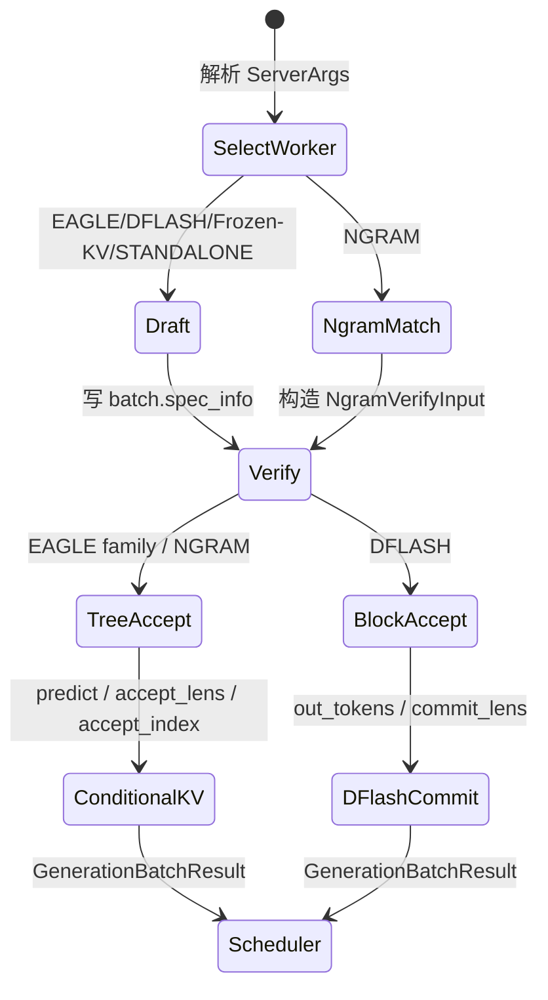

# Speculative · 核心概念

读这篇的目的不是背算法名，而是先建立一个能排障的模型：投机解码在一次 decode step 里先提出多条候选，再让 target 模型验收，最后只把被接受的 token 和 KV 状态并入主链。只要这三件事中任一件错位，表面现象可能是吞吐下降、输出不一致、KV 越界或结构化输出被错误 mask。

读完应能回答：

1. 为什么 EAGLE、NGRAM、DFLASH、Frozen-KV MTP 都能挂在同一个调度入口下。
2. `batch.spec_info` 为什么是阶段标记，而不是普通附加字段。
3. 为什么 accept lens 对 Scheduler 是“接受 token 数”，对 KV mover 却要扣掉 bonus token。
4. 为什么 NGRAM 是投机路径，却没有 draft model 和 draft KV。

## 先建立模型

把一次投机 decode 想成一条验收流水线：



这个模型有四本账。

| 账本 | 看什么 | 典型问题 |
|------|--------|----------|
| 控制账 | 字符串算法名如何变成 worker | 启动时报未知算法、自定义插件不支持 overlap |
| 阶段账 | 当前 batch 是 draft、draft extend 还是 verify | Attention backend 读错 mask 或 padding 规则 |
| KV 账 | 哪些 KV 是临时 verify 位置，哪些要并入 target 主链 | topk 大于 1 时 KV 写回错位 |
| 验收账 | target 如何决定接受长度，结果如何反馈 adaptive | accept rate 低、TP rank 输出不一致 |

一个有用的类比是“质检线”：draft 像快速生产候选零件，target verify 是正式质检，accept 写回是入库。类比只到这里为止；它不能解释 CUDA stream、FlashInfer metadata、paged KV slot 这些实现细节，具体判断仍要回到源码。

## 控制账：算法名不是开关，是 worker 工厂输入

系统压力：投机算法既有内置实现，也允许插件扩展。Scheduler 不能在每个调用点写一串字符串分支，否则新增算法会污染调度层。

源码把算法名统一成一个 duck-typed 对象：内置算法是 enum，插件算法来自 registry，调度所依赖的主接口是 `is_*`、`supports_*` 和 `create_worker`。边界是：注册期的一致性检查只枚举名字以 `is_` 或 `supports_` 开头的方法，并不证明插件实现了内置 enum 的每个辅助能力方法；插件若被新调用点要求 `need_topk` 或 `carries_draft_hidden_states`，仍可能在运行期暴露接口缺口。

```python
# 来源：python/sglang/srt/speculative/spec_info.py L28-L57
class SpeculativeAlgorithm(Enum):
    """Builtin speculative decoding algorithms. Plugin-registered ones are
    ``CustomSpecAlgo`` instances; ``from_string`` returns either type, and
    both expose the same ``is_*()`` / ``create_worker`` interface so callers
    dispatch uniformly without isinstance checks.
    """

    DFLASH = auto()
    EAGLE = auto()
    EAGLE3 = auto()
    FROZEN_KV_MTP = auto()
    STANDALONE = auto()
    NGRAM = auto()
    NONE = auto()

    @classmethod
    def from_string(
        cls, name: Optional[str]
    ) -> Union[SpeculativeAlgorithm, CustomSpecAlgo]:
        if name is None:
            return cls.NONE
        upper = name.upper()
        try:
            return cls[upper]
        except KeyError:
            pass
        spec = _get_registered_spec(upper)
        if spec is not None:
            return spec
        raise ValueError(f"Unknown speculative algorithm name: {name}")
```

这里的关键判断是：`NONE` 不是某个 worker，而是关闭投机；其他算法必须继续进入 worker 工厂。未知名称早抛错，避免 target worker 和 draft worker 初始化到一半才失败。

插件路径的边界在注册表。注册时会检查保留名、重复名和 `CustomSpecAlgo` 接口形状，随后把 factory 存进 registry。

```python
# 来源：python/sglang/srt/speculative/spec_registry.py L189-L219
def register_algorithm(
    name: str,
    *,
    supports_overlap: bool = False,
    validate_server_args: Optional[ServerArgsValidator] = None,
    spec_class: Type[CustomSpecAlgo] = CustomSpecAlgo,
) -> Callable[[WorkerFactory], WorkerFactory]:
    """Return a decorator that registers a plugin algorithm under ``name``.

    Pass a ``spec_class`` subclass of ``CustomSpecAlgo`` to override any
    ``is_*()`` / ``supports_*()`` / ``create_worker`` method.
    """
    upper = name.upper()
    if upper in _reserved_names():
        raise ValueError(
            f"'{upper}' is a reserved speculative algorithm name; cannot be re-registered."
        )
    if upper in _REGISTRY:
        raise ValueError(f"Speculative algorithm '{upper}' already registered.")
    _assert_custom_spec_algo_conforms(spec_class)

    def decorator(factory: WorkerFactory) -> WorkerFactory:
        _REGISTRY[upper] = spec_class(
            name=upper,
            factory=factory,
            supports_overlap=supports_overlap,
            validate_server_args=validate_server_args,
        )
        return factory

    return decorator
```

不变量：插件名不能覆盖内置算法；插件类要满足 `CustomSpecAlgo` 接口；factory 返回的 worker 还要在创建阶段通过 overlap 能力校验。否则启动期能挡住一部分错误，但错误声明能力的插件仍可能在运行时破坏调度协议。

## 阶段账：`spec_info` 是 batch 的临时身份牌

普通 decode 的 batch 只表示“继续生成一个 token”。投机路径下，同一个 `ScheduleBatch` 可能被临时改造成 draft 输入、draft extend 输入、target verify 输入。Attention backend 不能靠 worker 类型猜当前阶段，必须看 `SpecInputType`。

```python
# 来源：python/sglang/srt/speculative/spec_info.py L243-L278
class SpecInputType(IntEnum):
    # NOTE: introduce this to distinguish the SpecInput types of multiple algorithms when asserting in attention backends.
    # If all algorithms can share the same datastrucutre of draft_input and verify_input, consider simplify it
    EAGLE_DRAFT = auto()
    EAGLE_DRAFT_EXTEND = auto()
    EAGLE_VERIFY = auto()
    FROZEN_KV_MTP_DRAFT = auto()
    FROZEN_KV_MTP_VERIFY = auto()
    DFLASH_DRAFT = auto()
    DFLASH_VERIFY = auto()
    NGRAM_VERIFY = auto()


class SpecInput(ABC):
    def __init__(self, spec_input_type: SpecInputType):
        self.spec_input_type = spec_input_type

    # Cross-algorithm phase guards. Used by attention backends and
    # ForwardBatch padding logic to dispatch on phase without hardcoding the
    # specific algo class (EAGLE / FROZEN_KV_MTP / DFLASH / NGRAM each have
    # their own draft / verify SpecInput subclasses).
    def is_draft_input(self) -> bool:
        return self.spec_input_type in {
            SpecInputType.EAGLE_DRAFT,
            SpecInputType.EAGLE_DRAFT_EXTEND,
            SpecInputType.FROZEN_KV_MTP_DRAFT,
            SpecInputType.DFLASH_DRAFT,
        }

    def is_verify_input(self) -> bool:
        return self.spec_input_type in {
            SpecInputType.EAGLE_VERIFY,
            SpecInputType.FROZEN_KV_MTP_VERIFY,
            SpecInputType.DFLASH_VERIFY,
            SpecInputType.NGRAM_VERIFY,
        }
```

这段证明两个事实：

- NGRAM 没有 draft 阶段，但有 verify 阶段。
- EAGLE、Frozen-KV MTP、DFLASH 的 draft/verify 都用同一套阶段谓词给 attention 与 padding 逻辑分发。

失败模式也很直接：如果某个路径忘了写 `batch.spec_info`，后续 forward 会按普通 batch 或错误阶段解释 mask、position、KV loc。

## KV 账：NGRAM 是无 draft KV 的特例

很多投机排障会误以为“有投机就有 draft KV”。源码不是这样分的：是否写 draft KV 是算法语义，不是投机总开关。EAGLE family 会写 draft chain，NGRAM 的候选树来自 corpus match，只在 verify 输入和 mask 里存在。

```python
# 来源：python/sglang/srt/speculative/spec_info.py L121-L130
    def has_draft_kv(self) -> bool:
        """Whether the draft phase writes KV chains. NGRAM does not (its tree
        lives only in the verify mask), so per-decode KV sizing needs no
        per-topk page rounding; see get_alloc_len_per_decode."""
        return not self.is_ngram()

    def carries_draft_hidden_states(self) -> bool:
        """Whether the disagg prefill->decode transfer carries draft hidden
        states (EAGLE-family only; STANDALONE's vanilla draft ignores them)."""
        return self.is_eagle()
```

这段把两个容易混淆的边界拆开：

- `has_draft_kv()` 管内存账：NGRAM 不为 draft branch 写 KV。
- `carries_draft_hidden_states()` 管 disaggregation 交接：只有 EAGLE family 传 draft hidden states。

因此 PD 部署下看到 hidden transfer 问题，优先查 EAGLE family；看到 NGRAM 性能问题，优先查 corpus match、verify 成本和 accept rate，而不是 draft model。

## 验收账：共同的是调度结果，不是验收函数

EAGLE family 与 NGRAM 的 tree verify 会在内部形成三样东西：

| 字段 | 含义 | 谁消费 |
|------|------|--------|
| `predict` | 每个 verify 位置的最终 token 选择 | Scheduler、下一轮 draft |
| `accept_index` | 被接受 token 在 verify block 中的位置 | KV mover、logprob 计算 |
| `accept_lens` | 每个请求本轮向前推进几个 token | Scheduler、新 seq_lens |

其中 `accept_lens` 包含 trailing bonus token；通用 KV mover 的 `num_correct_drafts` 参数只接收 draft 命中数量，所以 EAGLE `topk > 1` 与 NGRAM 调用者传 `accept_lens - 1`。EAGLE `topk == 1` 的 accepted chain 已位于每请求块前部，跳过 mover；DFLASH 则按固定 block 计算 `commit_lens/out_tokens`，不调用 `eagle_sample`，也没有这套 `accept_index → 通用 mover` 内部契约。

真正跨算法稳定的是交回 Scheduler 的结果语义：本轮输出 token、每请求推进长度、新序列长度和下一轮内部输入必须彼此一致。把“共同结果契约”误读成“共同函数调用”，会让 DFLASH、EAGLE 单链和树状 EAGLE 的排障入口全部错位。

## 读者抓手

首次阅读时，不要按文件名背诵。按这条链路复述：

`ServerArgs` 选算法 → worker 工厂包住 target worker → draft model、corpus match 或 DFLASH block 提候选 → `SpecInput` 改写 batch 阶段 → target verify 得 logits → 算法专用验收与提交 → `GenerationBatchResult` 回 Scheduler。

排障时，从症状反推账本：

| 症状 | 先查账本 | 第一入口 |
|------|----------|----------|
| 启动失败 | 控制账 | `SpeculativeAlgorithm.from_string`、`CustomSpecAlgo.create_worker` |
| Attention mask 或 padding 异常 | 阶段账 | `SpecInputType`、具体 `VerifyInput` |
| KV 越界或 topk 输出错位 | KV 账 | EAGLE `_finalize_accept_tree_path`、NGRAM mover、DFLASH commit 分支 |
| TP rank 结果不一致 | 验收账 | `eagle_sample` stochastic branch 的 broadcast 条件 |
| accept rate 低且吞吐下降 | 验收账 | `accept_lens`、EAGLE adaptive controller、draft 步数 |

## 运行验证

投机解码先从控制账和验收账验证。下面的检索覆盖算法枚举、插件式自定义算法、阶段输入、NGRAM 特例、EAGLE 采样返回的 `accept_index` 与 bonus token 语义。

```powershell
rg -n 'SpeculativeAlgorithm|SpecInputType|class SpecInput|NGRAM|CustomSpecAlgo|create_worker|accept_lens|accept_index|bonus_tokens|eagle_sample|num_correct_drafts|commit_lens|compute_dflash' sglang/python/sglang/srt/speculative/spec_info.py sglang/python/sglang/srt/speculative/spec_registry.py sglang/python/sglang/srt/speculative/eagle_utils.py sglang/python/sglang/srt/speculative/dflash_worker_v2.py
```

读输出时先看 `SpeculativeAlgorithm.from_string/create_worker`，确认算法名会选出不同 worker；再看 `SpecInputType`，确认 batch 当前处在 draft 还是 verify；最后把 EAGLE/NGRAM 的 `num_correct_drafts + 1` 与 DFLASH 的 `commit_lens = accept_len + 1` 对照起来。两者都把 bonus 算进推进长度，但内部验收结构并不相同。
