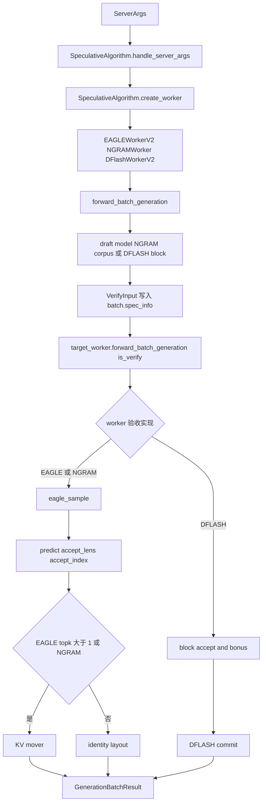

# Speculative · 源码走读

这篇沿一轮 decode step 走源码：启动参数先决定 worker，worker 再提出候选，target verify 产生 logits，算法专用验收逻辑决定接受长度，最后按各自布局提交 token 与 cache 状态。读完应能把 EAGLE、NGRAM 和 DFLASH 从控制面追到调度结果，而不是只记住算法名。

## 长文读法

这篇按“候选怎么来、target 怎么验、验收结果怎么提交”读：`SpeculativeAlgorithm` 先把参数规范化并选择 worker，`BaseSpecWorker` 规定 target / draft / adaptive 的外壳契约；EAGLE family 用 draft worker 生成候选，NGRAM 用语料匹配生成候选，二者复用 `eagle_sample`，但 KV 提交仍有条件；DFLASH 则使用独立 block verify。共同的是最终交给 Scheduler 的推进语义，不是共同调用一组函数。

| 读者任务 | 先读 | 要抓住的判断 |
|----------|------|--------------|
| 第一次建立投机解码主线 | 主线图、1 到 3 | 算法名不会直接进热路径，先被参数钩子和 worker 工厂降成统一执行器 |
| 判断 EAGLE worker 拿了哪些资源 | 4 | `EAGLEWorkerV2` 同时持有 target worker、draft worker、draft attention backend 和 adaptive controller |
| 排查 EAGLE target verify | 5 到 6 | target 只负责正式 logits，接受长度、接受索引和最终 token 由 `eagle_sample` 收口 |
| 理解 rejection sampling 或 TP 不一致 | 6 | stochastic 分支才做 rejection/target-only sampling 与 TP broadcast；HIP/NPU 强制 argmax |
| 排查 accepted token 没进主 KV | 7 | EAGLE `topk > 1` 才 compact/move；`topk == 1` 是 identity layout；NGRAM 总是搬 |
| 对比 NGRAM 与 EAGLE | 8 | NGRAM 没有独立 draft model，但仍复用 verify、采样和 KV 写回这套验收账 |
| 区分 DFLASH | 9 | DFLASH 用固定 block、标准 causal mask 和自己的 accept/bonus 实现 |
| 看 adaptive 为什么会变步数 | 10 | EAGLE verify 结果到 CPU result processor 后才反馈 controller |

读的时候把“草稿生成”“算法内验收”“调度提交”分开：EAGLE/NGRAM 的树验收产出 `predict/accept_lens/accept_index`；DFLASH 产出 `out_tokens/commit_lens`。两条实现最终都要保证 `GenerationBatchResult` 的 token 与长度一致，但中间对象不能互换。

## 主线图



这条主线至少有三处分叉：候选来源、验收算法和提交布局。EAGLE family 有独立 draft worker，NGRAM 没有 draft model；EAGLE `topk > 1` 才需要 compact，`topk == 1` 的链已在前部；DFLASH 不进入树验收路径。

## 1. 参数先被算法钩子规范化

系统压力：CLI 只给出一组 `speculative_*` 参数，但不同算法需要不同默认值和派生字段。worker 构造函数如果各自补默认值，启动语义会分散。

源码把参数变更集中到算法对象上：

```python
# 来源：python/sglang/srt/speculative/spec_info.py L162-L181
    def handle_server_args(self, server_args: ServerArgs) -> None:
        """Hook for per-algorithm server args mutation.

        In-place updated.
        """
        from sglang.srt.arg_groups.speculative_hook import (
            _handle_dflash,
            _handle_eagle_family,
            _handle_frozen_kv_mtp,
            _handle_ngram,
        )

        if self.is_dflash():
            _handle_dflash(server_args)
        elif self.is_frozen_kv_mtp():
            _handle_frozen_kv_mtp(server_args)
        elif self.is_eagle() or self.is_standalone():
            _handle_eagle_family(server_args)
        elif self.is_ngram():
            _handle_ngram(server_args)
```

执行逻辑很短：算法对象不直接创建资源，只把 `ServerArgs` 修到该算法能启动的形态。新增算法时如果忘记提供等价钩子，可能表现为 worker 构造期缺字段，而不是算法名解析失败。

## 2. worker 工厂把算法落到执行器

系统压力：Scheduler 需要拿到一个 worker class，而不是在热路径里判断每种算法。源码在 `create_worker` 里完成这个分发。

```python
# 来源：python/sglang/srt/speculative/spec_info.py L193-L238
    def create_worker(
        self, server_args: ServerArgs
    ) -> Optional[Union[Type[BaseSpecWorker], Type[TpModelWorker], Type[NGRAMWorker]]]:
        assert (
            not self.is_none()
        ), "Cannot create worker for NONE speculative algorithm."

        if self.is_dflash():
            # V2 worker drives both overlap and non-overlap (scheduler runs it
            # synchronously when overlap is disabled), same as EAGLE.
            from sglang.srt.speculative.dflash_worker_v2 import DFlashWorkerV2

            return DFlashWorkerV2

        if self.is_frozen_kv_mtp():
            # V2 worker drives both overlap and non-overlap (scheduler runs it
            # synchronously when overlap is disabled), same as EAGLE.
            from sglang.srt.speculative.frozen_kv_mtp_worker_v2 import (
                FrozenKVMTPWorkerV2,
            )

            return FrozenKVMTPWorkerV2

        # EAGLE / EAGLE3 / STANDALONE / MULTI_LAYER always use the V2 worker,
        # even with overlap disabled (scheduler drives it synchronously).
        if self.is_eagle() and server_args.enable_multi_layer_eagle:
            from sglang.srt.speculative.multi_layer_eagle_worker_v2 import (
                MultiLayerEagleWorkerV2,
            )

            return MultiLayerEagleWorkerV2

        elif self.is_eagle():
            from sglang.srt.speculative.eagle_worker_v2 import EAGLEWorkerV2

            return EAGLEWorkerV2
        elif self.is_standalone():
            from sglang.srt.speculative.standalone_worker_v2 import (
                StandaloneWorkerV2,
            )

            return StandaloneWorkerV2
        elif self.is_ngram():
            from sglang.srt.speculative.ngram_worker import NGRAMWorker

            return NGRAMWorker
```

这里能建立三个判断：

- `NONE` 不会创建 speculative worker。
- DFLASH、Frozen-KV MTP、EAGLE family、STANDALONE、NGRAM 都由 V2 调度入口管理，但 worker 内部协议并不因此相同。
- Multi-Layer EAGLE 是 EAGLE 分支里的子选路，不是新枚举名。

## 3. 所有 worker 都要满足同一个外壳契约

系统压力：上层调度既要能拿 target worker，又要能处理 draft worker、attention backend、adaptive hook。抽象边界放在 `BaseSpecWorker`。

```python
# 来源：python/sglang/srt/speculative/base_spec_worker.py L274-L330
class BaseSpecWorker(ABC):
    @property
    @abstractmethod
    def target_worker(self) -> TpModelWorker:
        pass

    @property
    @abstractmethod
    def draft_worker(self) -> EagleDraftWorkerBase:
        pass

    @property
    def war_fastpath_runner(self):
        # The runner that runs the step's LAST shared-buffer-reading phase --
        # it owns the read-done event the scheduler's WAR barrier waits on.
        # Default is the target runner; override if the last phase runs
        # elsewhere (eagle's draft_extend runs on the draft runner).
        return self.target_worker.model_runner

    @property
    def spec_v2_attn_backends(self) -> tuple:
        """Attn backends touched by spec_v2 forward; OR-ed by decide_needs_cpu_seq_lens.
        Default returns target only; subclasses extend with draft backends."""
        return (self.target_worker.model_runner.attn_backend,)

    @abstractmethod
    def clear_cache_pool(self):
        # TODO: move this abstract method to BaseTpWorker and call through self.model_runner
        pass

    def alloc_memory_pool(self, **kwargs):
        pass

    def init_attention_backends(self):
        pass

    def init_cuda_graphs(self):
        pass

    def on_verify_complete_cpu(
        self, num_correct_drafts_per_req: list[int], batch_size: int = 0
    ) -> None:
        """Hook called after verify finishes and accept counts are on CPU.

        Default no-op. Adaptive-aware workers override this to feed the
        controller without forcing a GPU→CPU sync in the worker hot path.
        """
        pass

    def activate_step_by_batch(self, batch_size: int) -> None:
        """Activate the optimal adaptive step for the current batch size.

        Default no-op. Adaptive-aware workers override this to switch
        the runtime state before each draft round.
        """
        pass
```

这段的关键不是抽象类本身，而是它暴露了哪些可变点：WAR barrier 的最后读取者、spec V2 会碰到的 attention backend、verify 完成后的 adaptive hook。NGRAM 没有 draft worker，但仍要满足这个外壳。

## 4. EAGLEWorkerV2 同时握住 target 与 draft

系统压力：EAGLE 不是一个单独模型 forward，它要协调 target worker、draft worker、draft extend、target verify 和 adaptive runtime state。

```python
# 来源：python/sglang/srt/speculative/eagle_worker_v2.py L948-L1021
class EAGLEWorkerV2(BaseSpecWorker):
    def __init__(
        self,
        server_args: ServerArgs,
        gpu_id: int,
        tp_rank: int,
        dp_rank: Optional[int],
        moe_ep_rank: int,
        attn_cp_rank: int,
        moe_dp_rank: int,
        nccl_port: int,
        target_worker: TpModelWorker,
    ):
        # Parse arguments
        self.server_args = server_args
        self.topk = server_args.speculative_eagle_topk
        self.speculative_num_steps = server_args.speculative_num_steps
        self.speculative_num_draft_tokens = server_args.speculative_num_draft_tokens
        self.tp_rank = tp_rank
        self.gpu_id = gpu_id
        self.device = server_args.device
        self._target_worker = target_worker
        self.page_size = server_args.page_size
        self.speculative_algorithm = SpeculativeAlgorithm.from_string(
            server_args.speculative_algorithm
        )

        # Override the context length of the draft model to be the same as the target model.
        server_args.context_length = target_worker.model_runner.model_config.context_len

        self._draft_worker = EagleDraftWorker(
            server_args,
            gpu_id,
            tp_rank,
            dp_rank,
            moe_ep_rank,
            attn_cp_rank,
            moe_dp_rank,
            nccl_port,
            target_worker,
        )

        # Adaptive speculative
        self.adaptive_controller: Optional[AdaptiveController] = None
        if server_args.speculative_adaptive:
            self.adaptive_controller = AdaptiveController(
                self,
                config_path=server_args.speculative_adaptive_config,
            )

        # Some dummy tensors
        self.num_new_pages_per_topk = torch.empty(
            (), dtype=torch.int64, device=self.device
        )
        self.extend_lens = torch.empty((), dtype=torch.int64, device=self.device)

        self.plan_stream, self.plan_stream_ctx = _get_plan_stream(self.device)

    @property
    def war_fastpath_runner(self):
        # Per the base contract: the step's last shared-buffer-reading phase is
        # draft_extend, which runs on the draft runner.
        return self._draft_worker.draft_runner

    @property
    def spec_v2_attn_backends(self) -> tuple:
        # Every attn backend a spec_v2 forward touches; consumed by
        # decide_needs_cpu_seq_lens to gate the seq_lens_cpu D2H.
        return (
            self._target_worker.model_runner.attn_backend,
            self._draft_worker.draft_attn_backend,
            self._draft_worker.draft_extend_attn_backend
            or self._draft_worker.draft_runner.attn_backend,
        )
```

这段证明 EAGLE 的三个不变量：

- draft context length 被强制对齐 target context length。
- `war_fastpath_runner` 改成 draft runner，因为最后读取 shared buffer 的阶段在 draft extend。
- attention backend 不是一个 target backend，而是 target、draft、draft-extend 的集合。

## 5. EAGLE verify：target 模型只负责正式验收

到 verify 阶段，draft 已经把候选树和 mask 填进 `batch.spec_info`。target worker 以 verify 模式 forward，输出 logits；真正的接受路径由 `eagle_sample` 决定。

```python
# 来源：python/sglang/srt/speculative/eagle_worker_v2.py L1511-L1546
        forward_batch_output = self.target_worker.forward_batch_generation(
            batch=None,
            forward_batch=verify_forward_batch,
            is_verify=True,
        )
        logits_output = forward_batch_output.logits_output

        # Generate vocab mask for constrained decoding
        vocab_mask = None
        if batch.has_grammar:
            # Generate the logit mask for structured output.
            vocab_mask = generate_token_bitmask(
                batch.reqs,
                verify_input,
                retrieve_next_token_cpu,
                retrieve_next_sibling_cpu,
                draft_tokens_cpu,
                batch.sampling_info.vocab_size,
            )

            if vocab_mask is not None:
                assert verify_input.grammar is not None
                vocab_mask = vocab_mask.to(verify_input.retrieve_next_token.device)
                # NOTE: otherwise, this vocab mask will be the one from the previous extend stage
                # and will be applied to produce wrong results
                batch.sampling_info.vocab_mask = None

        # Sample
        maybe_detect_nan(logits_output.next_token_logits, "verify: target model logits")
        maybe_detect_inf(logits_output.next_token_logits, "verify: target model logits")
        (
            predict,
            accept_lens,
            accept_index,
        ) = eagle_sample(verify_input, batch, logits_output, vocab_mask)
        new_seq_lens = batch.seq_lens + accept_lens
```

注意这里的 `batch=None`：target worker 消费的是已经准备好的 `verify_forward_batch`。如果结构化输出开启，vocab mask 必须根据 verify 输入重新生成，并清掉旧 mask，避免把上一阶段 mask 带到这次采样。

## 6. `eagle_sample`：专用验收路径，不是普通 Sampling 的重放

系统压力：target logits 只说明 target 认为每个候选位置的分布如何，还没说明哪条路径被接受。`eagle_sample` 会清理 NaN，应用 speculative relaxed penalty、logit bias 与 grammar mask，再按平台和 batch 选择 greedy 或 stochastic tree verify。它没有调用普通 `Sampler.forward`：当前路径不应用 min-p、custom logit processor、普通 seed/backend 选择，因此“复用 `SamplingBatchInfo`”不等于“复用普通 Sampling pipeline”。

分支条件是关键：`sampling_info.is_all_greedy or _is_npu or _is_hip` 直接 argmax。也就是说，HIP/NPU 即使请求参数不是 greedy，在当前基线仍走 greedy tree verify；只有其余平台的非全 greedy batch 才进入 temperature、top-k、top-p 与 rejection/target-only sampling。

```python
# 来源：python/sglang/srt/speculative/eagle_utils.py L488-L499
    candidates = verify_input.draft_token.reshape(bs, verify_input.draft_token_num)
    predict_shape = list(next_token_logits.shape)[:-1]
    predict = torch.zeros(predict_shape, dtype=torch.int32, device=device).flatten()
    accept_index = torch.full(
        (bs, verify_input.max_tree_depth), -1, dtype=torch.int32, device=device
    )
    num_correct_drafts = torch.empty((bs,), dtype=torch.int32, device=device)

    # Sample tokens
    target_predict = None
    if sampling_info.is_all_greedy or _is_npu or _is_hip:
        target_predict = torch.argmax(next_token_logits, dim=-1)
```

```python
# 来源：python/sglang/srt/speculative/eagle_utils.py L573-L606
        sampling_fn = (
            chain_speculative_sampling_triton
            if use_rejection_sampling
            else tree_speculative_sampling_target_only
        )
        sampling_fn(
            predicts=predict,  # mutable
            accept_index=accept_index,  # mutable
            accept_token_num=num_correct_drafts,  # mutable
            candidates=candidates,
            # kwarg LHS retained as `retrive_*` to match sgl_kernel op schema.
            retrive_index=verify_input.retrieve_index,
            retrive_next_token=verify_input.retrieve_next_token,
            retrive_next_sibling=verify_input.retrieve_next_sibling,
            uniform_samples=coins,
            uniform_samples_for_final_sampling=coins_for_final_sampling,
            target_probs=target_probs,
            draft_probs=draft_probs,
            threshold_single=get_global_server_args().speculative_accept_threshold_single,
            threshold_acc=get_global_server_args().speculative_accept_threshold_acc,
            deterministic=True,
        )

        # Sync sampling results across TP ranks: different GPUs may
        # produce slightly different target_probs due to floating-point
        # non-determinism in softmax/top_k/top_p, causing different
        # sampled tokens. Broadcast from rank 0 to ensure consistency.
        tp_group = (
            get_attention_tp_group() if is_dp_attention_enabled() else get_tp_group()
        )
        if tp_group.world_size > 1:
            tp_group.broadcast(predict, src=0)
            tp_group.broadcast(accept_index, src=0)
            tp_group.broadcast(num_correct_drafts, src=0)
```

这张卡位于 stochastic `else` 分支内部。只有 CUDA/MUSA 等非 HIP/NPU 平台的非全 greedy 路径，且 TP world size 大于 1 时，`predict`、`accept_index`、`num_correct_drafts` 才以 rank 0 为准；greedy 分支和 HIP/NPU 强制 argmax 分支不会执行这三次 broadcast。排障时必须先确认实际分支，不能把“未 broadcast”直接判为 bug。

经典 rejection sampling 的接受判断在 Triton loop 里：

```python
# 来源：python/sglang/srt/speculative/reject_sampling.py L48-L87
    # Verification Loop
    step = 1
    continue_verifying = 1

    while (step < NUM_SLOTS) and (continue_verifying == 1):
        draft_token = tl.load(cand_ptr_base + step * stride_cand_s)

        offset_prob = (
            (pid * stride_tp_b)
            + (cur_prob_row * stride_tp_s)
            + (draft_token * stride_tp_v)
        )
        offset_draft = (
            (pid * stride_dp_b)
            + (cur_prob_row * stride_dp_s)
            + (draft_token * stride_dp_v)
        )

        p = tl.load(TargetProbs + offset_prob)
        q = tl.load(DraftProbs + offset_draft)

        coin = tl.load(uni_ptr_base + (step - 1) * stride_uni_s)

        if coin * q < p:
            num_accept += 1
            cur_prob_row = step
            tl.store(Predicts + last_accepted_global_idx, draft_token)

            curr_global_idx = tl.load(idx_ptr_base + step * stride_idx_s)
            tl.store(
                AcceptIndex + pid * stride_idx_b + num_accept * stride_idx_s,
                curr_global_idx,
            )
            last_accepted_global_idx = curr_global_idx

            step += 1
        else:
            continue_verifying = 0

    tl.store(AcceptTokenNum + pid, num_accept)
```

这段只证明 verify loop：每个 batch 行沿候选链逐步比较 target 概率 `p` 和 draft 概率 `q`。一旦拒绝，后续 draft 不再继续验收。

## 7. 写回：接受路径要从临时 verify KV 并入 target 主链

`eagle_sample` 返回的 `accept_lens` 包含 bonus token；KV mover 需要的是正确 draft 数，所以 EAGLE 树路径传 `accept_lens - 1`。但 `_finalize_accept_tree_path` 只在非 idle 且 `topk > 1` 时调用：多分支树需要把 accepted path 搬到每个请求块前部；`topk == 1` 的 chain 天然已经位于前部，搬移和 compact 都是 identity，源码直接跳过。

```python
# 来源：python/sglang/srt/speculative/eagle_worker_v2.py L1628-L1636
        move_accept_tokens_to_target_kvcache(
            batch, accept_index, accept_lens - 1, self.token_to_kv_pool_allocator
        )
        predict = self._compact_accept_to_front(predict, accept_index, bs)
        if logits_output.hidden_states is not None:
            logits_output.hidden_states = self._compact_accept_to_front(
                logits_output.hidden_states, accept_index, bs
            )
        return predict
```

具体 mover 的宽度来自 `accept_index.shape[1]`，不是 `num_draft_tokens`。这是 topk 树排障时最重要的不变量。

```python
# 来源：python/sglang/srt/speculative/spec_utils.py L526-L578
def move_accept_tokens_to_target_kvcache(
    batch: ScheduleBatch,
    accept_index: torch.Tensor,
    num_correct_drafts: torch.Tensor,
    token_to_kv_pool_allocator: BaseTokenToKVPoolAllocator,
):
    """
    Move accepted tokens (drafts + bonus) to the target KV cache.

    Args:
        batch: The batch to run.
        accept_index: The index of the accepted tokens (incl. bonus).
        num_correct_drafts: Per-req count of correct drafts (excludes bonus);
            seq_lens is advanced by ``num_correct_drafts + 1`` to cover the bonus slot.
    """
    bs = len(batch.seq_lens)
    device = batch.seq_lens.device
    # accept_index element count, NOT bs * num_draft_tokens: for topk > 1 the
    # tree exceeds the accepted chain, over-reading accept_index (illegal memory).
    size = bs * accept_index.shape[1]

    # fill_accept_out_cache_loc reads out_cache_loc[accept_index]; -1 sentinel ok.
    maybe_detect_oob(
        accept_index,
        -1,
        batch.out_cache_loc.size(0),
        "spec v2 move_accept_tokens accept_index",
    )

    tgt_cache_loc = torch.zeros(
        size,
        dtype=torch.int64,
        device=device,
    )
    accept_out_cache_loc = torch.zeros(size, dtype=torch.int64, device=device)
    assign_extend_cache_locs[(bs,)](
        batch.req_pool_indices,
        batch.req_to_token_pool.req_to_token,
        batch.seq_lens,
        batch.seq_lens + num_correct_drafts + 1,
        tgt_cache_loc,
        batch.req_to_token_pool.req_to_token.shape[1],
        next_power_of_2(bs),
    )
    fill_accept_out_cache_loc[(size,)](
        accept_index,
        batch.out_cache_loc,
        accept_out_cache_loc,
        next_power_of_2(size),
    )
    token_to_kv_pool_allocator.get_kvcache().move_kv_cache(
        tgt_cache_loc, accept_out_cache_loc
    )
```

如果这里把 `size` 写成 `bs * num_draft_tokens`，topk 树会过读 `accept_index`，轻则输出错位，重则触发非法内存访问。

## 8. NGRAM：复用 tree verify，但有自己的状态所有权

NGRAM worker 构造时直接保存 target worker，并显式声明没有 draft model。候选来自 CPU 侧 corpus，而不是另一个 `TpModelWorker`。

```python
# 来源：python/sglang/srt/speculative/ngram_worker.py L37-L76
class NGRAMWorker(BaseSpecWorker):
    def alloc_memory_pool(self, **kwargs):
        # The target memory pool does not exist yet when __init__ runs.
        self.req_to_token_pool, self.token_to_kv_pool_allocator = (
            self._target_worker.get_memory_pool()
        )
        self.max_batch_size = self.model_runner.max_running_requests
        self._init_preallocated_tensors()

    def __init__(
        self,
        server_args: ServerArgs,
        gpu_id: int,
        tp_rank: int,
        dp_rank: Optional[int],
        moe_ep_rank: int,
        attn_cp_rank: int,
        moe_dp_rank: int,
        nccl_port: int,
        target_worker: TpModelWorker,
    ):
        self.server_args = server_args
        self.enable_overlap = not server_args.disable_overlap_schedule
        self._target_worker = target_worker
        self.model_runner = target_worker.model_runner
        self.tp_rank = tp_rank
        self.page_size = server_args.page_size
        self.draft_token_num: int = server_args.speculative_num_draft_tokens
        self.max_trie_depth: int = server_args.speculative_ngram_max_trie_depth
        self.speculative_num_draft_tokens = server_args.speculative_num_draft_tokens
        self.topk = server_args.speculative_eagle_topk
        self.speculative_num_steps = server_args.speculative_num_steps
        # req_to_token_pool / token_to_kv_pool_allocator are set in
        # alloc_memory_pool(), after the target pools are allocated.
        self.device = f"cuda:{gpu_id}" if gpu_id >= 0 else "cuda"

        self.adaptive_controller = None
        # rids of the last decode batch; used to erase corpus match state for
        # requests that left the batch (see forward_batch_generation).
        self._prev_decode_rids: set = set()
```

verify 后，NGRAM 也调用同一个 KV mover，并在同一段里更新 corpus、清理离开 batch 的请求状态：

```python
# 来源：python/sglang/srt/speculative/ngram_worker.py L448-L481
            # The KV mover expects drafts-only counts. NGRAM's
            # accept_lens includes the bonus token, matching scheduler output.
            num_correct_drafts_per_req = accept_lens - 1
            move_accept_tokens_to_target_kvcache(
                batch,
                accept_index,
                num_correct_drafts_per_req,
                self.token_to_kv_pool_allocator,
            )
            if batch.return_logprob:
                # The last arg is the accept_index row width minus 1. NGRAM's
                # accept_index is (bs, draft_token_num) -- the tree depth is not
                # bounded by spec_steps like EAGLE's (bs, spec_steps + 1).
                compute_spec_v2_logprobs(
                    batch,
                    logits_output,
                    predict,
                    accept_index,
                    self.draft_token_num - 1,
                )

            if on_publish is not None:
                on_publish(new_seq_lens)

            self._update_ngram_corpus(batch)
            # Erase match state of requests that left the decode batch.
            # req.finished() is unusable here: under overlap it flips at result
            # processing, one iteration after the request left the batch.
            # The last batch's entries persist while idle (bounded, small).
            cur_rids = {req.rid for req in batch.reqs}
            departed_rids = self._prev_decode_rids - cur_rids
            if departed_rids:
                self.ngram_corpus.erase_match_state(list(departed_rids))
            self._prev_decode_rids = cur_rids
```

NGRAM 的核心不变量是：match state 绑定请求 rid，不是绑定 batch slot。请求离开 decode batch 后若不 erase，下一批请求可能继承旧上下文的匹配状态。idle 时最后一批记录可以继续存在，时间上不设清理期限；数量上由最后一个 batch 的 rid 集合界定。

另一个容易重复拼 token 的边界是 overlap 与 grammar：`_prepare_draft_tokens` 和 `_update_ngram_corpus` 只在 `enable_overlap and not batch.has_grammar` 时把上一轮 accepted tokens 从 worker state 拼回上下文。同步调度或 grammar batch 的结果已先进入请求状态，再拼一次会重复。

```python
# 来源：python/sglang/srt/speculative/ngram_worker.py L346-L367
    def _update_ngram_corpus(self, batch: ScheduleBatch):
        batch_tokens = []
        i, stride = 0, self.draft_token_num
        # Same splice condition as _prepare_draft_tokens: only overlap mode
        # has accepted tokens missing from req.output_ids.
        use_prev_tokens = self.enable_overlap and not batch.has_grammar
        for req in batch.reqs:
            # FIXME: Whether to insert 'extend' into the cache or not, after testing,
            # there is not much difference, so we will not insert it for now.
            # if batch.forward_mode.is_extend():
            #     put_ids = req.origin_input_ids + req.output_ids
            # else:
            prev_tokens = (
                self.prev_token_ids[i * stride : i * stride + self.prev_accept_lens[i]]
                if use_prev_tokens
                else []
            )
            put_ids = self._efficient_concat_last_n(
                list(req.origin_input_ids),
                list(req.output_ids[-self.max_trie_depth :]) + prev_tokens,
                self.max_trie_depth,
            )
```

## 9. DFLASH：固定 block 的独立验收协议

DFLASH 的 target verify 使用标准 causal mask，不构造 EAGLE custom tree mask。非 greedy 且专用 sampling verify kernel 可用时，它计算 sampling-correct drafts 与 bonus；否则按 target argmax 做 greedy block 接受，并可在 Triton 路径失败时回退 eager。两条路径都构造 `commit_lens = accept_len + 1` 与 `out_tokens`，随后按 DFLASH 自己的 cache 协议提交，不调用 `eagle_sample` 或通用 target KV mover。

```python
# 来源：python/sglang/srt/speculative/dflash_worker_v2.py L1548-L1559
        # --- 2) Target verify.
        # TARGET_VERIFY uses standard causal masking; custom masks are unnecessary here.
        custom_mask = None

        verify_input_ids = draft_tokens.reshape(-1)
        verify_input = DFlashVerifyInput(
            draft_token=verify_input_ids,
            positions=positions,
            draft_token_num=int(self.block_size),
            custom_mask=custom_mask,
            capture_hidden_mode=CaptureHiddenMode.FULL,
        )
```

```python
# 来源：python/sglang/srt/speculative/dflash_worker_v2.py L1604-L1626
        candidates = draft_tokens
        new_seq_lens = None
        if (
            sampling_info is not None
            and not sampling_info.is_all_greedy
            and is_dflash_sampling_verify_available()
        ):
            accept_len, bonus = compute_dflash_sampling_correct_drafts_and_bonus(
                candidates=candidates,
                next_token_logits=logits_output.next_token_logits,
                sampling_info=sampling_info,
                max_top_k=draft_input.max_top_k,
                uniform_top_k_value=draft_input.uniform_top_k_value,
            )
            commit_lens = accept_len.to(torch.int32) + 1  # [bs]
            out_tokens = torch.empty(
                (bs, int(self.block_size)), dtype=torch.int64, device=device
            )
            if int(self.block_size) > 1:
                out_tokens[:, : int(self.block_size) - 1].copy_(candidates[:, 1:])
            out_tokens[:, int(self.block_size) - 1].fill_(0)
            out_tokens.scatter_(1, accept_len.to(torch.int64)[:, None], bonus[:, None])
        else:
```

还要注意两个产品边界：当前 DFLASH 对 `return_logprob=True` 直接报错；非 greedy kernel 不可用时会警告并回退 greedy argmax，因此“请求配置为随机采样”并不保证 DFLASH 实际执行随机验收。

## 10. Adaptive：CPU 结果处理后切 EAGLE runtime state

adaptive spec 不在采样前猜测收益，而是在 verify 后消费接受长度。接受长度先随结果到 CPU，`SchedulerBatchResultProcessor._resolve_spec_v2_tokens` 计算 drafts-only counts，再调用 worker 的 `on_verify_complete_cpu(..., batch_size=...)`；EAGLE worker 才把它交给 controller。这样避免在 worker GPU 热路径里同步 `.cpu()`。

```python
# 来源：python/sglang/srt/managers/scheduler_components/batch_result_processor.py L531-L550
    def _resolve_spec_v2_tokens(
        self,
        result: GenerationBatchResult,
        batch: ScheduleBatch,
    ) -> List[List[int]]:
        """Resolve the padded next token ids for spec-v2 (overlap and non-overlap)."""
        assert result.next_token_ids.is_cpu
        assert result.accept_lens.is_cpu

        next_token_ids = result.next_token_ids.tolist()
        accept_lens = result.accept_lens.tolist()
        result.num_correct_drafts = sum(accept_lens) - len(batch.reqs)
        result.num_correct_drafts_per_req_cpu = [x - 1 for x in accept_lens]

        # Feed the adaptive controller now that accept_lens is on CPU,
        # instead of doing a synchronous GPU→CPU copy in the worker hot path.
        # BaseSpecWorker provides a no-op default for non-adaptive workers.
        self.model_worker.on_verify_complete_cpu(
            result.num_correct_drafts_per_req_cpu, batch_size=len(batch.reqs)
        )
```

```python
# 来源：python/sglang/srt/speculative/adaptive_runtime_state.py L94-L126
    def init_states(self, cuda_graph_bs: list[int] | None = None) -> None:
        """Build and register runtime states for all candidate steps."""
        self.params.set_cuda_graph_bs(cuda_graph_bs)

        for steps in self.candidate_steps:
            if steps in self._states:
                continue

            pruned_bs = self.params.cuda_graph_bs_for_step(steps)
            state = self.worker.build_adaptive_runtime_state(
                speculative_num_steps=steps,
                speculative_num_draft_tokens=steps + 1,
                cuda_graph_bs=pruned_bs,
            )
            self._states[steps] = state

        # Start on the initial step.
        self._activate(self.worker.speculative_num_steps)

    def activate_step_by_batch(self, batch_size: int) -> None:
        target = self.params.get_steps_for_batch(batch_size)
        if target != self.worker.speculative_num_steps:
            self._activate(target)

    def on_verify_complete(
        self, num_correct_drafts_per_req: list[int], batch_size: int
    ) -> None:
        """Feed verify results; switch runtime state if EMA warrants it."""
        new_step = self.params.on_verify_complete(
            num_correct_drafts_per_req, batch_size
        )
        if new_step is not None:
            self._activate(new_step)
```

这解释了为什么“accept rate 低”不是单独 metric 问题：在 EAGLE adaptive 路径中，它可能导致下一轮 draft steps、draft token 数、CUDA graph batch set 和 attention backend state 一起切换。NGRAM 构造时把 `adaptive_controller` 固定为 `None`，当前不应宣称支持 adaptive；其防御性 hook 即使存在，也不是可达的正常能力路径。

## 运行验证

最小验证不是跑完 benchmark，而是确认四个可观测现象：

| 现象 | 预期 |
|------|------|
| 打开 EAGLE | target worker 外多一个 EAGLE draft worker，verify 后返回 `accept_lens` |
| 打开 NGRAM | 无 draft worker，仍进入 target verify、`eagle_sample` 和 KV mover |
| topk 大于 1 | verify 后会执行 accepted path compact |
| EAGLE topk 等于 1 | 不进入 `_finalize_accept_tree_path`，因为 accepted chain 已在前部 |
| 打开 DFLASH | 使用 block accept/bonus；不应命中 `eagle_sample` 或通用 KV mover |
| 开启 EAGLE adaptive | CPU result processing 后 accepted drafts 喂给 controller，后续 step 可能切换 |

调试时建议按算法选断点：共同入口看 `SpeculativeAlgorithm.create_worker`；EAGLE/NGRAM 看 `eagle_sample`，EAGLE 树看 `_finalize_accept_tree_path`，NGRAM 看 `move_accept_tokens_to_target_kvcache`，DFLASH 看 `compute_dflash_*_correct_drafts_and_bonus`，adaptive 看 `_resolve_spec_v2_tokens` 与 `AdaptiveController.on_verify_complete`。
