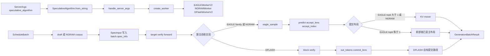

# Speculative

读本专题不是为了记住 EAGLE、NGRAM、DFLASH 这些名字，而是为了判断：一次 decode step 多猜几个 token 后，SGLang 如何保证 target 模型验收、KV cache 写回、采样结果和 Scheduler 状态仍然一致。

本专题回答三件事：

1. Scheduler 如何从 `--speculative-algorithm` 选出具体 worker。
2. 一个 request 在 draft、verify、accept 写回之间对象形态如何变化。
3. accept rate 低、verify 结果不一致、KV 写回错位、NGRAM 状态污染时应先查哪里。

## 阅读路径

| 读者任务 | 先读 | 再读 |
|----------|------|------|
| 建立投机解码的整体模型 | [[SGLang-Speculative-核心概念]] | [[SGLang-Sampling]] |
| 跟一次 EAGLE/NGRAM decode step | [[SGLang-Speculative-源码走读]] | [[SGLang-ScheduleBatch数据结构]] |
| 查 draft/verify/KV/accept 的对象边界 | [[SGLang-Speculative-数据流]] | [[SGLang-KV-Cache]] |
| 线上排障 | [[SGLang-Speculative-排障指南]] | [[SGLang-可观测性]] |
| 验收是否读懂 | [[SGLang-Speculative-学习检查]] | [[SGLang-Attention]] |

## 心理模型



把投机解码读成四本账：

| 账本 | 问题 | 源码入口 |
|------|------|----------|
| 控制账 | 用哪个算法、哪个 worker、哪些参数默认值 | `SpeculativeAlgorithm`、`CustomSpecAlgo`、`create_worker` |
| 阶段账 | 当前 batch 是 draft、draft extend 还是 verify | `SpecInputType`、`SpecInput`、`batch.spec_info` |
| KV 账 | verify 临时布局怎样变成已提交主链；哪些算法根本不走通用 mover | `prepare_for_draft_extend`、`_finalize_accept_tree_path`、DFLASH commit |
| 验收账 | 哪些 token 被接受、bonus token 如何产生、不同算法怎样交付共同调度结果 | `eagle_sample`、DFLASH block verify、`GenerationBatchResult` |

## 核心源码证据

控制账先把字符串解析成内置枚举或插件算法：

```python
# 来源：python/sglang/srt/speculative/spec_info.py L28-L57
class SpeculativeAlgorithm(Enum):
    """Builtin speculative decoding algorithms. Plugin-registered ones are
    ``CustomSpecAlgo`` instances; ``from_string`` returns either type, and
    both expose the same ``is_*()`` / ``create_worker`` interface so callers
    dispatch uniformly without isinstance checks.
    """

    DFLASH = auto()
    EAGLE = auto()
    EAGLE3 = auto()
    FROZEN_KV_MTP = auto()
    STANDALONE = auto()
    NGRAM = auto()
    NONE = auto()

    @classmethod
    def from_string(
        cls, name: Optional[str]
    ) -> Union[SpeculativeAlgorithm, CustomSpecAlgo]:
        if name is None:
            return cls.NONE
        upper = name.upper()
        try:
            return cls[upper]
        except KeyError:
            pass
        spec = _get_registered_spec(upper)
        if spec is not None:
            return spec
        raise ValueError(f"Unknown speculative algorithm name: {name}")
```

worker 工厂再把算法变成具体执行器。EAGLE family、DFLASH、Frozen-KV MTP、NGRAM 在这里分叉：

```python
# 来源：python/sglang/srt/speculative/spec_info.py L193-L238
    def create_worker(
        self, server_args: ServerArgs
    ) -> Optional[Union[Type[BaseSpecWorker], Type[TpModelWorker], Type[NGRAMWorker]]]:
        assert (
            not self.is_none()
        ), "Cannot create worker for NONE speculative algorithm."

        if self.is_dflash():
            # V2 worker drives both overlap and non-overlap (scheduler runs it
            # synchronously when overlap is disabled), same as EAGLE.
            from sglang.srt.speculative.dflash_worker_v2 import DFlashWorkerV2

            return DFlashWorkerV2

        if self.is_frozen_kv_mtp():
            # V2 worker drives both overlap and non-overlap (scheduler runs it
            # synchronously when overlap is disabled), same as EAGLE.
            from sglang.srt.speculative.frozen_kv_mtp_worker_v2 import (
                FrozenKVMTPWorkerV2,
            )

            return FrozenKVMTPWorkerV2

        # EAGLE / EAGLE3 / STANDALONE / MULTI_LAYER always use the V2 worker,
        # even with overlap disabled (scheduler drives it synchronously).
        if self.is_eagle() and server_args.enable_multi_layer_eagle:
            from sglang.srt.speculative.multi_layer_eagle_worker_v2 import (
                MultiLayerEagleWorkerV2,
            )

            return MultiLayerEagleWorkerV2

        elif self.is_eagle():
            from sglang.srt.speculative.eagle_worker_v2 import EAGLEWorkerV2

            return EAGLEWorkerV2
        elif self.is_standalone():
            from sglang.srt.speculative.standalone_worker_v2 import (
                StandaloneWorkerV2,
            )

            return StandaloneWorkerV2
        elif self.is_ngram():
            from sglang.srt.speculative.ngram_worker import NGRAMWorker

            return NGRAMWorker
```

## 源码范围

| 文件 | 本专题关注点 |
|------|--------------|
| `python/sglang/srt/speculative/spec_info.py` | 算法枚举、参数钩子、worker 工厂、`SpecInputType` |
| `python/sglang/srt/speculative/spec_registry.py` | 插件注册与 overlap 校验 |
| `python/sglang/srt/speculative/base_spec_worker.py` | worker 契约、draft extend 准备、stream/dtype 边界 |
| `python/sglang/srt/speculative/eagle_worker_v2.py` | EAGLE worker、verify、accept path compact |
| `python/sglang/srt/speculative/eagle_info.py` | EAGLE draft/verify 输入对象 |
| `python/sglang/srt/speculative/eagle_utils.py` | target verify 后的采样、accept_index 生成 |
| `python/sglang/srt/speculative/ngram_worker.py`、`ngram_info.py` | NGRAM 无 draft model 的 verify 路径 |
| `python/sglang/srt/speculative/reject_sampling.py` | classical rejection sampling kernel |
| `python/sglang/srt/speculative/spec_utils.py` | accepted tokens 写回 target KV cache |
| `python/sglang/srt/speculative/adaptive_runtime_state.py` | adaptive step runtime state 切换 |

## 判断标准

- 看到投机变慢，先看 accept rate 和 draft/verify 成本，不要只看 draft token 数。
- 看到 EAGLE/NGRAM 路径差异，先看 `has_draft_kv` 和 worker 类型。
- 看到 EAGLE/NGRAM 随机验收跨 TP 不一致，检查 CUDA/MUSA stochastic branch 是否从 rank 0 broadcast；greedy 以及 HIP/NPU 强制 argmax 分支不走这段同步。
- 看到 KV 错位，先分算法：EAGLE 仅 `topk > 1` 进入通用 mover，`topk == 1` 已是前部链；NGRAM 总是搬；DFLASH 使用独立 block commit。
- 看到自定义算法启动失败，先看注册名是否保留、`supports_overlap` 是否满足当前调度。

## 相邻专题

| 专题 | 关系 |
|------|------|
| [[SGLang-Sampling]] | 对照普通采样；spec verify 只复用部分参数，走专用路径，当前 `eagle_sample` 不应用 min-p 或 custom logit processor |
| [[SGLang-ScheduleBatch数据结构]] | 投机阶段通过 `ScheduleBatch.spec_info` 改变 batch 语义 |
| [[SGLang-KV-Cache]] | accepted token 最终要写回 target KV cache |
| [[SGLang-Attention]] | `SpecInputType` 会影响 attention mask 与 metadata |
| [[SGLang-PD分离]] | EAGLE family 可能携带 draft hidden states 做 PD 交接 |
