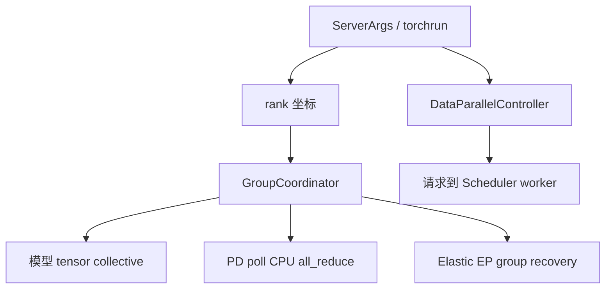

# 分布式 · 数据流

## 读者任务

这篇把 Distributed 拆成六段对象流：坐标下发、模型 collective、请求路由、负载预算、PD 状态收敛、Elastic EP recovery。读者要能先识别流动对象，再选择源码入口。

## 总图



同一个 rank 会同时参与这些流，但对象不同：tensor、request、poll status、active rank mask。对象不同，源码入口就不同。

## 数据流 1：rank 坐标变成 worker 快照

Scheduler 子进程启动前，DP Controller 会计算每个 worker 的 GPU id、TP rank、Attention CP rank、MoE DP/EP rank、PP rank、DP rank，并把这些作为参数传给 scheduler 进程。普通 DP 与 DP-Attention 的启动方式不同：前者按 DP rank 启动多个 TP/PP worker 组，后者在同一 TP rank 空间里计算 attention DP 身份并复用 NCCL 初始化端口。

```python
# 来源：python/sglang/srt/managers/data_parallel_controller.py L553-L588
                # Parallelism hierarchy (outermost to innermost):
                # - Attention: Global(TP) -> DP -> ATTN_CP -> ATTN_TP (innermost)
                # - MoE: Global(TP) -> MOE_DP -> EP -> MOE_TP (innermost)
                attn_tp_size = (
                    server_args.tp_size // attn_dp_size // server_args.attn_cp_size
                )
                attn_cp_rank = (tp_rank // attn_tp_size) % server_args.attn_cp_size
                moe_dp_rank = tp_rank // (
                    server_args.tp_size // server_args.moe_dp_size
                )
                moe_ep_rank = (
                    tp_rank
                    % (server_args.tp_size // server_args.moe_dp_size)
                    // (
                        server_args.tp_size
                        // server_args.moe_dp_size
                        // server_args.ep_size
                    )
                )

                with self.env_lock, maybe_reindex_device_id(gpu_id) as gpu_id:
                    proc = mp.Process(
                        target=self.run_scheduler_process_func,
                        args=(
                            server_args,
                            rank_port_args,
                            gpu_id,
                            tp_rank,
                            attn_cp_rank,
                            moe_dp_rank,
                            moe_ep_rank,
                            pp_rank,
                            dp_rank,
                            writer,
                        ),
                    )
```

这段的价值是把抽象 group 切分变成每个 worker 的本地事实。后续组件读 `ParallelState`，通常就是在读这里推导出的坐标。

## 数据流 2：模型 tensor collective

模型层的张量流是最短的：layer 产生 tensor，调用 `communication_op.py` helper，helper 取对应 group，group 内部决定通信实现。

```python
# 来源：python/sglang/srt/distributed/communication_op.py L18-L20
def tensor_model_parallel_all_reduce(input_: torch.Tensor) -> torch.Tensor:
    """All-reduce the input tensor across model parallel group."""
    return get_tp_group().all_reduce(input_)
```

进入 `GroupCoordinator.all_reduce` 后，单卡直接返回；CPU tensor 先尝试 shared-memory kernel，否则仍对当前 `device_group` 调 `torch.distributed.all_reduce`；GPU tensor 再按平台 communicator、对称内存、尺寸与 graph 状态选路。这里不能把“CPU tensor”简写成“必走 `cpu_group`”。

```python
# 来源：python/sglang/srt/distributed/parallel_state.py L594-L612
        # Bypass the function if we are using only 1 GPU.
        if self.world_size == 1:
            return input_

        if input_.is_cpu:
            if is_shm_available(input_.dtype, self.world_size, self.local_size):
                torch.ops.sgl_kernel.shm_allreduce(input_, REDUCE_OP_SUM)
            else:
                torch.distributed.all_reduce(input_, group=self.device_group)
            return input_

        if self.hpu_communicator is not None and not self.hpu_communicator.disabled:
            return self.hpu_communicator.all_reduce(input_)

        if self.xpu_communicator is not None and not self.xpu_communicator.disabled:
            return self.xpu_communicator.all_reduce(input_)

        if self.npu_communicator is not None and not self.npu_communicator.disabled:
            return self.npu_communicator.all_reduce(input_)
```

排障时按这个顺序问：当前 getter 返回哪个 coordinator、它是否 alias 另一语义组、是否真的多卡、tensor 在哪种设备、当前 communicator 是否接管、是否进入 graph/custom 分支。

## 数据流 3：DP 请求路由

DP Controller 的对象是请求。它用 `TypeBasedDispatcher` 区分普通 generate、embedding、batch、block、profile、active ranks；普通请求会带 trace 时间戳后进入当前 load-balance 方法。

```python
# 来源：python/sglang/srt/managers/data_parallel_controller.py L239-L249
    def dispatching_with_trace(self, req: Req, refresh_load_budget: bool = True):
        if refresh_load_budget and self.refresh_load_budget_on_dispatch:
            self.refresh_load_budget()

        time_stats = DPControllerReqTimeStats.new_from_obj(
            unwrap_from_pickle(req.time_stats)
        )

        time_stats.set_dp_dispatch_time()
        req.time_stats = wrap_as_pickle(time_stats)
        self.dispatching(req)
```

```python
# 来源：python/sglang/srt/managers/data_parallel_controller.py L265-L277
    def init_dispatcher(self):
        self._request_dispatcher = TypeBasedDispatcher(
            [
                (TokenizedGenerateReqInput, self.dispatching_with_trace),
                (TokenizedEmbeddingReqInput, self.dispatching_with_trace),
                (BatchTokenizedGenerateReqInput, self.dispatch_batch_generate),
                (BatchTokenizedEmbeddingReqInput, self.dispatch_batch_embedding),
                (BlockReqInput, self.send_to_all_workers),
                (ProfileReq, self.send_to_all_workers),
                (ActiveRanksOutput, self.update_active_ranks),
            ]
        )
        self._request_dispatcher.add_fallback_fn(self.send_control_message)
```

请求路由有一个强优先级入口：如果请求本身带 `routed_dp_rank`，Controller 直接发给目标 worker，不再走负载均衡。当前函数也没有在这条直接路径上检查 `status[target]` 或 rank 越界；上游必须保证目标合法且可用。

```python
# 来源：python/sglang/srt/managers/data_parallel_controller.py L605-L610
    def maybe_external_dp_rank_routing(self, req: Req):
        if req.routed_dp_rank is not None:
            logger.debug(f"Direct routing to DP rank {req.routed_dp_rank}")
            sock_send(self.workers[req.routed_dp_rank], req)
            return True
        return False
```

`FOLLOW_BOOTSTRAP_ROOM` 则要求请求必须带 `bootstrap_room`，并用 room 对 worker 数取模。这个策略服务 PD locality：同一 room 稳定映射到同一个 DP rank。与 round-robin 不同，该分支也未跳过 inactive `status`，所以健康路由仍依赖上层 worker 对与 active-rank 管理。

```python
# 来源：python/sglang/srt/managers/data_parallel_controller.py L628-L638
    def follow_bootstrap_room_scheduler(self, req: Req):
        if self.maybe_external_dp_rank_routing(req):
            return

        assert req.bootstrap_room is not None, (
            "req.bootstrap_room should not be None. Do not send requests directly to "
            "prefill or decode instances; send to the router instead."
        )
        target_rank = req.bootstrap_room % len(self.workers)
        sock_send(self.workers[target_rank], req)
```

这条流最容易被误解成模型 DP all-reduce。源码反过来证明：这里没有 tensor collective，只有 ZMQ socket 和 request object。

## 数据流 4：负载预算如何影响路由

`TOTAL_REQUESTS` 和 `TOTAL_TOKENS` 不是读一次状态就结束。`DPBudget` 会从 shared memory 快照更新负载，再对目标 worker 做一次投机加一，避免短时间 burst 全部落到同一 rank。

```python
# 来源：python/sglang/srt/managers/data_parallel_controller.py L93-L126
class DPBudget:
    def __init__(self, dp_size: int):
        self.dp_size = dp_size
        self.total_requests = [0] * dp_size
        self.total_tokens = [0] * dp_size
        self.last_timestamp = [0.0] * dp_size

    def update_budget(self, loads):
        """Update budget from shm snapshots, skipping stale reads."""
        for load in loads:
            if load.timestamp == self.last_timestamp[load.dp_rank]:
                continue
            self.last_timestamp[load.dp_rank] = load.timestamp
            self.total_requests[load.dp_rank] = (
                load.num_running_reqs + load.num_waiting_reqs
            )
            self.total_tokens[load.dp_rank] = load.num_total_tokens

    def dispatch(self, method: LoadBalanceMethod, estimated_tokens: int = 0):
        if method == LoadBalanceMethod.TOTAL_REQUESTS:
            target_rank = self.total_requests.index(min(self.total_requests))
        elif method == LoadBalanceMethod.TOTAL_TOKENS:
            # Use total_requests as a tie-breaker when total_tokens are equal
            target_rank = min(
                range(self.dp_size),
                key=lambda i: (self.total_tokens[i], self.total_requests[i]),
            )
        else:
            return None

        # Increment the load of that worker by one as a heuristic
        self.total_requests[target_rank] += 1
        self.total_tokens[target_rank] += estimated_tokens
        return target_rank
```

排查负载倾斜时，不要只看当前 Scheduler 的真实负载，也要看 DP Controller 是否按 20ms 节流刷新预算。

```python
# 来源：python/sglang/srt/managers/data_parallel_controller.py L222-L237
    def refresh_load_budget(self):
        # Throttle to at most once per 20ms.  When a burst of requests
        # arrives, dispatching_with_trace() calls this before every
        # dispatch.  Each call reads the latest scheduler snapshot and
        # overwrites the speculative +1 increments that DPBudget.dispatch()
        # added for previously dispatched requests in this burst.  Without
        # throttling, the budget resets to the (stale) scheduler-reported
        # value on every request, causing the entire burst to land on a
        # single DP rank.  The 20ms interval lets the burst complete
        # using speculative counters, then refreshes from the real
        # scheduler load for the next batch.
        now = time.perf_counter()
        if now - self._last_refresh_time < 0.02:
            return
        self._last_refresh_time = now
        self.dp_budget.update_budget(self.load_snapshot_reader.read_all())
```

## 数据流 5：PD poll 用 CPU group 收敛状态

PD 分离里的 poll 不是模型 tensor all-reduce。它把 poll 结果变成 CPU tensor，然后在调用者传入的 coordination group 上取 `MIN`，让所有参与方对状态达成一致。普通 group 通常传 Gloo；Mooncake 模式的协调 group 可能是 `mooncake-cpu`，因此文档只应承诺“CPU status tensor + coordination group”。

```python
# 来源：python/sglang/srt/disaggregation/utils.py L121-L140
def poll_and_all_reduce(
    pollers,
    gloo_group: dist.ProcessGroup,
    decode_reqs=None,
    metadata_buffers: Optional[MetadataBuffers] = None,
    server_args: Optional[ServerArgs] = None,
):
    # at a certain prob, the poll is failed to simulate failure
    polls = _poll_with_failure_injection(pollers)

    # Apply metadata gate on the decode requests to downgrade Success → Transferring for requests whose metadata hasn't landed.
    if (
        decode_reqs is not None
        and metadata_buffers is not None
        and server_args is not None
    ):
        _apply_metadata_gate(polls, decode_reqs, metadata_buffers, server_args)
    tensor_to_reduce = torch.tensor(polls, dtype=torch.uint8, device="cpu")
    dist.all_reduce(tensor_to_reduce, op=dist.ReduceOp.MIN, group=gloo_group)
    return tensor_to_reduce.tolist()
```

Attention CP/TP 组合下，源码先在 attn TP CPU group 内同步，再在 attn CP CPU group 内同步。

```python
# 来源：python/sglang/srt/disaggregation/utils.py L143-L160
def poll_and_all_reduce_attn_cp_tp_group(
    pollers,
    attn_cp_cpu_group: dist.ProcessGroup,
    attn_tp_cpu_group: dist.ProcessGroup,
):
    # First sync across attn-tp ranks so all TP participants for a given (dp, cp)
    # shard observe the same status transitions.
    polls = poll_and_all_reduce(pollers, attn_tp_cpu_group)

    # Then sync across attn-cp ranks, so all TPxCP participants in one DP shard
    # converge to the same global status.
    tensor_to_reduce = torch.tensor(polls, dtype=torch.uint8, device="cpu")
    dist.all_reduce(
        tensor_to_reduce,
        op=dist.ReduceOp.MIN,
        group=attn_cp_cpu_group,
    )
    return tensor_to_reduce.tolist()
```

如果 PD poll 卡住，应该查传入 group 的 membership/backend、参与 ranks、metadata gate 与 staging 状态，不要先去调模型 CustomAllReduce。

## 数据流 6：Elastic EP recovery 重建 backend，而不是重跑初始化

Elastic EP 的对象是 active ranks 和已存在的 live parallel groups。`try_recover_ranks` 先确认 WORLD backend 的 peer ready，然后恢复 WORLD，再遍历所有 live `GroupCoordinator`，把 global ranks 映射成 group-local ranks，分别恢复 device group 与 CPU group。

```python
# 来源：python/sglang/srt/elastic_ep/elastic_ep.py L147-L174
def try_recover_ranks(global_ranks: List[int]) -> bool:
    from mooncake import ep as mooncake_ep

    world_backend = _get_process_group_backend(torch.distributed.group.WORLD, "cuda")
    if not all(mooncake_ep.get_peer_state(world_backend, global_ranks)):
        # The relaunched ranks have not finished initializing yet.
        return False

    # Recover the world backend first, then recover each derived process group
    # using ranks mapped into that group's local rank space.
    mooncake_ep.recover_ranks(world_backend, global_ranks)

    for group in _iter_live_parallel_groups():
        group_local_ranks = _map_global_to_group_local_ranks(group.ranks, global_ranks)
        if not group_local_ranks:
            continue

        device_backend = _get_process_group_backend(group.device_group, "cuda")
        _wait_for_peer_state(mooncake_ep, device_backend, group_local_ranks)
        mooncake_ep.recover_ranks(device_backend, group_local_ranks)

        cpu_backend = _get_process_group_backend(group.cpu_group, "cpu")
        _wait_for_peer_state(mooncake_ep, cpu_backend, group_local_ranks)
        mooncake_ep.recover_ranks(cpu_backend, group_local_ranks)
        _maybe_create_message_queue(group)

    _refresh_ep_members()
    return True
```

这里的顺序很重要：WORLD 先恢复，derived group 再恢复，最后刷新 EP members。把它看成“修复已有坐标系”，而不是“重新计算一套 group”。

## 运行验证

| 数据流 | 观察点 | 预期 |
|--------|--------|------|
| rank 坐标 | Scheduler 启动参数或 `ParallelState` | 同一 worker 的 TP/PP/MoE/Attention rank 可互相推出 |
| tensor collective | `communication_op.py` helper 断点并记录 `unique_name`/对象 id | 进入 getter 当前返回的 coordinator；alias 时不同语义可落在同一对象 |
| DP 路由 | `routed_dp_rank`、`bootstrap_room`、status、load budget | 请求经 ZMQ 到目标 worker；外部直达和 room 分支需额外确认目标健康 |
| PD poll | `poll_and_all_reduce` 的 CPU tensor 与 group backend | 组内状态取 `MIN` 后一致；metadata 未到会把 Success 降为 Transferring |
| Elastic EP | `try_recover_ranks` 返回值 | peer 未 ready 返回 `False`，ready 后恢复 WORLD 和 live groups |

## 复盘

- Distributed 不是一条流，而是多条对象不同的流。
- 模型 tensor flow 走 helper 和 `GroupCoordinator`。
- 请求 DP flow 走 ZMQ 和 dispatch 方法。
- PD poll flow 用 CPU status tensor 与调用者提供的 coordination group 收敛状态。
- Elastic EP flow 恢复 backend membership，并刷新 MoE EP buffer 成员。

## 静态验证

```powershell
rg -n "enable_dp_attention|routed_dp_rank|bootstrap_room %|dist.ReduceOp.MIN|_apply_metadata_gate|recover_ranks" `
  sglang/python/sglang/srt/managers/data_parallel_controller.py `
  sglang/python/sglang/srt/disaggregation/utils.py `
  sglang/python/sglang/srt/elastic_ep/elastic_ep.py
```

预期分别命中 DP-Attention 分支、两种强制路由、PD 状态收敛/metadata gate 与 membership recovery。它们共享 rank 信息，却传递四种不同对象。
