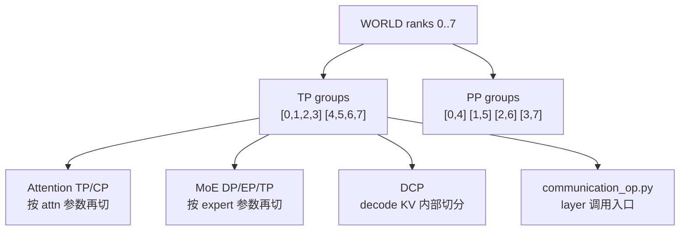

# 分布式 · 源码走读

## 读者任务

这篇沿一条真实启动链走源码：进程先进入 PyTorch WORLD，SGLang 再把 WORLD 切成 TP、DCP、Attention CP/TP、MoE DP/EP/TP、PP 多套 group，最后模型层通过 `communication_op.py` 调用 `GroupCoordinator` 完成 collective。

读完要能做三件事：

- 看到 `world_size is not equal to tensor_model_parallel_size x pipeline_model_parallel_size` 时，知道错误发生在模型并行初始化前置校验。
- 看到某个 layer 调 `tensor_model_parallel_all_reduce` 时，能追到 `get_tp_group().all_reduce` 的 backend 选路。
- 看到 DP 请求路由问题时，能明确它不在这条模型 collective 主线里，而在 [[SGLang-分布式-数据流]] 的请求路由链。

## 长文读法

这篇按“WORLD 如何被切成多套模型并行 group”读：`init_distributed_environment` 先接住 PyTorch WORLD，`initialize_model_parallel` 完成模型 WORLD/DCP 前置校验并构造 TP、PP、Attention、MoE、DCP group；各语义随后由 `GroupCoordinator` 或已有 coordinator alias 承载，模型层通过 `communication_op.py` / getter 进入对应 collective。

| 读者任务 | 先读 | 要抓住的判断 |
|----------|------|--------------|
| 第一次建立分布式主线 | 贯穿场景、1 到 2 | 先初始化 PyTorch WORLD，再在 WORLD 上投影出 TP/PP/Attention/MoE/DCP 等模型并行 group |
| 排查 world size 校验错误 | 2 | 这里的 world size 校验针对单个模型 worker 内的 TP × PP，不是 DP Controller 的请求路由规模 |
| 理解 TP 为什么先切 | 3 到 5 | TP 是 DCP、Attention TP/CP 等后续 group 的底座，很多 attention group 是 TP 的再投影 |
| 理解 MoE group | 6 | MoE DP/EP/TP 是 expert 维度的另一套投影，不等同于普通数据并行 |
| 排查 PP rank 组合 | 7 | PP 不是连续切片，而是按 stride 跨 rank 取组 |
| 追 layer collective | 8 到 10 | layer 只调用 getter / communication op，真正 backend 选路在 `GroupCoordinator` |
| 排查 CUDA graph capture group | 11 | capture 相关 group 也按 coordinator 注册，和普通 collective 共用分组心理模型 |

读的时候保持边界：这篇讲模型 forward 内部 collective；请求层 DP、router、worker 选择不在这里，应该去数据流与交互页。

## 贯穿场景

假设你用 8 张 GPU 启动一个模型：

- `tp_size=4`
- `pp_size=2`
- `ep_size=2`
- `moe_dp_size=1`
- `attn_cp_size=1`
- `decode_context_parallel_size=1`

源码先建立 `WORLD=[0,1,2,3,4,5,6,7]`，再把同一批 global ranks 投影成多套组。对这组参数，TP 与 PP 的实际成员关系是：



这张图先给读法：只要还在模型 forward 里，就沿 `WORLD → group → GroupCoordinator → communication_op` 追；如果对象变成请求，就换到 DP Controller 主线。

## 第 1 步：接住 PyTorch WORLD

`init_distributed_environment` 是 SGLang 接管分布式环境的入口。它显式接收 `world_size`、`rank`、`distributed_init_method`、`local_rank`、`backend`、`timeout` 和 MoE/elastic 相关开关。

```python
# 来源：python/sglang/srt/distributed/parallel_state.py L1880-L1889
def init_distributed_environment(
    world_size: int = -1,
    rank: int = -1,
    distributed_init_method: str = "env://",
    local_rank: int = -1,
    backend: str = "nccl",
    timeout: Optional[int] = None,
    moe_a2a_backend: Optional[str] = None,
    recovered_rank: bool = False,
):
```

如果 backend 含 `mooncake`，入口会先导入 Mooncake 并设置 host IP。这不是普通 NCCL 路径的一部分，而是 Elastic EP 和 Mooncake backend 的前置条件。

```python
# 来源：python/sglang/srt/distributed/parallel_state.py L1898-L1907
    if "mooncake" in backend:
        try:
            from mooncake import ep as mooncake_ep
        except ImportError as e:
            raise ImportError(
                "Please install mooncake by following the instructions at "
                "https://github.com/kvcache-ai/Mooncake/blob/main/doc/en/build.md "  # noqa: E501
                "to run SGLang with Mooncake Backend."
            ) from e
        mooncake_ep.set_host_ip(get_local_ip_auto())
```

随后才是 PyTorch 的 `init_process_group`。这里的 backend 是 WORLD backend，后面每个模型并行 group 会再调用 `new_group`。

```python
# 来源：python/sglang/srt/distributed/parallel_state.py L1931-L1939
        # this backend is used for WORLD
        torch.distributed.init_process_group(
            backend=backend,
            init_method=distributed_init_method,
            world_size=world_size,
            rank=rank,
            timeout=timeout,
            pg_options=pg_options,
        )
```

`local_rank` 不从 PyTorch ProcessGroup 里取。源码先看 `LOCAL_RANK` 环境变量，否则退回 `rank`。这解释了为什么单机启动和多机启动的设备绑定问题经常先看环境变量。

```python
# 来源：python/sglang/srt/distributed/parallel_state.py L1945-L1954
    # set the local rank
    # local_rank is not available in torch ProcessGroup,
    # see https://github.com/pytorch/pytorch/issues/122816
    if local_rank == -1:
        # local rank not set, this usually happens in single-node
        # setting, where we can use rank as local rank
        if distributed_init_method == "env://":
            local_rank = int(os.environ.get("LOCAL_RANK", "0"))
        else:
            local_rank = rank
```

## 第 2 步：模型并行初始化先做硬校验

`initialize_model_parallel` 的第一道门槛很硬：`world_size` 必须等于 `tensor_model_parallel_size * pipeline_model_parallel_size`。注意这里没有乘 `dp_size`：普通 DP 会由 Controller 启动多个模型 worker 组；DP-Attention 则在当前 TP rank 空间内计算 attention DP 身份。两种模式都不能把部署总设备数直接代入这一处模型 WORLD 校验。

```python
# 来源：python/sglang/srt/distributed/parallel_state.py L2029-L2039
    # Get world size and rank. Ensure some consistencies.
    assert torch.distributed.is_initialized()
    world_size: int = torch.distributed.get_world_size()
    backend = backend or torch.distributed.get_backend(get_world_group().device_group)

    if world_size != tensor_model_parallel_size * pipeline_model_parallel_size:
        raise RuntimeError(
            f"world_size ({world_size}) is not equal to "
            f"tensor_model_parallel_size ({tensor_model_parallel_size}) x "
            f"pipeline_model_parallel_size ({pipeline_model_parallel_size})"
        )
```

DCP 也在这里校验：必须大于等于 1；大于 1 时要求 CUDA 或 HIP；并且必须整除 TP size。

```python
# 来源：python/sglang/srt/distributed/parallel_state.py L2040-L2055
    if decode_context_parallel_size < 1:
        raise RuntimeError(
            f"decode_context_parallel_size ({decode_context_parallel_size}) must be >= 1"
        )
    if decode_context_parallel_size > 1 and not (is_hip() or is_cuda()):
        raise RuntimeError(
            "Decode context parallel (decode_context_parallel_size > 1) is "
            "currently only supported on the AMD HIP platform or CUDA platform, but got "
            f"decode_context_parallel_size ({decode_context_parallel_size}) "
            "on a non-HIP or non-CUDA platform."
        )
    if tensor_model_parallel_size % decode_context_parallel_size != 0:
        raise RuntimeError(
            f"tensor_model_parallel_size ({tensor_model_parallel_size}) must be divisible by "
            f"decode_context_parallel_size ({decode_context_parallel_size})"
        )
```

这个校验告诉读者一个重要边界：分布式故障不一定是网络问题。很多“启动即挂”的报错是并行坐标无法被合法切分。

## 第 3 步：先切 TP，因为它是许多后续组的底座

TP group 按连续 rank 切分。`world_size=8,tp_size=4` 时会得到 `[0,1,2,3]` 与 `[4,5,6,7]`。

```python
# 来源：python/sglang/srt/distributed/parallel_state.py L2057-L2079
    # Build the tensor model-parallel groups.
    num_tensor_model_parallel_groups: int = world_size // tensor_model_parallel_size
    global _TP
    assert _TP is None, "tensor model parallel group is already initialized"
    group_ranks = []
    for tp_group_idx in range(num_tensor_model_parallel_groups):
        ranks = list(
            range(
                tp_group_idx * tensor_model_parallel_size,
                (tp_group_idx + 1) * tensor_model_parallel_size,
            )
        )
        group_ranks.append(ranks)

    # message queue broadcaster is only used in tensor model parallel group
    _TP = init_model_parallel_group(
        group_ranks,
        get_world_group().local_rank,
        backend,
        use_message_queue_broadcaster=envs.SGLANG_USE_MESSAGE_QUEUE_BROADCASTER.get(),
        group_name="tp",
        recovered_rank=recovered_rank,
    )
```

TP 先切出来，是因为 Attention、MoE、DCP 的构造公式都以 TP size 与 TP group index 为基准。这里的“基准”不等于所有组都严格嵌套成一棵树：某些尺寸组合会让 Attention/MoE group 直接别名 `_TP` 或 `_ATTN_CP`，另一些组合才会创建新的 `GroupCoordinator`。

## 第 4 步：DCP 只在 TP 内部继续切

DCP 不是新的全局切分，而是在每个 TP group 内按 `decode_context_parallel_size` 做小组。

```python
# 来源：python/sglang/srt/distributed/parallel_state.py L2098-L2115
    # Build decode context-parallel groups inside each TP group only when DCP is enabled.
    global _DCP
    assert _DCP is None, "decode context parallel group is already initialized"
    if decode_context_parallel_size > 1:
        dcp_group_ranks = []
        for tp_group in group_ranks:
            for start in range(0, len(tp_group), decode_context_parallel_size):
                dcp_group_ranks.append(
                    tp_group[start : start + decode_context_parallel_size]
                )
        _DCP = init_model_parallel_group(
            dcp_group_ranks,
            get_world_group().local_rank,
            backend,
            use_message_queue_broadcaster=envs.SGLANG_USE_MESSAGE_QUEUE_BROADCASTER.get(),
            group_name="dcp",
            recovered_rank=recovered_rank,
        )
```

所以 DCP 的合法性先由 TP size 决定，而不是由全局 GPU 数直接决定。

## 第 5 步：Attention CP 和 Attention TP 是 TP 的两种投影

源码先算出 `attn_tp_size = tp_size // attn_cp_size // attn_dp_size`。这行是 Attention 坐标系的入口。

```python
# 来源：python/sglang/srt/distributed/parallel_state.py L2126-L2128
    attn_dp_size = attention_data_parallel_size
    attn_cp_size = attention_context_model_parallel_size
    attn_tp_size = tensor_model_parallel_size // attn_cp_size // attn_dp_size
```

Attention CP 组的切法是：在每个 TP group 内，固定 DP 和 attention TP 位置，按 `attn_tp_size` 步长取 ranks。这类切分看起来绕，是因为 CP 想让不同 context shard 在同一条同步线上。

```python
# 来源：python/sglang/srt/distributed/parallel_state.py L2137-L2160
        group_ranks = []
        for tp_group_idx in range(num_tensor_model_parallel_groups):
            for dp_idx in range(attn_dp_size):
                for attn_tp_idx in range(attn_tp_size):
                    st = (
                        tp_group_idx * tensor_model_parallel_size
                        + dp_idx * attn_tp_size * attn_cp_size
                        + attn_tp_idx
                    )
                    en = (
                        tp_group_idx * tensor_model_parallel_size
                        + (dp_idx + 1) * attn_tp_size * attn_cp_size
                        + attn_tp_idx
                    )
                    ranks = list(range(st, en, attn_tp_size))
                    group_ranks.append(ranks)
        _ATTN_CP = init_model_parallel_group(
            group_ranks,
            get_world_group().local_rank,
            backend,
            use_message_queue_broadcaster=envs.SGLANG_USE_MESSAGE_QUEUE_BROADCASTER.get(),
            group_name="attn_cp",
            recovered_rank=recovered_rank,
        )
```

Attention TP 则在每个 CP/DP 组合内取连续的一段 ranks。

```python
# 来源：python/sglang/srt/distributed/parallel_state.py L2171-L2196
        group_ranks = []
        for tp_group_idx in range(num_tensor_model_parallel_groups):
            for cp_dp_combined_idx in range(attn_cp_size * attn_dp_size):
                st = (
                    tp_group_idx * tensor_model_parallel_size
                    + cp_dp_combined_idx * attn_tp_size
                )
                en = (
                    tp_group_idx * tensor_model_parallel_size
                    + (cp_dp_combined_idx + 1) * attn_tp_size
                )
                ranks = list(range(st, en))
                group_ranks.append(ranks)

        _ATTN_TP = init_model_parallel_group(
            group_ranks,
            get_world_group().local_rank,
            backend,
            use_pynccl=SYNC_TOKEN_IDS_ACROSS_TP or enable_symm_mem,
            use_mscclpp_allreduce=False,
            use_custom_allreduce=False,
            use_torch_symm_mem_allreduce=False,
            use_message_queue_broadcaster=envs.SGLANG_USE_MESSAGE_QUEUE_BROADCASTER.get(),
            group_name="attention_tp",
            recovered_rank=recovered_rank,
        )
```

这里还有一个细节：**只有 `attn_tp_size != tensor_model_parallel_size`、需要新建 Attention TP coordinator 时**，构造参数才明确关闭 custom all-reduce、MSCCL++ 与 Torch symmetric-memory all-reduce，并按同步 token id / `enable_symm_mem` 决定 PyNccl。若尺寸相等，`_ATTN_TP = _TP`，会继承 TP coordinator 已有的 communicator 状态。

## 第 6 步：MoE DP、EP、TP 是另一个投影

MoE 坐标先从 `tp_size` 推出 `moe_tp_size`。它和 Attention 并不是同一组切法。

```python
# 来源：python/sglang/srt/distributed/parallel_state.py L2198-L2200
    moe_ep_size = expert_model_parallel_size
    moe_dp_size = moe_data_model_parallel_size
    moe_tp_size = tensor_model_parallel_size // moe_ep_size // moe_dp_size
```

MoE DP 有一个容易忽略的分支：当 `attn_cp_size > moe_dp_size` 时，CP ranks 需要在进入 MoE 前共享 token，所以直接复用 `_ATTN_CP`。

```python
# 来源：python/sglang/srt/distributed/parallel_state.py L2202-L2210
    global _MOE_DP
    assert _MOE_DP is None, "moe data parallel group is already initialized"
    if attn_cp_size > moe_dp_size:
        # When moe_dp_size < attn_cp_size, CP ranks must share tokens before MoE.
        # The MOE_DP group includes these CP partners, so the existing DP
        # allgather/scatter handles the token sharing.
        _MOE_DP = _ATTN_CP
    elif moe_dp_size == tensor_model_parallel_size:
        _MOE_DP = _TP
```

MoE EP group 负责 expert parallel 的坐标。若 `moe_ep_size == tensor_model_parallel_size`，源码直接令 `_MOE_EP = _TP`；只有另建 coordinator 的分支才显式关闭 PyNccl 与 custom all-reduce。不能从新建分支反推别名分支也使用相同 backend 策略。

```python
# 来源：python/sglang/srt/distributed/parallel_state.py L2229-L2254
    global _MOE_EP
    assert _MOE_EP is None, "expert model parallel group is already initialized"
    if moe_ep_size == tensor_model_parallel_size:
        _MOE_EP = _TP
    else:
        group_ranks = []
        for tp_group_idx in range(num_tensor_model_parallel_groups):
            for moe_dp_idx in range(moe_dp_size):
                for moe_tp_idx in range(moe_tp_size):
                    st = (
                        tp_group_idx * tensor_model_parallel_size
                        + moe_dp_idx * moe_ep_size * moe_tp_size
                        + moe_tp_idx
                    )
                    en = st + moe_ep_size * moe_tp_size
                    ranks = list(range(st, en, moe_tp_size))
                    group_ranks.append(ranks)
        _MOE_EP = init_model_parallel_group(
            group_ranks,
            get_world_group().local_rank,
            backend,
            use_pynccl=False,
            use_custom_allreduce=False,
            group_name="moe_ep",
            recovered_rank=recovered_rank,
        )
```

如果你在 MoE 中看到 expert 相关 mismatch，先检查 `expert_model_parallel_size`、`moe_data_model_parallel_size` 和 `tensor_model_parallel_size` 是否能推出合法的 `moe_tp_size`。

## 第 7 步：PP 不是连续切，而是跨 stride 取 rank

PP group 使用 `range(pp_group_idx, world_size, num_pipeline_model_parallel_groups)`，其中 `num_pipeline_model_parallel_groups = world_size // pp_size`。因此成员必须代入当前参数计算：

- `world_size=8, tp_size=4, pp_size=2` 时，stride 为 4，得到 `[0,4]`、`[1,5]`、`[2,6]`、`[3,7]`。
- 源码 docstring 里的 `[0,2,4,6]`、`[1,3,5,7]` 对应的是另一组参数：`tp_size=2, pp_size=4`。

```python
# 来源：python/sglang/srt/distributed/parallel_state.py L2284-L2302
    # Build the pipeline model-parallel groups.
    num_pipeline_model_parallel_groups: int = world_size // pipeline_model_parallel_size
    global _PP
    assert _PP is None, "pipeline model parallel group is already initialized"
    group_ranks = []
    for pp_group_idx in range(num_pipeline_model_parallel_groups):
        ranks = list(
            range(pp_group_idx, world_size, num_pipeline_model_parallel_groups)
        )
        group_ranks.append(ranks)
    # pipeline parallel does not need custom allreduce
    _PP = init_model_parallel_group(
        group_ranks,
        get_world_group().local_rank,
        backend,
        use_custom_allreduce=False,
        group_name="pp",
        recovered_rank=recovered_rank,
    )
```

这也是为什么只看相邻 global rank 不足以判断 PP 邻居。PP 的邻居来自流水线阶段，不来自 TP 内的连续张量切片。

## 第 8 步：所有 group 都包成 GroupCoordinator

`init_model_parallel_group` 把默认开关收口到一个地方：custom all-reduce、MSCCL++、Torch symmetric memory、PyNccl 默认启用条件都在这里决定。

```python
# 来源：python/sglang/srt/distributed/parallel_state.py L1641-L1665
    if use_custom_allreduce is None:
        use_custom_allreduce = _ENABLE_CUSTOM_ALL_REDUCE
    if use_mscclpp_allreduce is None:
        use_mscclpp_allreduce = _ENABLE_MSCCLPP_ALL_REDUCE
    if use_torch_symm_mem_allreduce is None:
        use_torch_symm_mem_allreduce = _ENABLE_TORCH_SYMM_MEM_ALL_REDUCE
    return GroupCoordinator(
        group_ranks=group_ranks,
        local_rank=local_rank,
        torch_distributed_backend=backend,
        use_pynccl=(
            not (_is_npu or _is_xpu or backend == "mooncake")
            if use_pynccl is None
            else use_pynccl
        ),
        use_pymscclpp=use_mscclpp_allreduce,
        use_custom_allreduce=use_custom_allreduce,
        use_torch_symm_mem_all_reduce=use_torch_symm_mem_allreduce,
        use_hpu_communicator=True,
        use_xpu_communicator=True,
        use_npu_communicator=True,
        use_message_queue_broadcaster=use_message_queue_broadcaster,
        group_name=group_name,
        recovered_rank=recovered_rank,
    )
```

设计含义很直接：不要在 layer 里散落 backend 判断。group 构造时已经把策略放进 `GroupCoordinator`。

## 第 9 步：layer 通过 getter 进入正确 group

`get_tp_group`、`get_attn_tp_group`、`get_moe_ep_group` 等 getter 是 group 的访问边界。`get_tp_group` 还处理 PD-Multiplexing prefill 的特殊 TP group。

```python
# 来源：python/sglang/srt/distributed/parallel_state.py L1684-L1691
def get_tp_group() -> GroupCoordinator:
    if _ENABLE_PDMUX_P_TP:
        assert (
            _PDMUX_PREFILL_TP_GROUP is not None
        ), "tensor model parallel group for PD-Multiplexing Prefill is not initialized"
        return _PDMUX_PREFILL_TP_GROUP
    assert _TP is not None, "tensor model parallel group is not initialized"
    return _TP
```

```python
# 来源：python/sglang/srt/distributed/parallel_state.py L1727-L1734
def get_moe_ep_group() -> GroupCoordinator:
    assert _MOE_EP is not None, "expert model parallel group is not initialized"
    return _MOE_EP


def get_moe_tp_group() -> GroupCoordinator:
    assert _MOE_TP is not None, "expert model parallel group is not initialized"
    return _MOE_TP
```

这些 assert 的价值不仅是防御式编程。它们把“当前路径需要哪个 group”写成了可定位的错误消息。

## 第 10 步：all-reduce 在 GroupCoordinator 内部选路

`GroupCoordinator.all_reduce` 的执行顺序是一个排障地图：

1. world size 为 1 时直接返回。
2. CPU tensor 走 shared-memory kernel，或调用当前 `device_group` 的 `torch.distributed.all_reduce`；这不等于无条件改走 `cpu_group`。
3. HPU/XPU/NPU 各自 communicator 优先。
4. symmetric memory、CustomAllReduce、quick allreduce、MSCCL++、Torch symmetric memory、piecewise CUDA graph PyNccl 按条件选择 out-of-place op。
5. 否则走 inplace custom op。

```python
# 来源：python/sglang/srt/distributed/parallel_state.py L594-L603
        # Bypass the function if we are using only 1 GPU.
        if self.world_size == 1:
            return input_

        if input_.is_cpu:
            if is_shm_available(input_.dtype, self.world_size, self.local_size):
                torch.ops.sgl_kernel.shm_allreduce(input_, REDUCE_OP_SUM)
            else:
                torch.distributed.all_reduce(input_, group=self.device_group)
            return input_
```

```python
# 来源：python/sglang/srt/distributed/parallel_state.py L628-L661
        outplace_all_reduce_method = None
        if (
            self.ca_comm is not None
            and not self.ca_comm.disabled
            and not should_use_pymscclpp_allreduce
            and self.ca_comm.should_custom_ar(input_)
        ):
            outplace_all_reduce_method = "ca"
        elif (
            self.qr_comm is not None
            and not self.qr_comm.disabled
            and self.qr_comm.should_quick_allreduce(input_)
        ):
            outplace_all_reduce_method = "qr"
        elif self.pymscclpp_comm is not None and should_use_pymscclpp_allreduce:
            outplace_all_reduce_method = "pymscclpp"
        elif (
            self.torch_symm_mem_comm is not None
            and not self.torch_symm_mem_comm.disabled
            and self.torch_symm_mem_comm.should_torch_symm_mem_allreduce(input_)
        ):
            outplace_all_reduce_method = "torch_symm_mem"
        elif is_in_tc_piecewise_cuda_graph() and self.pynccl_comm is not None:
            # For piecewise cuda graph, we use pynccl outplace allreduce
            outplace_all_reduce_method = "pynccl"
        if outplace_all_reduce_method is not None:
            return outplace_all_reduce(
                input_,
                group_name=self.unique_name,
                outplace_all_reduce_method=outplace_all_reduce_method,
            )
        else:
            inplace_all_reduce(input_, group_name=self.unique_name)
            return input_
```

这段说明为什么裸调 `torch.distributed.all_reduce` 会绕开很多系统约束：graph custom op、out-of-place/in-place 决策、硬件 communicator、CustomAllReduce 都不再由 SGLang 接管。

## 第 11 步：CUDA Graph capture 也按 group 注册

graph capture 不是只包 TP。源码先进入 TP 和 PP 的 graph context，再把 DCP、MoE EP、MoE TP 等 group 加进去，并用 `seen` 去重。

```python
# 来源：python/sglang/srt/distributed/parallel_state.py L1779-L1789
    with (
        get_tp_group().graph_capture(stream=stream) as context,
        get_pp_group().graph_capture(context),
    ):
        with contextlib.ExitStack() as stack:
            seen = {id(_TP), id(_PP)}
            for group in (_DCP, _MOE_EP, _MOE_TP):
                if group is not None and id(group) not in seen:
                    seen.add(id(group))
                    stack.enter_context(group.graph_capture(context))
            yield context
```

如果某条模型路径绕过 helper 或拿错 group，最危险的不只是功能错误，还可能是在 CUDA Graph capture 和 replay 中注册到不同通信实现。

## 运行验证

最小验证可以从三类现象入手：

| 目标 | 方法 | 预期现象 |
|------|------|----------|
| 验证坐标合法性 | 对当前 scheduler 模型 WORLD 检查 `tp_size * pp_size` | 不相等时在 `initialize_model_parallel` 前置校验报错；外层 DP 实例数不直接进入此等式 |
| 验证 PP 组 | 用下方静态脚本代入 `world=8,tp=4,pp=2` | 输出四组 `[0,4]`、`[1,5]`、`[2,6]`、`[3,7]` |
| 验证 TP group | 在 `get_tp_group` 或 `tensor_model_parallel_all_reduce` 打断点 | helper 进入当前 getter 返回的 coordinator；PDMux 可能切换 getter 结果 |
| 验证 backend 选路 | 在 `GroupCoordinator.all_reduce` 观察 communicator 与 graph 状态 | tensor、平台、尺寸和 capture 状态共同决定分支，不预设固定 backend |

无需 GPU 的 PP 静态验算：

```powershell
$world=8; $pp=2; $n=$world/$pp
0..($n-1) | ForEach-Object { "[$_, $($_+$n)]" }
```

如果只能读日志，先看启动时每个 rank 的 `world_size/rank/local_rank/backend`，再看具体报错来自 group 初始化、getter assert，还是 all-reduce backend。

## 复盘

- `init_distributed_environment` 建总表，`initialize_model_parallel` 切坐标。
- TP 是 Attention、MoE、DCP 的共同底座，PP 另按 stride 切。
- group 的 backend 策略在 `GroupCoordinator`，layer 应通过 `communication_op.py` 进入。
- CUDA Graph capture 会注册多个 group，绕过 helper 会破坏这条统一入口。
- DP 请求路由不是本文主线，下一篇会单独拆开。
