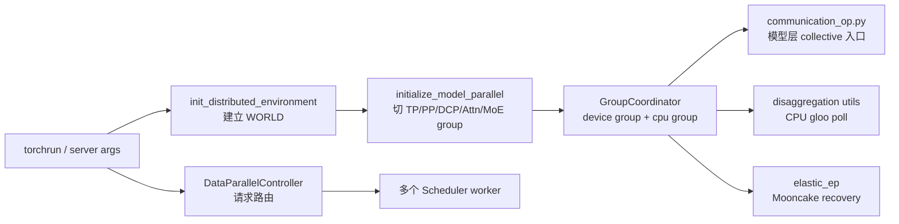

# 分布式

> **SGLang 高级特性 · 分布式** | Git：`70df09b83363e0127b43c83a6007d3938f815b2d`
> **源码范围：** `python/sglang/srt/distributed/`、`python/sglang/srt/managers/data_parallel_controller.py`、`python/sglang/srt/disaggregation/utils.py`、`python/sglang/srt/elastic_ep/`

## 读者为什么要读

部署大模型时，`--tp-size`、`--pp-size`、`--dp-size`、`--ep-size`、`--attn-cp-size` 不是几组互不相关的数字。它们会把同一批 global rank 切成多套坐标系：模型层用 TP、Attention TP/CP、MoE EP/TP 做张量通信，请求入口用 DP Controller 把请求送到不同 Scheduler，PD 和 Elastic EP 又会在 CPU group 或 Mooncake backend 上做特殊同步。

这组文档解决三个问题：

- 首次阅读时，知道 SGLang 如何从 `WORLD` 切出各类并行组。
- 排障时，能把 NCCL timeout、group size mismatch、DP 路由异常、PD poll 卡住、Elastic EP recovery 分别落到正确源码入口。
- 改代码时，知道模型层为什么应调用 `communication_op.py`，而不是在层里裸调 `torch.distributed`。

## 主线模型

把 Distributed 看成“分布式坐标系编译器”：



读源码时先问一个问题：当前这段代码在处理“rank 之间同步张量”，还是在处理“请求应该送到哪个 worker”。前者走 `GroupCoordinator` 和 `communication_op.py`，后者走 `DataParallelController`。

## 阅读顺序

| 文件 | 读完要能回答 |
| ------ | -------------- |
| [[SGLang-分布式-核心概念]] | 一个 rank 同时有哪些坐标，`GroupCoordinator` 承担什么边界 |
| [[SGLang-分布式-源码走读]] | `WORLD → TP/PP/Attn/MoE → communication_op` 是如何建出来的 |
| [[SGLang-分布式-数据流]] | 张量 collective、DP 请求路由、PD poll、Elastic EP recovery 各自怎么流动 |
| [[SGLang-分布式-排障指南]] | 看到 timeout、mismatch、错路由时从哪里查 |
| [[SGLang-分布式-学习检查]] | 能否自己画组、跑检查、解释一个失败模式 |

## 源码锚点

`parallel_state.py` 开头直接说明它接管 PyTorch 分布式环境，并把 workflow 分成环境初始化、模型并行初始化、业务代码、销毁四段。

```python
# 来源：python/sglang/srt/distributed/parallel_state.py L9-L24
"""Distributed state.
It takes over the control of the distributed environment from PyTorch.
The typical workflow is:

- call `init_distributed_environment` to initialize the distributed environment.
- call `initialize_model_parallel` or `ensure_model_parallel_initialized` to
 initialize the model parallel groups.

- any code dealing with the distributed stuff

- call `destroy_model_parallel` to destroy the model parallel groups.
- call `destroy_distributed_environment` to destroy the distributed environment.

If you only need to use the distributed environment without model/pipeline
 parallelism, you can skip the model parallel initialization and destruction
 steps.
```

`initialize_model_parallel` 是切坐标系的主入口。参数名就是本专题的地图：TP、EP、PP、Attention DP/CP、MoE DP、DCP 都在这里进入。

```python
# 来源：python/sglang/srt/distributed/parallel_state.py L1967-L1979
def initialize_model_parallel(
    tensor_model_parallel_size: int = 1,
    expert_model_parallel_size: int = 1,
    pipeline_model_parallel_size: int = 1,
    attention_data_parallel_size: int = 1,
    attention_context_model_parallel_size: int = 1,
    moe_data_model_parallel_size: int = 1,
    decode_context_parallel_size: int = 1,
    backend: Optional[str] = None,
    duplicate_tp_group: bool = False,
    enable_symm_mem: bool = False,
    recovered_rank: bool = False,
) -> None:
```

模型层不直接选择 NCCL、PyNccl、CustomAllReduce 或 graph-safe custom op，而是经 `communication_op.py` 委托给当前 TP group。

```python
# 来源：python/sglang/srt/distributed/communication_op.py L18-L20
def tensor_model_parallel_all_reduce(input_: torch.Tensor) -> torch.Tensor:
    """All-reduce the input tensor across model parallel group."""
    return get_tp_group().all_reduce(input_)
```

DP Controller 是另一条链：它分发请求，不负责模型张量 collective。

```python
# 来源：python/sglang/srt/managers/data_parallel_controller.py L129-L130
class DataParallelController:
    """A controller that dispatches requests to multiple data parallel workers."""
```

## 读者抓手

第一次读，不要先背缩写。先把 global rank 写在一行，再把它投影成不同组：

- TP/Attention/MoE/PP：模型权重和中间张量怎么在 GPU 间切。
- DP Controller：请求怎么落到哪个 Scheduler worker。
- CPU group：PD poll、对象同步、Mooncake recovery 等非模型张量场景。

排障时也按这个顺序缩小范围：先看 `world_size == tp_size * pp_size` 是否成立，再看当前报错属于哪个 group，最后看它是 group 构造失败、collective backend 选错，还是 DP 请求路由错位。

## 阅读路径

← [[SGLang-PD分离|PD 分离]]
→ [[SGLang-多模态|Multimodal：多模态 VLM]]
