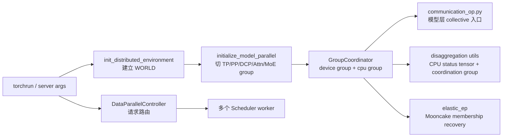

# 分布式

> 源码基线 `70df09b`。本专题同时覆盖模型 group、请求 DP、PD 状态同步与 Elastic EP；它们共享 rank，却不共享同一种通信对象。

## 读者为什么要读

部署大模型时，`--tp-size`、`--pp-size`、`--dp-size`、`--ep-size`、`--attn-cp-size` 不是几组可随意相乘的数字。TP/PP 定义当前 scheduler 模型 WORLD 的主要切分；Attention、MoE、DCP 在其上投影或复用 group；外层 DP Controller 则可能启动/路由多个 scheduler worker。PD 与 Elastic EP 又会消费这些 group 的协调通道或恢复其 membership。

这组文档解决三个问题：

- 首次阅读时，知道 SGLang 如何从 `WORLD` 切出各类并行组。
- 排障时，能把 NCCL timeout、group size mismatch、DP 路由异常、PD poll 卡住、Elastic EP recovery 分别落到正确源码入口。
- 改代码时，知道模型层为什么应调用 `communication_op.py`，而不是在层里裸调 `torch.distributed`。

## 主线模型

把 Distributed 看成“坐标编译 + 四类运行流”：



读源码时先确认**对象与作用域**：模型 tensor、请求对象、PD poll status、active-rank membership 分属不同运行流。即便都出现 `rank` 或 `all_reduce`，也不能互相套用故障模型。

## 阅读顺序

| 文件 | 读完要能回答 |
| ------ | -------------- |
| [[SGLang-分布式-核心概念]] | 一个 rank 同时有哪些坐标，`GroupCoordinator` 承担什么边界 |
| [[SGLang-分布式-源码走读]] | `WORLD → TP/PP/Attn/MoE → communication_op` 是如何建出来的 |
| [[SGLang-分布式-数据流]] | 张量 collective、DP 请求路由、PD poll、Elastic EP recovery 各自怎么流动 |
| [[SGLang-分布式-排障指南]] | 看到 timeout、mismatch、错路由时从哪里查 |
| [[SGLang-分布式-学习检查]] | 能否自己画组、跑检查、解释一个失败模式 |

## 源码锚点

`parallel_state.py` 开头直接说明它接管 PyTorch 分布式环境，并把 workflow 分成环境初始化、模型并行初始化、业务代码、销毁四段。

```python
# 来源：python/sglang/srt/distributed/parallel_state.py L9-L24
"""Distributed state.
It takes over the control of the distributed environment from PyTorch.
The typical workflow is:

- call `init_distributed_environment` to initialize the distributed environment.
- call `initialize_model_parallel` or `ensure_model_parallel_initialized` to
 initialize the model parallel groups.

- any code dealing with the distributed stuff

- call `destroy_model_parallel` to destroy the model parallel groups.
- call `destroy_distributed_environment` to destroy the distributed environment.

If you only need to use the distributed environment without model/pipeline
 parallelism, you can skip the model parallel initialization and destruction
 steps.
```

`initialize_model_parallel` 是模型 group 的主入口。参数名覆盖 TP、EP、PP、Attention DP/CP、MoE DP、DCP；但某些结果会直接别名已有 `_TP` / `_ATTN_CP`，并非每个名字都创建一个全新 ProcessGroup。

```python
# 来源：python/sglang/srt/distributed/parallel_state.py L1967-L1979
def initialize_model_parallel(
    tensor_model_parallel_size: int = 1,
    expert_model_parallel_size: int = 1,
    pipeline_model_parallel_size: int = 1,
    attention_data_parallel_size: int = 1,
    attention_context_model_parallel_size: int = 1,
    moe_data_model_parallel_size: int = 1,
    decode_context_parallel_size: int = 1,
    backend: Optional[str] = None,
    duplicate_tp_group: bool = False,
    enable_symm_mem: bool = False,
    recovered_rank: bool = False,
) -> None:
```

模型层不直接选择 NCCL、PyNccl、CustomAllReduce 或 graph-safe custom op，而是经 `communication_op.py` 委托给当前 TP group。

```python
# 来源：python/sglang/srt/distributed/communication_op.py L18-L20
def tensor_model_parallel_all_reduce(input_: torch.Tensor) -> torch.Tensor:
    """All-reduce the input tensor across model parallel group."""
    return get_tp_group().all_reduce(input_)
```

DP Controller 是另一条链：它分发请求，不负责模型张量 collective。

```python
# 来源：python/sglang/srt/managers/data_parallel_controller.py L129-L130
class DataParallelController:
    """A controller that dispatches requests to multiple data parallel workers."""
```

## 读者抓手

第一次读，不要先背缩写。先建立四本账：

- **坐标账**：global/local/group rank 与 TP/PP/Attention/MoE/DCP membership。
- **对象账**：tensor、request、poll status、active-rank mask 分别在流动什么。
- **通道账**：device group、coordination group、ZMQ、Mooncake recovery 分别由谁拥有。
- **生命周期账**：group 建立、alias、capture、destroy/recover 发生在何时。

排障时先限定 `world_size == tp_size * pp_size` 的作用域：它是 `initialize_model_parallel` 对当前模型 WORLD 的硬校验，不是整个部署的 GPU 总量公式。然后再判断是 group 构造、collective backend、DP 请求路由、PD status 收敛还是 Elastic EP membership 恢复。

## 阅读路径

前置：[[SGLang-架构分层]]、[[SGLang-关键概念]]

关联：[[SGLang-PD分离]]、[[SGLang-MoE]]、[[SGLang-ModelRunner]]

## 静态验证

```powershell
rg -n "world_size != tensor_model_parallel_size|_ATTN_TP = _TP|_MOE_EP = _TP|class DataParallelController|poll_and_all_reduce|try_recover_ranks" `
  sglang/python/sglang/srt/distributed/parallel_state.py `
  sglang/python/sglang/srt/managers/data_parallel_controller.py `
  sglang/python/sglang/srt/disaggregation/utils.py `
  sglang/python/sglang/srt/elastic_ep/elastic_ep.py
```

预期同时命中模型 WORLD 校验、group alias、请求 controller、PD poll 与 recovery；这证明本专题至少包含五种不同边界，不能被压缩成一条 NCCL 主线。
